# Every directive on one page

One entry per lesson: what the directive does, the figure that shows what changed, and what you gain against what it costs.
Every number comes from the measured tables in the lesson READMEs, on `xcku5p-ffvb676-2-e` at 3.33 ns under Vitis HLS 2023.2.2.
Where a lesson reports both, **Vivado** numbers are marked as such; everything else is C synthesis.

A state in these schedules may use about **2.43 ns** (3.33 ns clock minus 0.90 ns of uncertainty). That budget decides more results here than any directive does.

## At a glance

| Directive | You gain | You pay | Free lunch? |
| --- | --- | --- | --- |
| 0.1 TOP | a module name, or a smaller thing to measure | nothing | n/a — it builds no hardware |
| 1.1 PIPELINE | throughput and latency, 18 cycles against 33 | +11 LUT of pipeline control, 0 FF | nearly |
| 1.2 LOOP_TRIPCOUNT | a readable report instead of `?` | nothing in hardware; a wrong number reads as fact | yes, and that is the risk |
| 1.3 LOOP_FLATTEN | control cycles per outer iteration | a wrap mux in front of the address — here **+48 cycles** | **no, it lost** |
| 1.4 LOOP_MERGE | latency, 33 against 66 | nothing here; contention if both bodies share a port | **yes, both axes** |
| 1.5 DEPENDENCE | II 2 → 1, 87 cycles against 102 | **correctness**, if the promise is wrong | no |
| 2.1 ARRAY_PARTITION | memory bandwidth, and through it cycles | ports, wiring, and a mux when the bank is run-time | yes, if the type matches the pattern |
| 2.2 ARRAY_RESHAPE | the same bandwidth through one wide port | a barrel shifter when the slice is run-time — **in cycles** | yes, if the slice is a constant |
| 2.3 BIND_STORAGE | a resource column, or clock headroom | a slower read the scheduler believes — **16 cycles** | no |
| 3.1 UNROLL | cycles, if the operands can arrive together | area, and multiplexing when they cannot | no |
| 3.2 LATENCY (`-min`) | a predictable `ap_done` | 1 FF per added state, nothing in the datapath | cheap, but buys no speed |
| 3.2 LATENCY (`-max`) | a shorter schedule, when one exists | **the clock**, reported as a warning, exit status 0 | no |
| 3.3 PERFORMANCE | a target that survives a change of type, clock or part | control: it may re-bind, over-pipeline, or silently refuse | no |
| 3.5 EXPRESSION_BALANCE | depth, 1 cycle against 5 | registers for the live partials, +188 FF | no |
| 4.1 BIND_OP | DSP slices, or clock headroom | LUTs, cycles, or the clock, depending on the option | no |
| 4.2 ALLOCATION | hard resources, 3 DSP against 9 | a mux per shared input, and possibly cycles | **yes here — it also saved FF and LUT** |
| 4.3 INLINE | a schedule that crosses the boundary, 33 against 49 | one copy of the callee per call site, and a lost module | yes for small callees |
| 5.1 INTERFACE | whatever the surrounding system can actually provide | adapters, and with `m_axi` the latency of a bus | no |
| 5.2 AGGREGATE / DISAGGREGATE | an exact port layout at the boundary | width (padding) or port count, never cycles here | yes, in cycles |
| 5.3 RESET | state that restarts without reprogramming | 0 for a scalar; a ROM and a written-bit vector for an array | nearly |
| 6.1 DATAFLOW | latency **and** interval, 51/50 against 66/67 | one controller per process, +14 LUT, +39 FF | yes here |
| 6.2 STREAM | a channel sized to the slack the producer needs | a PIPO serialises the call, 115 cycles against 83 | no |

---

## 0.1 TOP — `s0_setup/01_top`

**What it does.** Names the one function synthesis starts from. Its arguments become the ports of the generated module, everything it can reach becomes hardware, and everything it cannot — including `main` and the testbench — is compiled for simulation only. `set_directive_top -name` changes only the module's name.

**Figure.**

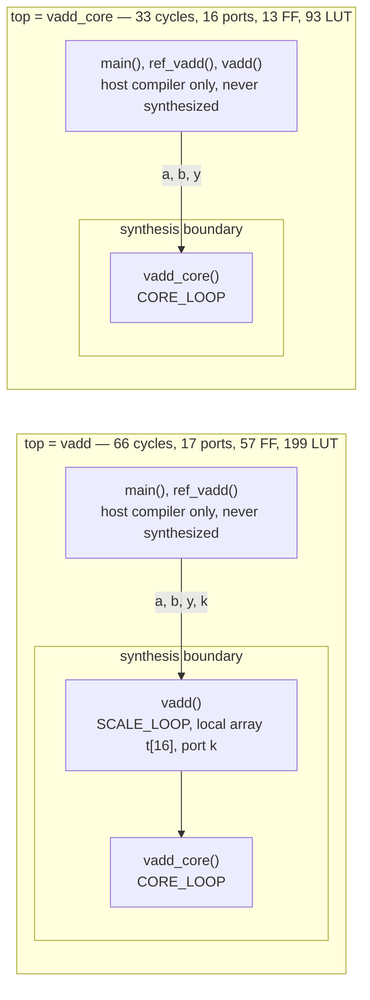
```mermaid
flowchart LR
    subgraph A["top = vadd — 66 cycles, 17 ports, 57 FF, 199 LUT"]
        direction TB
        AM["main(), ref_vadd()<br/>host compiler only, never synthesized"]
        subgraph AH["synthesis boundary"]
            direction TB
            AV["vadd()<br/>SCALE_LOOP, local array t[16], port k"]
            AC["vadd_core()<br/>CORE_LOOP"]
            AV --> AC
        end
        AM -->|"a, b, y, k"| AV
    end
    subgraph B["top = vadd_core — 33 cycles, 16 ports, 13 FF, 93 LUT"]
        direction TB
        BM["main(), ref_vadd(), vadd()<br/>host compiler only, never synthesized"]
        subgraph BH["synthesis boundary"]
            direction TB
            BC["vadd_core()<br/>CORE_LOOP"]
        end
        BM -->|"a, b, y"| BC
    end
```

Moving the boundary down did not optimize anything away — the storage for `t`, the second loop counter, the second group of FSM states and the `k` pin are simply not part of the design any more. The `+ k` still has to happen somewhere.

An array argument does not become a memory inside the block. It becomes address, enable and data pins that expect a RAM outside, meeting the one-cycle read latency the schedule assumes.

**Gain:** a module name that will not collide, or a smaller boundary to characterise on its own.
**Cost:** nothing. `base` and `rename` are bit-for-bit the same design at 66 cycles, 57 FF and 199 LUT. The `sub` solution is smaller only because a smaller piece of the program was built — the `+ k` still has to happen somewhere.

---

## 1.1 PIPELINE — `s1_loops/11_pipeline`

**What it does.** Lets iteration $i+1$ start before iteration $i$ has finished. With depth $D$ and initiation interval II, a loop of $N$ iterations takes $D + \textrm{II}\,(N-1)$ cycles instead of $N \cdot D$.

**Figure.** One iteration of `y[i] = a[i] + b[i]` is RD (drive addresses) then AW (data arrives, add, write), so $D = 2$.

Before — no overlap:

| Iteration | 0 | 1 | 2 | 3 | 4 | 5 | 6 | 7 |
| --- | -- | -- | -- | -- | -- | -- | -- | -- |
| i = 0 | RD | AW | | | | | | |
| i = 1 | | | RD | AW | | | | |
| i = 2 | | | | | RD | AW | | |
| i = 3 | | | | | | | RD | AW |
| **adder in use** | | x | | x | | x | | x |

After, II = 1 — a new iteration every cycle:

| Iteration | 0 | 1 | 2 | 3 | 4 | 5 | 6 | 7 |
| --- | -- | -- | -- | -- | -- | -- | -- | -- |
| i = 0 | RD | AW | | | | | | |
| i = 1 | | RD | AW | | | | | |
| i = 2 | | | RD | AW | | | | |
| i = 3 | | | | RD | AW | | | |
| i = 4 | | | | | RD | AW | | |
| i = 5 | | | | | | RD | AW | |
| i = 6 | | | | | | | RD | AW |
| **adder in use** | | x | x | x | x | x | x | x |

Same one adder, same one port per array. What appeared is one valid bit per stage (`ap_enable_reg_pp0_iter1`) and a loop handshake helper.

**Gain:** 18 cycles against 33, a saving of exactly $(D - \textrm{II})(N-1) = 15$.
**Cost:** +11 LUT of pipeline control, and **0 FF** — the two new bits are paid for by the state register shrinking from three bits to one.
**The trap:** II = 2 on a depth-2 loop buys nothing at all (34 cycles against 33) and still pays for the handshake. Pipelining saves $D - \textrm{II}$ per iteration, so it is worth nothing when $\textrm{II} = D$.

---

## 1.2 LOOP_TRIPCOUNT — `s1_loops/12_loop_tripcount`

**What it does.** Tells the latency *estimator* how many times a loop with a run-time bound is expected to run. It is the only directive here that builds no hardware at all.

**Figure.**

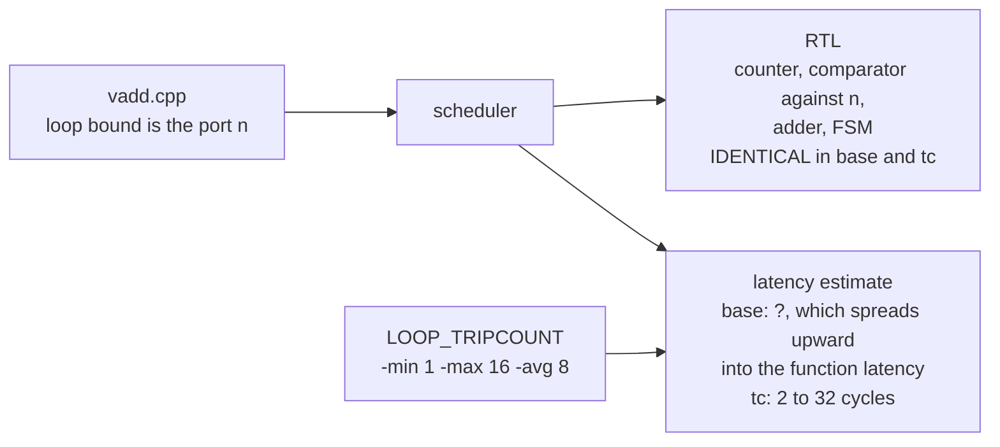
```mermaid
flowchart LR
    C["vadd.cpp<br/>loop bound is the port n"] --> S["scheduler"]
    S --> R["RTL<br/>counter, comparator against n,<br/>adder, FSM<br/>IDENTICAL in base and tc"]
    S --> E["latency estimate<br/>base: ?, which spreads upward<br/>into the function latency<br/>tc: 2 to 32 cycles"]
    T["LOOP_TRIPCOUNT<br/>-min 1 -max 16 -avg 8"] --> E
```

The arrow from the directive ends at the estimate and never reaches the RTL. That is the whole lesson in one picture.

Normalizing the tool's signal-name suffixes and diffing the two `vadd.v` files prints `identical`.

**Gain:** a report you can compare. Two solutions that both print `?` cannot be compared at all.
**Cost:** zero flip-flops, zero LUTs, zero cycles. The real cost is a risk: the tool never checks the numbers against the code, so a wrong trip count produces a report that looks precise and is simply wrong. The `-max 16` appears nowhere in the hardware — the counter is 5 bits because `x` has 16 elements, and the comparator is 32 bits because `n` is an `int`.

---

## 1.3 LOOP_FLATTEN — `s1_loops/13_loop_flatten`

**What it does.** Replaces a perfect or semi-perfect loop nest with one loop over every combination of the indices, so the controller never leaves one loop and enters another.

**Figure.** One row of a 3-column nest, written as FSM states:

| | states of one row of a 3-column nest | cycles per row |
| --- | --- | --- |
| nested | `H` &nbsp; `R A W` &nbsp; `R A W` &nbsp; `R A W` &nbsp; `R` | 1 + 3×3 + 1 = **11** |
| flattened | `C R A W` &nbsp; `C R A W` &nbsp; `C R A W` | 3×4 = **12** |

`H` is the row header and `C` the flat header (test, wrap mux, address); `R` reads, `A` adds, `W` writes. Flattening removes the two per-row control states exactly as promised — and then loses more than that, because the header can no longer share a state with the read:

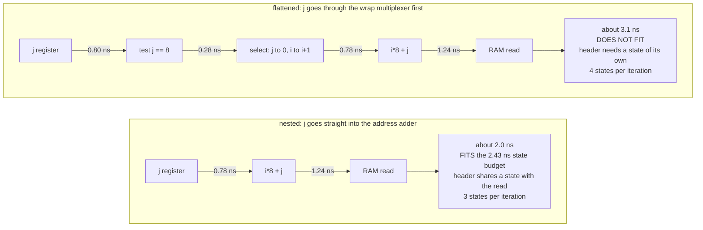
```mermaid
flowchart LR
    subgraph N["nested: j goes straight into the address adder"]
        direction LR
        NJ["j register"] -->|"0.78 ns"| NA["i*8 + j"]
        NA -->|"1.24 ns"| NR["RAM read"]
        NR --> NOK["about 2.0 ns<br/>FITS the 2.43 ns state budget<br/>header shares a state with the read<br/>3 states per iteration"]
    end
    subgraph F["flattened: j goes through the wrap multiplexer first"]
        direction LR
        FJ["j register"] -->|"0.80 ns"| FT["test j == 8"]
        FT -->|"0.28 ns"| FS["select: j to 0, i to i+1"]
        FS -->|"0.78 ns"| FA["i*8 + j"]
        FA -->|"1.24 ns"| FR["RAM read"]
        FR --> FNO["about 3.1 ns<br/>DOES NOT FIT<br/>header needs a state of its own<br/>4 states per iteration"]
    end
```

**Gain:** on this 8×8 nest, nothing. The nest is 209 cycles and the flattened loop is **257**.
**Cost:** +2 FF, +34 LUT, and +48 cycles.
**When it is actually worth it:** on a nest whose inner loop is pipelined, where a flat loop keeps one pipeline running across all rows instead of draining and refilling it every row. Vitis flattens eligible nests on its own as part of pipelining, which is why the useful form of this directive is `-off`. With `config_compile -pipeline_loops 0` the tool does not flatten by itself, so `default` and `off` are the same hardware.

---

## 1.4 LOOP_MERGE — `s1_loops/14_loop_merge`

**What it does.** Combines consecutive loops inside a region into one loop, so the second loop's iterations stop waiting for the whole of the first.

**Figure.** Trip count 3. `R` issues the reads, `W` computes and writes, `X` is a loop's final exit test.

| Operation | 0 | 1 | 2 | 3 | 4 | 5 | 6 | 7 | 8 | 9 | 10 | 11 | 12 | 13 |
| --- | -- | -- | -- | -- | -- | -- | -- | -- | -- | -- | -- | -- | -- | -- |
| add i=0 | R | W | | | | | | | | | | | | |
| add i=1 | | | R | W | | | | | | | | | | |
| add i=2 | | | | | R | W | | | | | | | | |
| add exit | | | | | | | X | | | | | | | |
| sub i=0 | | | | | | | | R | W | | | | | |
| sub i=1 | | | | | | | | | | R | W | | | |
| sub i=2 | | | | | | | | | | | | R | W | |
| sub exit | | | | | | | | | | | | | | X |

| Operation | 0 | 1 | 2 | 3 | 4 | 5 | 6 |
| --- | -- | -- | -- | -- | -- | -- | -- |
| add i=0 | R | W | | | | | |
| **sub i=0** | **R** | **W** | | | | | |
| add i=1 | | | R | W | | | |
| **sub i=1** | | | **R** | **W** | | | |
| add i=2 | | | | | R | W | |
| **sub i=2** | | | | | **R** | **W** | |
| exit | | | | | | | X |

14 cycles become 7. The subtraction for `i = 0` needed nothing the addition produced, and only the loop structure was making it wait until cycle 7.

**Gain:** 33 cycles against 66 — *and* 132 LUT against 205, 13 FF against 25. One loop counter, one exit comparator and one group of FSM states disappear, and both bodies read `a[i]` and `b[i]` in the same cycle so the two reads become one.
**Cost:** nothing on this kernel. The real cost appears when the two bodies need the same single memory port in the same cycle — then the merged iteration grows and part of the saving goes back. Merging also removes the separate loop rows from the report, so each original loop is harder to inspect on its own.

---

## 1.5 DEPENDENCE — `s1_loops/15_dependence`

**What it does.** Overrules what the scheduler assumed about memory dependences it could not prove. In a histogram, iteration $i$ updates `acc[x[i]]` and nothing says whether `x[i+1]` equals `x[i]`, so the tool assumes it might and spreads the iterations apart.

**Figure.** The iteration reads `acc` at stage 1 and writes it at stage 3, a gap of $g = 2$ cycles. `X` reads `x[i]`, `R` sends the bin to `acc`, `+` adds, `W` writes back, `!` marks a read that is already stale.

`base`, II = 2 — the dependence honoured:

| Iteration | 0 | 1 | 2 | 3 | 4 | 5 | 6 | 7 |
| --- | -- | -- | -- | -- | -- | -- | -- | -- |
| i=0 | X | R | + | W | | | | |
| i=1 | | | X | R | + | W | | |
| i=2 | | | | | X | R | + | W |

`false_dep`, II = 1 — the dependence denied:

| Iteration | 0 | 1 | 2 | 3 | 4 | 5 | 6 | 7 |
| --- | -- | -- | -- | -- | -- | -- | -- | -- |
| i=0 | X | R | + | W | | | | |
| i=1 | | X | **R!** | + | W | | | |
| i=2 | | | X | **R!** | + | W | | |

In `base` the tool builds a bypass — a register pair holding the previous iteration's bin and count, a comparator and a mux — which covers exactly one in-flight iteration. At II 1 there are two, and the directive has just told the tool not to bother building the bypass at all.

**Gain:** II 2 → 1, loop 20 cycles against 35, function 87 against 102, and 313 LUT against 449.
**Cost:** **correctness.** `false_dep` fails co-simulation: sixteen identical samples come back as a count of 6 instead of 16. `dist2` copies the `distance = 2` out of the tool's own II Violation message, gains no II whatsoever, and still returns 8 instead of 16 — it pays the full II 2 and is wrong anyway.
**Use it** only when two iterations provably cannot touch the same element. Vitis does not check the claim.

---

## 2.1 ARRAY_PARTITION — `s2_arrays/21_array_partition`

**What it does.** Splits one array into several banks, each its own memory with its own ports. A single memory offers at most two ports; partitioning multiplies them, so more elements can be reached in one cycle.

**Figure.** `sum4` reads four neighbouring elements per iteration. Where element $k$ lands with factor 4 — the elements iteration `i = 1` reads are in bold:

**cyclic** — bank $= k \bmod F$, address $= \lfloor k/F \rfloor$

| Bank | addr 0 | addr 1 | addr 2 | addr 3 |
| --- | --- | --- | --- | --- |
| `x_0` | x[0] | **x[4]** | x[8] | x[12] |
| `x_1` | x[1] | **x[5]** | x[9] | x[13] |
| `x_2` | x[2] | **x[6]** | x[10] | x[14] |
| `x_3` | x[3] | **x[7]** | x[11] | x[15] |

**block** — bank $= \lfloor k/S \rfloor$, address $= k \bmod S$

| Bank | addr 0 | addr 1 | addr 2 | addr 3 |
| --- | --- | --- | --- | --- |
| `x_0` | x[0] | x[1] | x[2] | x[3] |
| `x_1` | **x[4]** | **x[5]** | **x[6]** | **x[7]** |
| `x_2` | x[8] | x[9] | x[10] | x[11] |
| `x_3` | x[12] | x[13] | x[14] | x[15] |

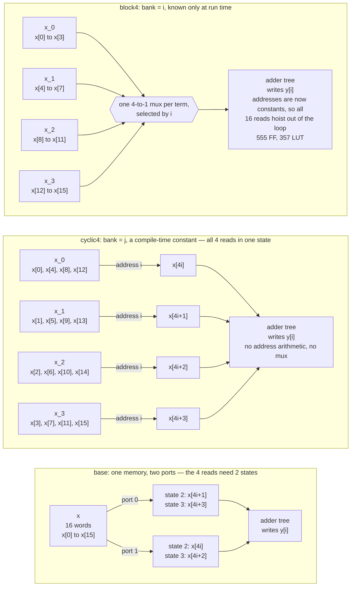
```mermaid
flowchart LR
    subgraph BASE["base: one memory, two ports — the 4 reads need 2 states"]
        direction LR
        M["x<br/>16 words<br/>x[0] to x[15]"]
        M -- "port 0" --> P0["state 2: x[4i+1]<br/>state 3: x[4i+3]"]
        M -- "port 1" --> P1["state 2: x[4i]<br/>state 3: x[4i+2]"]
        P0 --> T1["adder tree<br/>writes y[i]"]
        P1 --> T1
    end
    subgraph CYC["cyclic4: bank = j, a compile-time constant — all 4 reads in one state"]
        direction LR
        B0["x_0<br/>x[0], x[4], x[8], x[12]"] -- "address i" --> Q0["x[4i]"]
        B1["x_1<br/>x[1], x[5], x[9], x[13]"] -- "address i" --> Q1["x[4i+1]"]
        B2["x_2<br/>x[2], x[6], x[10], x[14]"] -- "address i" --> Q2["x[4i+2]"]
        B3["x_3<br/>x[3], x[7], x[11], x[15]"] -- "address i" --> Q3["x[4i+3]"]
        Q0 --> T2["adder tree<br/>writes y[i]<br/>no address arithmetic, no mux"]
        Q1 --> T2
        Q2 --> T2
        Q3 --> T2
    end
    subgraph BLK["block4: bank = i, known only at run time"]
        direction LR
        C0["x_0<br/>x[0] to x[3]"] --> MUX{{"one 4-to-1 mux per term,<br/>selected by i"}}
        C1["x_1<br/>x[4] to x[7]"] --> MUX
        C2["x_2<br/>x[8] to x[11]"] --> MUX
        C3["x_3<br/>x[12] to x[15]"] --> MUX
        MUX --> T3["adder tree<br/>writes y[i]<br/>addresses are now constants, so all<br/>16 reads hoist out of the loop<br/>555 FF, 357 LUT"]
    end
```

**Gain:** `cyclic4` is **13 cycles against 17 and 160 LUT against 205** — faster and smaller at once, because the bank number is a compile-time constant and no address arithmetic is left.
**Cost:** it is entirely a question of whether the type matches the access pattern. `block4` reaches 11 cycles and pays **555 FF and 357 LUT** for it; `complete` reaches 9 cycles with 41 FF but turns a top-level array into 16 separate 32-bit ports that the surrounding system must drive.

| | base | cyclic4 | block4 | complete |
| --- | --- | --- | --- | --- |
| `x` data ports | 2 | 4 | 8 | 16 |
| function latency | 17 | **13** | **11** | **9** |
| FF | 109 | **42** | 555 | 41 |
| LUT | 205 | **160** | 357 | 234 |

---

## 2.2 ARRAY_RESHAPE — `s2_arrays/22_array_reshape`

**What it does.** The partitioning of 2.1 followed by one more step: the banks are placed *side by side in one memory* instead of being kept as separate memories. A bank number becomes a **slice** number inside a wide word. It does not add ports; it makes each port wider.

**Figure.** Same kernel, factor 4. Rows are word addresses, columns are slices, highest bits on the left:

**cyclic** — slice $= k \bmod F$, address $= \lfloor k/F \rfloor$

| Address | slice 3 (127:96) | slice 2 (95:64) | slice 1 (63:32) | slice 0 (31:0) |
| --- | --- | --- | --- | --- |
| 0 | x[3] | x[2] | x[1] | x[0] |
| 1 | **x[7]** | **x[6]** | **x[5]** | **x[4]** |
| 2 | x[11] | x[10] | x[9] | x[8] |
| 3 | x[15] | x[14] | x[13] | x[12] |

**block** — slice $= \lfloor k/S \rfloor$, address $= k \bmod S$

| Address | slice 3 | slice 2 | slice 1 | slice 0 |
| --- | --- | --- | --- | --- |
| 0 | x[12] | x[8] | **x[4]** | x[0] |
| 1 | x[13] | x[9] | **x[5]** | x[1] |
| 2 | x[14] | x[10] | **x[6]** | x[2] |
| 3 | x[15] | x[11] | **x[7]** | x[3] |

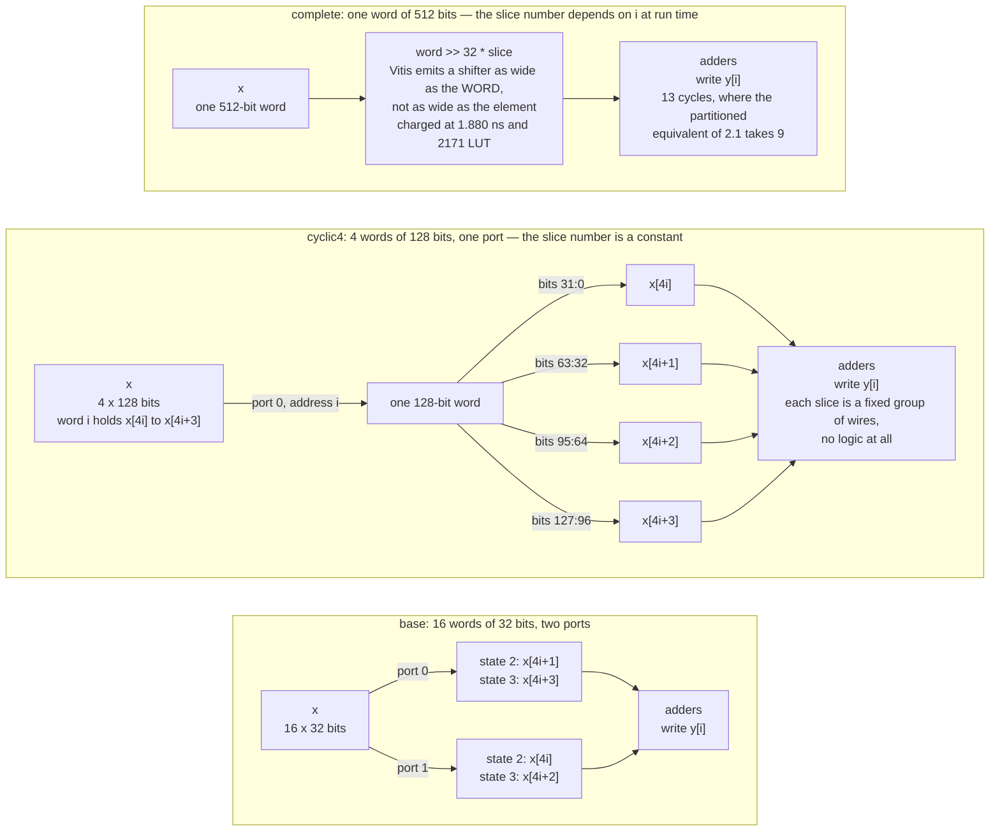
```mermaid
flowchart LR
    subgraph BASE["base: 16 words of 32 bits, two ports"]
        direction LR
        M["x<br/>16 x 32 bits"]
        M -- "port 0" --> P0["state 2: x[4i+1]<br/>state 3: x[4i+3]"]
        M -- "port 1" --> P1["state 2: x[4i]<br/>state 3: x[4i+2]"]
        P0 --> T1["adders<br/>write y[i]"]
        P1 --> T1
    end
    subgraph RES["cyclic4: 4 words of 128 bits, one port — the slice number is a constant"]
        direction LR
        W["x<br/>4 x 128 bits<br/>word i holds x[4i] to x[4i+3]"]
        W -- "port 0, address i" --> Q["one 128-bit word"]
        Q -- "bits 31:0" --> S0["x[4i]"]
        Q -- "bits 63:32" --> S1["x[4i+1]"]
        Q -- "bits 95:64" --> S2["x[4i+2]"]
        Q -- "bits 127:96" --> S3["x[4i+3]"]
        S0 --> T2["adders<br/>write y[i]<br/>each slice is a fixed group of wires,<br/>no logic at all"]
        S1 --> T2
        S2 --> T2
        S3 --> T2
    end
    subgraph BAD["complete: one word of 512 bits — the slice number depends on i at run time"]
        direction LR
        WB["x<br/>one 512-bit word"] --> SH["word >> 32 * slice<br/>Vitis emits a shifter as wide as the WORD,<br/>not as wide as the element<br/>charged at 1.880 ns and 2171 LUT"]
        SH --> T3["adders<br/>write y[i]<br/>13 cycles, where the partitioned<br/>equivalent of 2.1 takes 9"]
    end
```

A run-time *bank* number in 2.1 selects between four separate 32-bit signals, which is a 32-bit four-input multiplexer. A run-time *slice* number here extracts a 32-bit field out of one 128-bit or 512-bit value. Same function of the same data, very different hardware. Vivado builds the whole `complete` design in 227 LUT, so the area figure was harmless — **the delay figure was not**, because the scheduler had already spent a cycle on it.

**Gain:** with `cyclic`, the same bandwidth as partitioning through **one** memory and one address path: 13 cycles against 17, 160 LUT against 205, identical to 2.1's `cyclic4`. Fewer block RAMs than several small banks would occupy.
**Cost:** a data path as wide as the word, and — when the slice number is only known at run time — a barrel shifter. **`complete` takes 13 cycles where the partitioned equivalent of 2.1 takes 9**, and no downstream tool gives those four cycles back.

> **The real price of a run-time slice is cycles, and the resource column is where you will not find it.** C synthesis reports 8878 LUT for `complete`; Vivado builds it in 227. The number that was right all along was the latency.

**Use it instead of `ARRAY_PARTITION`** when the elements needed together land at the same address *and* each sits in a slice whose number is a compile-time constant. The second condition is the one 2.1 does not have.

---

## 2.3 BIND_STORAGE — `s2_arrays/23_bind_storage`

**What it does.** Picks what a local array's memory is made of (`-impl`), what kind of memory it is (`-type`), and how many cycles pass between address and data (`-latency`).

**Figure.**

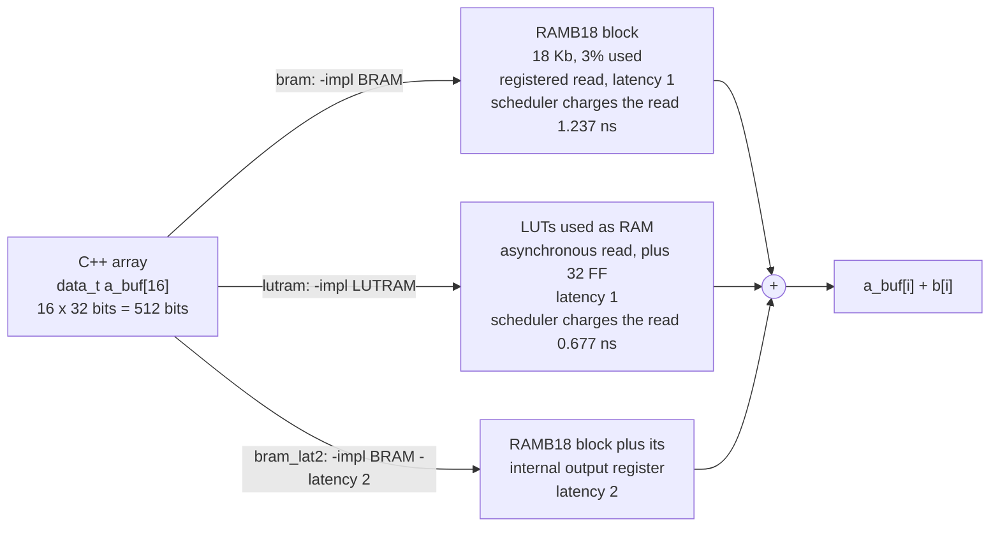
```mermaid
flowchart LR
    C["C++ array<br/>data_t a_buf[16]<br/>16 x 32 bits = 512 bits"]
    C -- "bram: -impl BRAM" --> B["RAMB18 block<br/>18 Kb, 3% used<br/>registered read, latency 1<br/>scheduler charges the read 1.237 ns"]
    C -- "lutram: -impl LUTRAM" --> L["LUTs used as RAM<br/>asynchronous read, plus 32 FF<br/>latency 1<br/>scheduler charges the read 0.677 ns"]
    C -- "bram_lat2: -impl BRAM -latency 2" --> B2["RAMB18 block plus its<br/>internal output register<br/>latency 2"]
    B --> ADD(("+"))
    L --> ADD
    B2 --> ADD
    ADD --> Y["a_buf[i] + b[i]"]
```

The read port, cycle by cycle from the address cycle:

| Signal | cycle 0 | cycle 1 | cycle 2 |
| --- | --- | --- | --- |
| `a_buf_address0` | i | any | any |
| `a_buf_ce0`, latency 1 | 1 | 0 | 0 |
| `a_buf_q0`, latency 1 | old | **a_buf[i]** | a_buf[i] |
| `a_buf_ce0`, latency 2 | 1 | 1 | 1 |
| `a_buf_q0`, latency 2 | old | old | **a_buf[i]** |

**Gain:** the resource trade is real. Moving the array into block RAM took the design from **85 LUT and 55 FF to 51 and 24** after Vivado synthesis, freeing fabric at the price of one 18 Kb block of which 3 % is used.
**Cost:** **16 cycles per call**, 82 against 66. That 0.56 ns difference in the read delay alone pushed `ADD_LOOP` from two states to three. The cost came from `-impl`, not from `-latency`.

> **`-impl` is not only a resource knob. It changes the delay the scheduler assumes, and a delay change can cost cycles that no later tool gives back.**

**Two things that did not happen.** `-latency 2` cost **no cycles at all** (82 against 82) — the extra cycle went into a state the body already had. And the 32 FF it appears to save are not real: after Vivado synthesis `bram` and `bram_lat2` are the same circuit, because Vivado moves a register sitting behind a block RAM into the block's built-in output register whether or not anyone asked. C synthesis put `base` and `bram` within two LUTs of each other; Vivado put them 34 apart.

| | base | bram | lutram | bram_lat2 |
| --- | --- | --- | --- | --- |
| `ADD_LOOP` iteration latency | 2 | **3** | 2 | **3** |
| function latency | **66** | 82 | **66** | 82 |
| BRAM_18K | 0 | 1 | 0 | 1 |
| Vivado LUT / FF | 85 / 55 | **51 / 24** | 85 / 55 | **51 / 24** |

The tool's own default (`base`) was tied for the fewest cycles and used no block RAM.

---

## 3.1 UNROLL — `s3_parallelism/31_unroll`

**What it does.** Makes $F$ copies of the loop body so several iterations exist as separate hardware, and divides the trip count by $F$.

**Figure.** `R` issues a read, `D` is the cycle its data is available, `A` adds, `W` writes.

Rolled — one pass per element, 2 states:

| Operation | 0 | 1 |
| --- | -- | -- |
| read `a[i]`, `b[i]` | R | D |
| add | | A |
| write `y[i]` | | W |

Unrolled by 4 on the same memories — one pass per four elements, **3 states, not 2**:

| Operation | 0 | 1 | 2 |
| --- | -- | -- | -- |
| read `a[i]`, `a[i+1]`, `b[i]`, `b[i+1]` | R | D | |
| add lanes 0 and 1 | | A | |
| write `y[i]`, `y[i+1]` | | W | |
| read `a[i+2]`, `a[i+3]`, `b[i+2]`, `b[i+3]` | | R | D |
| add lanes 2 and 3 | | | A |
| write `y[i+2]`, `y[i+3]` | | | W |

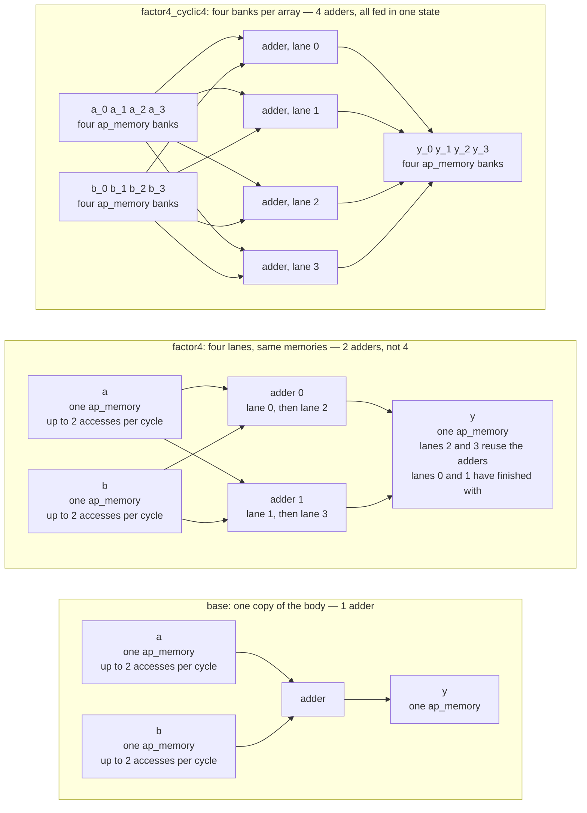
```mermaid
flowchart LR
    subgraph BASE["base: one copy of the body — 1 adder"]
        direction LR
        MA0["a<br/>one ap_memory<br/>up to 2 accesses per cycle"] --> AD0["adder"]
        MB0["b<br/>one ap_memory<br/>up to 2 accesses per cycle"] --> AD0
        AD0 --> MY0["y<br/>one ap_memory"]
    end
    subgraph F4["factor4: four lanes, same memories — 2 adders, not 4"]
        direction LR
        MA1["a<br/>one ap_memory<br/>up to 2 accesses per cycle"] --> L0["adder 0<br/>lane 0, then lane 2"]
        MA1 --> L1["adder 1<br/>lane 1, then lane 3"]
        MB1["b<br/>one ap_memory<br/>up to 2 accesses per cycle"] --> L0
        MB1 --> L1
        L0 --> MY1["y<br/>one ap_memory<br/>lanes 2 and 3 reuse the adders<br/>lanes 0 and 1 have finished with"]
        L1 --> MY1
    end
    subgraph F4P["factor4_cyclic4: four banks per array — 4 adders, all fed in one state"]
        direction LR
        MA2["a_0 a_1 a_2 a_3<br/>four ap_memory banks"] --> P0["adder, lane 0"]
        MA2 --> P1["adder, lane 1"]
        MA2 --> P2["adder, lane 2"]
        MA2 --> P3["adder, lane 3"]
        MB2["b_0 b_1 b_2 b_3<br/>four ap_memory banks"] --> P0
        MB2 --> P1
        MB2 --> P2
        MB2 --> P3
        P0 --> MY2["y_0 y_1 y_2 y_3<br/>four ap_memory banks"]
        P1 --> MY2
        P2 --> MY2
        P3 --> MY2
    end
```

`factor4` has no third and fourth adder. Two ports carry two lanes per cycle, so its four lanes take two turns, and the factor is paid for in **port multiplexing** — 84 of its 221 LUT.

> **`UNROLL` multiplies the compute and does nothing whatsoever to the memory bandwidth.** An `ap_memory` argument offers two ports. Four adders that all want an element of `a` in the same cycle cannot be fed — they get built, paid for, and left idle half the time. This is memory port starvation.

**Gain:** cycles, when the operands can actually arrive together. 17 cycles at factor 2, 13 at factor 4, **9** at factor 4 with matching `cyclic` banks.
**Cost:** area, in proportion to the copies that really run in the same cycle. Measured as cycles bought per LUT spent:

| | cycles saved | LUT added | cycles per LUT |
| --- | --- | --- | --- |
| `factor2` | 16 | 30 | **0.53** |
| `factor4` | 20 | 128 | 0.16 |
| `factor4_cyclic4` | 24 | 104 | 0.23 |

Doubling the factor from 2 to 4 on the same memories bought four cycles and spent 98 LUT, almost none of it arithmetic. **A factor matching the accesses available per cycle — 2 here — is often the whole of the available benefit**, unless you partition as well.

---

## 3.2 LATENCY — `s3_parallelism/32_latency`

**What it does.** Puts a lower bound, an upper bound, or both, on the cycles a scope may take. It is a **constraint**, not a transformation: it says what result would be acceptable and leaves the tool to find one.

| Case | What the tool does |
| --- | --- |
| `-max` above the natural latency | nothing; met on arrival |
| `-max` **below** the natural latency | compresses the schedule, re-binds operators, and **breaks the target clock to get there** — warning, not error |
| `-min` below the natural latency | nothing; met on arrival |
| `-min` above the natural latency | keeps the schedule and appends idle states |

**Figure.** `poly` computes `a*x*x + b*x + c`. `X` = multiplier busy, `A` = add, `W` = write, `.` = the design doing nothing.

`X` marks a multiplier busy, `A` the addition, `W` the write of `y`, and `.` a state in which the design does nothing at all. One table covers three of the four solutions, because `base` and `min4` are the same design and `min16` is that design with states appended:

| Operation | 1 | 2 | 3 | 4 | 5 | 6 – 16 | 17 |
| --- | -- | -- | -- | -- | -- | --- | -- |
| `MUL_AX`, `a * x` | X | X | | | | | |
| `MUL_Q`, `(a*x) * x` | | | X | X | | | |
| `MUL_B`, `b * x` | | | X | X | | | |
| `ADD`, `quad + c + lin` | | | | | A | | |
| write `y` | | | | | W | | |
| `min16` only: idle | | | | | | . . . | . |

`base` and `min4` stop at state 5: latency 4, clock 2.365 ns, slack +0.06. `min16` runs to state 17 with **the top five rows unchanged** — the directive did not move a single operation, it only appended twelve states in which the design holds still and then reported `ap_done` late. `y_ap_vld` still rises in state 5.

`-max` is the half that does not stop at a wall:

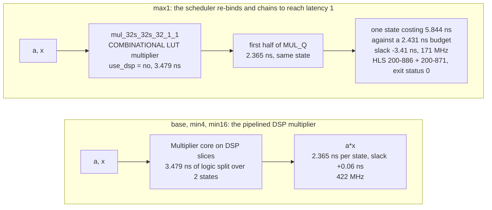
```mermaid
flowchart LR
    subgraph N["base, min4, min16: the pipelined DSP multiplier"]
        direction LR
        A1["a, x"] --> M1["Multiplier core on DSP slices<br/>3.479 ns of logic split over 2 states"]
        M1 --> Q1["a*x<br/>2.365 ns per state, slack +0.06 ns<br/>422 MHz"]
    end
    subgraph X["max1: the scheduler re-binds and chains to reach latency 1"]
        direction LR
        A2["a, x"] --> M2["mul_32s_32s_32_1_1<br/>COMBINATIONAL LUT multiplier<br/>use_dsp = no, 3.479 ns"]
        M2 --> M3["first half of MUL_Q<br/>2.365 ns, same state"]
        M3 --> Q2["one state costing 5.844 ns<br/>against a 2.431 ns budget<br/>slack -3.41 ns, 171 MHz<br/>HLS 200-886 + 200-871, exit status 0"]
    end
```

**`-min` gain:** predictability, not speed. A scope whose latency is pinned produces `ap_done` at a time the rest of the system can rely on — which matters for `DATAFLOW` branches staying in step, for external protocols, and for cycle-counting reference models.
**`-min` cost:** the cycles it adds, plus **one flip-flop per added state** in the one-hot FSM and a little next-state logic. `min16` measured +12 FF and +58 LUT, nothing in the datapath. A `-min` at or below the natural latency is byte-identical to `base`.

**`-max` gain:** a shorter schedule, when a shorter schedule exists at the target clock.
**`-max` cost:** **the clock.** `max1` reached latency 1 and a timing slack of **−3.41 ns**, and `vitis_hls` still exited 0. Its real cost is attention.

> The scheduler already produces the shortest schedule it can find at the target clock. Asking for something shorter does not give it a new capability — it tells it the clock is now negotiable.

Use `-max` as a build-time assertion on a latency you have already measured, **together with a check on the log**.

---

## 3.3 PERFORMANCE — `s3_parallelism/33_performance`

**What it does.** States a target and lets the tool choose the transformations. It writes the `PIPELINE` and `BIND_OP` directives you did not write: `INFO: [HLS 214-269] Inferring pragma 'pipeline II=9' ... due to performance pragma`.

**Figure.** `acc` sums 16 floats, so it has a loop-carried dependence that no directive can remove:

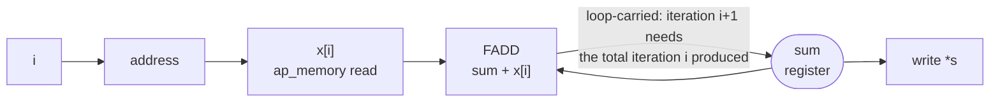
```mermaid
flowchart LR
    I["i"] --> ADDR["address"]
    ADDR --> XM["x[i]<br/>ap_memory read"]
    XM --> FA["FADD<br/>sum + x[i]"]
    SUM(["sum<br/>register"]) --> FA
    FA -->|"loop-carried: iteration i+1 needs<br/>the total iteration i produced"| SUM
    SUM --> OUT["write *s"]
```

Lesson 1.5 removed a loop-carried dependence with `DEPENDENCE`, because that one was false. This one is real — every iteration genuinely needs the total the iteration before it produced — and it puts a floor under the initiation interval, $II_{\min} = L_{\textrm{fadd}} + w$.

The twist is that $L_{\textrm{fadd}}$ is **not a constant**. It is a property of the core the tool picked, and the tool has more than one:

| Core | `<Latency>` | States | DSP | LUT | Reaches |
| --- | --- | --- | --- | --- | --- |
| `FAddSub_fulldsp` | 10 | 11 | 2 | 236 | II 10 |
| `FAddSub_nodsp` | 7 | 8 | 0 | 376 | **II 9** |

So a target tight enough to demand II 9 cannot be met by scheduling alone. The tool reaches it by **changing which adder the design contains** — and no directive in the lesson mentions an adder.

Five distinguishable behaviours, all measured on this one kernel (`base` = 225 cycles):

| Target | What the tool did | Latency | Cost |
| --- | --- | --- | --- |
| `tl_slack` 400 (far above) | pipelined anyway, at II 14 — no overlap at all | **226, slower** | +27 LUT |
| `tl_loose` 240 (just above) | pipelined at II 10 | **164** | +61 LUT, **slack −0.258 ns** |
| `tl_reach` 224 (equal) | pipelined at II 9 **and swapped the float adder** | **147** | −2 DSP, +187 LUT, +3 FF |
| `tl_miss` 160 (below, but reachable) | **refused**, one `INFO` line, RTL identical to `base` | 225 | 0 |
| `tl_tight` 20 (impossible) | refused, `INFO` + `WARNING` | 225 | 0 |

> The design it refuses to build for a target of 160 is the same design it happily builds for a target of 224 — and that design finishes in **147**.

**Gain:** a number that survives a change of data type, clock period or part, where `II=1` and `factor 4` do not. It composes across many loops, and it reaches for transformations you might not — `tl_reach` is met by a core swap that by hand is a `BIND_OP`.
**Cost:** control and predictability. **Every failure mode is quiet:** a dropped target prints `INFO`, and a target met by a design that is slower or that breaks the clock also prints `INFO` saying it succeeded. Use it with a build check that greps the log.

The directive itself contributes **no hardware** — everything in the RTL is there because the tool applied `PIPELINE` and picked a binding. But a goal with slack in it is **not** a no-op: `tl_slack` asked for 400 from a loop taking 224 and came out a cycle slower and 27 LUT larger.

---

## 3.5 EXPRESSION_BALANCE — `s3_parallelism/35_expression_balance`

**What it does.** Controls whether the tool may regroup a chain of associative operations into a balanced tree, cutting the dependent path from $n-1$ to $\lceil \log_2 n \rceil$.

**Figure.**

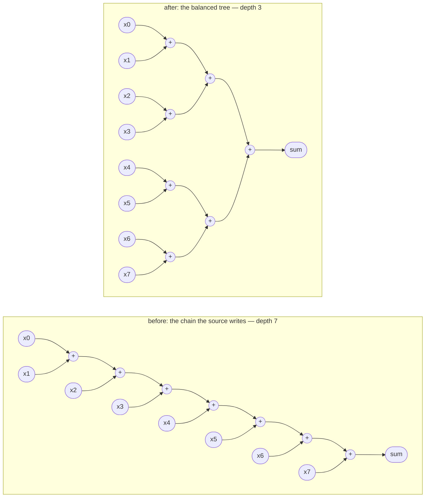
```mermaid
flowchart LR
  subgraph CH["before: the chain the source writes — depth 7"]
    direction LR
    x0([x0]) --> c1(("+"))
    x1([x1]) --> c1
    c1 --> c2(("+"))
    x2([x2]) --> c2
    c2 --> c3(("+"))
    x3([x3]) --> c3
    c3 --> c4(("+"))
    x4([x4]) --> c4
    c4 --> c5(("+"))
    x5([x5]) --> c5
    c5 --> c6(("+"))
    x6([x6]) --> c6
    c6 --> c7(("+"))
    x7([x7]) --> c7
    c7 --> s1([sum])
  end
  subgraph TR["after: the balanced tree — depth 3"]
    direction LR
    y0([x0]) --> t1(("+"))
    y1([x1]) --> t1
    y2([x2]) --> t2(("+"))
    y3([x3]) --> t2
    y4([x4]) --> t3(("+"))
    y5([x5]) --> t3
    y6([x6]) --> t4(("+"))
    y7([x7]) --> t4
    t1 --> t5(("+"))
    t2 --> t5
    t3 --> t6(("+"))
    t4 --> t6
    t5 --> t7(("+"))
    t6 --> t7
    t7 --> s2([sum])
  end
```

Seven adders either way, and the same mathematical sum. In the chain every adder waits for the one before it; in the tree the four first-level adders have no dependence on each other and all run at once.

Same seven adders either way. But the scheduler counts nanoseconds, not graph depth, and Vitis fuses chained additions into **ternary adders** at 0.731 ns against 1.016 ns for a binary one — so a chain's delay path is about *half* its graph depth:

| operands | chain delay path | chain states | tree states | saved |
| --- | --- | --- | --- | --- |
| 8 | 1.02 + 3 × 0.73 = 3.21 ns | 2 | 2 | **0** |
| 32 | 1.02 + 15 × 0.73 = 11.98 ns | 6 | 2 | **4** |

That is why the kernel sums 32 scalars and not 8 — at 8 operands the directive changes the RTL and buys nothing measurable.

**Gain:** latency. On `sum32`, **1 cycle against 5**.
**Cost:** registers. In a chain one partial sum is alive at a time and one operator can serve several in turn; in a tree several run at once, so each needs its own operator and every partial needs its own register. **166 FF → 354 FF**, and +70 LUT of arithmetic, partly offset by −23 LUT of simpler FSM decode. Net: **+47 LUT, +188 FF**.

**The defaults differ by type, and that is the point.** For integers, balancing is **on** by default, because two's-complement addition is associative even when it wraps — so `default` and `on` are byte-identical and the useful form of the directive is `-off`. For `float` and `double` it is off, because rounding at different points gives different answers.

> Measured: **the directive does not reach floating-point expressions at all.** `fsum8` is identical at 76 cycles in `off`, `default` and `on`. The knob for that is `config_compile -unsafe_math_optimizations`, which is a configuration, not this directive.

---

## 4.1 BIND_OP — `s4_resources/41_bind_op`

**What it does.** Chooses which library *core* implements one arithmetic operation (`-impl`) and how many register stages it contains (`-latency`). One directive binds one operation, so `poly`'s three multiplies need three directives.

**Figure.**

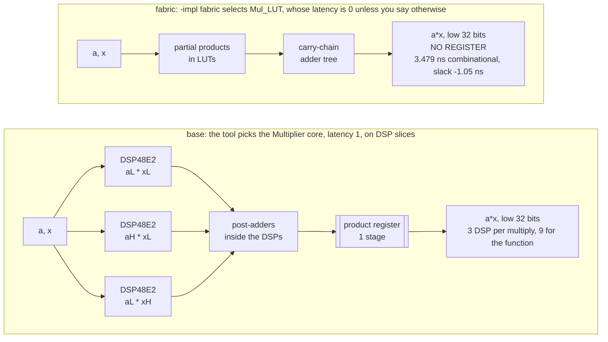
```mermaid
flowchart LR
    subgraph BEFORE["base: the tool picks the Multiplier core, latency 1, on DSP slices"]
        direction LR
        A1["a, x"] --> D1["DSP48E2<br/>aL * xL"]
        A1 --> D2["DSP48E2<br/>aH * xL"]
        A1 --> D3["DSP48E2<br/>aL * xH"]
        D1 --> S1["post-adders<br/>inside the DSPs"]
        D2 --> S1
        D3 --> S1
        S1 --> R1[["product register<br/>1 stage"]]
        R1 --> P1["a*x, low 32 bits<br/>3 DSP per multiply, 9 for the function"]
    end
    subgraph AFTER["fabric: -impl fabric selects Mul_LUT, whose latency is 0 unless you say otherwise"]
        direction LR
        A2["a, x"] --> L1["partial products<br/>in LUTs"]
        L1 --> C1["carry-chain<br/>adder tree"]
        C1 --> P2["a*x, low 32 bits<br/>NO REGISTER<br/>3.479 ns combinational, slack -1.05 ns"]
    end
```

The DSP multiplier is only 27 by 18 bits, so the core splits each operand and builds the product from partial products. The $2^{34} a_H x_H$ term vanishes modulo $2^{32}$ and is never built, which leaves three — hence 3 DSP per multiply.

> Naming `-impl` without naming `-latency` does not leave the pipelining to the scheduler's timing judgement. It selects a specific library core, and that core is the **combinational** one.

> Naming `-impl` without naming `-latency` does not leave the pipelining to the scheduler's timing judgement. It selects a specific library core, and that core is the **combinational** one.

| | base | fabric | lat0 | lat3 |
| --- | --- | --- | --- | --- |
| latency, cycles | 4 | **2** | **2** | **8** |
| DSP | 9 | **0** | 9 | 9 |
| FF | 596 | 99 | 201 | 207 |
| LUT | 242 | **3243** | 225 | 259 |
| estimated clock | 2.365 ns | **3.479, slack −1.05** | **3.330, slack −0.90** | 2.287 ns |

**Gain** depends entirely on which option moves. `-impl fabric` frees **all 9 DSP slices** for the rest of a larger design. `-latency 3` shortens the logic between registers and gives the best clock in the lesson, 2.287 ns. `-latency 0` removes register stages and saves two cycles.
**Cost:** about 1000 LUT per 32-bit multiply moved to fabric (3243 against 242 here), or extra cycles and registers for a higher latency — and, for both `fabric` and `lat0`, **a broken clock**, because the whole multiply then has to fit in one period. As in 3.2, Vitis breaks the clock rather than refusing.

**Use it** when the automatic choice does not suit the system: running out of DSP slices, a Vivado timing path through a multiply, or an operator whose latency must match a hand-written pipeline beside it. If you set `-latency`, pin `-impl` too, so the tool cannot meet an unusual latency by quietly switching resource.

---

## 4.2 ALLOCATION — `s4_resources/42_allocation`

**What it does.** Caps how many hardware *instances* of an operation may exist in a scope. Below the cap, operations must **share** one instance across different clock cycles, and a multiplexer picks the operands each cycle. 4.1 chose *which* core; this chooses *how many copies*.

**Figure.**

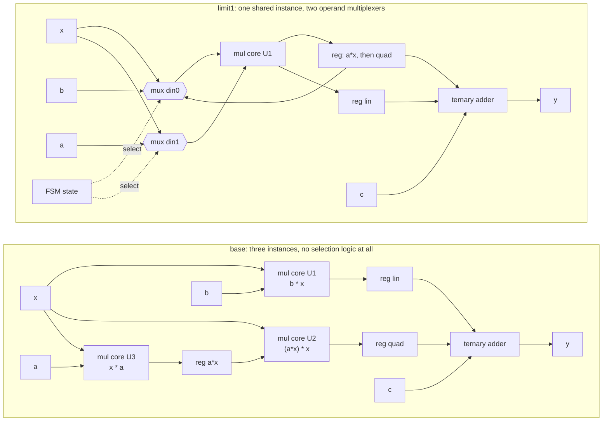
```mermaid
flowchart LR
  subgraph B["base: three instances, no selection logic at all"]
    direction LR
    bX["x"] --> bM3["mul core U3<br/>x * a"]
    bA["a"] --> bM3
    bM3 --> bR["reg a*x"]
    bR --> bM2["mul core U2<br/>(a*x) * x"]
    bX --> bM2
    bB["b"] --> bM1["mul core U1<br/>b * x"]
    bX --> bM1
    bM2 --> bQ["reg quad"]
    bM1 --> bL["reg lin"]
    bQ --> bS["ternary adder"]
    bL --> bS
    bC["c"] --> bS
    bS --> bY["y"]
  end
  subgraph L["limit1: one shared instance, two operand multiplexers"]
    direction LR
    lX["x"] --> lMux0{{"mux din0"}}
    lB["b"] --> lMux0
    lR["reg: a*x, then quad"] --> lMux0
    lA["a"] --> lMux1{{"mux din1"}}
    lX --> lMux1
    lF["FSM state"] -. select .-> lMux0
    lF -. select .-> lMux1
    lMux0 --> lM["mul core U1"]
    lMux1 --> lM
    lM --> lR
    lM --> lL["reg lin"]
    lR --> lS["ternary adder"]
    lL --> lS
    lC["c"] --> lS
    lS --> lY["y"]
  end
```

Two details that are easy to get wrong. **Both** inputs need a multiplexer, not one — `x` is an operand of all three multiplies, but the tool does not put it on the same port every time. And **one register can serve several products**, because a shared instance produces them at different times; that is why sharing removed flip-flops here instead of adding them.

| | base | limit2 | limit1 |
| --- | --- | --- | --- |
| multiplier instances | 3 | 2 | **1** |
| DSP | 9 | 6 | **3** |
| FF | 596 | 399 | **234** |
| LUT | 242 | 221 | **178** |
| latency / interval | 4 / 5 | 4 / 5 | **4 / 5** |
| estimated clock | 2.365 ns | 2.365 ns | **2.365 ns** |

**Gain:** 3 DSP slices instead of 9 — and, against the usual expectation, **362 fewer flip-flops and 64 fewer LUTs as well**, because two capture registers disappear with the two instances.
**Cost:** on this kernel, nothing measurable. No cycles, no clock. In principle a mux per shared input sits on the path into the multiplier, and if the shared instance cannot fit all its work into the cycles the original schedule offered, the function needs more cycles. Neither happened here — `poly` had idle multiplier states to spend.

**Use it** when a hard resource is the scarce thing and the function has cycles in which an instance would otherwise sit idle. Do **not** use it on small operators like adders: the multiplexer usually costs more LUTs than the operator it removes.

---

## 4.3 INLINE — `s4_resources/43_inline`

**What it does.** Copies a callee's body into its caller so the call disappears. A function that is *not* inlined becomes its own RTL submodule with its own handshake, and the scheduler treats each call as an opaque operation it cannot see inside. The directive goes on the function that should disappear.

**Figure.**

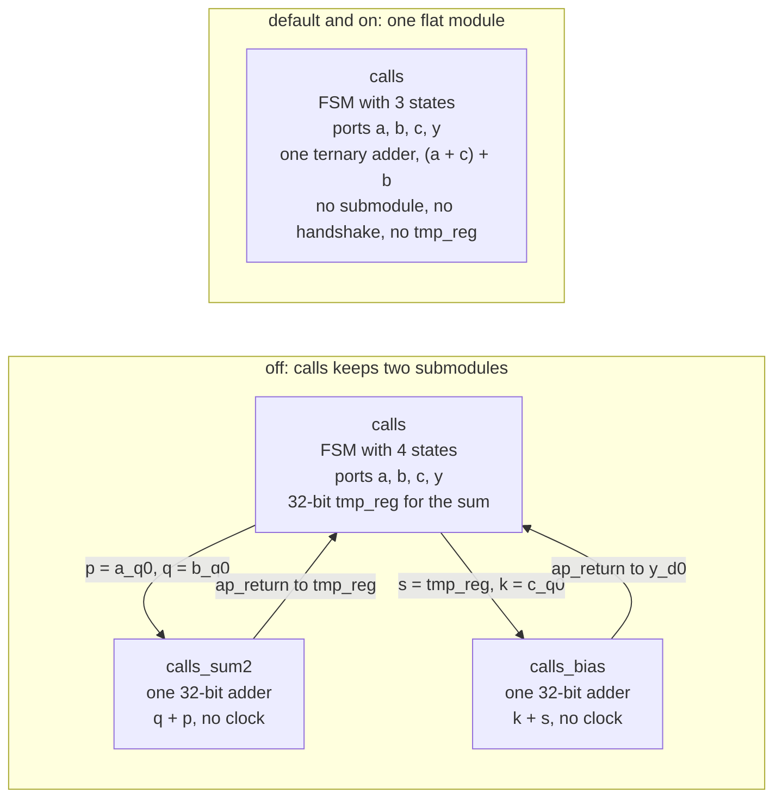
```mermaid
flowchart LR
    subgraph OFF["off: calls keeps two submodules"]
        direction TB
        T1["calls<br/>FSM with 4 states<br/>ports a, b, c, y<br/>32-bit tmp_reg for the sum"]
        S1["calls_sum2<br/>one 32-bit adder<br/>q + p, no clock"]
        B1["calls_bias<br/>one 32-bit adder<br/>k + s, no clock"]
        T1 -- "p = a_q0, q = b_q0" --> S1
        S1 -- "ap_return to tmp_reg" --> T1
        T1 -- "s = tmp_reg, k = c_q0" --> B1
        B1 -- "ap_return to y_d0" --> T1
    end
    subgraph ON["default and on: one flat module"]
        direction TB
        T2["calls<br/>FSM with 3 states<br/>ports a, b, c, y<br/>one ternary adder, (a + c) + b<br/>no submodule, no handshake, no tmp_reg"]
    end
```

The scheduler of `calls` treats each call as an opaque operation with a fixed delay, so it cannot merge the two adds into one operator, must run the calls one after the other, and must store the first sum in a register so the second call can read it next state.

| State | `off` | `default` and `on` |
| --- | --- | --- |
| 1 | 0.427 ns, `i = 0` | 0.427 ns, `i = 0` |
| 2 | 1.216 ns, counter | 1.216 ns, counter |
| 3 | 1.693 ns, read `a` + call `sum2` | **2.085 ns, read + ternary adder + write `y`** |
| 4 | **2.370 ns**, read `c` + call `bias` + write `y` | — |

**Gain:** the scheduler sees both sides at once and fuses them. **33 cycles against 49** — a 48 % shorter runtime for the same result — plus a better clock, 2.085 ns against 2.370.
**Cost:** one copy of the callee per call site, and a lost module boundary that made that part easy to find in the reports, simulate alone, or reuse. Here the boundary's price was **+33 FF** (the 32-bit `tmp_reg` carrying the sum from state 3 to state 4, plus one one-hot FSM bit) and only +20 LUT, because the two separate adders (+78 LUT) nearly cancel the ternary adder they replace (−64 LUT).

> **For small functions the plain directive changes nothing**, because Vitis already inlines them: `default` and `on` produce byte-identical Verilog. The setting that changes hardware on a small helper is **`-off`**.

| | off | default | on |
| --- | --- | --- | --- |
| Verilog module files | 3 | 1 | 1 |
| iteration / function latency | 3 / 49 | 2 / 33 | 2 / 33 |
| FF / LUT | 46 / 138 | **13 / 118** | 13 / 118 |

---

## 5.1 INTERFACE — `s5_interfaces/51_interface`

**What it does.** Chooses the port protocol of a top-level argument — the wires that carry it and the rules for which cycle they are valid. Every earlier lesson used the default for arrays, `ap_memory`.

**Figure.**

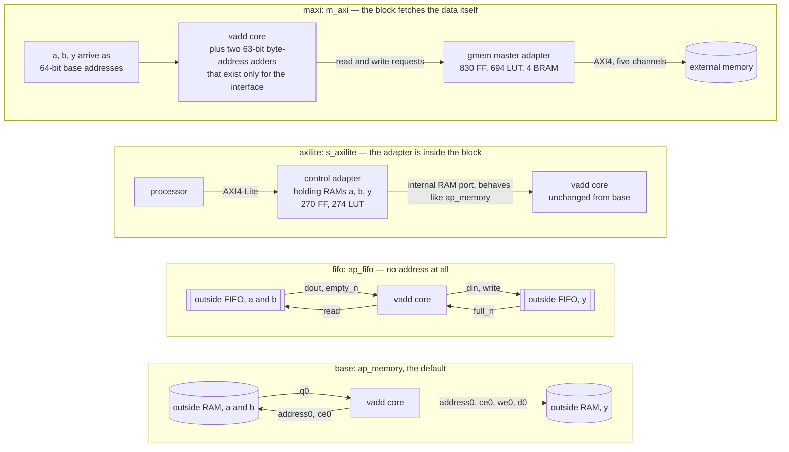
```mermaid
flowchart LR
  subgraph B["base: ap_memory, the default"]
    direction LR
    RA[("outside RAM, a and b")] -- "q0" --> K1["vadd core"]
    K1 -- "address0, ce0" --> RA
    K1 -- "address0, ce0, we0, d0" --> RY[("outside RAM, y")]
  end
  subgraph F["fifo: ap_fifo — no address at all"]
    direction LR
    QA[["outside FIFO, a and b"]] -- "dout, empty_n" --> K2["vadd core"]
    K2 -- "read" --> QA
    K2 -- "din, write" --> QY[["outside FIFO, y"]]
    QY -- "full_n" --> K2
  end
  subgraph S["axilite: s_axilite — the adapter is inside the block"]
    direction LR
    CPU["processor"] -- "AXI4-Lite" --> AD["control adapter<br/>holding RAMs a, b, y<br/>270 FF, 274 LUT"]
    AD -- "internal RAM port, behaves like ap_memory" --> K3["vadd core<br/>unchanged from base"]
  end
  subgraph M["maxi: m_axi — the block fetches the data itself"]
    direction LR
    OFF["a, b, y arrive as<br/>64-bit base addresses"] --> K4["vadd core<br/>plus two 63-bit byte-address adders<br/>that exist only for the interface"]
    K4 -- "read and write requests" --> GM["gmem master adapter<br/>830 FF, 694 LUT, 4 BRAM"]
    GM -- "AXI4, five channels" --> DDR[("external memory")]
  end
```

An `ap_memory` read is a request followed by a reply. A FIFO read has no request — the next word is already waiting on `dout` — but the scheduler still gave the read and the write separate states, so `fifo` stayed at 33 cycles where the prediction said 17.

| | base | fifo | axilite | maxi |
| --- | --- | --- | --- | --- |
| iteration latency | 2 | 2 | 2 | **13** |
| function latency (C synth) | 33 | 33 | 33 | **214** |
| cosim latency min/avg/max | 33/33/33 | 33/33/33 | **355/488/498** | **298** |
| C synth FF / LUT | 13 / 93 | 72 / 122 | 283 / 367 | 1204 / 1067 |
| of which the adapter | — | — | 270 / 274 | 830 / 694 + 4 BRAM |
| Vivado LUT / FF / BRAM | 41 / 12 / 0 | 43 / 72 / 0 | 100 / 58 / 5 | 1254 / 2046 / 2 |

**Gain** depends on the mode: `ap_fifo` removes the address wires and lets you attach a producer instead of a memory; `s_axilite` lets a processor load and read back the arrays with no glue logic; `m_axi` lets the block reach a memory far larger than anything that fits beside it.
**Cost:** logic that appears nowhere in the C. `ap_fifo` is the cheap one at **+29 LUT and +59 FF** — almost all of it the two captured input words and three `*_blk_n` handshake terms — in exchange for 0.139 ns of clock. It did **not** save a cycle: the read and the write still cannot share a state, so the latency stayed at 33 where the prediction said 17.

`s_axilite` leaves the core untouched and puts everything new in one adapter instance. `m_axi` grows the core itself: the arithmetic the C asks for is 39 LUT, and **the arithmetic the interface asks for is 140 LUT** — two 63-bit byte-address adders that exist only because the read bursts were dropped. Its cosim latency, 298, is a property of the system, not the kernel.

---

## 5.2 AGGREGATE and DISAGGREGATE — `s5_interfaces/52_aggregate`

**What it does.** Decides how a struct argument's fields become wires. `AGGREGATE` packs all fields into one wide word; `DISAGGREGATE` splits the struct so each field gets its own port. `-compact bit` packs back to back, `-compact byte` starts every field on a byte boundary.

**Figure.** An RGB565 pixel, `r:5 g:6 b:5`:

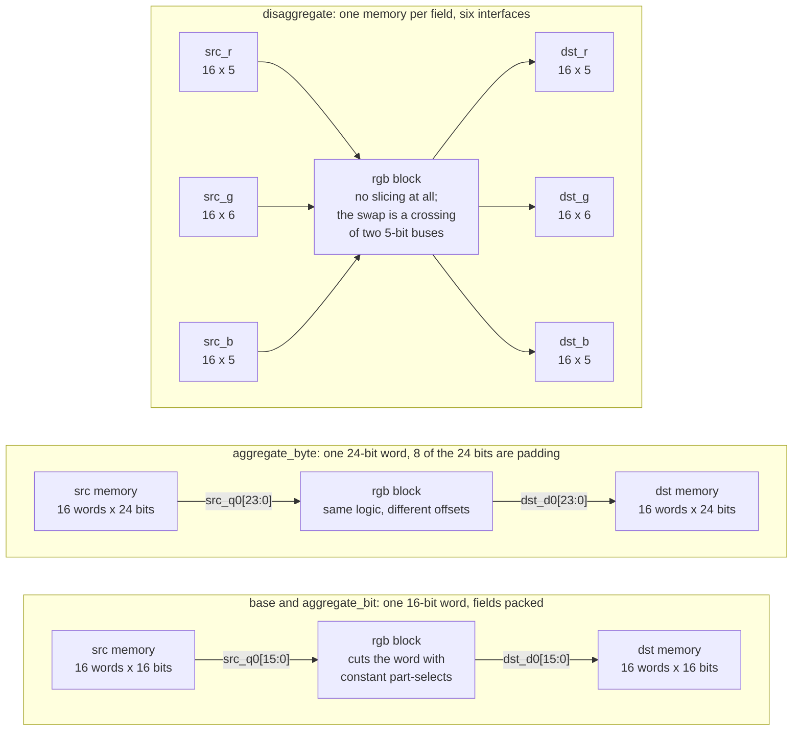
```mermaid
flowchart LR
  subgraph B["base and aggregate_bit: one 16-bit word, fields packed"]
    direction LR
    S0["src memory<br/>16 words x 16 bits"] -- "src_q0[15:0]" --> K0["rgb block<br/>cuts the word with<br/>constant part-selects"]
    K0 -- "dst_d0[15:0]" --> D0["dst memory<br/>16 words x 16 bits"]
  end
  subgraph BY["aggregate_byte: one 24-bit word, 8 of the 24 bits are padding"]
    direction LR
    S1["src memory<br/>16 words x 24 bits"] -- "src_q0[23:0]" --> K1["rgb block<br/>same logic, different offsets"]
    K1 -- "dst_d0[23:0]" --> D1["dst memory<br/>16 words x 24 bits"]
  end
  subgraph D["disaggregate: one memory per field, six interfaces"]
    direction LR
    SR["src_r<br/>16 x 5"] --> K2["rgb block<br/>no slicing at all;<br/>the swap is a crossing<br/>of two 5-bit buses"]
    SG["src_g<br/>16 x 6"] --> K2
    SB["src_b<br/>16 x 5"] --> K2
    K2 --> DR["dst_r<br/>16 x 5"]
    K2 --> DG["dst_g<br/>16 x 6"]
    K2 --> DB["dst_b<br/>16 x 5"]
  end
```

The first field declared lands in the least significant bits. Measured layouts:

| `base` and `aggregate_bit`, 16 bits | 15 to 11 | 10 to 5 | 4 to 0 |
| --- | --- | --- | --- |
| Field | `b` | `g` | `r` |

| `aggregate_byte`, 24 bits | 23 to 21 | 20 to 16 | 15 to 14 | 13 to 8 | 7 to 5 | 4 to 0 |
| --- | --- | --- | --- | --- | --- | --- |
| Field | padding | `b` | padding | `g` | padding | `r` |

**Gain:** control over the exact bit layout at the boundary. An aggregated word lets a caller move a whole pixel in one access and a bit-packed word wastes no memory width; a disaggregated struct lets each field live in its own memory, which is what a downstream block that consumes one channel wants.
**Cost:** width or port count — **never cycles here.** Every field sits at a compile-time bit offset, so reading or writing one is a constant selection of wires, and all four solutions are identical inside: **33 cycles, 13 FF, 54 LUT, 1.354 ns**. Byte alignment widens every word by the padding (16 bits → 24); disaggregation multiplies address, enable and data ports (2 memory interfaces → 6).

Measured: the default for an `ap_memory` port is **bit** alignment — `base` and `aggregate_bit` are the same RTL. And the padding bits of the output are not zeroed; they are copied from the input word.

---

## 5.3 RESET — `s5_interfaces/53_reset`

**What it does.** Decides whether one static or global variable returns to its C initial value when `ap_rst` is asserted. Power-up and reset are different events: Vitis writes the C value into the bitstream at power-up, but a register returns there on reset only if the RTL contains a branch that drives it. The default `config_rtl -reset control` resets the FSM and handshake registers and **leaves static variables alone**.

**Figure.** A scalar is one extra branch. An array is a rebuilt illusion, because a RAM has no reset pin:

A scalar is one extra branch in one `always` block:

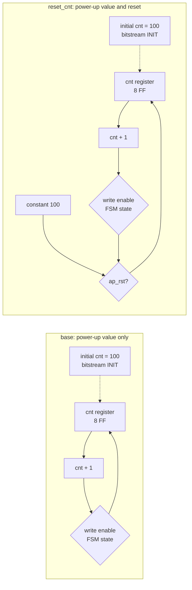
```mermaid
flowchart LR
  subgraph B["base: power-up value only"]
    direction TB
    B_init["initial cnt = 100<br/>bitstream INIT"] -.-> B_reg["cnt register<br/>8 FF"]
    B_reg --> B_add["cnt + 1"]
    B_add --> B_en{"write enable<br/>FSM state"}
    B_en --> B_reg
  end
  subgraph R["reset_cnt: power-up value and reset"]
    direction TB
    R_init["initial cnt = 100<br/>bitstream INIT"] -.-> R_reg["cnt register<br/>8 FF"]
    R_reg --> R_add["cnt + 1"]
    R_add --> R_en{"write enable<br/>FSM state"}
    R_k["constant 100"] --> R_rst{"ap_rst?"}
    R_en --> R_rst
    R_rst --> R_reg
  end
```

The dotted edge acts once, when the device is configured, and never again. An array is a rebuilt illusion instead, because a RAM has no reset pin and rewriting eight addresses would cost cycles:

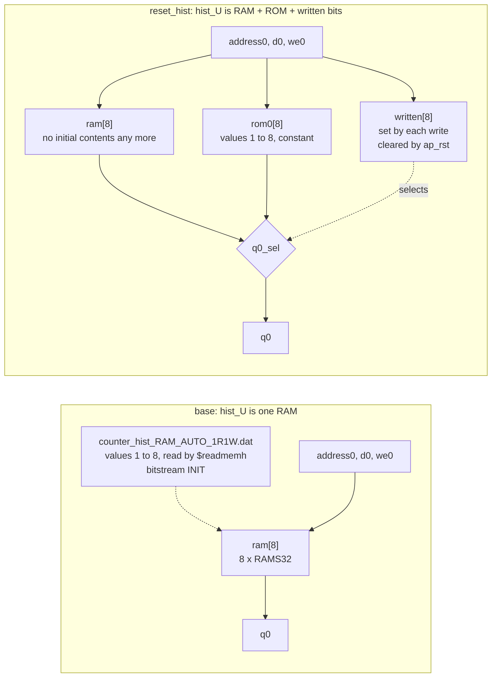
```mermaid
flowchart LR
  subgraph B2["base: hist_U is one RAM"]
    direction TB
    B2_dat["counter_hist_RAM_AUTO_1R1W.dat<br/>values 1 to 8, read by $readmemh<br/>bitstream INIT"] -.-> B2_ram["ram[8]<br/>8 x RAMS32"]
    B2_in["address0, d0, we0"] --> B2_ram
    B2_ram --> B2_q["q0"]
  end
  subgraph R2["reset_hist: hist_U is RAM + ROM + written bits"]
    direction TB
    R2_in["address0, d0, we0"] --> R2_ram["ram[8]<br/>no initial contents any more"]
    R2_in --> R2_rom["rom0[8]<br/>values 1 to 8, constant"]
    R2_in --> R2_w["written[8]<br/>set by each write<br/>cleared by ap_rst"]
    R2_ram --> R2_mux{"q0_sel"}
    R2_rom --> R2_mux
    R2_w -. selects .-> R2_mux
    R2_mux --> R2_q["q0"]
  end
```

A read returns the RAM output when the address's `written` bit is set and the ROM output when it is not. After a reset every bit is 0, so every address reads back its C initial value — at a cost of **zero cycles**, because nothing has to be rewritten.

**Gain:** the kernel restarts from its power-up state without the bitstream being reloaded. In an ASIC flow this is not optional: there is no power-up value at all.
**Cost:** for a scalar, **nothing on this FPGA** — every flip-flop already has a set/reset pin, and `reset_cnt` has exactly the same cell count as `base`, with three FDRE cells simply becoming FDSE. For an 8-word array, **+13 FF and +20 LUT** (Vivado) and still **zero cycles**: latency 1 and interval 2 in all three solutions.

**It changes hardware only when the variable was not already reset.** Under `config_rtl -reset state` or `all`, every static is reset already, and only `-off` would change the RTL.

---

## 6.1 DATAFLOW — `s6_dataflow/61_dataflow`

**What it does.** Turns the functions and loops inside one function into **processes** — independent blocks with their own controllers — connected by **channels**. Without it, one controller walks the stages in order.

Which number improves depends on the channel:
- a **ping-pong buffer (PIPO)** holds a whole array in each of two banks, and releases the consumer only when the producer has finished the entire array. The **interval** improves, the latency does not.
- a **FIFO** passes one element at a time and releases the consumer as soon as the first element arrives. The stages overlap *inside* one call, so the **latency** improves too.

**Figure.**

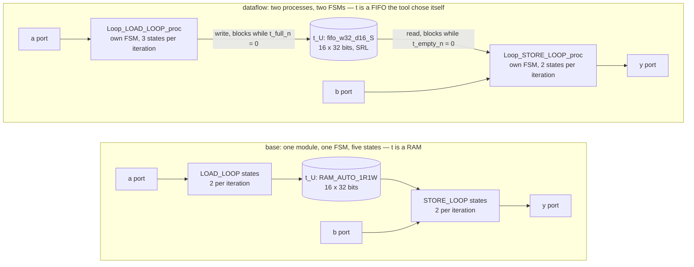
```mermaid
flowchart LR
    subgraph BASE["base: one module, one FSM, five states — t is a RAM"]
        direction LR
        a1["a port"] --> L1["LOAD_LOOP states<br/>2 per iteration"]
        L1 --> t1[("t_U: RAM_AUTO_1R1W<br/>16 x 32 bits")]
        t1 --> S1["STORE_LOOP states<br/>2 per iteration"]
        b1["b port"] --> S1
        S1 --> y1["y port"]
    end
    subgraph DF["dataflow: two processes, two FSMs — t is a FIFO the tool chose itself"]
        direction LR
        a2["a port"] --> P1["Loop_LOAD_LOOP_proc<br/>own FSM, 3 states per iteration"]
        P1 -- "write, blocks while t_full_n = 0" --> f[("t_U: fifo_w32_d16_S<br/>16 x 32 bits, SRL")]
        f -- "read, blocks while t_empty_n = 0" --> P2["Loop_STORE_LOOP_proc<br/>own FSM, 2 states per iteration"]
        b2["b port"] --> P2
        P2 --> y2["y port"]
    end
```

In `base`, while the single FSM is in `STORE_LOOP` the hardware of `LOAD_LOOP` sits idle, because one FSM can only be in one state at a time. `INFO: [XFORM 203-721] Change variable 't' to FIFO automatically.` — the default channel is a ping-pong buffer, but both ends here touch the array strictly in order, so the tool converts it. That is the whole synchronisation: no global schedule, two machines waiting on a queue.

`INFO: [XFORM 203-721] Change variable 't' to FIFO automatically.` The default channel is a PIPO, but both ends here touch the array strictly in order, so the tool converts it. That is the whole synchronisation: no global schedule, two machines waiting on a queue.

**Gain:** **latency 51 against 66 and interval 50 against 67.** Over 16 calls, co-simulation measured 831 cycles against 1071.
**Cost:** one controller per process, channel status logic, and top-level handshake combining — **+14 LUT and +39 FF** after Vivado synthesis. The channel itself got *cheaper*: a 16-deep shift-register FIFO replaced a 16-word distributed RAM with its address decoding and output register.

The LOAD body grew from 2 states to 3, because a FIFO write can stall and so needs a state of its own with the value already registered. That extra state is why the interval lands at 50 and not 34.

**Use it** when a function is stages that each consume what the previous stage produced. It is useless for a stage that reads its whole input before producing anything, and it cannot help beyond the slowest process, which alone sets the interval.

---

## 6.2 STREAM — `s6_dataflow/62_stream`

**What it does.** Chooses the channel a DATAFLOW region builds between two processes: `-type fifo` with a `-depth`, or `-type pipo`. The kernel is 6.1's `pipe2` with `STORE_LOOP` multiplying instead of adding, so that the **consumer** is the slower side and the FIFO actually fills.

**Figure.**

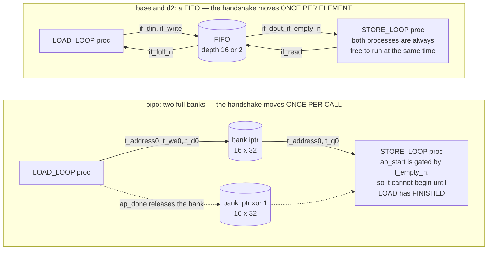
```mermaid
flowchart LR
  subgraph P["pipo: two full banks — the handshake moves ONCE PER CALL"]
    direction LR
    L1["LOAD_LOOP proc"] -->|"t_address0, t_we0, t_d0"| B0[("bank iptr<br/>16 x 32")]
    L1 -.->|"ap_done releases the bank"| B1[("bank iptr xor 1<br/>16 x 32")]
    B0 -->|"t_address0, t_q0"| S1["STORE_LOOP proc<br/>ap_start is gated by t_empty_n,<br/>so it cannot begin until<br/>LOAD has FINISHED"]
    B1 -.-> S1
  end
  subgraph F["base and d2: a FIFO — the handshake moves ONCE PER ELEMENT"]
    direction LR
    L2["LOAD_LOOP proc"] -->|"if_din, if_write"| Q[("FIFO<br/>depth 16 or 2")]
    Q -->|"if_full_n"| L2
    Q -->|"if_dout, if_empty_n"| S2["STORE_LOOP proc<br/>both processes are always<br/>free to run at the same time"]
    S2 -->|"if_read"| Q
  end
```

Bank select in the PIPO is one extra address bit into one memory, not a multiplexer in front of two: the channel module forms `{i_address0, iptr}` on the write side and `{t_address0, tptr}` on the read side.

| | base (FIFO, 16) | pipo | d2 (FIFO, 2) |
| --- | --- | --- | --- |
| LOAD process latency | 49 | **33** | 49 |
| STORE process latency | 81 | 81 | 81 |
| function latency | **83** | **115** | **83** |
| interval | 82 | 82 | 82 |
| cosim, 16 calls | 1343 | **1855** | 1343 |
| Vivado FF | 114 | **85** | **176** |
| Vivado LUT | 113 | **97** | 109 |
| channel primitives | 32 × SRL16E | 20 × LUTRAM | 170 × FDRE |

**Gain:** a FIFO lets the consumer start on the first element instead of the whole array, and holds only the elements in flight rather than two whole copies. `-depth` buys the producer exactly as much slack as it needs and no more.
**Cost:** a strict access rule — both processes must touch the array in the same sequential order, each element exactly once — and, for a shallow FIFO, a producer that stalls whenever it is full. In `d2` the producer stalls 2 cycles in every 5 from cycle 47 onward.

**What moved and what did not.** The PIPO costs **115 cycles against 83** and does not change the **interval**, which is 82 in all three: the interval is set by the slower process, and no channel choice changes that. Depth 2 changed neither latency nor interval — it changed *where the producer waits* and which primitives the channel lands on, trading 32 shift-register LUTs for 170 flip-flops.

An explicit `-depth 16`, or `-type fifo` with no depth, reproduces `base`: a converted array keeps its size as its depth.
