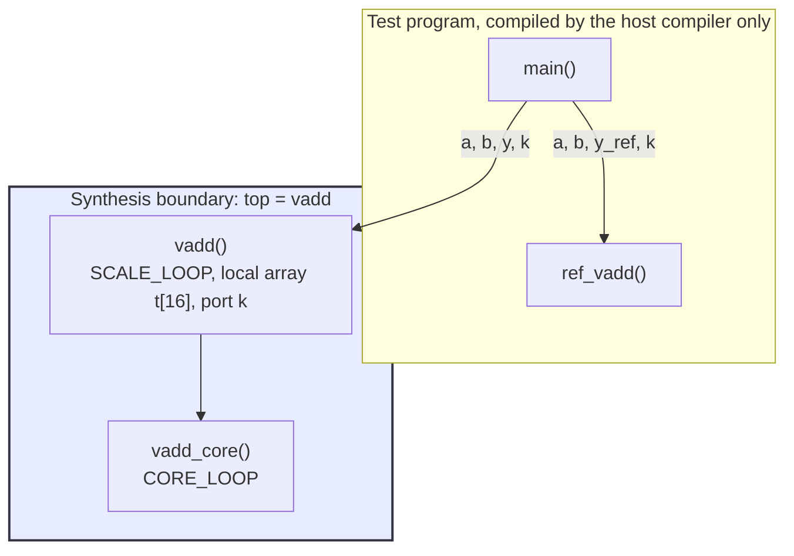
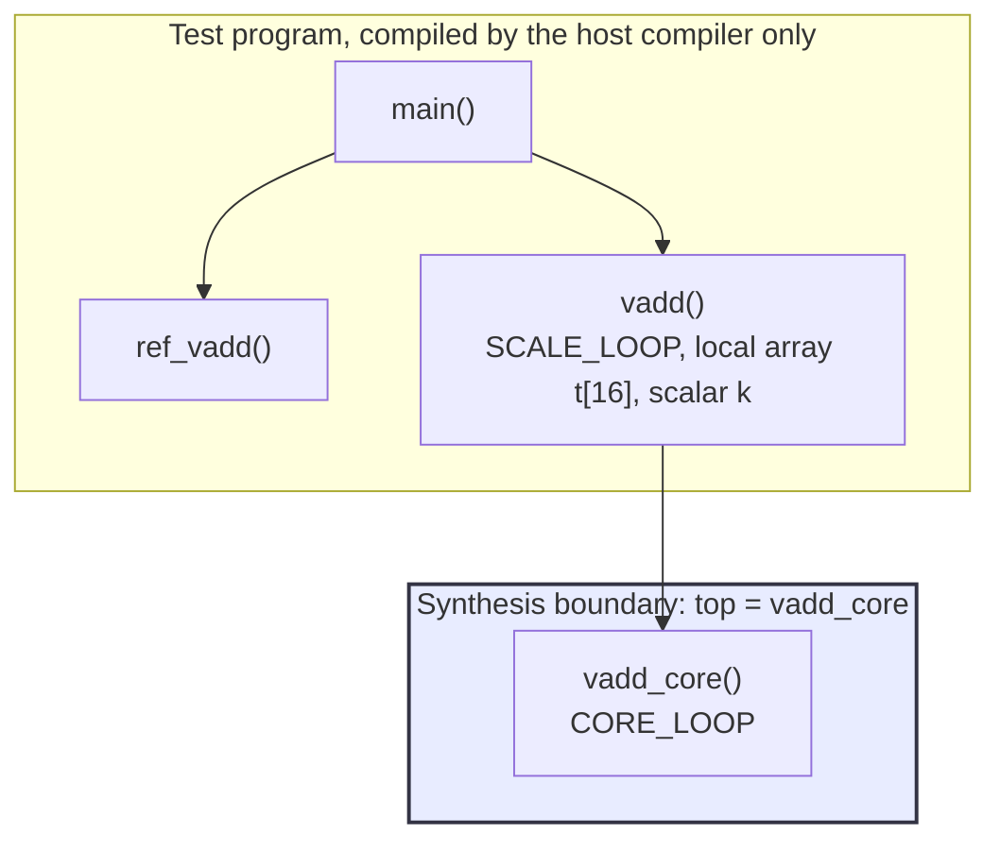

# 0.1 TOP, and the project harness

## 1. Introduction

Every high level synthesis run needs one function to start from.
That function is called the **top function**, and the `TOP` directive is how you name it.
In a Tcl batch script you select it with the project command `set_top`, and you can give a function an alternative top-level name with `set_directive_top -name`, which is the same thing as writing `#pragma HLS top name=...` inside the function.
Vitis HLS then walks the call tree downward from that function and turns everything it can reach into hardware.
Everything the top function cannot reach, including `main` and the whole testbench, is compiled by the host compiler for simulation and is never translated into register transfer level code, which is the cycle accurate hardware description that synthesis produces.

The top function also fixes the **synthesis boundary**, which is the outline around the part of your program that becomes one RTL module.
The arguments of the top function become the ports of that module, and everything inside becomes wires, registers and operators.
Arguments of functions further down the call tree are not ports; they are internal connections.

**What improves:** nothing, in the sense that this directive makes no circuit faster or smaller.
**What it costs:** nothing either.
The `TOP` directive with the `-name` option changes the module name in the generated RTL and nothing else.
The schedule, the resource counts and the port list are bit for bit the same, as this lesson demonstrates by comparing two generated Verilog files.
Selecting a different function as the top does change the reported numbers, but only because a different amount of the program is being built, not because any part of it became more efficient.

**When to use it.** There are three normal reasons.
The first is renaming, so that the generated module does not collide with another module of the same name when several IP blocks are integrated into one design.
The second is characterisation, where you temporarily point the top at an inner function to see the latency and area of that block on its own.
The third is keeping a thin wrapper function in the source file for testing while synthesizing only the part you actually intend to hand to the hardware.

Reference: the `top` pragma and directive page in UG1399, the Vitis HLS user guide for 2023.2, at
<https://docs.amd.com/r/2023.2-English/ug1399-vitis-hls/pragma-HLS-top>, and the
`set_top` command page at
<https://docs.amd.com/r/2023.2-English/ug1399-vitis-hls/set_top>.

This lesson is also where the repository harness is built: the Tcl batch script, the shared part file, the testbench shape and the two collection scripts that every later lesson reuses.
Those files are described in section 6 and in `notes/env.md`.

## 2. How it works

The kernel below has two functions.
The outer function `vadd` calls the inner function `vadd_core` into a local array, and then adds a scalar offset.
The testbench calls `vadd` and compares the result against a reference model.

**Before, with `vadd` as the top function.** The boundary sits around both functions, so the whole call tree becomes hardware.



**After, with `vadd_core` as the top function.** The boundary moves one level down.
`vadd` is still compiled and still runs during C simulation, but it is now ordinary software that nobody builds.



Walking through what the tool does with the first case: it takes the signature of `vadd` and turns each argument into a port group.
The three array arguments become memory interfaces, which means a small bundle of pins consisting of an address output, a chip enable output, a read data input for the arrays that are read, and a write enable output together with a write data output for the array that is written.
The scalar argument `k` becomes a plain 32 bit input.
Four extra control pins appear, called `ap_start`, `ap_done`, `ap_idle` and `ap_ready`, which form the handshake that tells the block when to begin and reports when it has finished.
Then the tool looks inside.
`vadd_core` is small, so it is inlined, meaning its body is pasted into the caller rather than built as a separate module, and `CORE_LOOP` and `SCALE_LOOP` end up as two loops running one after the other inside one module.
The local array `t` becomes real storage inside the block.

In the second case none of the outer work exists.
There is no `k` port because the scalar never crosses the boundary, there is no storage for `t` because the array is declared in a function that is no longer part of the design, and there is only one loop left to schedule.
The reported latency and area drop, but the addition of `k` still has to happen somewhere.
It has simply become the responsibility of whatever circuit you write around this block.

## 3. The kernel

`src/vadd.h`:

```cpp
#ifndef VADD_H
#define VADD_H

const int N = 16;
typedef int data_t;

void vadd_core(const data_t a[N], const data_t b[N], data_t y[N]);
void vadd(const data_t a[N], const data_t b[N], data_t y[N], data_t k);

#endif // VADD_H
```

`src/vadd.cpp`:

```cpp
#include "vadd.h"

// Inner function: element-wise vector addition.
void vadd_core(const data_t a[N], const data_t b[N], data_t y[N]) {
CORE_LOOP:
    for (int i = 0; i < N; i++) {
        y[i] = a[i] + b[i];
    }
}

// Outer function: calls the inner one, then adds a scalar offset.
void vadd(const data_t a[N], const data_t b[N], data_t y[N], data_t k) {
    data_t t[N];
    vadd_core(a, b, t);
SCALE_LOOP:
    for (int i = 0; i < N; i++) {
        y[i] = t[i] + k;
    }
}
```

Three details are worth naming.
The element type is hidden behind the typedef `data_t` so that later lessons can change it in one place.
Both loops carry a label, `CORE_LOOP` and `SCALE_LOOP`, because the loop tables in the synthesis report are indexed by label and an unlabelled loop shows up under a generated name that is hard to follow.
The two input arrays are declared `const`, which tells the tool they are only ever read and lets it leave out the write pins on those interfaces.

## 4. The solutions

| Solution | Name given to `set_top` | Content of the directives file | The one difference |
| --- | --- | --- | --- |
| `base` | `vadd` | empty | The whole call tree is the design. This is the reference. |
| `sub` | `vadd_core` | empty | The synthesis boundary moves one level down the call tree. |
| `rename` | `vadd_ip` | `set_directive_top -name vadd_ip "vadd"` | The same design as `base`, built under a different module name. |

No other directive is applied anywhere in this lesson, and all three solutions share the same `common/part.tcl`, so the part, the clock and the compile configuration are identical.

## 5. Predict

Write these down before running anything.

**Prediction one: the port list.** With the default block level protocol `ap_ctrl_hs` and the default `ap_memory` interface on array arguments, the `base` solution should show the following RTL ports.
The address buses are 4 bits wide because addressing 16 words needs $\lceil \log_2 16 \rceil = 4$ bits.

| Source object | Ports it creates | Count |
| --- | --- | --- |
| block level control | `ap_clk`, `ap_rst`, `ap_start`, `ap_done`, `ap_idle`, `ap_ready` | 6 |
| `a` (read only) | `a_address0`, `a_ce0`, `a_q0` | 3 |
| `b` (read only) | `b_address0`, `b_ce0`, `b_q0` | 3 |
| `y` (written) | `y_address0`, `y_ce0`, `y_we0`, `y_d0` | 4 |
| `k` (scalar) | `k` | 1 |
| | **total** | **17** |

The `sub` solution should show the same list without `k`, so 16 ports, and the `rename` solution should show exactly the same 17 ports as `base`.

**Prediction two: latency.** Neither loop is pipelined, because `config_compile -pipeline_loops 0` is set.
Reading a word from a memory interface costs one cycle for driving the address and the chip enable, and the data arrives in the following cycle, when the addition and the write can also happen.
That gives roughly two cycles per iteration.
`CORE_LOOP` alone should therefore take about $16 \times 2 = 32$ cycles plus one or two cycles of loop entry and exit, and `base` runs two such loops one after the other, so it should land near twice that, in the neighbourhood of 65 to 70 cycles.
The exact numbers go into the table in section 7.

**Prediction three: the two claims this lesson is really about.** First, `base` and `rename` must report identical latency and identical resource counts, and the only difference between their generated Verilog files must be the identifier `vadd` against `vadd_ip`.
Second, `sub` must contain no storage for the array `t`, because that array belongs to a function that is outside the boundary.

One honest caveat on prediction two.
A 16 word array of 32 bit integers is small enough that Vitis may decide to keep `t` in registers rather than in a RAM.
If it does, reading `t` costs no cycle of its own and `SCALE_LOOP` can run at one cycle per iteration, so `base` would come out clearly below twice `sub`.
That outcome is not a failed prediction; it is information about where `t` was placed, and the resource table tells you which of the two happened.

## 6. Run

C synthesis is enough for this lesson.
The `TOP` directive cannot change what the hardware computes, so co-simulation, which runs the testbench against the generated RTL, would only confirm what C simulation already shows.
C simulation is still run once per solution because this lesson is also where the harness is proven to work.

```bash
cd s0_setup/01_top
vitis_hls -f run_hls.tcl 2>&1 | tee run.log
```

The equivalent through the repository Makefile is `make run LESSON=s0_setup/01_top`.

Then collect the numbers:

```bash
bash ../../common/collect_latency.sh   vadd_proj
bash ../../common/collect_resources.sh vadd_proj
```

or `make check LESSON=s0_setup/01_top`, which runs both.
The two scripts are invoked through `bash` so that they work even when the executable bit was lost in copying; run `chmod +x common/*.sh` once if you prefer to call them directly.

What the harness files do, since this is the lesson that introduces them:

| File | Role |
| --- | --- |
| `run_hls.tcl` | Creates the project, adds the sources, then opens, configures and synthesizes each solution in turn. |
| `common/part.tcl` | Holds the part, the clock and the `config_*` commands shared by every lesson. |
| `directives_<solution>.tcl` | Holds the `set_directive_*` commands for one solution, and nothing else. |
| `tb/vadd_tb.cpp` | Reference model, poison value, directed vectors, fixed-seed random vectors, non-zero return on failure. |
| `common/collect_latency.sh` | One row per solution from `syn/report/csynth.xml`, with latency and interval. |
| `common/collect_resources.sh` | One row per solution with the module name and the BRAM, DSP, flip-flop and look-up table estimates. |

Two notes on the script.
The testbench is added with `add_files -tb` rather than `add_files`, which is what keeps it out of the design.
And `set_top` is called again for every solution, after the directives file has been sourced, because in the `rename` solution the name `vadd_ip` only exists once `set_directive_top` has created it.

> **Troubleshooting the rename solution.** If synthesis stops with a message that the top function `vadd_ip` cannot be found, your install resolves the top name before the solution directives are applied.
> In that case put `#pragma HLS top name=vadd_ip` inside `vadd` in the source file instead, or simply confirm the renaming behaviour in the graphical interface, where the directive is stored in the same place.
> The rest of the lesson does not depend on it.

## 7. Read the results

### The latency table

Open `vadd_proj/base/syn/report/csynth.rpt` and find the section headed `== Performance Estimates`, subsection `+ Latency`, table `* Summary`.
It has columns for latency in cycles as a minimum and a maximum, latency in absolute time, the interval, and the pipeline type.
Because there is no pipelining and no data dependent control flow, the minimum and the maximum should be equal.
The `+ Detail` subsection below it lists `CORE_LOOP` and `SCALE_LOOP` separately with their trip counts, which is the direct check that the `sub` solution really lost one of them.

### The interface table

At the bottom of the same file, the section headed `== Interface` lists every RTL port with its direction, its width in bits, the protocol it belongs to, the source object that created it and the C type of that object.
Count the rows and compare against prediction one.
The line for `k` is the one to look for: it is present in `base` and `rename` and absent in `sub`.

### The resource table

The section headed `== Utilization Estimates` reports BRAM_18K, which is a block RAM half-tile, DSP, which is a hardened multiply-accumulate slice, FF, which counts flip-flops, and LUT, which counts look-up tables.
The array `t` shows up here, either as a BRAM count of one or two, or as extra flip-flops and look-up tables if the tool kept it in registers.

### The Verilog

The generated code sits in `vadd_proj/<solution>/syn/verilog/`.
The single most informative line is the module declaration:

```bash
grep -n "^module" vadd_proj/base/syn/verilog/vadd.v
grep -n "^module" vadd_proj/sub/syn/verilog/vadd_core.v
grep -n "^module" vadd_proj/rename/syn/verilog/vadd_ip.v
```

The file names themselves already make the point, because the tool names the file after the module.
To see the whole port list of the top module, print from the module keyword to the closing parenthesis of the port list:

```bash
sed -n '/^module/,/);/p' vadd_proj/base/syn/verilog/vadd.v
```

And to prove that renaming changed nothing but the name, rewrite the identifier in the renamed file and compare, ignoring the comment header, which contains a timestamp:

```bash
diff <(sed 's/vadd_ip/vadd/g' vadd_proj/rename/syn/verilog/vadd_ip.v | grep -v '^//') \
     <(grep -v '^//' vadd_proj/base/syn/verilog/vadd.v)
```

An empty result is the expected outcome and is the strongest evidence that this directive is a naming operation only.

### Fill this in

| Solution | Module name | Latency (cycles) | RTL ports | BRAM_18K |  FF | LUT |
| -------- | ----------- | ---------------- | --------- | -------- | --- | --- |
| `base`   |        vadd |               66 |        17 |        0 |  57 | 199 |
| `sub`    |   vadd_core |               33 |        16 |        0 |  13 |  93 |
| `rename` |     vadd_ip |               66 |        17 |        0 |  57 | 199 |

The two relations to confirm are that the `base` row and the `rename` row are identical in every column except the first, and that the `sub` row has one port fewer, no storage for `t`, and roughly the latency of a single loop.

## 8. Hardware implications

The top function decides what physically exists in the netlist.
With `vadd` as the top, one module is produced that contains an adder used by both loops, a small counter for the loop index, the comparison logic that ends each loop, the finite state machine that sequences the two loops, storage for the array `t`, and the handshake registers behind `ap_start` and `ap_done`.
With `vadd_core` as the top, the storage for `t`, the second loop counter, the second state group in the state machine and the `k` input pin are all simply absent from the netlist.
Nothing was optimized away; a smaller piece of the program was built.

The three memory interfaces deserve a closer look, because they are the part that most often surprises people coming from a register transfer level background.
An array argument does not become a memory inside the block.
It becomes a set of pins that expect a memory to be sitting outside: an address output, a chip enable output, and either a read data input or a write enable and write data output.
The block is a memory master, and somebody else has to provide the RAM and meet the one cycle read latency the schedule assumes.

For a standard cell ASIC flow, most of this carries over unchanged.
The handshake protocol built from `ap_start`, `ap_done`, `ap_idle` and `ap_ready` is ordinary synchronous logic with no FPGA specific primitive in it, and it synthesizes to gates in any technology.
The memory pin bundle carries over as well, and in an ASIC those pins are what you would wire to a compiled SRAM macro from a memory generator, which is why the assumed read latency matters: a compiled SRAM has its own access time, and if it does not match the one cycle the schedule assumed, the timing is wrong.
The module name matters for exactly the same reason in both flows, because two modules with the same name cannot coexist in one netlist.

What is FPGA specific is the storage decision for `t` and the units in the resource report.
A BRAM_18K is a hardened block on the device, and a look-up table based RAM uses the same lookup tables that implement logic.
An ASIC flow has neither; the same array would become flip-flops or a small compiled SRAM, and the area would be reported in gate equivalents or in square micrometres instead.
So read the resource table of this lesson as a relative measure of how much storage exists, not as a number that transfers to another technology.

## 9. One common mistake and one question

**The mistake: adding the testbench with `add_files` instead of `add_files -tb`.** The two commands look interchangeable and the project still builds, but files added without `-tb` are design files.
That means their functions are candidates for synthesis, that constructs which cannot be synthesized, such as `printf` and `rand`, are now inside the design source set, and that co-simulation later behaves strangely because the tool no longer knows which code is the reference and which code is under test.
The symptom is usually a confusing warning about unsynthesizable constructs in a file you never intended to synthesize.
The rule is simple: exactly the files that must become hardware go in with `add_files`, and everything that only exists to test them goes in with `add_files -tb`.

**The question.** The `sub` solution reports a lower latency and fewer resources than `base`.
Did anything get faster?

<details>
<summary>Answer</summary>

No. The `sub` solution is not a faster implementation of the same computation; it is an implementation of a smaller computation.
`SCALE_LOOP`, the local array `t` and the scalar input `k` are outside the synthesis boundary, so no hardware was generated for them at all.
The addition of `k` still has to be performed by something, and whatever circuit instantiates `vadd_core` now has to do it, which costs cycles and area somewhere else in the system.

This is worth internalising because it is the easiest way to accidentally lie with a synthesis report.
A latency number is only meaningful together with the boundary it was measured across.
Comparing two solutions is only fair when both of them build the same amount of the problem, which is exactly why every later lesson in this repository keeps the kernel and the boundary fixed and varies one directive.

There is one honest efficiency difference hiding in the comparison, and it is worth noticing separately: in `base` the intermediate result travels through the array `t`, so every element is written to storage and read back out.
A single fused loop that computed `a[i] + b[i] + k` directly would avoid that round trip.
That is a source code change rather than a directive, and loop merging is the subject of lesson 1.4.

</details>