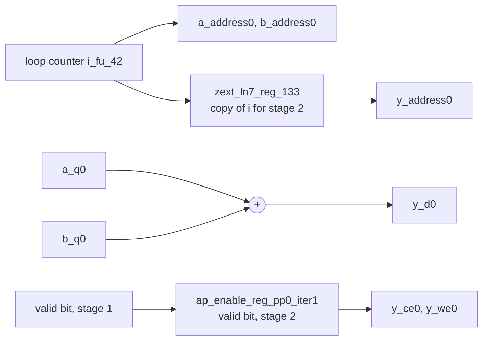

# 1.1 PIPELINE

## 1. Introduction

The `PIPELINE` directive lets the hardware start the next iteration of a loop before the current iteration has finished.
Without it, a loop runs its iterations strictly one after the other, so every operator in the loop body sits idle while the other operators do their part.
With it, the iterations overlap in time like cars on an assembly line: while one iteration is adding, the next one is already reading its inputs.

Three terms describe this, and the whole lesson uses them.
The **iteration latency**, also called the **pipeline depth** and written $D$, is the number of clock cycles one iteration needs from its first operation to its last.
The **initiation interval**, written II, is the number of clock cycles between the start of one iteration and the start of the next.
The **loop latency** is the number of cycles from the start of the first iteration to the end of the last one.
For a loop with $N$ iterations, the loop latency without pipelining is $N \cdot D$, and with pipelining it is

$$
L_{\text{loop}} = D + II \cdot (N - 1).
$$

The first iteration pays the full depth, and every later iteration adds only the initiation interval, because it overlaps with the ones before it.

**What improves:** throughput, meaning the number of results produced per clock cycle.
At II of 1 the loop produces one result every cycle, whatever its depth, and the loop latency drops by roughly a factor of $D$ when $N$ is large.
**What it costs:** a small amount of extra logic and registers.
Each stage needs registers that carry values belonging to its iteration, one valid bit per stage tracks which stages hold a real iteration, and the control logic that starts and drains the pipeline has to be built.
Every operator and every memory port that the loop body uses must also be able to accept new work every II cycles, which is exactly what limits the achievable II in later lessons.
Power while the loop runs goes up, because the operators now switch every cycle instead of every other cycle, but the loop finishes sooner.

**When to use it.** Pipelining is the default first step for any loop that sits on the performance critical path, and inner loops in particular.
It is not worth it for a loop that runs rarely, or for a design where area matters and the extra cycles do not.

The directive takes a target initiation interval with the option `-II`, and the default target is 1.
Other options exist, such as `-rewind`, `-off` and `-style`, but this lesson does not use them.
If the tool cannot reach the requested II, it does not fail; it builds the best II it can and reports a violation, which is the subject of lesson 1.5.

Reference: the `pipeline` pragma page in UG1399, the Vitis HLS user guide for 2023.2, at <https://docs.amd.com/r/2023.2-English/ug1399-vitis-hls/pragma-HLS-pipeline>, and the `set_directive_pipeline` command page at <https://docs.amd.com/r/2023.2-English/ug1399-vitis-hls/set_directive_pipeline>.

## 2. How it works

One iteration of the vector addition kernel in section 3 has two steps.
In the first step, labelled RD in the tables below, the hardware drives the addresses of `a[i]` and `b[i]` onto the two memory interfaces.
In the second step, labelled AW, the two words arrive from memory, the adder adds them, and the sum is written to `y[i]`.
The two steps cannot share one cycle, because the memory interface returns read data one cycle after the address is presented, so $D = 2$.

**Before, without pipelining.** Iteration $i + 1$ starts only after iteration $i$ has written its result.

| Iteration    | 0  | 1  | 2  | 3  | 4  | 5  | 6  | 7  |
| ------------ | -- | -- | -- | -- | -- | -- | -- | -- |
| i = 0        | RD | AW |    |    |    |    |    |    |
| i = 1        |    |    | RD | AW |    |    |    |    |
| i = 2        |    |    |    |    | RD | AW |    |    |
| i = 3        |    |    |    |    |    |    | RD | AW |
| Adder in use |    | x  |    | x  |    | x  |    | x  |

**After, pipelined with II of 1.** A new iteration starts every cycle.

| Iteration    | 0  | 1  | 2  | 3  | 4  | 5  | 6  | 7  |
| ------------ | -- | -- | -- | -- | -- | -- | -- | -- |
| i = 0        | RD | AW |    |    |    |    |    |    |
| i = 1        |    | RD | AW |    |    |    |    |    |
| i = 2        |    |    | RD | AW |    |    |    |    |
| i = 3        |    |    |    | RD | AW |    |    |    |
| i = 4        |    |    |    |    | RD | AW |    |    |
| i = 5        |    |    |    |    |    | RD | AW |    |
| i = 6        |    |    |    |    |    |    | RD | AW |
| Adder in use |    | x  | x  | x  | x  | x  | x  | x  |

Read the columns of the second table from left to right.
In cycle 1, iteration 0 is adding and writing while iteration 1 is already reading, and this is legal because the two steps use different hardware: the read step uses the ports of `a` and `b`, and the write step uses the port of `y`.
No port is asked to do two things in the same cycle, so nothing forces the second iteration to wait.
From cycle 1 onward the adder is busy in every cycle, whereas in the first table it is idle half of the time.
After eight cycles the pipelined loop has completed seven iterations, while the sequential loop has completed four.
The circuit did not get a second adder; it got better use out of the one it already had.

## 3. The kernel

`src/vadd.h`:

```cpp
#ifndef VADD_H
#define VADD_H

const int N = 16;
typedef int data_t;

void vadd(const data_t a[N], const data_t b[N], data_t y[N]);

#endif // VADD_H
```

`src/vadd.cpp`:

```cpp
#include "vadd.h"

// Element-wise vector addition. The only loop is VADD_LOOP, and it is the
// target of the PIPELINE directive in the ii1 and ii2 solutions.
void vadd(const data_t a[N], const data_t b[N], data_t y[N]) {
VADD_LOOP:
    for (int i = 0; i < N; i++) {
        y[i] = a[i] + b[i];
    }
}
```

The kernel is the smallest loop that has something to overlap.
Each iteration reads each input array once and writes the output array once, so a single memory port per array is enough for II of 1, and no memory port can become the bottleneck.
There is also no value carried from one iteration to the next, so no dependence can stop the iterations from overlapping.
Both properties are deliberate, because they leave the directive as the only thing that decides the schedule.

## 4. The solutions

| Solution | Content of the directives file                   | The one difference                                        |
| -------- | ------------------------------------------------ | --------------------------------------------------------- |
| `base`   | empty                                            | The loop is not pipelined. This is the reference.         |
| `ii1`    | `set_directive_pipeline -II 1 "vadd/VADD_LOOP"`  | The loop is pipelined with a target II of 1.              |
| `ii2`    | `set_directive_pipeline -II 2 "vadd/VADD_LOOP"`  | The loop is pipelined with a target II of 2.              |

The location string `"vadd/VADD_LOOP"` names the function first and the loop label second, which is why every loop in this repository carries a label.
All three solutions source the same `common/part.tcl`, and its line `config_compile -pipeline_loops 0` is what keeps the `base` loop from being pipelined automatically.
Without that line, Vitis would pipeline a 16 iteration loop on its own, and `base` and `ii1` would come out identical.

## 5. Predict

Write these down before running anything.

**Prediction one: the `base` loop latency.** The loop has $N = 16$ iterations of depth $D = 2$ and no overlap, so

$$
L_{\text{base}} = N \cdot D = 16 \cdot 2 = 32 \text{ cycles}.
$$

The function latency should be the same number plus one or two cycles for entering and leaving the loop.

**Prediction two: the `ii1` initiation interval and loop latency.** Nothing in the kernel stands in the way of II of 1, so the achieved II should equal the target, and

$$
L_{\text{ii1}} = D + II \cdot (N - 1) = 2 + 1 \cdot 15 = 17 \text{ cycles}.
$$

At the 3.33 ns clock this is about 57 ns against about 107 ns for `base`.
The function latency should again be one or two cycles larger than the loop latency, for entering and leaving the loop and for the small handshake that a pipelined loop gets in this tool version.
If the tool decides that reading and adding cannot fit in one 2.43 ns budget and gives the loop a depth of 3, the formula still holds and gives 18 cycles.

Before running, also write down your own guess for the `ii2` loop latency, using the same formula; the question in section 9 returns to it.

## 6. Run

C synthesis is enough for this lesson.
Pipelining never changes what the loop computes, because the tool only overlaps iterations when it can prove the overlap is safe, and this kernel has no dependence between iterations at all.
Co-simulation would therefore only confirm what C simulation already shows.
The script runs C simulation once, in the `base` solution, because the testbench and the source are the same for all three solutions.

```bash
cd s1_loops/11_pipeline
vitis_hls -f run_hls.tcl 2>&1 | tee run.log
```

The same run through the repository Makefile is `make run LESSON=s1_loops/11_pipeline`.

Then collect the summary numbers:

```bash
bash ../../common/collect_latency.sh   vadd_proj
bash ../../common/collect_resources.sh vadd_proj
```

or run `make check LESSON=s1_loops/11_pipeline`, which runs both.

## 7. Read the results

### The scheduler's own statement

The quickest check is the log line that the scheduler prints for every pipelined loop:

```bash
grep "Pipelining result" run.log
```

It reports the target II, the final II and the depth, once for `ii1` and once for `ii2`, and nothing for `base`:

```
INFO: [HLS 200-1470] Pipelining result : Target II = 1, Final II = 1, Depth = 2, loop 'VADD_LOOP'
INFO: [HLS 200-1470] Pipelining result : Target II = 2, Final II = 2, Depth = 2, loop 'VADD_LOOP'
```

The depth printed here is the value of $D$ to use in the formula, and here it agrees with the Iteration Latency column of the reports below.

### The loop table

In this tool version (2023.2.2) the loop is not split into a module of its own; `VADD_LOOP` stays inside `vadd` in all three solutions, and the table `* Instance` reads `N/A` everywhere.
So the loop row sits in the same report for every solution.
Open `vadd_proj/<solution>/syn/report/vadd_csynth.rpt` and find the section headed `== Performance Estimates`, subsection `+ Detail`, table `* Loop`:

```bash
grep -A 7 "\* Loop:" vadd_proj/base/syn/report/vadd_csynth.rpt
grep -A 7 "\* Loop:" vadd_proj/ii1/syn/report/vadd_csynth.rpt
grep -A 7 "\* Loop:" vadd_proj/ii2/syn/report/vadd_csynth.rpt
```

`csynth.rpt` in the same folder is the shorter synthesis summary, and its `Modules & Loops` table shows the same numbers for the function and the loop on two lines.
In `base`, the row lists a trip count of 16, an iteration latency of 2, no initiation interval and the Pipelined column set to `no`.
In `ii1` and `ii2`, the Pipelined column reads `yes`, and the Initiation Interval column has two sub-columns, the achieved value and the target value, which agree in this lesson.

Compare the loop Latency column with the formula carefully.
For `ii2` it reads 32, as the formula predicts, but for `ii1` it reads 16, one cycle below the 17 that the formula gives.
The cycle is not lost, it is only booked elsewhere: the function latency of `ii1` is two cycles above its loop row, whereas for `base` it is one cycle above.
The function latency is therefore the reliable comparison: `base` needs $32 + 1 = 33$ cycles and `ii1` needs $17 + 1 = 18$, so pipelining saves exactly $(D - II) \cdot (N - 1) = 15$ cycles.

### The top-level summary

The `* Summary` table under `+ Latency` gives the function latency and the interval, and the collector script prints the same numbers.
The function latencies are 33, 18 and 34 cycles for `base`, `ii1` and `ii2`, with intervals of 34, 19 and 35.
The interval of the function stays one cycle above its latency in all three solutions, because the directive pipelines the loop and not the function, so one call of `vadd` still has to finish before the next call can start.

### The Verilog

The generated files sit in `vadd_proj/<solution>/syn/verilog/`, and listing them already shows the structural change:

```bash
ls vadd_proj/base/syn/verilog/ vadd_proj/ii1/syn/verilog/
```

`base` contains only `vadd.v`.
The pipelined solutions add `vadd_flow_control_loop_pipe.v`, which is not the loop but a small helper that `vadd.v` instantiates to handle the start and done handshake around the pipelined loop.
The loop itself stays in `vadd.v`, and there the line worth finding is the declaration of the valid bit of the second stage:

```bash
grep -n "reg.*ap_enable_reg_pp0_iter1;" vadd_proj/*/syn/verilog/vadd.v
```

It matches only in `ii1`.
The register `ap_enable_reg_pp0_iter1` says whether the second stage currently holds a real iteration, and it gates the write enable `y_we0` during the fill and drain of the pipeline.
Its presence is the most direct evidence that a two stage pipeline exists in hardware.
To see how the three solutions differ, compare the state names of the controller:

```bash
grep -o "ap_ST_fsm_[a-z0-9]*" vadd_proj/base/syn/verilog/vadd.v | sort -u
grep -o "ap_ST_fsm_[a-z0-9]*" vadd_proj/ii1/syn/verilog/vadd.v  | sort -u
grep -o "ap_ST_fsm_[a-z0-9]*" vadd_proj/ii2/syn/verilog/vadd.v  | sort -u
```

`base` has three ordinary states, `ap_ST_fsm_state1` to `ap_ST_fsm_state3`: `state1` waits for `ap_start`, `state2` checks the counter and performs the RD step, and `state3` performs the AW step and returns to `state2`.
`ii1` has a single pipeline state, `ap_ST_fsm_pp0_stage0`, because every cycle looks the same.
`ii2` has no pipeline state at all, only `ap_ST_fsm_state1` and `ap_ST_fsm_state2`, and no `ap_enable_reg_pp0_iter1` either.
With II equal to the depth no two iterations ever overlap, so the tool builds the loop as a plain two state sequence, and `y_we0` is simply driven by `state2`.
Section 9 comes back to this.

### Fill this in

| Solution | II achieved | Depth | Loop latency   | Function latency | Interval | FF  | LUT |
| -------- | ----------- | ----- | -------------- | ---------------- | -------- | --- | --- |
| predict  | none, 1, ?  | 2     | 32, 17, ?      | about 34, 19, ?  | +1       |     |     |
| `base`   | none        | 2     | 32             | 33               | 34       | 13  | 93  |
| `ii1`    | 1           | 2     | 16 (see above) | 18               | 19       | 13  | 104 |
| `ii2`    | 2           | 2     | 32             | 34               | 35       | 13  | 105 |

The estimated clock period is 2.370 ns in all three solutions, so the `ii1` function takes about 60 ns against about 110 ns for `base`.

The relations to confirm are these.
The `ii1` function latency is 15 cycles below `base`, which is exactly what $D + (N - 1) = 17$ against $N \cdot D = 32$ predicts, even though the `ii1` loop row reads 16.
The single 32 bit adder, `y_d0` in the Expression table of the report, is present once in every solution, so pipelining did not duplicate any operator.
The flip-flop count does not grow at all: `ii1` adds the valid bit `ap_enable_reg_pp0_iter1` and a one bit `ap_done_reg`, but its state register shrinks from three bits to one, and the three changes cancel out.
The cost shows up in the LUT count instead, which grows by 11 from `base` to `ii1`, mostly in the multiplexers and small gates of the pipeline control.
Finally, the `ii2` row is worth comparing with `base` rather than with `ii1`: same loop latency, one cycle more function latency and 12 more LUTs.

## 8. Hardware implications

The pipelined loop contains the same single 32 bit adder as the sequential one, and each array still has one memory port.
What appeared is a small amount of bookkeeping hardware, shown in the diagram below for the `ii1` solution; the register names are those in `vadd_proj/ii1/syn/verilog/vadd.v`.



The stage register for the loop index, `zext_ln7_reg_133`, is not new.
When iteration $i$ reaches its write step, the counter has already moved on to $i + 1$, so the index of iteration $i$ has to travel alongside it for one cycle to address `y` correctly, and `base` needs the same register, `zext_ln7_reg_131`, for the same reason.
The real addition is the chain of valid bits, one per stage after the first, which here is the single register `ap_enable_reg_pp0_iter1`; it keeps the write enable low during the first cycle, before any iteration has reached the write step, and during the drain at the end.
The second addition is the loop handshake: `vadd.v` instantiates the helper module `vadd_flow_control_loop_pipe`, and gains a one bit `ap_done_reg`, to start the pipelined loop and signal when it has drained.
The loop itself is not split off into a module of its own; it stays inside `vadd`.
What disappeared is part of the finite state machine of `vadd`, which is the controller that steps the design through its states: the three states of `base` collapsed into a single repeating pipeline state, so the one-hot state register `ap_CS_fsm` shrinks from three bits to one.
That saving cancels the two new flip-flops exactly, which is why the FF count stays at 13, and the net cost is the 11 extra LUTs of the pipeline control logic.

For a standard cell ASIC flow, all of this carries over.
Stage registers, valid bits and the handshake are ordinary synchronous logic, and this kernel instantiates no FPGA specific primitive, since a 32 bit addition is written as a plain `+` in the Verilog.
Two assumptions deserve care when the same design moves to an ASIC.
First, the depth of 2 was chosen from FPGA delay estimates against a 2.43 ns budget, so a different technology or clock could justify a different depth, although for this kernel the memory read latency alone fixes the depth at 2.
Second, the schedule assumes each memory accepts a new access every cycle with one cycle of read latency, and in an ASIC those memories would be compiled SRAM macros that must actually provide that behavior.

The resource numbers themselves are FPGA specific.
The report counts flip-flops (FF) and look-up tables (LUT), which are the basic storage and logic cells of the FPGA fabric, and it also counts BRAM_18K blocks, which are hardened memory blocks, and DSP slices, which are hardened multiply and accumulate units; neither of the last two should appear in any solution here.
In an ASIC the same design would be reported in gate equivalents or square micrometres, so read the FF and LUT change as a relative measure of the bookkeeping cost, not as a number that transfers.

## 9. One common mistake and one question

**The mistake: pipelining the function instead of the loop.**
Writing `set_directive_pipeline "vadd"` looks like a shortcut that pipelines everything inside `vadd`, but it asks for something much stronger.
When a function or an outer loop is pipelined, Vitis must fully unroll every loop below it, meaning it replaces the loop by 16 copies of the loop body that all belong to one pipeline iteration.
All 32 reads and 16 writes are then requested in the same pipeline iteration, the memory ports cannot deliver that many accesses in one cycle, and the result is a large circuit whose achieved II is several cycles rather than 1.
The directive should name the loop, as `"vadd/VADD_LOOP"`, unless you really want the unrolling, which is the subject of lesson 3.1.

**The question.** The `ii2` solution is pipelined, and yet its loop latency is almost exactly the same as in `base`. Why, and when would II of 2 ever be the right choice?

<details>
<summary>Answer</summary>

With $D = 2$ and II of 2, the formula gives

$$ L_{\textrm{ii2}} = D + II \cdot (N - 1) = 2 + 2 \cdot 15 = 32 \textrm{cycles} $$

which is the same as $N \cdot D = 32$ for the sequential loop.
The schedule table shows why: iteration $i + 1$ starts in the very cycle after iteration $i$ has finished, so the iterations never overlap, and the table is identical to the one for `base` in section 2.
Pipelining only saves time when the depth is larger than the initiation interval, because the saving per iteration is $D - II$ cycles.
Here that saving is zero, and the tool recognises it: the `ii2` Verilog has no pipeline state and no valid bit, only a plain two state loop like `base`, as section 7 showed.
It still pays for the pipelined loop handshake, the `vadd_flow_control_loop_pipe` helper and `ap_done_reg`, so it is slightly worse than `base` on both counts, with 105 LUTs against 93 and a function latency of 34 cycles against 33.

II of 2 becomes the right choice when something forces it or when it buys area.
A loop body that reads the same single port memory twice per iteration cannot go below II of 2, because the port can only serve one access per cycle.
A deep loop body, for example one with a floating point adder of depth 7, still gains a lot from II of 2, because its saving per iteration is $7 - 2 = 5$ cycles.
And a loop that only needs half the throughput can use II of 2 to let one operator serve two operations per iteration, which lesson 4.2 shows with the `ALLOCATION` directive.

</details>