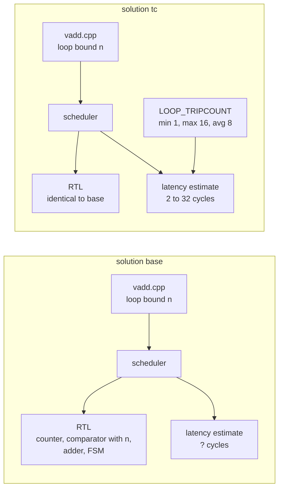

# 1.2 LOOP_TRIPCOUNT

## 1. Introduction

The `LOOP_TRIPCOUNT` directive tells Vitis HLS how many times a loop is expected to run, so that the tool can print a latency estimate for a loop whose bound is only known at run time.
The **trip count** of a loop is the number of times its body executes.
When the bound is a constant, such as the 16 in lesson 1.1, the tool knows the trip count and multiplies it by the iteration latency to obtain the loop latency.
When the bound is a function argument, the trip count depends on a value that only arrives while the hardware is running, so the tool cannot form that product and prints a question mark instead.
The directive supplies the missing numbers as a minimum, a maximum and an average trip count.

**What improves:** only the synthesis report.
The report shows a latency range instead of a question mark, and the question mark no longer spreads upward into the latency of the function and of every function that calls it.

**What it costs:** nothing in hardware, because this directive changes nothing in hardware.
UG1399 describes it as a directive for analysis only that does not affect the synthesis result, and this lesson checks that claim by comparing the generated Verilog of the two solutions line by line.
The real cost is a risk.
The tool never checks the numbers against the code, so a wrong trip count produces a report that looks precise and is simply wrong.

**When to use it.** Use it on every loop with a variable bound whose latency you want to read or compare, which in practice means as soon as a report shows a question mark.
It matters most before comparing solutions, because two solutions that both report a question mark cannot be compared at all.
Do not use it to make the hardware smaller or faster, because it cannot do either; section 9 shows what to change instead when that is the goal.

The directive takes the options `-min`, `-max` and `-avg`, each an integer number of iterations, and a location that names the loop.

Reference: the `loop_tripcount` pragma page in UG1399, the Vitis HLS user guide for 2023.2, at <https://docs.amd.com/r/2023.2-English/ug1399-vitis-hls/pragma-HLS-loop_tripcount>, and the `set_directive_loop_tripcount` command page at <https://docs.amd.com/r/2023.2-English/ug1399-vitis-hls/set_directive_loop_tripcount>.

## 2. How it works

Synthesis produces two separate things from the same C code: the hardware itself, written out as RTL, and a report that estimates how that hardware will behave.
RTL, short for register transfer level, is the Verilog description of registers and the logic between them.
The diagram below shows both solutions of this lesson side by side and marks where the directive enters.



In both solutions the scheduler builds the same loop.
It is a counter `i`, a comparator that checks `i` against the input port `n` at every iteration, the adder, and an FSM, short for finite state machine, which is the controller that steps the design through its clock cycles and leaves the loop when the comparator says so.
In hardware the number of iterations is not fixed at all; it is decided cycle by cycle from whatever value sits on `n`, and for one call the loop latency is

$$
L_{\textrm{loop}}(n) = n \cdot D,
$$

where $D$ is the iteration latency, the number of cycles one iteration takes, which is 2 for this unpipelined loop as in lesson 1.1.
The report, however, has to print a single range that holds for every call, and the formula above has no value for $n$ at synthesis time.
In `base` the estimator therefore writes a question mark.
In `tc` the directive feeds the estimator the numbers 1, 16 and 8, and the estimator evaluates the same formula at those points.
The arrow from the directive ends at the estimate and never reaches the RTL, which is the whole lesson in one picture.

## 3. The kernel

`src/vadd.h`:

```cpp
#ifndef VADD_H
#define VADD_H

const int N_MAX = 16;
typedef int data_t;

void vadd(const data_t a[N_MAX], const data_t b[N_MAX], data_t y[N_MAX], int n);

#endif // VADD_H
```

`src/vadd.cpp`:

```cpp
#include "vadd.h"

// Element-wise vector addition over the first n elements. The caller must
// keep n between 1 and N_MAX. VADD_LOOP has a bound that is only known at
// run time, and it is the target of LOOP_TRIPCOUNT in the tc solution.
void vadd(const data_t a[N_MAX], const data_t b[N_MAX], data_t y[N_MAX], int n) {
VADD_LOOP:
    for (int i = 0; i < n; i++) {
        y[i] = a[i] + b[i];
    }
}
```

The kernel is the vector addition from lesson 1.1 with one change: the loop runs to the argument `n` instead of to a constant.
The arrays keep their 16 elements, so the memory interfaces are the same as before.
The scalar `n` becomes a plain 32 bit input port of the same name in the Vivado IP flow.
The rule that `n` lies between 1 and 16 exists only as a comment, and the directive in the `tc` solution restates that comment in a form the estimator can read, without the tool checking either of them.

The loop is deliberately not pipelined, and `common/part.tcl` still sets `config_compile -pipeline_loops 0`, so that the only thing that differs between the solutions is the directive under study.

## 4. The solutions

| Solution | Tripcount options       | The one difference                                 |
| -------- | ----------------------- | -------------------------------------------------- |
| `base`   | none                    | Reference: the estimator has no trip count.        |
| `tc`     | `-min 1 -max 16 -avg 8` | The estimator is told the loop runs 1 to 16 times. |

The full command in `directives_tc.tcl` is `set_directive_loop_tripcount -min 1 -max 16 -avg 8 "vadd/VADD_LOOP"`.
The minimum and the maximum follow from the contract in the kernel comment.
The average of 8 is an assumption about how the kernel will be used, and it is the kind of number only the designer can know.

## 5. Predict

Write these down before running anything.

**Prediction one: the `base` latency.** The loop latency, the function latency and the interval of `base` should all read as a question mark, because every one of them contains the unknown trip count.
If your report shows a number instead, note it down, because it means the tool derived a bound on its own from somewhere, and section 9 asks where it could have come from.

**Prediction two: the `tc` loop latency range.** With $D = 2$,

$$
L_{\textrm{min}} = 1 \cdot 2 = 2 \textrm{ cycles}, \qquad L_{\textrm{max}} = 16 \cdot 2 = 32 \textrm{ cycles}.
$$

The maximum function latency should be close to the function latency of `base` in lesson 1.1, because a call with $n = 16$ runs the same loop.
It may differ by a cycle, because comparing with a port costs slightly different logic than comparing with a constant.

Finally, predict the resources and the Verilog: both should be identical between `base` and `tc`.

## 6. Run

C synthesis is enough for this lesson.
The directive cannot change what the hardware computes, because it does not change the hardware at all, so co-simulation would add nothing.
The script runs C simulation once, in the `base` solution, to prove that the kernel and the testbench agree.

```bash
cd s1_loops/12_loop_tripcount
vitis_hls -f run_hls.tcl 2>&1 | tee run.log
```

The same run through the repository Makefile is `make run LESSON=s1_loops/12_loop_tripcount`.

Then collect the summary numbers:

```bash
bash ../../common/collect_latency.sh   vadd_proj
bash ../../common/collect_resources.sh vadd_proj
```

or run `make check LESSON=s1_loops/12_loop_tripcount`, which runs both.
For `base`, the latency collector should print the placeholder that `csynth.xml` uses for an unknown value rather than a number.

## 7. Read the results

### The loop table

Open `vadd_proj/<solution>/syn/report/vadd_csynth.rpt` and find the section headed `== Performance Estimates`, subsection `+ Detail`, table `* Loop`:

```bash
grep -A 12 "\* Loop:" vadd_proj/base/syn/report/vadd_csynth.rpt
grep -A 12 "\* Loop:" vadd_proj/tc/syn/report/vadd_csynth.rpt
```

In `base`, the row for `VADD_LOOP` should show a question mark in the two latency columns and in the Trip Count column, while the Iteration Latency column still shows 2.
The iteration latency is known because it depends only on the loop body, and the body is the same whatever `n` is.
In `tc`, the latency columns should read 2 and 32, and the Trip Count column should show the range from 1 to 16.
These two rows are the before and after of this lesson.

### The top-level summary

```bash
grep -A 10 "\* Summary:" vadd_proj/base/syn/report/vadd_csynth.rpt
grep -A 10 "\* Summary:" vadd_proj/tc/syn/report/vadd_csynth.rpt
```

The function latency and the interval of `base` should be question marks as well, which shows how an unknown trip count spreads upward.
In `tc`, the function latency should read 3 to 33 cycles and the interval 4 to 34.
The one extra cycle of function latency over loop latency is the state that enters and leaves the loop, and the one extra cycle of interval over latency is the cycle before the function can accept its next start.
The short summary `csynth.rpt` shows the same contrast in its `Modules & Loops` table.
The text reports show only the minimum and the maximum; the average estimate, if your install writes it, sits in the XML report:

```bash
grep -iE "average|best|worst" vadd_proj/tc/syn/report/csynth.xml | head
```

### The Verilog

The claim that the hardware is unchanged can be tested directly:

```bash
diff -rq vadd_proj/base/syn/verilog vadd_proj/tc/syn/verilog
diff vadd_proj/base/syn/verilog/vadd.v vadd_proj/tc/syn/verilog/vadd.v
```

Expect the plain `diff` to be longer than one line.
The tool gives every internal signal a numeric suffix, such as `i_fu_40` in `base` and `i_fu_48` in `tc`, and these numbers come from an internal counter that shifts between runs, so the same register can carry a different name in each solution.
Renamed wires are not different hardware.
To compare structure rather than names, replace the suffixes with a placeholder before diffing:

```bash
norm(){ sed -E 's/_(fu|reg)_[0-9]+/_\1_N/g; s/HLS_SYN_LAT=[-0-9]+/HLS_SYN_LAT=X/' "$1"; }
diff <(norm vadd_proj/base/syn/verilog/vadd.v) <(norm vadd_proj/tc/syn/verilog/vadd.v) && echo identical
```

This should print `identical`: every register, every assignment and every state of the FSM is the same in both files.

The one line that differs in content is the `CORE_GENERATION_INFO` attribute at the top of `vadd.v`, which the command above masks on purpose:

```bash
grep -o "HLS_SYN_LAT=[^,]*" vadd_proj/*/syn/verilog/vadd.v
```

This attribute is a comment-like record of the synthesis estimates that the tool stamps into the module, and its latency field is where the new number from the directive lands.
In `base` it reads `-1`, the marker for an unknown latency.
In `tc` it reads 17, which is neither the minimum nor the maximum but the average-case latency, $8 \cdot 2 + 1$, computed from `-avg 8`.
This is the one place where the average reaches a file outside `csynth.xml`.

### Fill this in

| Solution          | Trip count | Loop latency | Function latency | FF      | LUT     |
| ----------------- | ---------- | ------------ | ---------------- | ------- | ------- |
| `base`, predicted | ?          | ?            | ?                | as `tc` | as `tc` |
| `tc`, predicted   | 1 to 16    | 2 to 32      | about 3 to 33    |         |         |
| `base`, measured  |            |              |                  |         |         |
| `tc`, measured    |            |              |                  |         |         |

The relations to confirm are that only the latency columns change, that the resource columns are identical, and that the Verilog differs only in signal names and in the generation attribute.

## 8. Hardware implications

Nothing appeared and nothing disappeared.
Both solutions contain the same counter, the same comparator between `i` and the port `n`, the same 32 bit adder, the same single memory port per array and the same FSM.
The flip-flop count (FF) and the look-up table count (LUT), which measure the basic storage and logic cells of the FPGA fabric, should therefore match exactly.

One detail of that shared hardware is worth noticing, because it shows what the directive does not do.
The counter `i` is only 5 bits wide, and it is 5 bits wide in `base` as well, so the directive did not cause this.
The tool narrowed the counter on its own, because `i` indexes arrays of 16 elements and 5 bits are enough to count from 0 up to and including 16.
The comparator, however, zero-extends that 5 bit counter and checks it against the full 32 bit signed `n`, because `n` is an `int` and nothing in the code narrows it.
You can see both with:

```bash
grep -nE "reg +\[4:0\] i_fu|^assign icmp_ln8" vadd_proj/tc/syn/verilog/vadd.v
```

The directive states a maximum of 16, yet nothing in the hardware refers to it; the counter width comes from the arrays and the comparator width comes from the type of `n`, identically in both solutions.
The directive is only a statement for the report and not a fact about the code.

For a standard cell ASIC flow, the conclusion carries over completely, since there is no hardware difference to carry.
The directive is metadata for the estimator and never reaches the netlist, so an ASIC synthesis tool that reads either Verilog file builds the same gates.
The latency range itself also carries over, because it counts clock cycles and not FPGA cells.
The FF and LUT numbers remain FPGA specific, as in lesson 1.1.

## 9. One common mistake and one question

**The mistake: treating the maximum as a limit that the hardware enforces.**
It is tempting to read `-max 16` as a promise that the loop cannot run more than 16 times, and to expect a smaller counter or a guard against larger values of `n`.
Neither happens.
If a caller passes `n = 20`, the hardware runs 20 iterations and reads and writes past the end of the arrays, and the report still claims a maximum of 32 cycles.
If a caller passes `n = 32` or more, it is worse: the 5 bit counter from section 8 wraps from 31 back to 0 before it ever reaches `n`, so the loop never ends.
If the bound should shape the hardware, it has to be expressed in the C code, for example by giving `n` a narrower type such as `ap_uint<5>`, or by writing the loop with the constant bound `N_MAX` and leaving it early when `i` reaches `n`.
Both are source changes that do alter the hardware, which is exactly why they are outside this lesson.

**The question.** The arrays are declared with 16 elements, and the loop indexes them with `i`. Why does `base` still report an unknown latency instead of deducing a maximum of 16 iterations?

<details>
<summary>Answer</summary>

The loop condition is `i < n`, and nothing in that condition mentions 16.
The array sizes do not help, because in C and C++ an array parameter such as `const data_t a[N_MAX]` is adjusted to a plain pointer, so the 16 is not part of the type the loop sees.
Vitis HLS does use that size to build the memory interface, which is why the address ports are 4 bits wide.
It also uses it to narrow the counter `i` to 5 bits, as section 8 showed, which amounts to assuming that `i` never exceeds 16.
It does not, however, carry that assumption over to the latency estimate.
The estimator bounds a loop from its exit condition, and the exit condition compares against `n`, a 32 bit signed value about which the code promises nothing.
So the same tool that trusts the array size when sizing a register refuses to trust it when counting iterations, and the trip count stays unknown.
In hardware, a call with `n` larger than 16 would simply run on, and because the address ports are only 4 bits wide, the addresses would wrap around and overwrite the first elements of `y`.

This is also why the tool cannot check the directive.
If it could prove a bound, it would not need one, and since it cannot, it has to take the designer's numbers on trust.

</details>