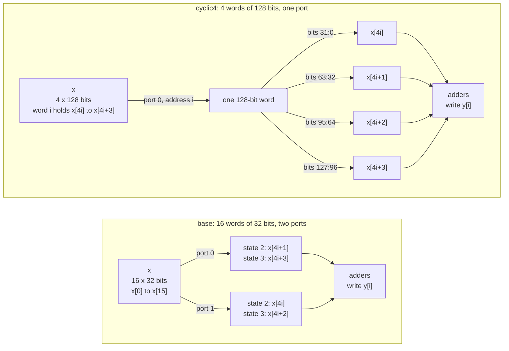

# 2.2 ARRAY_RESHAPE

## 1. Introduction

The `ARRAY_RESHAPE` directive turns one array into a new array with fewer words, where each word is wider and holds several of the original elements side by side.
The result is still one memory, but every read or write through its port moves several elements at once.
A memory port is the set of address, enable and data signals through which a memory serves one read or one write per clock cycle.
A single memory offers at most two ports, so a loop that needs more than two elements of one array in the same cycle normally has to spread those reads over several cycles.
Reshaping does not add ports; it makes each port wider, so one read can deliver several elements, but only elements that share one word.

Reshaping is best understood as the partitioning from lesson 2.1 followed by one more step.
The array is first split into banks exactly as `ARRAY_PARTITION` would split it, and the banks are then placed side by side in one memory instead of being kept as separate memories.
What was a bank number in lesson 2.1 becomes a slice number, which is the position of an element inside the wide word.
What was an address inside a bank stays the address of the wide word.
Partitioning therefore lets one cycle combine elements at different addresses in different banks, while reshaping lets one cycle combine only the elements stored at one address.

The directive has the same three types as `ARRAY_PARTITION`.
The `cyclic` type places neighbouring elements in the same word, so consecutive elements are read together.
The `block` type places elements that lie one block apart in the same word, so consecutive elements land in the same slice of different words.
The `complete` type packs the whole array into a single word.
The `-factor` option sets the number of elements per word for `cyclic` and `block`.
The `-dim` option chooses the dimension of a multidimensional array; this lesson uses a one-dimensional array, so the dimension is always 1.

**What improves:** memory bandwidth, which is the number of elements that can be read or written in one clock cycle, and through it latency.
The improvement appears only when the elements that the loop needs together share one word address after reshaping.
On this kernel each iteration reads four neighbouring elements, so the `cyclic` type places all four in one word and removes one read cycle from every iteration.
Compared with partitioning, reshaping reaches that bandwidth with one memory and one address path instead of several.

**What it costs:** the data path becomes as wide as the word, so every port carries four times as many data wires in this lesson.
Writing a single element into a wide word requires either a write mask, which enables only the bits of one slice, or a read followed by a write of the whole word.
A less obvious cost appears when the tool cannot tell at compile time which slice holds an element.
Under `ARRAY_PARTITION` the banks are separate signals, so an unknown bank number becomes a multiplexer, a circuit that selects one of several inputs.
Under `ARRAY_RESHAPE` the word is one wide value, so an unknown slice number becomes a **variable bit-field extraction**, which means taking a group of bits out of the word at a position computed at run time.
This lesson measures how Vitis builds that extraction, how it estimates its delay and area, and what that estimate does to the schedule.
When the array is an argument of the top-level function, as in this lesson, reshaping also changes the interface of the generated block: the surrounding system must provide one memory with wide words and store the elements in the packed order.

**When to use it:** use it instead of `ARRAY_PARTITION` when the elements that are needed together lie at the same address after the split, and when each of them lies in a slice whose number is a compile-time constant.
The first condition is the rule of lesson 2.1 turned around: partitioning needs the elements used together to lie in different banks, and reshaping needs them to lie in the same word.
The second condition decides whether any selection logic appears at all, and section 7 shows why it matters.
UG1399 recommends reshaping mainly to reduce the number of block RAMs, because several small partitions would each occupy a block RAM of fixed size.
That benefit applies to arrays stored inside the design, and it does not appear in this lesson, because `x` is an argument of the top-level function and the surrounding system owns its memory.
The directive does change the hardware, and every solution below shows the requested word width in its interface.

Reference: UG1399, [pragma HLS array_reshape](https://docs.amd.com/r/2023.2-English/ug1399-vitis-hls/pragma-HLS-array_reshape) and [set_directive_array_reshape](https://docs.amd.com/r/2023.2-English/ug1399-vitis-hls/set_directive_array_reshape).

## 2. How it works

The diagram compares `base`, where `x` is one memory of 16 words of 32 bits with two ports, with `cyclic4`, where `x` is one memory of 4 words of 128 bits with one port.
Both feed the same adders, and in `cyclic4` the four slices of one word are simply four groups of wires.



The two tables below show where each element of `x` lives after a reshape with a factor of 4.
Rows are word addresses, and columns are slices, written with the highest bits on the left as in the Verilog.
The elements that iteration `i = 1` reads are in bold.
Placing slice 0 in the lowest bits is the expected convention, and section 7 confirms it.

**Cyclic, factor 4 (`cyclic4`):**

| Address | Slice 3, bits 127:96 | Slice 2, bits 95:64 | Slice 1, bits 63:32 | Slice 0, bits 31:0 |
| ------- | -------------------- | ------------------- | ------------------- | ------------------ |
| 0       | x[3]                 | x[2]                | x[1]                | x[0]               |
| 1       | **x[7]**             | **x[6]**            | **x[5]**            | **x[4]**           |
| 2       | x[11]                | x[10]               | x[9]                | x[8]               |
| 3       | x[15]                | x[14]               | x[13]               | x[12]              |

**Block, factor 4 (`block4`):**

| Address | Slice 3, bits 127:96 | Slice 2, bits 95:64 | Slice 1, bits 63:32 | Slice 0, bits 31:0 |
| ------- | -------------------- | ------------------- | ------------------- | ------------------ |
| 0       | x[12]                | x[8]                | **x[4]**            | x[0]               |
| 1       | x[13]                | x[9]                | **x[5]**            | x[1]               |
| 2       | x[14]                | x[10]               | **x[6]**            | x[2]               |
| 3       | x[15]                | x[11]               | **x[7]**            | x[3]               |

For an element with index $k$, a factor $F$ and a block size $S = N / F$, the two types place the element as follows:

$$\textrm{cyclic:}\quad \textrm{slice}(k) = k \bmod F, \qquad \textrm{address}(k) = \lfloor k / F \rfloor$$

$$\textrm{block:}\quad \textrm{slice}(k) = \lfloor k / S \rfloor, \qquad \textrm{address}(k) = k \bmod S$$

These are the formulas of lesson 2.1 with the word bank replaced by the word slice.
Each table is the matching 2.1 table turned on its side: the banks of lesson 2.1 now stand next to each other as the columns of one memory.
The `complete` type has no table, because it packs all 16 elements into one word of 512 bits, with $x[k]$ expected in bits $32k + 31$ down to $32k$.

Iteration `i` reads the elements $k = 4i + j$ for $j = 0, 1, 2, 3$.
In `base`, all four elements are separate words of one memory with two ports, so the loop needs two cycles to issue the four reads.
In `cyclic4`, element $4i + j$ lies at address $i$ in slice $j$.
All four elements share one address, so a single read returns them together, and because the slice number $j$ is a constant, each element is a fixed group of wires with no logic at all.
In `block4`, element $4i + j$ lies at address $j$ in slice $i$.
The four elements lie in four different words, which two ports cannot fetch in one cycle, and the slice number $i$ is known only at run time.
In `complete`, the whole array is one word, so no address is needed, but the bit position of each term, $32(4i + j)$, again depends on $i$.

The last two cases are where the two lessons stop being the same picture.
A run-time bank number in lesson 2.1 selects between four separate 32-bit signals, which is naturally written as a four-input multiplexer.
A run-time slice number here selects a 32-bit field out of one 128-bit or 512-bit value, which can be written either as the same multiplexer or as a right shift of the whole word, `word >> (32 * slice)`.
The two forms compute the same function of the same data, and section 5 asks which form Vitis chooses.

## 3. The kernel

```cpp
#include "sum4.h"

// Each output is the sum of G = 4 neighbouring inputs. Every iteration reads
// four elements of x, which is more than the two ports of one memory can
// deliver in one cycle. The solutions reshape x and change nothing else.
void sum4(const data_t x[N], data_t y[M]) {
SUM_LOOP:
    for (int i = 0; i < M; i++) {
        y[i] = x[G * i] + x[G * i + 1] + x[G * i + 2] + x[G * i + 3];
    }
}
```

The kernel is identical to lesson 2.1, so the two lessons can be compared number by number.
The header sets `N = 16`, `G = 4` and `M = N / G = 4`.
The loop therefore has a **trip count**, the number of times its body executes, of 4.
The **iteration latency** is the number of cycles one pass through the body takes, and it is the quantity this lesson changes.

Both arguments use the default **ap_memory** interface of the Vivado IP flow.
An ap_memory port is a plain memory port with address, enable and data signals that connects to a RAM outside the generated block.
Vitis gives such a port a second read port, with signals ending in `1` instead of `0`, when the schedule needs two accesses in the same cycle, and lesson 2.1 measured exactly that for `x` in `base`.

The four integer additions are balanced by default, which lesson 3.5 covers.
Lesson 2.1 found that Vitis builds this sum as one adder with two inputs followed by one adder with three inputs, and that arrangement is the same in every solution here.

## 4. The solutions

| Solution   | Directive in `directives_<solution>.tcl`                             | Expected form of `x`                         |
| ---------- | -------------------------------------------------------------------- | -------------------------------------------- |
| `base`     | none                                                                 | one memory of 16 words of 32 bits, two ports |
| `cyclic4`  | `set_directive_array_reshape -type cyclic -factor 4 -dim 1 "sum4" x` | one memory of 4 words of 128 bits, one port  |
| `block4`   | `set_directive_array_reshape -type block -factor 4 -dim 1 "sum4" x`  | one memory of 4 words of 128 bits, two ports |
| `complete` | `set_directive_array_reshape -type complete -dim 1 "sum4" x`         | one word of 512 bits, a single input port    |

Only `x` is reshaped, and `y` stays a memory of 4 words of 32 bits in every solution.
The directive needs no other directive to have an effect, so `base` has an empty directives file.
`common/part.tcl` still sets `config_compile -pipeline_loops 0`, so `SUM_LOOP` is not pipelined in any solution.
The tool does not reshape arrays on its own in an unpipelined loop, so no `off` and `default` pair is needed; section 7 confirms that `base` logs no array transformation.

## 5. Predict

Write these numbers down before running anything.

Lesson 2.1 measured this kernel on this part, so the prediction starts from those measurements.
The clock period is 3.33 ns and the default clock uncertainty is 0.90 ns, so the scheduler places at most about 2.431 ns of logic in one state.
Lesson 2.1 measured the following operator delays:

| Operation                      | Delay    |
| ------------------------------ | -------- |
| RAM read or write              | 0.677 ns |
| two-input adder, 32 bit        | 1.016 ns |
| three-input adder, root output | 0.731 ns |
| four-to-one selector, 32 bit   | 0.525 ns |

The iteration latency splits into two parts: $R$, the number of cycles the loop needs to issue its reads, and $T$, the cycles for the selection, the adders and the write after the last data has arrived:

$$L_{\textrm{it}} = R + T.$$

The data from a read issued in one cycle arrives in the next cycle.
In lesson 2.1, $T$ was 2 in every solution: one cycle holding the whole adder tree and one holding the write of `y[i]`.
The reason is visible in the delays.
The adder tree takes $1.016 + 0.731 = 1.747$ ns, and read data arriving from a RAM adds 0.677 ns in front of it, which gives 2.424 ns and fills the state, so the 0.677 ns write needs a state of its own.
Any selection placed in front of the adder tree must fit in the remaining $2.431 - 1.747 = 0.684$ ns if it is to share the state.
The four-to-one selector of lesson 2.1, at 0.525 ns, fits.

The schedule tables below sketch one iteration.
Rows are operations, and columns are clock cycles.
`R` marks the cycle that issues a read, `D` the cycle in which its data arrives, `S` a selection, `A` the adders and `W` the write of `y[i]`.
The loop exit test and the increment of `i` share the first cycle of the body, so they add no column.

**`base`, two read cycles, as measured in 2.1:**

| Operation                                        | 0  | 1  | 2  | 3  |
| ------------------------------------------------ | -- | -- | -- | -- |
| read `x[4i+1]` on port 0 and `x[4i]` on port 1   | R  | D  |    |    |
| read `x[4i+3]` on port 0 and `x[4i+2]` on port 1 |    | R  | D  |    |
| whole adder tree                                 |    |    | A  |    |
| write `y[i]`                                     |    |    |    | W  |

$L_{\textrm{it}} = 2 + 2 = 4$, so `base` should reproduce lesson 2.1 exactly, down to the resource counts.

**`cyclic4`, one read of one wide word:**

| Operation                                       | 0  | 1  | 2  |
| ----------------------------------------------- | -- | -- | -- |
| read word `i`, which holds `x[4i]` to `x[4i+3]` | R  | D  |    |
| four constant slices, then the whole adder tree |    | A  |    |
| write `y[i]`                                    |    |    | W  |

Taking a constant slice out of the word is only a choice of wires, so it adds no delay, and $L_{\textrm{it}} = 1 + 2 = 3$, the same as the partitioned `cyclic4` of lesson 2.1.

The addresses in `block4` are the constants 0 to 3, which do not depend on $i$.
The four word reads are therefore the same in every iteration, and lesson 2.1 showed that the tool moves such loop-invariant reads in front of the loop.
The partitioned `block4` of lesson 2.1 read all of `x` into registers before the loop, and the reshaped `block4` is expected to do the same with four words of 128 bits.
The body below follows the shape that lesson 2.1 measured, with the selection and the adder tree in one state.

**`block4`, reads moved in front of the loop, then one iteration:**

| Operation                                  | P0 | P1 | P2 | 0  | 1  |
| ------------------------------------------ | -- | -- | -- | -- | -- |
| read words 0 and 1                         | R  | D  |    |    |    |
| read words 2 and 3                         |    | R  | D  |    |    |
| select slice `i` of each of the four words |    |    |    | S  |    |
| whole adder tree                           |    |    |    | A  |    |
| write `y[i]`                               |    |    |    |    | W  |

**`complete`, no read at all, because `x` becomes a plain input port:**

| Operation                                      | 0  | 1  |
| ---------------------------------------------- | -- | -- |
| select the slices holding `x[4i]` to `x[4i+3]` | S  |    |
| whole adder tree                               | A  |    |
| write `y[i]`                                   |    | W  |

Lessons 1.2 and 1.4 confirmed that an unpipelined loop costs $M\,L_{\textrm{it}}$ cycles in the loop row, plus the states before the loop:

$$L = M\,L_{\textrm{it}} + P_{\textrm{pre}}, \qquad P_{\textrm{pre}} = 1 \ \textrm{unless the tool moves work out of the loop.}$$

This gives $L_{\textrm{base}} = 4 \cdot 4 + 1 = 17$ and $L_{\textrm{cyclic4}} = 4 \cdot 3 + 1 = 13$ cycles.
If the two tables above hold, $L_{\textrm{complete}} = 4 \cdot 2 + 1 = 9$ and $L_{\textrm{block4}} = 4 \cdot 2 + 3 = 11$, where $P_{\textrm{pre}} = 3$ counts the two cycles that issue four word reads through two ports and the cycle in which the last data arrives.

The two tables for `block4` and `complete` quietly assume an answer to two questions.
Both concern the rows marked `S`, and both have the same root: in these two solutions the slice number is the run-time value $i$.

*Question one: what the selection is made of.*
In lesson 2.1 the answer was a four-input multiplexer of 32 bits per term, generated as a `sparsemux` module and estimated at about 20 LUT each, because the four candidates were four separate bank outputs.
Here the candidates are four fields of one wide word, which allows two outcomes.
Under outcome (a), the tool cuts the word into its four fields and multiplexes them, so the delay and the reported area match lesson 2.1.
Under outcome (b), the tool keeps the word whole and emits `word >> (32 * i)`, a variable shifter as wide as the word.
A shifter over 128 bits needs about seven levels of selection where a four-input multiplexer needs two, so under outcome (b) the delay should exceed the 0.684 ns that can share a state with the adder tree, and the reported area should be that of a shifter over 128 or 512 bits rather than a selector over 32.
Decide which outcome you expect, and predict separately whether the hardware that Vivado eventually builds will agree with the C synthesis report.
Each shift takes a 32-bit field at a multiple of 32 out of a word whose other bits are discarded, which is a multiplexer written the long way, and logic synthesis is good at simplifying such logic.

*Question two: what outcome (b) would do to the schedule.*
Under outcome (b) the shift cannot share a state with the adder tree, so it needs a state of its own.
The iteration latency then depends on whether the shift can at least share a state with the arithmetic that produces its shift amount.
In `block4` the amount is $32i$, which is the counter with five zeros appended, so it is free wiring, and the shift can sit in the first state beside the exit test and the increment.
The body is then one state of shifting and one state of adding and writing, $L_{\textrm{it}}$ stays 2 and the latency stays 11.
In `complete` the amount is $32(4i + j) = 128i + 32j$.
Because $32j < 128$ and the low seven bits of $128i$ are zero, every such offset can in principle be formed by OR gates, which are also free wiring.
If the tool builds any of the offsets with an adder instead, the adder and the shift together are unlikely to fit one state, the body grows to three states, and $L_{\textrm{it}} = 3$ gives $L = 4 \cdot 3 + 1 = 13$ rather than 9.

A last number follows from the interface alone and needs no scheduling argument.
Each port of `x` needs address, enable and data wires, so the wire count of `x` is the number of ports times the sum of the address width, 1 enable bit and the word width:

$$W_{\textrm{base}} = 2\,(4 + 1 + 32) = 74, \qquad W_{\textrm{cyclic4}} = 1\,(2 + 1 + 128) = 131, \qquad W_{\textrm{block4}} = 2\,(2 + 1 + 128) = 262.$$

In lesson 2.1 the same count was 140 for the partitioned `cyclic4`, with four banks of $2 + 1 + 32$ wires each, and 280 for the partitioned `block4`.
Reshaping keeps the data wires and saves the repeated address and enable wires.

| Quantity                     | `base`  | `cyclic4` | `block4` (a) | `block4` (b) | `complete` (a) | `complete` (b) |
| ---------------------------- | ------- | --------- | ------------ | ------------ | -------------- | -------------- |
| Memories for `x`             | 1       | 1         | 1            | 1            | 0              | 0              |
| Words by width in bits       | 16 x 32 | 4 x 128   | 4 x 128      | 4 x 128      | 1 x 512        | 1 x 512        |
| Read ports                   | 2       | 1         | 2            | 2            | none           | none           |
| Address width of `x` in bits | 4       | 2         | 2            | 2            | none           | none           |
| Wires of `x`                 | 74      | 131       | 262          | 262          | 512            | 512            |
| Read cycles inside the loop  | 2       | 1         | 0            | 0            | 0              | 0              |
| Iteration latency            | 4       | 3         | 2            | 2            | 2              | 3              |
| States before the loop       | 1       | 1         | 3            | 3            | 1              | 1              |
| Function latency             | 17      | 13        | 11           | 11           | 9              | 13             |
| Interval                     | 18      | 14        | 12           | 12           | 10             | 14             |

## 6. Run

Reshaping changes where each element sits inside a wide word of the external memory.
C simulation runs the original C code on an ordinary array, so it cannot detect a mistake in that packing.
The script therefore runs **C and RTL co-simulation (cosim)** for every solution, which drives the same testbench through the ports of the generated register-transfer level (RTL) design.
The co-simulation wrapper packs the testbench array into wide words exactly as the directive describes, so a pass shows that the design takes every element from the right slice of the right word.
C simulation runs once, in `base`, to prove that the testbench itself passes.

```bash
cd s2_arrays/22_array_reshape
vitis_hls -f run_hls.tcl 2>&1 | tee run.log
```

The same run through the repository Makefile is `make run LESSON=s2_arrays/22_array_reshape`.

Then collect the summary numbers:

```bash
bash ../../common/collect_latency.sh   sum4_proj
bash ../../common/collect_resources.sh sum4_proj
```

You can also run `make check LESSON=s2_arrays/22_array_reshape`, which runs both scripts.

This lesson needs two steps that the other lessons do not, because section 7 shows that the C synthesis resource estimate cannot be trusted for the selection logic here.
The first step runs Vivado logic synthesis on the generated RTL of every solution, and the same script works in lesson 2.1, whose project has the same name:

```bash
vitis_hls -f export_syn.tcl 2>&1 | tee export_syn.log
cd ../21_array_partition && vitis_hls -f ../22_array_reshape/export_syn.tcl 2>&1 | tee export_syn.log && cd -
```

The second step synthesizes `complete` again at three clock periods in a separate project, `clk_proj`, to find out what the extra cycle in section 7 depends on:

```bash
vitis_hls -f clk_sweep.tcl 2>&1 | tee clk_sweep.log
bash ../../common/collect_latency.sh   clk_proj
bash ../../common/collect_resources.sh clk_proj
```

Logic synthesis takes a few minutes per solution, so neither step is part of `make run`.

## 7. Read the results

### The log

The solution banners from `run_hls.tcl` show which solution each message belongs to:

```bash
grep -nE "== solution|Applying array_|TEST (PASSED|FAILED)|C/RTL co-simulation finished" run.log
```

Each of `cyclic4`, `block4` and `complete` logs one message about `x`, and `base` logs none, so the tool applies no array transformation on its own here.
The message ID is the same `HLS 214-248` that lesson 2.1 used for partitioning, and only the verb changes:

```
INFO: [HLS 214-248] Applying array_reshape to 'x': Cyclic reshaping with factor 4 on dimension 1.
INFO: [HLS 214-248] Applying array_reshape to 'x': Block reshaping with factor 4 on dimension 1.
INFO: [HLS 214-248] Applying array_reshape to 'x': Complete reshaping on dimension 1.
```

The log also reports `3 expression(s) balanced` in every solution, as in lesson 2.1.
Every solution ends with `*** C/RTL co-simulation finished: PASS ***`, preceded by two `TEST PASSED` lines, because `cosim_design` runs the testbench twice, once in C to capture the input and output vectors and once against the RTL.
`base` prints a third `TEST PASSED` before all of that, from the separate `csim_design` call.

### The interface table

Open `sum4_proj/<solution>/syn/report/sum4_csynth.rpt` and find the section headed `== Interface`, table `* Summary`, which lists every RTL port with its direction, width and protocol:

```bash
for s in base cyclic4 block4 complete; do
    echo "== $s"; grep -A 40 "== Interface" sum4_proj/$s/syn/report/sum4_csynth.rpt | grep -E "\bx(_|\s)|\by_"
done
```

Every interface matches the prediction.
`base` has `x_address0`, `x_ce0`, `x_q0` and the same three signals ending in `1`, with 4 bit addresses and 32 bit data, exactly as in lesson 2.1.
`cyclic4` has only the set ending in `0`, with a 2 bit address and 128 bit data.
`block4` has sets ending in `0` and in `1`, each with a 2 bit address and 128 bit data, so two ports of 128 bits.
`complete` has a single port `x`, 512 bits wide, with protocol `ap_none` and C type `pointer`, and no memory ports at all.
This is the same treatment that lesson 2.1 gave to its sixteen 32-bit ports, gathered into one.
In every solution `y` keeps its ap_memory ports `y_address0`, `y_ce0`, `y_we0` and `y_d0` with a 2 bit address.

### The loop table

Find the section headed `== Performance Estimates`, subsection `+ Detail`, table `* Loop`:

```bash
for s in base cyclic4 block4 complete; do
    echo "== $s"; grep -A 8 "\* Loop:" sum4_proj/$s/syn/report/sum4_csynth.rpt
done
```

`SUM_LOOP` shows a trip count of 4 in every solution, and iteration latencies of 4, 3, 2 and **3**.
The function latencies are 17, 13, 11 and **13**.
So `block4` behaves as predicted and `complete` does not: it is no faster than `cyclic4`, and four cycles slower than the completely partitioned design of lesson 2.1.
This is the number to keep in mind, because it is fixed in the state machine, and no later tool changes it.
The schedules show where it comes from.

### What the schedules actually look like

The per-state schedule is in `sum4_proj/<solution>/.autopilot/db/sum4.verbose.sched.rpt`, which also prints the critical path of every state.
`R` marks the state that issues a read, `D` the state in which its data becomes available, `A` an addition, `S` a selection and `W` the write of `y[i]`.
State 1 initialises the counter in every solution except `block4`, where it also starts the reads.

The reports contain operators that lesson 2.1 did not use, with these delays:

| Operation                                   | Delay    |
| ------------------------------------------- | -------- |
| RAM read, 128-bit word                      | 0.677 ns |
| constant slice of a wide word (part select) | 0.000 ns |
| two-input adder, 9 bit (a bit offset)       | 0.770 ns |
| variable shift of a 128-bit word            | 1.510 ns |
| variable shift of a 512-bit word            | 1.880 ns |

The RAM read costs the same 0.677 ns whether the word is 32 bits or 128 bits wide, while the variable shift is the one operator whose delay grows with the width of the word.
These are the delays the **scheduler** assumes, which are models inside the tool, and the schedule built from them is frozen into the RTL before any logic synthesis runs.

**`base`, states 2 to 5, iteration latency 4, unchanged from lesson 2.1:**

| Operation                                        | 2  | 3  | 4  | 5  |
| ------------------------------------------------ | -- | -- | -- | -- |
| exit test and `i++`                              | A  |    |    |    |
| read `x[4i+1]` on port 0 and `x[4i]` on port 1   | R  | D  |    |    |
| read `x[4i+3]` on port 0 and `x[4i+2]` on port 1 |    | R  | D  |    |
| whole adder tree                                 |    |    | A  |    |
| write `y[i]`                                     |    |    |    | W  |

State 4 carries $0.677 + 1.016 + 0.731 = 2.424$ ns against a budget of 2.431 ns, so the 0.677 ns write cannot join it.

**`cyclic4`, states 2 to 4, iteration latency 3:**

| Operation                    | 2  | 3  | 4  |
| ---------------------------- | -- | -- | -- |
| exit test and `i++`          | A  |    |    |
| read word `i` at address `i` | R  | D  |    |
| four part selects of `x_q0`  |    | S  |    |
| whole adder tree             |    | A  |    |
| write `y[i]`                 |    |    | W  |

State 3 carries 2.417 ns: the read data, the four part selects at 0.000 ns each and the whole adder tree.
This is the schedule that section 5 predicted, and it has a different shape from the partitioned `cyclic4` of lesson 2.1, which read two banks, added them while the other two reads were in flight, and absorbed the write into its last state.
Both reach an iteration latency of 3, and the C synthesis estimates of the two designs happen to be identical, 42 flip-flops and 160 look-up tables.

**`block4`, prologue in states 1 to 3, loop in states 4 and 5, iteration latency 2:**

| Operation                                    | 1  | 2  | 3  | 4  | 5  |
| -------------------------------------------- | -- | -- | -- | -- | -- |
| read word 1 on port 0 and word 0 on port 1   | R  | D  |    |    |    |
| read word 3 on port 0 and word 2 on port 1   |    | R  | D  |    |    |
| exit test and `i++`                          |    |    |    | A  |    |
| four 128-bit shifts by `32*i`, then truncate |    |    |    | S  |    |
| whole adder tree and write `y[i]`            |    |    |    |    | W  |

The reads are hoisted exactly as in lesson 2.1, and the four word addresses are constants chosen by the FSM state: `x_address0` is 1 in state 1 and 3 in state 2, and `x_address1` is 0 and then 2.
The selection is outcome (b).
The Verilog reads `assign lshr_ln9_fu_146_p2 = x_load_reg_223 >> zext_ln9_fu_142_p1;` with the shift amount `{i, 5'd0}`, which is $32i$.
There are four such 128-bit variable shifters, one per term, at 1.510 ns each.
State 4 therefore carries the four shifts together with the exit test and the increment, which add no delay beside them.
State 5 carries the adder tree and the write together, $1.016 + 0.731 + 0.677 = 2.424$ ns, which fits because the shifted values come out of registers rather than out of a RAM.
The iteration latency is 2 as predicted and the function latency of 11 holds, but the two states of the body are arranged differently from lesson 2.1.
In lesson 2.1 the selection and the adder tree shared one state and the write had the other, while here the selection alone fills a state and the adder tree shares the second state with the write.

**`complete`, states 2 to 4, iteration latency 3:**

| Operation                                        | 2  | 3  | 4  |
| ------------------------------------------------ | -- | -- | -- |
| exit test and `i++`                              | A  |    |    |
| bit offsets `128i`, `128i+32` and `128i+64`      | A  |    |    |
| bit offset `128i+96`, merged into the shift      |    | S  |    |
| four 512-bit shifts `x >> offset`, then truncate |    | S  |    |
| whole adder tree and write `y[i]`                |    |    | W  |

This is outcome (b) again, and this time it costs a cycle.
The Verilog computes `shl_ln9 = {i, 7'd0}`, which is $128i$, and derives the other offsets with `| 9'd32`, `+ 9'd32` and `| 9'd96`, so term $j$ of iteration $i$ is read from bit $128i + 32j = 32(4i + j)$ of `x`.
This confirms that slice $k$ occupies bits $32k+31$ down to $32k$, as section 2 assumed.
It also shows where the third state comes from.
One offset is built with a 9-bit adder at 0.770 ns, and $0.770 + 1.880 = 2.650$ ns does not fit in one state, so the offsets and the shifts land in different states.
The 1.880 ns shift cannot share a state with the 1.747 ns adder tree either, so the body needs three states.
The adder was not necessary, since the low seven bits of $128i$ are zero and an OR gate would give the same offset, as it does for the other two offsets.
The lost cycle is therefore a consequence of how the tool wrote the offset arithmetic and how it priced the shift, not of any arithmetic the kernel requires.

### The co-simulation report

Open `sum4_proj/<solution>/sim/report/sum4_cosim.rpt`.
It reports the latency that the RTL actually took while the testbench ran.
Every call has the same trip count, so the minimum, average and maximum are equal, and as in lessons 1.4 and 2.1 the co-simulation latency of these unpipelined loops equals the C synthesis function latency exactly: 17, 13, 11 and 13.
The testbench makes 26 calls, 6 directed and 20 random, so the total execution time is one cycle short of 26 intervals: 467, 363, 311 and 363 cycles against intervals of 18, 14, 12 and 14.
All four solutions pass, so all four read every element from the right slice of the right word.

### The Verilog

The port declarations show the reshape directly, because the word width appears in the data port:

```bash
for s in base cyclic4 block4 complete; do
    echo "== $s"; grep -E "^\s*(input|output).*\bx(_|;)" sum4_proj/$s/syn/verilog/sum4.v
done
```

`base` declares `x_q0` and `x_q1` as `[31:0]`, `cyclic4` declares `x_q0` as `[127:0]`, `block4` declares both `x_q0` and `x_q1` as `[127:0]`, and `complete` declares a single `input [511:0] x;`.

The lines worth reading are where the slices come out of the word in `cyclic4`:

```bash
grep -nE "x_q0\[|x_address0 =" sum4_proj/cyclic4/syn/verilog/sum4.v
```

```verilog
assign trunc_ln9_fu_112_p1 = x_q0[31:0];
assign tmp_s_fu_116_p4     = {{x_q0[63:32]}};
assign tmp_1_fu_126_p4     = {{x_q0[95:64]}};
assign tmp_2_fu_136_p4     = {{x_q0[127:96]}};
assign x_address0          = zext_ln8_fu_102_p1;
```

The four part selects contain no logic, and the address is the loop counter with nothing done to it.
These five lines contain the whole benefit of the directive, and they confirm that slice 0 sits in the low bits.

The same selection in the other two solutions:

```bash
grep -nE ">> zext_ln9" sum4_proj/block4/syn/verilog/sum4.v sum4_proj/complete/syn/verilog/sum4.v
```

The grep finds eight `>>` operators, four over `x_load_n_reg` of 128 bits in `block4` and four over `x` of 512 bits in `complete`.
It is also worth checking what is missing:

```bash
ls sum4_proj/*/syn/verilog/
```

Every solution contains only `sum4.v`.
Lesson 2.1 generated a separate `sum4_sparsemux_9_2_32_1_1.v` for `block4` and `complete` and instantiated it four times, whereas no reshaped solution generates one, because no reshaped solution builds an explicit multiplexer.

### The resource estimate against logic synthesis

Outcome (b) makes the C synthesis resource report very large, so before drawing any conclusion from it, compare it with what Vivado logic synthesis builds.
`export_syn.tcl` from section 6 writes `sum4_proj/<solution>/impl/report/verilog/export_syn.rpt` for each solution:

```bash
for s in base cyclic4 block4 complete; do
    echo -n "$s: "; grep -E "^(LUT|FF):" sum4_proj/$s/impl/report/verilog/export_syn.rpt | tr -s ' ' | tr '\n' ' '; echo
done
```

The same loop in `s2_arrays/21_array_partition` gives the partitioned designs to compare against.
The columns marked Vivado are post-synthesis figures, which come before placement and routing.

| Solution   | LUT, C synth 2.1 | LUT, Vivado 2.1 | LUT, C synth 2.2 | LUT, Vivado 2.2 | FF, Vivado 2.1 | FF, Vivado 2.2 |
| ---------- | ---------------- | --------------- | ---------------- | --------------- | -------------- | -------------- |
| `base`     | 205              | 100             | 205              | 100             | 106            | 106            |
| `cyclic4`  | 160              | 72              | 160              | 99              | 41             | 41             |
| `block4`   | 357              | 366             | 1885             | **229**         | 556            | 650            |
| `complete` | 234              | 386             | 8878             | **227**         | 42             | 137            |

The estimate is not merely pessimistic; it ranks the designs the wrong way round.
The C synthesis report puts the completely reshaped design at 8878 look-up tables against 234 for the completely partitioned one, a ratio of 38.
After logic synthesis the reshaped design is the smaller of the two, 227 look-up tables against 386.
The reshaped `block4` is likewise smaller than the partitioned one after synthesis, 229 against 366, although its estimate is five times larger.
The most likely explanation is that Vivado propagates the constant low bits of the shift amount and removes every output bit that nothing uses, which reduces each shifter to the four-input multiplexer that the function requires.
In the other direction, the `sparsemux` of lesson 2.1 costs more after synthesis than its estimate of about 20 LUT each suggested.

The timing summary in the same report points the same way.
The post-synthesis critical path of `complete` is 0.621 ns, against the 1.880 ns that the scheduler charged for the shifter alone, and none of the five worst paths that the report lists passes through the extraction.
All five run between the counter and the state machine.

The cycle count is a different matter.
The scheduler used the same 1.880 ns to decide how many states the loop body needs, and that decision is in the RTL.
`clk_sweep.tcl` from section 6 synthesizes `complete` at clock periods of 3.33, 5.0 and 8.0 ns and changes nothing else.
The function latency comes out 13, 9 and 5, while the LUT estimate stays at 8878, 8872 and 8866.
At a 5 ns clock the completely reshaped design reaches the same 9 cycles as the partitioned one, because the scheduler then has room to place the shift in the same state as the adder tree.
The sweep shows that the extra state at 3.33 ns is caused by the delay model, and the Vivado timing report shows that the modelled delay is not present in the synthesized circuit.
At the clock this repository uses, the extra state stays.

### Predicted and measured

The rows marked 2.1 are the partition results for the same kernel, and they are the comparison this lesson exists to make.
FF and LUT are the C synthesis estimates, with the Vivado post-synthesis figures in brackets where they were measured.

| Solution                    | `x` wires | Iteration latency | Function latency | Cosim latency | FF        | LUT        |
| --------------------------- | --------- | ----------------- | ---------------- | ------------- | --------- | ---------- |
| `base`, 2.1 partition       | 74        | 4                 | 17               | 17            | 109 (106) | 205 (100)  |
| `cyclic4`, 2.1 partition    | 140       | 3                 | 13               | 13            | 42 (41)   | 160 (72)   |
| `block4`, 2.1 partition     | 280       | 2                 | 11               | 11            | 555 (556) | 357 (366)  |
| `complete`, 2.1 partition   | 512       | 2                 | 9                | 9             | 41 (42)   | 234 (386)  |
| `base`, predicted           | 74        | 4                 | 17               | 17            | 109       | 205        |
| `cyclic4`, predicted        | 131       | 3                 | 13               | 13            | 42        | 160        |
| `block4` (a), multiplexer   | 262       | 2                 | 11               | 11            | about 520 | about 360  |
| `block4` (b), shifter       | 262       | 2                 | 11               | 11            | about 650 | far higher |
| `complete` (a), multiplexer | 512       | 2                 | 9                | 9             | about 40  | about 230  |
| `complete` (b), shifter     | 512       | 3                 | 13               | 13            | about 140 | far higher |
| `base`, measured            | 74        | 4                 | 17               | 17            | 109 (106) | 205 (100)  |
| `cyclic4`, measured         | 131       | 3                 | 13               | 13            | 42 (41)   | 160 (99)   |
| `block4`, measured          | 262       | 2                 | 11               | 11            | 651 (650) | 1885 (229) |
| `complete`, measured        | 512       | 3                 | 13               | 13            | 144 (137) | 8878 (227) |

Every structural prediction was met: the word widths, the port counts, the wire counts, the hoisting of the loop-invariant reads in `block4`, and the packing convention.
`base` reproduces lesson 2.1 to the flip-flop, before and after logic synthesis, which is the control this lesson needs.
`cyclic4` matches the partitioned `cyclic4` in iteration latency, function latency and C synthesis estimate, and it does so with one memory instead of four and 131 interface wires instead of 140.
Both remaining solutions took outcome (b), which answers question one: **Vitis does not multiplex the slices of a reshaped word; it shifts the word.**

The answer to question two is not what the resource column suggests.
`block4` keeps its predicted latency of 11 and, after logic synthesis, is the cheaper of the two block designs, 229 look-up tables against 366.
`complete` is also cheaper after synthesis, 227 against 386, but it is four cycles slower, 13 against 9.
On this kernel, reshaping therefore cost no area, and it cost one cycle per iteration in the solution where the tool had to extract a field from the widest word, for a delay the synthesized circuit does not have.

The choice between the reshaped solutions is a trade-off between latency and area.
`block4` is the fastest at 11 cycles, but it holds the whole array in about 650 flip-flops and needs 229 look-up tables after synthesis.
`cyclic4` takes 13 cycles with 41 flip-flops and 99 look-up tables after synthesis, and it is the only reshaped solution whose slice numbers are compile-time constants, so it is the only one without any selection logic.
The partitioned `cyclic4` of lesson 2.1 implements in 72 look-up tables against these 99, although the two have identical C synthesis estimates, which shows that equal estimates do not imply equal hardware when the schedules differ.

## 8. Hardware implications

The adders and the write port of `y` are the same in every solution, and the same as in lesson 2.1.
What changes is the storage of `x` and the logic between that storage and the first adder.
The four solutions use 0 BRAM and 0 DSP, because both arrays are interface ports and plain 32-bit additions map to fabric logic.
The two parts of the utilization report that move are the expression table, which holds the arithmetic and the shifters, and the register table.

In `base`, one external memory of 16 words serves the loop through two ports.
Each port needs two different addresses per iteration, so the expression table holds three `or` gates for the offsets `+1`, `+2` and `+3` at 4 LUT each, on top of the adders and the exit comparison, 137 LUT in all.
The multiplexer table holds the FSM at 31 LUT, the counter at 9 and one address multiplexer per port at 14 each, 68 LUT in all.
The design also registers the first pair of loaded words until the second pair arrives, which accounts for 64 of its 109 flip-flops.
All of these numbers are the numbers of lesson 2.1.

In `cyclic4`, one external memory of four words of 128 bits replaces it.
A single address, the counter `i` itself, fetches all four elements, so the address offsets, the address multiplexers and the second port all disappear.
The multiplexer table shrinks from 68 LUT to 35, of which 26 are the FSM and 9 the counter.
The expression table holds only the three adders, the exit comparison and the increment, 125 LUT.
The register table holds the partial sum, the counter and the FSM, 42 flip-flops, and no loaded word has to survive a state boundary, because all four arrive together.
The four slices cost nothing, because they are four part selects of one 128-bit signal.
Compared with the partitioned `cyclic4` of lesson 2.1, the C synthesis estimates are identical, while the synthesized design is 99 look-up tables against 72, because the two schedules differ.
The clear saving is on the interface: three address buses and three enable lines fewer, 131 wires instead of 140, and one memory for the surrounding system to build instead of four.
Reshaping is the better choice whenever partitioned banks would all be driven by the same address, which is exactly when the slice number is a constant.

In `block4`, the same wide memory appears with two ports, and the four elements of one iteration lie in four different words.
The tool reads all four words in a three-state prologue and keeps them in $4 \cdot 128 = 512$ flip-flops.
It adds $4 \cdot 32 = 128$ flip-flops for the extracted terms and 11 for the counter and the FSM, which together give the 651 of the report.
The loop body is then four bit-field extractions driven by `i`.
Each is a 128-bit variable right shift estimated at 423 LUT, so the four cost 1692 of the 1817 LUT in the expression table.
The adders and the comparison account for the other 125, and the multiplexer table holds the same 68 LUT as `base`, because one address multiplexer per port survives at 14 LUT each even though the addresses are compile-time constants.
The comparison with lesson 2.1 is as close to controlled as these lessons get.
Both designs have the same hoisting, the same 512 flip-flops holding the whole array, the same two-state body and the same adders, and only the selection differs.
Lesson 2.1 used $4 \cdot 20 = 80$ estimated LUT of `sparsemux`, while this design uses $4 \cdot 423 = 1692$ estimated LUT of shifter.
This design also has 96 more flip-flops, because it registers the shifted terms, while lesson 2.1 fed its multiplexers straight into the adders.
Only the low 32 bits of each 128-bit shift are ever used, and the shift amount is always a multiple of 32, so the function being computed is a four-input multiplexer of 32 bits.
Vitis estimates it as a general shifter over the full word, and Vivado does not build one: the synthesized design is 229 look-up tables, fewer than the 366 of the partitioned `block4`.
The 512 flip-flops are real, and the post-synthesis count of 650 against an estimate of 651 confirms it, because the whole array has to sit in registers between the prologue and the loop.

In `complete`, no memory is left for `x`.
The 16 elements arrive on 512 input wires as one packed value, so the storage has moved into the surrounding system, and the design registers only the four extracted terms and a little control, 144 flip-flops.
Each extraction is now a 512-bit variable right shift, estimated at 2171 LUT, and the four of them account for 8684 of the 8843 LUT in the expression table.
That estimate is about 4 percent of the look-up tables of the whole device for a kernel that adds sixteen numbers.
The synthesized design is 227 look-up tables, against 386 for the completely partitioned design of lesson 2.1, which receives the same 512 bits on the same 512 wires.
The two designs carry the same information in a different representation, and for area the representation does not matter, because logic synthesis reduces both to four multiplexers.
For latency the representation does matter.
The scheduler had to place the extraction before any of this simplification happened, it charged 1.880 ns for it, and that charge bought a third state for the loop body.
Those four cycles, 13 against 9, are the entire measured cost of reshaping instead of partitioning on this kernel.

This lesson is the first in the repository where the estimate and the synthesized hardware rank the designs in opposite orders, so it is worth separating the properties of the hardware from the properties of the tool.
The C synthesis estimates already differed from Vivado in earlier lessons, for example 205 against 100 look-up tables in `base`, but they preserved the ranking.
The flip-flop counts are reliable: they track the post-synthesis figures within seven in every solution, because the registers follow from the schedule, and the schedule is in the RTL.
The look-up table counts are not reliable here: the estimator charges for a general shifter, Vivado builds a multiplexer, and the two differ by a factor of 39 in `complete` (8878 against 227), in the direction that makes the better design look like the worse one.
The delay model matters most, because its errors are the only ones that no later tool corrects.
An overestimated operator makes the scheduler add a state, the state is written into the state machine, and every downstream tool implements the slower design as written.
`complete` runs its 13 cycles with a post-synthesis critical path of 0.621 ns and about 2.7 ns of slack, which is what an unnecessary state looks like from the outside.
All of this was measured on one tool version, Vitis HLS 2023.2.2, and `notes/env.md` records the behaviour so that a later version can be checked against it.

When the reshaped array is inside the design instead of on its interface, the FPGA stores it in block RAM.
A block RAM port on this device family is at most 72 bits wide in simple dual-port mode and at most 36 bits wide in true dual-port mode (UG573), so a 128 bit word spans several block RAMs working side by side with one shared address.
The saving that UG1399 describes is therefore a saving in separate memories: partitioning into many shallow banks can occupy one block RAM per bank, while reshaping fills fewer block RAMs more fully.
Lesson 2.3 looks at where the tool puts internal arrays.

For a standard-cell ASIC flow, the storage argument for reshaping is often stronger than on an FPGA.
A reshaped array becomes one SRAM macro with a wide word, in which one address decoder and one set of word lines serve all bit columns.
Four separate macros would each need their own decoder, sense amplifiers and control, so one wide macro usually has a smaller area per bit.
The cost of a wide word also carries over: writing a single element requires a macro with a bit-write mask or a read of the whole word followed by a write.
The selection logic carries over as well, and so does the lesson about latency.
An ASIC synthesis tool would most likely reduce the same shifter to the same multiplexer, but it would inherit the same cycle count, because the schedule was fixed in high-level synthesis and logic synthesis does not rewrite a state machine.
Only the FF and LUT numbers and the fixed widths of an FPGA block RAM are specific to the FPGA.

## 9. One common mistake and one question

**The mistake: comparing directives on the look-up table column of the C synthesis report.**
The C synthesis report says the completely reshaped design costs 8878 look-up tables against 234 for the completely partitioned one, a ratio of 38 that seems to settle the choice.
The ratio is wrong, and it points in the wrong direction: after logic synthesis the reshaped design is the smaller of the two, 227 against 386.
The estimator charged for a general 512-bit shifter, and Vivado built four multiplexers.
The number in the report that did deserve attention is the function latency, 13 against 9.
The scheduler spent a state on an overestimated delay before the resource table was written, and no downstream tool removes that state.

The rule that covers both lessons concerns what the tool can compute at compile time.
Partitioning gives the tool a set of separate signals, and an unknown choice among them becomes a multiplexer.
Reshaping gives the tool one wide value, and an unknown position inside it becomes a bit-field extraction that the scheduler prices as a shifter.
Both end up as the same gates, but only the extraction costs a cycle first.
Reshape when the slice number is a compile-time constant, partition when it is not, and take latency from high-level synthesis and area from logic synthesis.

**The question:** Suppose the kernel is changed to `y[i] = x[i] + x[i + 4] + x[i + 8] + x[i + 12]` for `i` from 0 to 3, the same change as the question in lesson 2.1.
Which of the reshaped `cyclic4` and `block4` now fetches all four elements with one read, and what happens to the other one?

<details>
<summary>Answer</summary>

The `block4` solution does, and it needs no selection logic either.
Iteration $i$ reads the elements $k = i + 4j$ for $j = 0, 1, 2, 3$, with $i < 4$.
Under the block type, with a block size of 4, these elements lie at

$$\textrm{address}(i + 4j) = (i + 4j) \bmod 4 = i, \qquad \textrm{slice}(i + 4j) = \left\lfloor \frac{i + 4j}{4} \right\rfloor = j,$$

so all four share word $i$, the address is the counter itself, and each element sits in the constant slice $j$, which is a fixed group of wires.
That is the situation of `cyclic4` in this lesson, so expect its numbers: an iteration latency of 3, a function latency of 13, and no selection logic at all.

Under the cyclic type, the same elements lie at

$$\textrm{address}(i + 4j) = \left\lfloor \frac{i + 4j}{4} \right\rfloor = j, \qquad \textrm{slice}(i + 4j) = (i + 4j) \bmod 4 = i,$$

so they lie in four different words at the constant addresses 0 to 3, and the slice depends on the counter.
That is the situation of `block4` in this lesson, so expect its outcome as well.
The tool hoists the four loop-invariant word reads into a prologue, holds the four words in 512 flip-flops and selects with four 128-bit shifters, which gives a function latency of 11.
This design is two cycles faster than the one with constant slices, and it pays for those two cycles with about 650 flip-flops against about 40.
It also needs more look-up tables: about twelve times as many according to the C synthesis estimate, and a little more than twice as many after logic synthesis, if this lesson's figures of 229 against 99 carry over.

The two types swap roles exactly as they did for partitioning in lesson 2.1, and for the same reason: a reshape is a partition whose banks sit side by side, so the rule that elements used together must lie in different banks becomes the rule that they must lie in the same word.
What does not carry over is how you notice the difference.
In lesson 2.1 the resource table showed it clearly, 555 flip-flops against 42.
Here the look-up table estimate is unreliable, and the dependable signals are the flip-flop count and the schedule report.

</details>