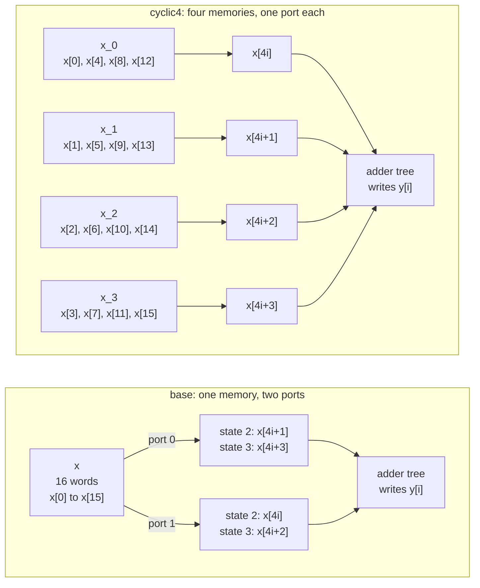

# 2.1 ARRAY_PARTITION

## 1. Introduction

The `ARRAY_PARTITION` directive splits one array into several smaller arrays, which this lesson calls banks.
Each bank becomes its own memory with its own ports, or, when the array is partitioned completely, each element becomes its own register or its own port.
A memory port is the set of address, enable and data signals through which a memory serves one read or one write per clock cycle.
A single memory offers at most two ports, so a loop that needs more than two elements of one array in the same cycle has to spread those reads over several cycles.
Partitioning multiplies the number of ports, so more elements can be read in the same cycle.

The directive has three types.
The `cyclic` type deals the elements out to the banks in turn, like cards, so neighbouring elements land in different banks.
The `block` type cuts the array into consecutive pieces, so neighbouring elements land in the same bank.
The `complete` type splits the array into its individual elements.
The `-factor` option sets the number of banks for `cyclic` and `block`.
The `-dim` option chooses the dimension of a multidimensional array; this lesson uses a one-dimensional array, so the dimension is always 1.

**What improves:** memory bandwidth, which is the number of elements that can be read or written in one clock cycle, and through it latency.
The improvement appears only when the loop actually asks for several elements of the array at the same time and the partition places those elements in different banks.
On this kernel each iteration reads four neighbouring elements, so a partition that spreads those four over four banks shortens the schedule of every iteration.

**What it costs:** every bank needs its own address, enable and data signals, so wiring and control grow with the number of banks.
When the tool cannot tell at compile time which bank an access falls into, it has to address every bank that could hold the element and add a multiplexer, a circuit that selects one of several inputs, to pick the right value.
That multiplexer is not the only thing it may do: if the address inside the bank is a compile-time constant, reading every bank at every address no longer depends on the loop counter at all, and the tool is free to hoist those reads out of the loop and keep the values in registers.
The `block4` solution of this lesson does exactly that, and it is the most expensive of the four in both flip-flops and look-up tables.
Small banks also waste memory resources, because an FPGA block RAM has a fixed size and four banks of four words could occupy four almost empty block RAMs; in this lesson `x` and `y` are top-level arguments, so the memories sit outside the generated block and that cost lands on the surrounding system rather than in the BRAM column of the report.
Complete partitioning replaces the memory by registers or ports, which for a large array costs far more area than a memory would.
When the array is an argument of the top-level function, as in this lesson, partitioning also changes the interface of the generated block: the surrounding system must provide one memory per bank instead of one memory.

**When to use it:** use it when a loop needs more elements of one array per cycle than two ports can deliver.
This typically happens after a loop is unrolled or pipelined, or when the body itself reads several elements, as it does here.
Choose the type from the access pattern.
The `cyclic` type suits elements that are neighbours, the `block` type suits elements that lie one bank size apart, and the `complete` type suits small arrays that must be read all at once.
UG1399 also describes automatic partitioning, controlled by `config_array_partition`, which the tool applies mainly to arrays in pipelined loops.
The loop in this lesson is not pipelined, so the `base` solution is expected to keep `x` as one memory, and section 7 checks that.
`ARRAY_PARTITION` is not a hint that the tool may ignore: every solution below shows the requested banks in its interface.

Reference: UG1399, [pragma HLS array_partition](https://docs.amd.com/r/2023.2-English/ug1399-vitis-hls/pragma-HLS-array_partition), [set_directive_array_partition](https://docs.amd.com/r/2023.2-English/ug1399-vitis-hls/set_directive_array_partition) and [config_array_partition](https://docs.amd.com/r/2023.2-English/ug1399-vitis-hls/config_array_partition).

## 2. How it works

The diagram compares `base`, where `x` is one memory with two ports, with `cyclic4`, where `x` is four memories with one port each.
Both feed the same adder tree, which is a set of adders arranged so that four values are summed without three additions in series; on this part Vitis builds it from one two-input adder and one three-input adder.



The two tables below show where each element of `x` lives after a partition with a factor of 4.
Rows are banks, and columns are addresses inside a bank.
The elements that iteration `i = 1` reads are in bold.

**Cyclic, factor 4 (`cyclic4`):**

| Bank  | Address 0 | Address 1 | Address 2 | Address 3 |
| ----- | --------- | --------- | --------- | --------- |
| `x_0` | x[0]      | **x[4]**  | x[8]      | x[12]     |
| `x_1` | x[1]      | **x[5]**  | x[9]      | x[13]     |
| `x_2` | x[2]      | **x[6]**  | x[10]     | x[14]     |
| `x_3` | x[3]      | **x[7]**  | x[11]     | x[15]     |

**Block, factor 4 (`block4`):**

| Bank  | Address 0 | Address 1 | Address 2 | Address 3 |
| ----- | --------- | --------- | --------- | --------- |
| `x_0` | x[0]      | x[1]      | x[2]      | x[3]      |
| `x_1` | **x[4]**  | **x[5]**  | **x[6]**  | **x[7]**  |
| `x_2` | x[8]      | x[9]      | x[10]     | x[11]     |
| `x_3` | x[12]     | x[13]     | x[14]     | x[15]     |

For an element with index $k$, a factor $F$ and a bank size $S = N / F$, the two types place the element as follows:

$$\textrm{cyclic:}\quad \textrm{bank}(k) = k \bmod F, \qquad \textrm{address}(k) = \lfloor k / F \rfloor$$

$$\textrm{block:}\quad \textrm{bank}(k) = \lfloor k / S \rfloor, \qquad \textrm{address}(k) = k \bmod S$$

With $N = 16$ and $F = 4$, the bank size is also 4, which is why the two tables look like transposes of each other.
The `complete` type has no table, because every element becomes its own port named `x_0` to `x_15`.

Iteration `i` reads the elements $k = 4i + j$ for $j = 0, 1, 2, 3$.
In `base`, all four elements sit in one memory with two ports, so the loop needs two states to issue the four reads, and each address has to be computed from `i`.
In `cyclic4`, element $4i + j$ lies in bank $j$ at address $i$.
The bank number is the constant $j$ and the address is the counter itself, so every bank is read exactly once per iteration, no address arithmetic is needed, and nothing forces the four reads into different cycles.
In `block4`, element $4i + j$ lies in bank $i$ at address $j$.
All four reads of one iteration therefore hit the same bank, which has only two ports.
The bank number $i$ is known only at run time, so each read has to go to all four banks with a multiplexer selecting the value that came from bank $i$ — and once the tool has decided to read all four banks, the addresses $j = 0 \ldots 3$ are compile-time constants, so the sixteen reads no longer depend on `i` and can leave the loop entirely.
Section 7 shows that this is what happens, and what it costs.
In `complete`, every element is a separate input port, so no read is left in the loop at all, but a multiplexer driven by $i$ must choose one of four ports for each of the four terms.

## 3. The kernel

```cpp
#include "sum4.h"

// Each output is the sum of G = 4 neighbouring inputs. Every iteration reads
// four elements of x, which is more than the two ports of one memory can
// deliver in one cycle. The solutions partition x and change nothing else.
void sum4(const data_t x[N], data_t y[M]) {
SUM_LOOP:
    for (int i = 0; i < M; i++) {
        y[i] = x[G * i] + x[G * i + 1] + x[G * i + 2] + x[G * i + 3];
    }
}
```

The header sets `N = 16`, `G = 4` and `M = N / G = 4`.
The loop therefore has a **trip count**, the number of times its body executes, of 4.
The **iteration latency** is the number of cycles one pass through the body takes, and it is the quantity this lesson changes.

Both arguments use the default **ap_memory** interface of the Vivado IP flow.
An ap_memory port is a plain memory port with address, enable and data signals that connects to a RAM outside the generated block.
Lesson 1.4 showed that Vitis gives such a port a second read port, with signals ending in `1` instead of `0`, when the schedule needs two accesses in the same cycle.
That is why `base` is expected to use two ports for `x` and not one.

The four integer additions are balanced into an adder tree by default, which lesson 3.5 covers; the log reports `3 expression(s) balanced` in every solution.
The operator delays that the scheduler uses on this part, all taken from the schedule reports of this lesson, are worth writing down, because they decide where the state boundaries fall:

| Operation                      | Delay    |
| ------------------------------ | -------- |
| RAM read, 32 bit               | 0.677 ns |
| RAM write, 32 bit              | 0.677 ns |
| two-input adder, 32 bit        | 1.016 ns |
| three-input adder, root output | 0.731 ns |
| four-to-one selector, 32 bit   | 0.525 ns |

The clock is 3.33 ns and the uncertainty is 0.90 ns, so the scheduler will not put more than about 2.43 ns of logic into one state.

## 4. The solutions

| Solution   | Directive in `directives_<solution>.tcl`                               | Expected form of `x`                     |
| ---------- | ---------------------------------------------------------------------- | ---------------------------------------- |
| `base`     | none                                                                   | one memory of 16 words, two ports        |
| `cyclic4`  | `set_directive_array_partition -type cyclic -factor 4 -dim 1 "sum4" x` | four memories of 4 words, one port each  |
| `block4`   | `set_directive_array_partition -type block -factor 4 -dim 1 "sum4" x`  | four memories of 4 words, two ports each |
| `complete` | `set_directive_array_partition -type complete -dim 1 "sum4" x`         | 16 input ports of 32 bits, no memory     |

Only `x` is partitioned, and `y` stays one memory in every solution.
The directive needs no other directive to have an effect, so `base` has an empty directives file.
`common/part.tcl` still sets `config_compile -pipeline_loops 0`, so `SUM_LOOP` is not pipelined in any solution.
The loop in `base` is also not a place where the tool partitions arrays on its own, so no `off` and `default` pair is needed; section 7 confirms that `base` logs no partitioning.

## 5. Predict

Write these numbers down before running anything.

Start with the interface, which follows from the directive alone and leaves the scheduler no freedom: the number of banks, the ports per bank and the address width of each bank.
Then the schedule.
The iteration latency splits into two parts: $R$, the number of states in which the loop issues the reads of one iteration, and $T$, the states still needed after the last read data has arrived:

$$L_{\textrm{it}} = R + T.$$

The data of a read issued in one state is available at the end of the next state.
$T = 2$ here, and the two states are not two levels of addition: the tool puts the whole adder tree into one state, because a RAM read plus a two-input adder plus the root of the three-input adder is $0.677 + 1.016 + 0.731 = 2.424$ ns and still fits the 2.43 ns budget, and then the write of `y[i]` needs a state of its own.
With four elements to fetch and $P$ ports serving them, $R \ge \lceil 4 / P \rceil$.

**`base`, two ports on one memory, $R = 2$:**

| Operation                             | 0  | 1  | 2  | 3  |
| ------------------------------------- | -- | -- | -- | -- |
| issue reads of `x[4i]` and `x[4i+1]`  | R  |    |    |    |
| issue reads of `x[4i+2]` and `x[4i+3]`|    | R  |    |    |
| data of the last pair arrives         |    |    | D  |    |
| whole adder tree                      |    |    | A  |    |
| write `y[i]`                          |    |    |    | W  |

**`cyclic4`, four banks of one port, $R = 1$:**

| Operation                                    | 0  | 1  | 2  |
| -------------------------------------------- | -- | -- | -- |
| issue reads of `x[4i]` to `x[4i+3]`, one per bank | R  |    |    |
| data arrives                                 |    | D  |    |
| whole adder tree                             |    | A  |    |
| write `y[i]`                                 |    |    | W  |

**`complete`, no read at all, $R = 0$:**

| Operation                                          | 0  | 1  |
| -------------------------------------------------- | -- | -- |
| select `x[4i]` to `x[4i+3]` with four multiplexers  | S  |    |
| whole adder tree                                   | A  |    |
| write `y[i]`                                       |    | W  |

Lessons 1.2 and 1.4 confirmed that an unpipelined loop costs $M\,L_{\textrm{it}}$ cycles in the loop row, plus the states before the loop, which so far has always been the single state that initialises the counter:

$$L = M\,L_{\textrm{it}} + P_{\textrm{pre}}, \qquad P_{\textrm{pre}} = 1 \ \textrm{unless the tool moves work out of the loop.}$$

This gives $L_{\textrm{base}} = 4 \cdot 4 + 1 = 17$, $L_{\textrm{cyclic4}} = 4 \cdot 3 + 1 = 13$ and $L_{\textrm{complete}} = 4 \cdot 2 + 1 = 9$ cycles.

`block4` is the interesting one, because two different designs are consistent with the directive and you have to decide which one Vitis will build.

*Outcome (a), the local reading.*
The bank of every read is $\lfloor (4i + j) / 4 \rfloor = i$, so all four reads of an iteration share one bank with two ports, $R = 2$ as in `base`, and $L_{\textrm{block4}} = 4 \cdot 4 + 1 = 17$.
The directive would have bought eight data ports and a multiplexer per port and no cycles at all.

*Outcome (b), the hoist.*
Because the bank index is the run-time value $i$, every read must be presented to all four banks anyway, and the address inside a bank is the compile-time constant $j$.
So the sixteen accesses "bank $b$, address $j$" for $b, j = 0 \ldots 3$ cover everything the loop can ask for, and none of them depends on `i`.
The tool can issue all sixteen before the loop, keep the values in registers, and leave the loop with nothing but four four-to-one selectors driven by $i$.
Eight ports serve sixteen reads in $\lceil 16 / 8 \rceil = 2$ issue states, the last data arrives one state later, so $P_{\textrm{pre}} = 3$, and inside the loop $R = 0$ and $L_{\textrm{it}} = 2$, giving $L_{\textrm{block4}} = 4 \cdot 2 + 3 = 11$.
This is the fastest solution but one, and it has to store all sixteen elements, so predict about $16 \cdot 32 = 512$ extra flip-flops.

Decide which of (a) and (b) you expect, then check section 7.

Lesson 1.3 showed that the number of states depends on the real delays of the operators, so the split of $T$ is an assumption, and the predicted difference between `base` and `cyclic4` rests on the scheduler actually using the extra ports:

$$L_{\textrm{base}} - L_{\textrm{cyclic4}} = M\,(R_{\textrm{base}} - R_{\textrm{cyclic4}}) = 4 \cdot (2 - 1) = 4\ \textrm{cycles}.$$

| Quantity                     | `base` | `cyclic4` | `block4` (a) | `block4` (b) | `complete` |
| ---------------------------- | ------ | --------- | ------------ | ------------ | ---------- |
| Memories for `x`             | 1      | 4         | 4            | 4            | 0          |
| Read ports per memory        | 2      | 1         | 2            | 2            | none       |
| Data ports for `x`           | 2      | 4         | 8            | 8            | 16         |
| Address width of `x` in bits | 4      | 2         | 2            | 2            | none       |
| Reads issued inside the loop | 4      | 4         | 4            | 0            | 0          |
| States before the loop       | 1      | 1         | 1            | 3            | 1          |
| Iteration latency            | 4      | 3         | 4            | 2            | 2          |
| Loop latency                 | 16     | 12        | 16           | 8            | 8          |
| Function latency             | 17     | 13        | 17           | 11           | 9          |
| Interval                     | 18     | 14        | 18           | 12           | 10         |

## 6. Run

Partitioning changes which external memory holds each element and at which address.
C simulation runs the original C code on an ordinary array, so it cannot detect a mistake in that mapping.
The script therefore runs **C and RTL co-simulation (cosim)** for every solution, which drives the same testbench through the ports of the generated register-transfer level (RTL) design.
The co-simulation wrapper distributes the testbench array over the banks exactly as the directive describes, so a pass shows that the design reads every element from the right bank.
C simulation runs once, in `base`, to prove that the testbench itself passes.

```bash
cd s2_arrays/21_array_partition
vitis_hls -f run_hls.tcl 2>&1 | tee run.log
```

The same run through the repository Makefile is `make run LESSON=s2_arrays/21_array_partition`.

Then collect the summary numbers:

```bash
bash ../../common/collect_latency.sh   sum4_proj
bash ../../common/collect_resources.sh sum4_proj
```

You can also run `make check LESSON=s2_arrays/21_array_partition`, which runs both scripts.

## 7. Read the results

### The log

The solution banners from `run_hls.tcl` show which solution each message belongs to:

```bash
grep -nE "== solution|Applying array_partition|TEST (PASSED|FAILED)|C/RTL co-simulation finished" run.log
```

Each of `cyclic4`, `block4` and `complete` logs one message about `x`, and `base` logs none.
The message ID is the same in all three and the wording names the type and, where there is one, the factor:

```
INFO: [HLS 214-248] Applying array_partition to 'x': Cyclic partitioning with factor 4 on dimension 1.
INFO: [HLS 214-248] Applying array_partition to 'x': Block partitioning with factor 4 on dimension 1.
INFO: [HLS 214-248] Applying array_partition to 'x': Complete partitioning on dimension 1.
```

Every solution ends with `*** C/RTL co-simulation finished: PASS ***`, preceded by two `TEST PASSED` lines, because `cosim_design` runs the testbench twice, once in C to capture the input and output vectors and once against the RTL.
`base` prints a third `TEST PASSED` before all of that, from the separate `csim_design` call.

### The interface table

Open `sum4_proj/<solution>/syn/report/sum4_csynth.rpt` and find the section headed `== Interface`, table `* Summary`, which lists every RTL port with its direction, width and protocol:

```bash
for s in base cyclic4 block4 complete; do
    echo "== $s"; grep -A 40 "== Interface" sum4_proj/$s/syn/report/sum4_csynth.rpt | grep -E "\bx_|\by_"
done
```

Every solution matches the prediction.
`base` has `x_address0`, `x_ce0`, `x_q0` and the same three signals ending in `1`, with 4 bit addresses.
`cyclic4` has `x_0` to `x_3`, each with only the port ending in `0`, with 2 bit addresses.
`block4` has the same four banks, each with ports ending in `0` and in `1`, so eight data ports of 32 bits.
`complete` has sixteen 32 bit inputs `x_0` to `x_15` with protocol `ap_none` and object type `pointer`, and no memory ports for `x` at all.
In every solution `y` keeps its ap_memory ports `y_address0`, `y_ce0`, `y_we0` and `y_d0` with a 2 bit address.

### The loop table

Find the section headed `== Performance Estimates`, subsection `+ Detail`, table `* Loop`:

```bash
for s in base cyclic4 block4 complete; do
    echo "== $s"; grep -A 8 "\* Loop:" sum4_proj/$s/syn/report/sum4_csynth.rpt
done
```

`SUM_LOOP` shows a trip count of 4 in every solution, and iteration latencies of 4, 3, **2** and 2.
The function latencies are 17, 13, **11** and 9.
`block4` follows outcome (b): the directive that was supposed to buy nothing produced the second fastest design in the lesson.

### What the schedules actually look like

The per-state schedule is in `sum4_proj/<solution>/.autopilot/db/sum4.verbose.sched.rpt`, which also prints the critical path of every state.
`R` marks the state that issues a read, `D` the state in which its data becomes available, `A` an addition, `S` a selection and `W` the write of `y[i]`.
State 1 initialises the counter in every solution.

**`base`, states 2 to 5, iteration latency 4:**

| Operation                                            | 2  | 3  | 4  | 5  |
| ---------------------------------------------------- | -- | -- | -- | -- |
| exit test and `i++`                                  | A  |    |    |    |
| read `x[4i+1]` on port 0 and `x[4i]` on port 1       | R  | D  |    |    |
| read `x[4i+3]` on port 0 and `x[4i+2]` on port 1     |    | R  | D  |    |
| add the pair that just arrived, then the three-input adder |    |    | A  |    |
| write `y[i]`                                         |    |    |    | W  |

State 4 is full: its critical path is $0.677 + 1.016 + 0.731 = 2.424$ ns against a budget of 2.431 ns, so the 0.677 ns write cannot join it.

**`cyclic4`, states 2 to 4, iteration latency 3:**

| Operation                                       | 2  | 3  | 4  |
| ----------------------------------------------- | -- | -- | -- |
| exit test and `i++`                             | A  |    |    |
| read `x_2[i]` and `x_3[i]`                      | R  | D  |    |
| add those two                                   |    | A  |    |
| read `x_0[i]` and `x_1[i]`                      |    | R  | D  |
| three-input adder over the two fresh values and that partial sum |    |    | A  |
| write `y[i]`                                    |    |    | W  |

This is not the schedule predicted in section 5.
Vitis does not read all four banks in one state; it reads two banks, adds them while the other two are in flight, and feeds the last two straight into the three-input adder.
Its last state is therefore short, $0.677 + 0.731 + 0.677 = 2.085$ ns, and the write of `y[i]` fits into it.
The predicted iteration latency of 3 is right, but it comes out of the tail of the schedule rather than out of the read phase.
Note also that nothing in `base` prevented the same trick: its first pair of read data is also available one state early, and had the tool bound that pair to the two-input adder and the fresh pair to the zero-delay inputs of the three-input adder, state 4 would have carried $0.677 + 0.731 = 1.408$ ns and absorbed the write as well.
The four-cycle iteration of `base` is the schedule Vitis produced, not a hard lower bound.
This is the general shape of the lesson: the directive fixes the architecture, the scheduler decides the cycles.

**`block4`, prologue in states 1 to 3, loop in states 4 and 5, iteration latency 2:**

| Operation                                            | 1  | 2  | 3  | 4  | 5  |
| ---------------------------------------------------- | -- | -- | -- | -- | -- |
| read address 0 and 1 of all four banks, eight reads  | R  | D  |    |    |    |
| read address 2 and 3 of all four banks, eight reads  |    | R  | D  |    |    |
| four selectors pick bank `i` out of each group of four |    |    |    | S  |    |
| whole adder tree                                     |    |    |    | A  |    |
| write `y[i]`                                         |    |    |    |    | W  |

The Verilog shows it plainly: every bank address is a constant chosen by the FSM state, `x_0_address0` is `64'd1` in state 1 and `64'd3` in state 2, and `x_0_address1` is `64'd0` then `64'd2`, and the register table of the utilization report lists `x_0_load` through `x_3_load_3`, sixteen registers of 32 bits.
The loop body reads nothing.
This is the same datapath as `complete`, with a three-state prologue that fills the registers from four small memories instead of receiving them on 512 input wires.

**`complete`, states 2 and 3, iteration latency 2:**

| Operation                                     | 2  | 3  |
| --------------------------------------------- | -- | -- |
| exit test and `i++`                           | A  |    |
| four selectors pick the terms of iteration `i`| S  |    |
| whole adder tree                              | A  |    |
| write `y[i]`                                  |    | W  |

State 2 carries $0.525 + 1.016 + 0.731 = 2.272$ ns.

### The co-simulation report

Open `sum4_proj/<solution>/sim/report/sum4_cosim.rpt`.
It reports the latency that the RTL actually took while the testbench ran.
Every call has the same trip count, so the minimum, average and maximum are equal, and as in lesson 1.4 the co-simulation latency of these unpipelined loops equals the C synthesis function latency exactly: 17, 13, 11 and 9.
The testbench makes 26 calls, 6 directed and 20 random, so the total execution time is one cycle short of 26 intervals: 467, 363, 311 and 259 cycles against intervals of 18, 14, 12 and 10.

### The Verilog

The port declarations show the partition directly:

```bash
for s in base cyclic4 block4 complete; do
    echo "== $s"; grep -E "^(input|output).* x_" sum4_proj/$s/syn/verilog/sum4.v
done
```

The one line worth reading is the address of bank 0:

```bash
for s in base cyclic4 block4; do
    echo "== $s"; grep -nE "x_(0_)?address0 =" sum4_proj/$s/syn/verilog/sum4.v
done
```

In `cyclic4` there is no logic at all on the addresses, only four `assign` statements from the counter: `x_2_address0` and `x_3_address0` take `i` directly, because they are read in state 2, and `x_0_address0` and `x_1_address0` take the registered copy of `i`, because they are read in state 3.
In `block4` every address is a constant selected by the FSM state, as the schedule above showed.
In `base` the address is a multiplexer between two computed values, `4i+1` and `4i+3` on port 0 and `4i` and `4i+2` on port 1; the offsets are `or` gates rather than adders, because the two low bits of `4i` are zero.

The selectors of `block4` and `complete` appear as a generated module:

```bash
ls sum4_proj/*/syn/verilog/
```

`sum4_sparsemux_9_2_32_1_1.v` is present in `block4` and `complete` and absent in `base` and `cyclic4`, and each solution instantiates it four times, once per term of the sum.

### Fill this in

| Solution              | `x` data ports | Iteration latency | Function latency | Cosim latency | FF        | LUT       |
| --------------------- | -------------- | ----------------- | ---------------- | ------------- | --------- | --------- |
| `base`, predicted     | 2              | 4                 | 17               | 17            | reference | reference |
| `cyclic4`, predicted  | 4              | 3                 | 13               | 13            | lower     | lower     |
| `block4` (a)          | 8              | 4                 | 17               | 17            | similar   | higher    |
| `block4` (b)          | 8              | 2                 | 11               | 11            | far higher| higher    |
| `complete`, predicted | 16             | 2                 | 9                | 9             | lowest    | higher    |
| `base`, measured      | 2              | 4                 | 17               | 17            | 109       | 205       |
| `cyclic4`, measured   | 4              | 3                 | 13               | 13            | 42        | 160       |
| `block4`, measured    | 8              | 2                 | 11               | 11            | 555       | 357       |
| `complete`, measured  | 16             | 2                 | 9                | 9             | 41        | 234       |

Every structural prediction was met, and `base`, `cyclic4` and `complete` hit their predicted latencies.
`block4` followed outcome (b), so the one prediction that a reader is likely to get wrong is the one the naive bank-conflict argument gives.

The relations confirmed are that `cyclic4` saves exactly the predicted four cycles over `base`, 13 against 17, and does so with 67 fewer flip-flops and 45 fewer look-up tables; that `block4`, far from saving nothing, produces the second fastest design at 11 cycles by hoisting all sixteen reads out of the loop, and pays 446 more flip-flops and 152 more look-up tables than `base` for it; that `complete` is the fastest at 9 cycles with the fewest flip-flops but 74 more look-up tables than `cyclic4`; and that every solution passes co-simulation with a latency equal to its synthesis estimate.
The best directive on this kernel is `cyclic4`: it is the only one that is both faster and smaller than the baseline.

## 8. Hardware implications

The adder tree and the write port of `y` are the same in every solution, and the two lines of the utilization table that move are the expression table, which holds the arithmetic, and the multiplexer table, which holds the selection logic.
The four solutions use 0 BRAM and 0 DSP, because both arrays are interface ports and plain 32-bit additions map to fabric logic rather than to a DSP block.

In `base`, one external memory of 16 words serves the loop through two ports.
Each port needs two different addresses per iteration, so the design contains three `or` gates for the offsets `+1`, `+2` and `+3` (4 LUT each) and a multiplexer on each of the two address ports (14 LUT each).
It also has to register the data of the first pair of reads until the second pair arrives, `x_load_reg` and `x_load_1_reg`, 64 flip-flops.
The finite state machine (FSM), the circuit that steps the design through its states, has five states, one per cycle of the iteration plus the entry state.

In `cyclic4`, four external memories of four words each replace the single memory.
Every bank is read once per iteration at the address `i`, so the address arithmetic and the address multiplexers disappear entirely, the FSM loses one state, and only one 32-bit partial sum has to survive a state boundary instead of two loaded words.
The two utilization tables account for all of it: the 45 look-up tables are the three `or` gates (12), the two address multiplexers (28) and the `ap_NS_fsm` multiplexer shrinking from 31 to 26 LUT with the lost state; the 67 flip-flops are 64 bits of data storage, because `base` keeps three 32-bit registers, the two loaded words of the first pair and the sum on its way to `y`, where `cyclic4` keeps only the one partial sum, plus 3 bits of counter and FSM state that go with the shorter schedule.
This is the case partitioning is meant for: the bank of every access is a compile-time constant, so the tool needs no selection logic at all.

In `block4`, the same four memories appear, but each needs two ports, and the design that Vitis builds is not a loop that reads memory.
Because the bank index is `i` and the addresses are constants, it reads the whole array once in a three-state prologue and keeps it in sixteen 32-bit registers, which is 512 of the 555 flip-flops.
The loop body is then four four-to-one selectors driven by `i`, one per term, instantiated as `sparsemux` modules at 20 LUT each; a one-LUT-per-bit count for a 32-bit four-to-one selector would suggest 32, so the estimate is lower than the naive figure.
The remaining logic is eight address multiplexers, one per bank port, 14 LUT each, which still exist even though the addresses are constants, because each port has to choose between two constants and an idle state.
So the directive bought six cycles of latency, 17 down to 11, at a cost of 446 flip-flops and 152 look-up tables against `base`.
It is a real speed-up, obtained by turning a memory-read loop into a register file plus selection — which is what `complete` does directly, and `complete` is both faster and far smaller here.
The lesson is not that `block` partitioning is fast, but that a directive whose local effect looks useless can make the tool restructure the loop, and that the resource report is the only way to see what that cost.

In `complete`, no memory is left for `x`.
The 16 elements arrive on 512 input wires, which means the storage has moved into the surrounding system, which must hold all 16 words for the whole call.
Inside the block, the same four selectors as in `block4` (80 LUT) choose the terms of iteration `i`, and the read disappears because the data is already on the wires.
With nothing to register but the counter, the partial sum and a three-state FSM, it has the fewest flip-flops of the four at 41, and its 234 look-up tables are 74 more than `cyclic4`: the four selectors add 80 and the shorter FSM gives 6 back in the multiplexer table.

For a standard-cell ASIC flow, the lesson carries over.
Partitioning becomes banking: four small SRAM macros instead of one.
Each macro brings its own address decoders and sense amplifiers, so the area per stored bit rises as the banks shrink.
For very small arrays, ASIC designers usually replace the SRAM with a flip-flop register file, which is the ASIC form of complete partitioning, and it is exactly the structure that the tool arrived at by itself in `block4`.
The address logic, the chip-enable decoding and the selectors are ordinary standard cells, so an ASIC synthesis tool would see the same differences between the solutions.
Only the FF and LUT numbers and the fixed size of an FPGA block RAM are specific to the FPGA.

## 9. One common mistake and one question

**The mistake: partitioning an array that is read one element at a time.**
In `vadd` from lesson 1.1, each iteration reads `a[i]` once, so one port is already enough.
A `cyclic` partition with a factor of 4 on `a` puts `a[i]` in bank $i \bmod 4$, which depends on the counter, so the tool must address every bank and add a multiplexer to select the result.
The design gains ports and logic, and the latency stays the same or becomes worse.
Partitioning pays off only when something asks for several elements of the same array in the same cycle, such as the body of `sum4`, an unrolled loop as in lesson 3.1, or a pipelined loop.

**The question:** Suppose the kernel is changed to `y[i] = x[i] + x[i + 4] + x[i + 8] + x[i + 12]` for `i` from 0 to 3.
Which of `cyclic4` and `block4` now places the four elements of one iteration in four different banks with a bank number the tool knows at compile time, and what happens to the other one?

<details>
<summary>Answer</summary>

The `block4` solution does.
Iteration $i$ reads the elements $k = i + 4j$ for $j = 0, 1, 2, 3$, with $i < 4$.
Under the block type, these elements lie in

$$\textrm{bank}(i + 4j) = \left\lfloor \frac{i + 4j}{4} \right\rfloor = j, \qquad \textrm{address}(i + 4j) = i,$$

so the four reads go to four different banks, the bank number $j$ is a compile-time constant and the address is the counter — exactly the situation that `cyclic4` enjoys in this lesson.
Under the cyclic type, the same elements lie in

$$\textrm{bank}(i + 4j) = (i + 4j) \bmod 4 = i, \qquad \textrm{address}(i + 4j) = j,$$

so all four reads hit the same bank, the bank number depends on the counter, and the address inside the bank is a constant.
That is exactly the situation of `block4` in this lesson, so expect the same outcome: the tool reads all four banks at all four addresses before the loop, keeps the sixteen values in registers and selects with multiplexers driven by $i$.
The two types swap roles completely, including which of them reaches its speed through the schedule and which reaches it by paying for sixteen registers.

The rule is to choose the partition that places the elements needed in the same cycle in different banks, and ideally in banks whose number the tool can compute at compile time.
The reason to prefer that partition is not only the cycle count, which the tool may recover in other ways, but the absence of the selection logic and the registers that those other ways cost.

</details>
