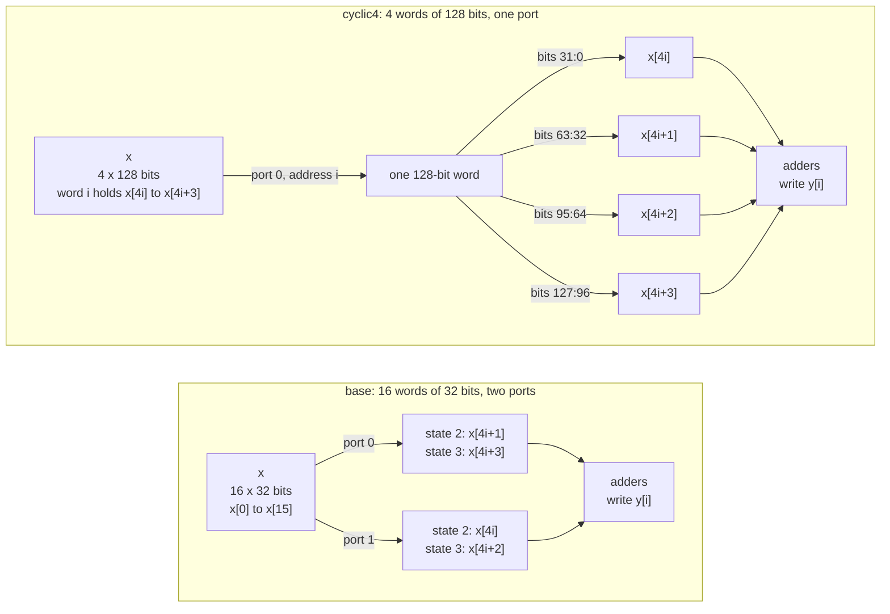

# 2.2 ARRAY_RESHAPE

## 1. Introduction

The `ARRAY_RESHAPE` directive turns one array into a new array with fewer words, where each word is wider and holds several of the original elements side by side.
The result is still one memory, but every read or write through its port moves several elements at once.
A memory port is the set of address, enable and data signals through which a memory serves one read or one write per clock cycle.
A single memory offers at most two ports, so a loop that needs more than two elements of one array in the same cycle normally has to spread those reads over several cycles.
Reshaping does not add ports; it makes each port wider, so one read can deliver several elements.

Reshaping is best understood as the partitioning from lesson 2.1 followed by one more step.
The array is first split into banks exactly as `ARRAY_PARTITION` would split it, and the banks are then placed side by side in one memory instead of being kept as separate memories.
What was a bank number in lesson 2.1 becomes a slice number, which is the position of an element inside the wide word.
What was an address inside a bank stays the address of the wide word.

The directive has the same three types as `ARRAY_PARTITION`.
The `cyclic` type places neighbouring elements in the same word, so consecutive elements are read together.
The `block` type places elements that lie one block apart in the same word, so consecutive elements land in the same slice of different words.
The `complete` type packs the whole array into a single word.
The `-factor` option sets the number of elements per word for `cyclic` and `block`.
The `-dim` option chooses the dimension of a multidimensional array; this lesson uses a one-dimensional array, so the dimension is always 1.

**What improves:** memory bandwidth, which is the number of elements that can be read or written in one clock cycle, and through it latency.
The improvement appears only when the elements that the loop needs together share one word address after reshaping.
On this kernel each iteration reads four neighbouring elements, so the `cyclic` type places all four in one word and removes one read cycle from every iteration.
Compared with partitioning, reshaping reaches that bandwidth with one memory and one address path instead of several.

**What it costs:** the data path becomes as wide as the word, so every port carries four times as many data wires in this lesson.
Writing a single element into a wide word requires either a write mask, which enables only the bits of one slice, or a read followed by a write of the whole word.
The cost that this lesson measures, and that the documentation does not warn about, is what happens when the tool cannot tell at compile time which slice holds an element.
Under `ARRAY_PARTITION` the banks are separate objects, so an unknown bank number becomes a multiplexer, a circuit that selects one of several inputs, over a handful of 32-bit values.
Under `ARRAY_RESHAPE` the word is one wide value, so an unknown slice number becomes a **variable bit-field extraction**, which Vitis emits as a right shift of the whole word by a run-time amount.
Vitis then costs that shifter as if it were a general one, as wide as the word rather than as wide as the element: 1.880 ns and 2171 look-up tables for one 32-bit field of a 512-bit word.
Both figures are far too large, and sections 7 and 8 show what each error does.
The area figure is harmless, because Vivado recognises the shift for what it is and implements the whole `complete` design in 227 look-up tables rather than 8878.
The delay figure is not, because the scheduler has already spent a cycle on it by the time anyone could notice: `complete` takes 13 cycles where the equivalent partitioned design of lesson 2.1 takes 9, and no downstream tool gives those cycles back.
**The real price of a run-time slice is cycles, and the resource column is where you will not find it.**
When the array is an argument of the top-level function, as in this lesson, reshaping also changes the interface of the generated block: the surrounding system must provide one memory with wide words and store the elements in the packed order.

**When to use it:** use it instead of `ARRAY_PARTITION` when the elements that are needed together already lie at the same address after the split **and** each of them lies in a slice whose number is a compile-time constant.
The first condition is the one shared with lesson 2.1, restated: partitioning needs the elements used together to lie in different banks, and reshaping needs them to lie in the same word.
The second condition is new, and it is the one that decides whether the schedule the tool builds is the one the access pattern deserves.
UG1399 recommends reshaping mainly to reduce the number of block RAMs, because several small partitions would each occupy a block RAM of fixed size.
`ARRAY_RESHAPE` is not a hint that the tool may ignore: every solution below shows the requested word width in its interface.

Reference: UG1399, [pragma HLS array_reshape](https://docs.amd.com/r/2023.2-English/ug1399-vitis-hls/pragma-HLS-array_reshape) and [set_directive_array_reshape](https://docs.amd.com/r/2023.2-English/ug1399-vitis-hls/set_directive_array_reshape).

## 2. How it works

The diagram compares `base`, where `x` is one memory of 16 words of 32 bits with two ports, with `cyclic4`, where `x` is one memory of 4 words of 128 bits with one port.
Both feed the same adders, and in `cyclic4` the four slices of one word are simply four groups of wires.



The two tables below show where each element of `x` lives after a reshape with a factor of 4.
Rows are word addresses, and columns are slices, written with the highest bits on the left as in the Verilog.
The elements that iteration `i = 1` reads are in bold.
Placing slice 0 in the lowest bits is the expected convention, and section 7 confirms it.

**Cyclic, factor 4 (`cyclic4`):**

| Address | Slice 3, bits 127:96 | Slice 2, bits 95:64 | Slice 1, bits 63:32 | Slice 0, bits 31:0 |
| ------- | -------------------- | ------------------- | ------------------- | ------------------ |
| 0       | x[3]                 | x[2]                | x[1]                | x[0]               |
| 1       | **x[7]**             | **x[6]**            | **x[5]**            | **x[4]**           |
| 2       | x[11]                | x[10]               | x[9]                | x[8]               |
| 3       | x[15]                | x[14]               | x[13]               | x[12]              |

**Block, factor 4 (`block4`):**

| Address | Slice 3, bits 127:96 | Slice 2, bits 95:64 | Slice 1, bits 63:32 | Slice 0, bits 31:0 |
| ------- | -------------------- | ------------------- | ------------------- | ------------------ |
| 0       | x[12]                | x[8]                | **x[4]**            | x[0]               |
| 1       | x[13]                | x[9]                | **x[5]**            | x[1]               |
| 2       | x[14]                | x[10]               | **x[6]**            | x[2]               |
| 3       | x[15]                | x[11]               | **x[7]**            | x[3]               |

For an element with index $k$, a factor $F$ and a block size $S = N / F$, the two types place the element as follows:

$$\textrm{cyclic:}\quad \textrm{slice}(k) = k \bmod F, \qquad \textrm{address}(k) = \lfloor k / F \rfloor$$

$$\textrm{block:}\quad \textrm{slice}(k) = \lfloor k / S \rfloor, \qquad \textrm{address}(k) = k \bmod S$$

These are the formulas of lesson 2.1 with the word bank replaced by the word slice.
Each table is the matching 2.1 table turned on its side: the banks of lesson 2.1 now stand next to each other as the columns of one memory.
The `complete` type has no table, because it packs all 16 elements into one word of 512 bits, with $x[k]$ expected in bits $32k + 31$ down to $32k$.

Iteration `i` reads the elements $k = 4i + j$ for $j = 0, 1, 2, 3$.
In `base`, all four elements are separate words of one memory with two ports, so the loop needs two cycles to issue the four reads.
In `cyclic4`, element $4i + j$ lies at address $i$ in slice $j$.
All four elements share one address, so a single read returns them together, and because the slice number $j$ is a constant, each element is a fixed group of wires with no logic at all.
In `block4`, element $4i + j$ lies at address $j$ in slice $i$.
The four elements lie in four different words, which two ports cannot fetch in one cycle, and the slice number $i$ is known only at run time.
In `complete`, the whole array is one word, so no address is needed, but the bit position of each term, $32(4i + j)$, again depends on $i$.

The last two cases are where the two lessons stop being the same picture.
A run-time bank number in lesson 2.1 selects between four separate 32-bit signals, which is a 32-bit four-input multiplexer.
A run-time slice number here selects a 32-bit field out of one 128-bit or 512-bit value, and Vitis writes that as `word >> (32 * slice)`, a shifter over the whole word.
The two are the same function of the same data, but not the same hardware, and the reports in section 7 show how large the difference is.

## 3. The kernel

```cpp
#include "sum4.h"

// Each output is the sum of G = 4 neighbouring inputs. Every iteration reads
// four elements of x, which is more than the two ports of one memory can
// deliver in one cycle. The solutions reshape x and change nothing else.
void sum4(const data_t x[N], data_t y[M]) {
SUM_LOOP:
    for (int i = 0; i < M; i++) {
        y[i] = x[G * i] + x[G * i + 1] + x[G * i + 2] + x[G * i + 3];
    }
}
```

The kernel is identical to lesson 2.1, so the two lessons can be compared number by number.
The header sets `N = 16`, `G = 4` and `M = N / G = 4`.
The loop therefore has a **trip count**, the number of times its body executes, of 4.
The **iteration latency** is the number of cycles one pass through the body takes, and it is the quantity this lesson changes.

Both arguments use the default **ap_memory** interface of the Vivado IP flow.
An ap_memory port is a plain memory port with address, enable and data signals that connects to a RAM outside the generated block.
Vitis gives such a port a second read port, with signals ending in `1` instead of `0`, when the schedule needs two accesses in the same cycle, and lesson 2.1 measured exactly that for `x` in `base`.

The four integer additions are balanced by default, which lesson 3.5 covers; the log reports `3 expression(s) balanced` in every solution.
Lesson 2.1 found that Vitis builds this sum as one adder with two inputs followed by one adder with three inputs, and that arrangement is the same in every solution here.
The operator delays that the scheduler uses on this part, all taken from the schedule reports of this lesson, decide where the state boundaries fall:

| Operation                                | Delay    |
| ---------------------------------------- | -------- |
| RAM read or write, any width             | 0.677 ns |
| constant slice of a wide word (part select) | 0.000 ns |
| two-input adder, 32 bit                  | 1.016 ns |
| two-input adder, 9 bit (a bit offset)    | 0.770 ns |
| three-input adder, root output           | 0.731 ns |
| variable shift of a 128-bit word         | 1.510 ns |
| variable shift of a 512-bit word         | 1.880 ns |

The clock is 3.33 ns and the uncertainty is 0.90 ns, so the scheduler will not put more than about 2.43 ns of logic into one state.
Note that the RAM read costs the same 0.677 ns whether the word is 32 bits or 128 bits wide, while the variable shift is the one operator in the table whose delay depends on the width of the word.

These are the delays the **scheduler** believes, not the delays the hardware has.
Every number above is a model in the tool, and the schedule it produces is frozen into the RTL before any logic synthesis runs.
Section 7 takes the two shift rows to Vivado and finds them badly wrong, by which point the cycles have already been spent.

## 4. The solutions

| Solution   | Directive in `directives_<solution>.tcl`                             | Expected form of `x`                                 |
| ---------- | -------------------------------------------------------------------- | ---------------------------------------------------- |
| `base`     | none                                                                 | one memory of 16 words of 32 bits, two ports         |
| `cyclic4`  | `set_directive_array_reshape -type cyclic -factor 4 -dim 1 "sum4" x` | one memory of 4 words of 128 bits, one port          |
| `block4`   | `set_directive_array_reshape -type block -factor 4 -dim 1 "sum4" x`  | one memory of 4 words of 128 bits, two ports         |
| `complete` | `set_directive_array_reshape -type complete -dim 1 "sum4" x`         | one word of 512 bits, expected as a single input port |

Only `x` is reshaped, and `y` stays a memory of 4 words of 32 bits in every solution.
The directive needs no other directive to have an effect, so `base` has an empty directives file.
`common/part.tcl` still sets `config_compile -pipeline_loops 0`, so `SUM_LOOP` is not pipelined in any solution.
The tool does not reshape arrays on its own in an unpipelined loop, so no `off` and `default` pair is needed; section 7 confirms that `base` logs no array transformation.

## 5. Predict

Write these numbers down before running anything.

Lesson 2.1 measured this kernel on this part, so the prediction starts from those measurements.
The iteration latency splits into two parts: $R$, the number of cycles the loop needs to issue its reads, and $T$, the cycles for the selection, the adders and the write after the last data has arrived:

$$L_{\textrm{it}} = R + T.$$

The data from a read issued in one cycle arrives in the next cycle.
In lesson 2.1, $T$ was 2 in every solution: one cycle holding the whole adder tree and one holding the write of `y[i]`.
Keep $T = 2$ as the starting assumption, but note where it comes from, because this lesson breaks it.
A state may hold about 2.43 ns, the adder tree is $1.016 + 0.731 = 1.747$ ns, and the write is 0.677 ns.
Those two together are 2.424 ns and fit one state exactly — but only if the values entering the adder come from registers.
If they come straight out of a RAM read, the extra 0.677 ns pushes the write into a state of its own, and if they come out of a variable shift, even the adder tree no longer fits.

The schedule tables below sketch one iteration.
Rows are operations, and columns are clock cycles.
`R` marks the cycle that issues a read, `D` the cycle in which its data arrives, `S` a selection, `A` the adders and `W` the write of `y[i]`.
The loop exit test and the increment of `i` share the first cycle of the body, so they add no column.

**`base`, two read cycles (as measured in 2.1):**

| Operation                                    | 0  | 1  | 2  | 3  |
| -------------------------------------------- | -- | -- | -- | -- |
| read `x[4i+1]` on port 0 and `x[4i]` on port 1 | R  | D  |    |    |
| read `x[4i+3]` on port 0 and `x[4i+2]` on port 1 |    | R  | D  |    |
| whole adder tree                             |    |    | A  |    |
| write `y[i]`                                 |    |    |    | W  |

$L_{\textrm{it}} = 2 + 2 = 4$, so `base` should reproduce lesson 2.1 exactly, down to the resource counts.

**`cyclic4`, one read of one wide word:**

| Operation                                       | 0  | 1  | 2  |
| ----------------------------------------------- | -- | -- | -- |
| read word `i`, which holds `x[4i]` to `x[4i+3]` | R  | D  |    |
| four constant slices, then the whole adder tree |    | A  |    |
| write `y[i]`                                    |    |    | W  |

Taking a constant slice out of the word is only a choice of wires, so it adds no delay, and $L_{\textrm{it}} = 1 + 2 = 3$, the same as the partitioned `cyclic4` of lesson 2.1.

The addresses in `block4` are the constants 0 to 3, which do not depend on $i$.
The four word reads are therefore the same in every iteration, and lesson 2.1 showed that the tool moves such loop-invariant reads in front of the loop.
The partitioned `block4` of lesson 2.1 read all of `x` into registers before the loop, and the reshaped `block4` is expected to do the same with four words of 128 bits.

**`block4`, reads moved in front of the loop, then one iteration:**

| Operation                                   | P0 | P1 | P2 | 0  | 1  |
| ------------------------------------------- | -- | -- | -- | -- | -- |
| read words 1 and 0                          | R  | D  |    |    |    |
| read words 3 and 2                          |    | R  | D  |    |    |
| select slice `i` of each of the four words  |    |    |    | S  |    |
| whole adder tree and write                  |    |    |    |    | W  |

**`complete`, no read at all, because `x` becomes a plain input port:**

| Operation                                    | 0  | 1  |
| -------------------------------------------- | -- | -- |
| select the slices holding `x[4i]` to `x[4i+3]` | S  |    |
| whole adder tree and write                   |    | W  |

Lessons 1.2 and 1.4 confirmed that an unpipelined loop costs $M\,L_{\textrm{it}}$ cycles in the loop row, plus the states before the loop:

$$L = M\,L_{\textrm{it}} + P_{\textrm{pre}}, \qquad P_{\textrm{pre}} = 1 \ \textrm{unless the tool moves work out of the loop.}$$

This gives $L_{\textrm{base}} = 4 \cdot 4 + 1 = 17$, $L_{\textrm{cyclic4}} = 4 \cdot 3 + 1 = 13$ and, if the two tables above hold, $L_{\textrm{complete}} = 4 \cdot 2 + 1 = 9$ and $L_{\textrm{block4}} = 4 \cdot 2 + 3 = 11$, where $P_{\textrm{pre}} = 3$ is the two cycles that issue four word reads through two ports plus the cycle in which the last data arrives.

Now the two questions that the schedule tables above quietly assumed away.
Both concern the rows marked `S`, and both have the same root: in `block4` and `complete` the slice number is the run-time value $i$.

*Question one, what the selection is made of.*
Lesson 2.1 answered it with a 32-bit four-input multiplexer per term, built as a generated `sparsemux` module at 20 LUT each, because the four candidates were four separate bank outputs.
Here the candidates are four fields of one wide word.

- *Outcome (a), the multiplexer.* The tool slices the word into its four fields and multiplexes them, so the reported cost is the same 4 by 20 LUT as in lesson 2.1 and the delay is the 0.525 ns that lesson 2.1 measured for a four-to-one selector.
- *Outcome (b), the shifter.* The tool keeps the word whole and emits `word >> (32 * i)`, a variable shifter as wide as the word. The delay is then the 1.510 ns or 1.880 ns of the table in section 3, and the reported area is that of a shifter over 128 or 512 bits rather than a selector over 32.

Predict what the C synthesis report will say under each outcome.
Then predict something harder, and write it down separately: whether the hardware that Vivado eventually builds will agree with it.
Both shifts compute a 32-bit field at a multiple of 32 out of a word whose upper bits are then thrown away, which is a multiplexer written the long way, and logic synthesis is good at that sort of thing.

*Question two, what outcome (b) would do to the schedule.*
Under outcome (b) no shift can share a state with the adder tree, because even the narrower one is $1.510 + 1.747 = 3.257$ ns against a budget of 2.43.
What then decides the iteration latency is whether the shift can share a state with the arithmetic that produces its shift amount.
In `block4` the amount is $32i$, which is the counter with five zeros appended, free wiring, so the shift can sit in the same state as the exit test and the increment: the body is one state of shifting and one of adding and writing, $L_{\textrm{it}}$ stays 2 and the latency stays 11.
In `complete` the amount is $32(4i + j) = 128i + 32j$, and while $128i$ and $128i + 32$ are again free wiring, the remaining offsets need a 9-bit adder, $0.770 + 1.880 = 2.650$ ns, which does not fit.
The offsets and the shifts then land in different states, the body grows to three, and $L_{\textrm{it}} = 3$ with $L = 4 \cdot 3 + 1 = 13$ rather than 9.

Decide which outcome you expect for each of `block4` and `complete`, then check section 7.

A last number follows from the interface alone and needs no scheduling argument.
Each port of `x` needs address, enable and data wires, so the wire count of `x` is the number of ports times the sum of the address width, 1 enable bit and the word width:

$$W_{\textrm{base}} = 2\,(4 + 1 + 32) = 74, \qquad W_{\textrm{cyclic4}} = 1\,(2 + 1 + 128) = 131, \qquad W_{\textrm{block4}} = 2\,(2 + 1 + 128) = 262.$$

In lesson 2.1 the same count was 140 for the partitioned `cyclic4`, with four banks of $2 + 1 + 32$ wires each, and 280 for the partitioned `block4`.
Reshaping keeps the data wires and saves the repeated address and enable wires.

| Quantity                     | `base`  | `cyclic4` | `block4` (a) | `block4` (b) | `complete` (a) | `complete` (b) |
| ---------------------------- | ------- | --------- | ------------ | ------------ | -------------- | -------------- |
| Memories for `x`             | 1       | 1         | 1            | 1            | 0              | 0              |
| Words by width in bits       | 16 x 32 | 4 x 128   | 4 x 128      | 4 x 128      | 1 x 512        | 1 x 512        |
| Read ports                   | 2       | 1         | 2            | 2            | none           | none           |
| Address width of `x` in bits | 4       | 2         | 2            | 2            | none           | none           |
| Wires of `x`                 | 74      | 131       | 262          | 262          | 512            | 512            |
| Read cycles inside the loop  | 2       | 1         | 0            | 0            | 0              | 0              |
| Iteration latency            | 4       | 3         | 2            | 2            | 2              | 3              |
| States before the loop       | 1       | 1         | 3            | 3            | 1              | 1              |
| Function latency             | 17      | 13        | 11           | 11           | 9              | 13             |
| Interval                     | 18      | 14        | 12           | 12           | 10             | 14             |

## 6. Run

Reshaping changes where each element sits inside a wide word of the external memory.
C simulation runs the original C code on an ordinary array, so it cannot detect a mistake in that packing.
The script therefore runs **C and RTL co-simulation (cosim)** for every solution, which drives the same testbench through the ports of the generated register-transfer level (RTL) design.
The co-simulation wrapper packs the testbench array into wide words exactly as the directive describes, so a pass shows that the design takes every element from the right slice of the right word.
C simulation runs once, in `base`, to prove that the testbench itself passes.

```bash
cd s2_arrays/22_array_reshape
vitis_hls -f run_hls.tcl 2>&1 | tee run.log
```

The same run through the repository Makefile is `make run LESSON=s2_arrays/22_array_reshape`.

Then collect the summary numbers:

```bash
bash ../../common/collect_latency.sh   sum4_proj
bash ../../common/collect_resources.sh sum4_proj
```

You can also run `make check LESSON=s2_arrays/22_array_reshape`, which runs both scripts.

This lesson needs one step that the other lessons do not.
Its headline difference between the solutions is a resource estimate, and section 7 shows that this estimate cannot be trusted here, so the last subsection of section 7 runs Vivado logic synthesis on the generated RTL as well.
That step takes a few minutes per solution and is not part of `make run`.

## 7. Read the results

### The log

The solution banners from `run_hls.tcl` show which solution each message belongs to:

```bash
grep -nE "== solution|Applying array_|TEST (PASSED|FAILED)|C/RTL co-simulation finished" run.log
```

Each of `cyclic4`, `block4` and `complete` logs one message about `x`, and `base` logs none, so the tool applies no array transformation on its own here.
The message ID is the same `HLS 214-248` that lesson 2.1 used for partitioning, and only the verb changes:

```
INFO: [HLS 214-248] Applying array_reshape to 'x': Cyclic reshaping with factor 4 on dimension 1.
INFO: [HLS 214-248] Applying array_reshape to 'x': Block reshaping with factor 4 on dimension 1.
INFO: [HLS 214-248] Applying array_reshape to 'x': Complete reshaping on dimension 1.
```

Every solution ends with `*** C/RTL co-simulation finished: PASS ***`, preceded by two `TEST PASSED` lines, because `cosim_design` runs the testbench twice, once in C to capture the input and output vectors and once against the RTL.
`base` prints a third `TEST PASSED` before all of that, from the separate `csim_design` call.

### The interface table

Open `sum4_proj/<solution>/syn/report/sum4_csynth.rpt` and find the section headed `== Interface`, table `* Summary`, which lists every RTL port with its direction, width and protocol:

```bash
for s in base cyclic4 block4 complete; do
    echo "== $s"; grep -A 40 "== Interface" sum4_proj/$s/syn/report/sum4_csynth.rpt | grep -E "\bx(_|\s)|\by_"
done
```

Every interface matches the prediction.
`base` has `x_address0`, `x_ce0`, `x_q0` and the same three signals ending in `1`, with 4 bit addresses and 32 bit data, exactly as in lesson 2.1.
`cyclic4` has only the set ending in `0`, with a 2 bit address and 128 bit data.
`block4` has sets ending in `0` and in `1`, each with a 2 bit address and 128 bit data, so two ports of 128 bits.
`complete` has a single port `x`, 512 bits wide, with protocol `ap_none` and C type `pointer`, and no memory ports at all — the same treatment lesson 2.1 gave to its sixteen 32-bit ports, gathered into one.
In every solution `y` keeps its ap_memory ports `y_address0`, `y_ce0`, `y_we0` and `y_d0` with a 2 bit address.

### The loop table

Find the section headed `== Performance Estimates`, subsection `+ Detail`, table `* Loop`:

```bash
for s in base cyclic4 block4 complete; do
    echo "== $s"; grep -A 8 "\* Loop:" sum4_proj/$s/syn/report/sum4_csynth.rpt
done
```

`SUM_LOOP` shows a trip count of 4 in every solution, and iteration latencies of 4, 3, 2 and **3**.
The function latencies are 17, 13, 11 and **13**.
So `block4` behaves as predicted and `complete` does not: it is no faster than `cyclic4`, and four cycles slower than the completely partitioned design of lesson 2.1.
This is the number to keep hold of, because it is the only one in this lesson that no later tool can change.
The schedules show where it comes from.

### What the schedules actually look like

The per-state schedule is in `sum4_proj/<solution>/.autopilot/db/sum4.verbose.sched.rpt`, which also prints the critical path of every state.
`R` marks the state that issues a read, `D` the state in which its data becomes available, `A` an addition, `S` a selection and `W` the write of `y[i]`.
State 1 initialises the counter in every solution.

**`base`, states 2 to 5, iteration latency 4, unchanged from lesson 2.1:**

| Operation                                        | 2  | 3  | 4  | 5  |
| ------------------------------------------------ | -- | -- | -- | -- |
| exit test and `i++`                              | A  |    |    |    |
| read `x[4i+1]` on port 0 and `x[4i]` on port 1   | R  | D  |    |    |
| read `x[4i+3]` on port 0 and `x[4i+2]` on port 1 |    | R  | D  |    |
| whole adder tree                                 |    |    | A  |    |
| write `y[i]`                                     |    |    |    | W  |

State 4 carries $0.677 + 1.016 + 0.731 = 2.424$ ns against a budget of 2.431 ns, so the 0.677 ns write cannot join it.

**`cyclic4`, states 2 to 4, iteration latency 3:**

| Operation                                            | 2  | 3  | 4  |
| ---------------------------------------------------- | -- | -- | -- |
| exit test and `i++`                                  | A  |    |    |
| read word `i`; the address is the counter, unmodified | R  | D  |    |
| four part selects, `x_q0[31:0]` to `x_q0[127:96]`    |    | S  |    |
| whole adder tree                                     |    | A  |    |
| write `y[i]`                                         |    |    | W  |

State 3 carries 2.417 ns: the read data, the four part selects at 0.000 ns each and the whole adder tree.
This is the schedule that section 5 predicted, and it is a different shape from the partitioned `cyclic4` of lesson 2.1, which read two banks, added them while the other two were in flight, and absorbed the write into its last state.
Both reach an iteration latency of 3, and, as the resource table below shows, both reach it with exactly the same 42 flip-flops and 160 look-up tables.

**`block4`, prologue in states 1 to 3, loop in states 4 and 5, iteration latency 2:**

| Operation                                                | 1  | 2  | 3  | 4  | 5  |
| -------------------------------------------------------- | -- | -- | -- | -- | -- |
| read word 1 on port 0 and word 0 on port 1               | R  | D  |    |    |    |
| read word 3 on port 0 and word 2 on port 1               |    | R  | D  |    |    |
| exit test and `i++`                                      |    |    |    | A  |    |
| four 128-bit shifts `x_load_n >> 32*i`, then truncate    |    |    |    | S  |    |
| whole adder tree and write `y[i]`                        |    |    |    |    | W  |

The reads are hoisted exactly as in lesson 2.1, and the four word addresses are constants chosen by the FSM state: `x_address0` is 1 in state 1 and 3 in state 2, `x_address1` is 0 then 2.
The selection is outcome (b).
The Verilog reads `assign lshr_ln9_fu_146_p2 = x_load_reg_223 >> zext_ln9_fu_142_p1;` with the shift amount `{i, 5'd0}`, which is $32i$: a 128-bit variable shifter per term, four of them, 1.510 ns each.
State 4 therefore carries the four shifts together with the exit test and the increment, which are free beside them, and state 5 carries the adder tree and the write together, $1.016 + 0.731 + 0.677 = 2.424$ ns, which fits because the shifted values come out of registers rather than out of a RAM.
The iteration latency is 2 as predicted and the function latency of 11 holds, but the two states of the body are not the two states of lesson 2.1: there the selection and the whole adder tree shared one state and the write had the other, while here the selection alone fills a state and the adder tree shares the second with the write.
The same cycle count, a selection the scheduler thinks is slower, and a resource estimate five times larger — which the cross-check below shows to be five times larger than nothing.

**`complete`, states 2 to 4, iteration latency 3:**

| Operation                                                    | 2  | 3  | 4  |
| ------------------------------------------------------------ | -- | -- | -- |
| exit test and `i++`                                          | A  |    |    |
| compute the bit offsets $128i$, $128i+32$ and $128i+64$       | A  |    |    |
| the fourth offset $128i+96$, folded into the shifter logic   |    | S  |    |
| four 512-bit shifts `x >> offset`, then truncate             |    | S  |    |
| whole adder tree and write `y[i]`                            |    |    | W  |

This is outcome (b) again, and this time it costs a cycle.
The 512-bit shifter is 1.880 ns, so it can share a state neither with the 1.747 ns adder tree that consumes it nor with the 0.770 ns adder that produces two of its four shift amounts, and the body needs three states instead of two.
The bit offsets confirm the packing convention: the Verilog computes `shl_ln9 = {i, 7'd0}`, which is $128i$, then `| 9'd32`, `+ 9'd32` and `| 9'd96`, so term $j$ of iteration $i$ is read from bit $128i + 32j = 32(4i + j)$ of `x`.
Slice $k$ therefore occupies bits $32k+31$ down to $32k$, as section 2 assumed.

### The co-simulation report

Open `sum4_proj/<solution>/sim/report/sum4_cosim.rpt`.
It reports the latency that the RTL actually took while the testbench ran.
Every call has the same trip count, so the minimum, average and maximum are equal, and as in lessons 1.4 and 2.1 the co-simulation latency of these unpipelined loops equals the C synthesis function latency exactly: 17, 13, 11 and 13.
The testbench makes 26 calls, 6 directed and 20 random, so the total execution time is one cycle short of 26 intervals: 467, 363, 311 and 363 cycles against intervals of 18, 14, 12 and 14.
All four pass, so all four read every element from the right slice of the right word.

### The Verilog

The port declarations show the reshape directly, because the word width appears in the data port:

```bash
for s in base cyclic4 block4 complete; do
    echo "== $s"; grep -E "^\s*(input|output).*\bx(_|;)" sum4_proj/$s/syn/verilog/sum4.v
done
```

`base` declares `x_q0` and `x_q1` as `[31:0]`, `cyclic4` declares `x_q0` as `[127:0]`, `block4` declares both `x_q0` and `x_q1` as `[127:0]`, and `complete` declares a single `input [511:0] x;`.

The lines worth reading are where the slices come out of the word in `cyclic4`:

```bash
grep -nE "x_q0\[|x_address0 =" sum4_proj/cyclic4/syn/verilog/sum4.v
```

```verilog
assign trunc_ln9_fu_112_p1 = x_q0[31:0];
assign tmp_s_fu_116_p4     = {{x_q0[63:32]}};
assign tmp_1_fu_126_p4     = {{x_q0[95:64]}};
assign tmp_2_fu_136_p4     = {{x_q0[127:96]}};
assign x_address0          = zext_ln8_fu_102_p1;
```

Four constant part selects, no logic, and an address that is the loop counter with nothing done to it: this is the whole benefit of the directive in one place.
Slice 0 sits in the low bits, as section 2 assumed.

The same selection in the other two solutions:

```bash
grep -nE ">> zext_ln9" sum4_proj/block4/syn/verilog/sum4.v sum4_proj/complete/syn/verilog/sum4.v
```

Eight `>>` operators, four over `x_load_n_reg` of 128 bits in `block4` and four over `x` of 512 bits in `complete`.
Note also what is *not* there:

```bash
ls sum4_proj/*/syn/verilog/
```

Every solution contains only `sum4.v`.
Lesson 2.1 generated a separate `sum4_sparsemux_9_2_32_1_1.v` for `block4` and `complete` and instantiated it four times; no reshaped solution generates one, because no reshaped solution builds a multiplexer.

### What the estimate is worth: a cross-check against Vivado

Outcome (b) makes the resource report shout, so before drawing any conclusion from it, find out whether the hardware agrees.
`export_design -flow syn` runs Vivado logic synthesis on the generated RTL and writes `sum4_proj/<solution>/impl/report/verilog/export_syn.rpt`:

```tcl
open_project sum4_proj
set_top sum4
foreach sol {base cyclic4 block4 complete} {
    open_solution $sol
    export_design -flow syn -rtl verilog -format ip_catalog
}
```

```bash
for s in base cyclic4 block4 complete; do
    echo -n "$s: "; grep -E "^(LUT|FF):" sum4_proj/$s/impl/report/verilog/export_syn.rpt | tr -s ' ' | tr '\n' ' '; echo
done
```

The same four commands in `s2_arrays/21_array_partition` give the partitioned designs to compare against.

| Solution   | LUT, C synth 2.1 | LUT, Vivado 2.1 | LUT, C synth 2.2 | LUT, Vivado 2.2 | FF, Vivado 2.1 | FF, Vivado 2.2 |
| ---------- | ---------------- | --------------- | ---------------- | --------------- | -------------- | -------------- |
| `base`     | 205              | 100             | 205              | 100             | 106            | 106            |
| `cyclic4`  | 160              | 72              | 160              | 99              | 41             | 41             |
| `block4`   | 357              | 366             | 1885             | **229**         | 556            | 650            |
| `complete` | 234              | 386             | 8878             | **227**         | 42             | 137            |

The estimate was not merely pessimistic, it was pointing the wrong way.
After logic synthesis the completely reshaped design is the *smaller* of the two completes, 227 look-up tables against 386, and the reshaped `block4` is smaller than the partitioned one, 229 against 366.
Vivado sees that the shift amount's low five or seven bits are constant and that all but the low 32 bits of every shifted result are unused, and builds the four-input multiplexer that was there all along.
The `sparsemux` of lesson 2.1, meanwhile, turns out to cost rather more in implementation than its 20 LUT estimate suggested.
The timing summary in the same report says the same thing from the other side.
The implemented critical path of `complete` is 0.621 ns against the 1.880 ns the scheduler charged for the shifter alone, and none of the five worst paths the report lists touches the extraction at all — every one of them runs between the counter and the state machine.

So the 38-fold area difference is an artefact of the estimator, and anyone who chose a directive on the strength of the LUT column here would have chosen wrongly in both directions.
What is *not* an artefact is the cycle count.
The scheduler used that same 1.880 ns to decide how many states the loop body needs, and the answer it reached is in the RTL for good:

```tcl
# same kernel, same directive, only the clock constraint relaxed
open_project -reset clk_proj
set_top sum4
add_files src/sum4.cpp -cflags "-Isrc"
foreach per {3.33 5.0 8.0} {
    open_solution -reset "c$per" -flow_target vivado
    set_part {xcku5p-ffvb676-2-e}
    create_clock -period $per -name default
    config_compile -pipeline_loops 0
    set_directive_array_reshape -type complete -dim 1 "sum4" x
    csynth_design
}
```

The function latency comes out 13, 9 and 5, while the LUT estimate stays at 8878, 8872 and 8866.
At a 5 ns clock the completely reshaped design reaches exactly the 9 cycles of the partitioned one, and the area estimate barely moves, because it does not depend on the schedule.
That is the proof that the extra cycle at 3.33 ns is bought entirely by the delay model: give the scheduler enough room to put the phantom 1.880 ns shifter in the same state as the adder tree, and the cycle comes back.
At the clock this repository actually uses, it does not.

### Fill this in

The rows marked 2.1 are the partition results for the same kernel, and they are the comparison this lesson exists to make.
FF and LUT are the C synthesis estimates, with the Vivado figures from the previous subsection in brackets.

| Solution                  | `x` wires | Iteration latency | Function latency | Cosim latency | FF        | LUT           |
| ------------------------- | --------- | ----------------- | ---------------- | ------------- | --------- | ------------- |
| `base`, 2.1 partition     | 74        | 4                 | 17               | 17            | 109 (106) | 205 (100)     |
| `cyclic4`, 2.1 partition  | 140       | 3                 | 13               | 13            | 42 (41)   | 160 (72)      |
| `block4`, 2.1 partition   | 280       | 2                 | 11               | 11            | 555 (556) | 357 (366)     |
| `complete`, 2.1 partition | 512       | 2                 | 9                | 9             | 41 (42)   | 234 (386)     |
| `base`, predicted         | 74        | 4                 | 17               | 17            | 109       | 205           |
| `cyclic4`, predicted      | 131       | 3                 | 13               | 13            | 42        | 160           |
| `block4` (a), multiplexer | 262       | 2                 | 11               | 11            | about 520 | about 360     |
| `block4` (b), shifter     | 262       | 2                 | 11               | 11            | about 650 | far higher    |
| `complete` (a), multiplexer | 512     | 2                 | 9                | 9             | about 40  | about 230     |
| `complete` (b), shifter   | 512       | 3                 | 13               | 13            | about 140 | far higher    |
| `base`, measured          | 74        | 4                 | 17               | 17            | 109 (106) | 205 (100)     |
| `cyclic4`, measured       | 131       | 3                 | 13               | 13            | 42 (41)   | 160 (99)      |
| `block4`, measured        | 262       | 2                 | 11               | 11            | 651 (650) | 1885 (229)    |
| `complete`, measured      | 512       | 3                 | 13               | 13            | 144 (137) | 8878 (227)    |

Every structural prediction was met: the word widths, the port counts, the wire counts, the hoisting of the loop-invariant reads in `block4`, and the packing convention.
`base` reproduces lesson 2.1 to the flip-flop, before and after logic synthesis, which is the control this lesson needs.
`cyclic4` is the clean result: the same iteration latency, the same function latency and byte-for-byte the same 42 flip-flops and 160 look-up tables as the partitioned `cyclic4`, on 131 interface wires instead of 140 and with one memory instead of four.
Both of the remaining solutions took outcome (b), the shifter, and that answers question one: **Vitis does not multiplex the slices of a reshaped word, it shifts the word.**

What that costs is the answer to question two, and it is not what the resource column claims.
`block4` keeps its predicted latency of 11 and, once Vivado has had the RTL, is the *cheaper* of the two block designs, 229 look-up tables against 366.
`complete` is cheaper too, 227 against 386 — and four cycles slower, 13 against 9, which is the one number that survives every downstream tool.
So reshaping did not cost area on this kernel; it cost a cycle per iteration in the one solution where the tool had to extract a field from the widest word, and it cost that cycle for a delay the hardware does not have.

The best directive on this kernel is `cyclic4`, as it was in lesson 2.1.
It is the only one of the three whose slice numbers are compile-time constants, so it is the only one that never meets the shifter: 13 cycles, 99 look-up tables, 41 flip-flops, one memory and 131 wires.
Note, though, that the partitioned `cyclic4` implements in 72 look-up tables against these 99, even though the two have identical C synthesis estimates — the estimates matched by coincidence, and the schedules behind them never did.

## 8. Hardware implications

The adders and the write port of `y` are the same in every solution, and the same as in lesson 2.1.
What changes is the storage of `x` and the logic between that storage and the first adder.
The four solutions use 0 BRAM and 0 DSP, because both arrays are interface ports and plain 32-bit additions map to fabric logic.
The two lines of the utilization table that move are the expression table, which holds the arithmetic and the shifters, and the register table.

In `base`, one external memory of 16 words serves the loop through two ports.
Each port needs two different addresses per iteration, so the expression table holds three `or` gates for the offsets `+1`, `+2` and `+3` at 4 LUT each on top of the adders and the exit comparison, 137 LUT in all, and the multiplexer table holds the FSM at 31 LUT, the counter at 9 and one address multiplexer per port at 14, 68 LUT in all.
The design also registers the first pair of loaded words until the second pair arrives, 64 of its 109 flip-flops.
This is lesson 2.1 verbatim, to every one of those numbers.

In `cyclic4`, one external memory of four words of 128 bits replaces it.
A single address, the counter `i` itself, fetches all four elements, so the address offsets, the address multiplexers and the second port all disappear: the multiplexer table shrinks from 68 LUT to 35, of which 26 are the FSM and 9 the counter, and nothing else is left.
The expression table holds only the three adders, the exit comparison and the increment, 125 LUT.
The register table holds the partial sum, the counter and the FSM, 42 flip-flops; no loaded word has to survive a state boundary, because all four arrive together.
The four slices cost nothing at all — they are four part selects of one 128-bit signal.
Compared with the partitioned `cyclic4` of lesson 2.1 the logic is identical, and the saving is on the interface: three address buses and three enable lines fewer, 131 wires instead of 140, and one memory for the surrounding system to build instead of four.
Reshaping is the better choice whenever partitioned banks would all be driven by the same address, which is exactly when the slice number is a constant.

In `block4`, the same wide memory appears with two ports, and the four elements of one iteration lie in four different words.
The tool reads all four words in a three-state prologue and keeps them in 4 x 128 = 512 flip-flops, plus 4 x 32 = 128 flip-flops for the extracted terms and 11 for the counter and FSM, which is the whole 651.
The loop body is then four bit-field extractions driven by `i`.
Each is a 128-bit variable right shift estimated at 423 LUT, so the four cost 1692 of the 1817 LUT in the expression table; the adders and the comparison account for the other 125, and the multiplexer table is the same 68 as `base`, because one address multiplexer per port survives at 14 LUT each even though the addresses are compile-time constants.
The comparison with lesson 2.1 is as close to controlled as these lessons get: the same hoisting, the same 512 flip-flops holding the whole array, the same two-state body, the same adders, and only the selection different — 4 x 20 = 80 LUT of `sparsemux` there against 4 x 423 = 1692 LUT of shifter here, and 96 extra flip-flops here because the shifted terms are registered where lesson 2.1 fed its multiplexers straight into the adders.
Note where the waste is: only the low 32 bits of each 128-bit shift are ever used, and the shift amount is always a multiple of 32, so the function being computed is a 32-bit four-input multiplexer.
Vitis costs it as a general shifter over the full word, and Vivado does not: the implemented design is 229 look-up tables, fewer than the 366 of the partitioned `block4`.
The 512 flip-flops are real, though — 650 after synthesis against an estimate of 651 — because the whole array genuinely has to sit in registers between the prologue and the loop.

In `complete`, no memory is left for `x`.
The 16 elements arrive on 512 input wires as one packed value, so the storage has moved into the surrounding system and the design registers only the four extracted terms and a little control, 144 flip-flops.
Each extraction is now a 512-bit variable right shift, estimated at 2171 LUT, and the four of them are 8684 of the 8843 LUT in the expression table.
That is 4 percent of the look-up tables of the whole device for a kernel that adds sixteen numbers, and it is fiction: the implemented design is 227 look-up tables, against 386 for the completely partitioned design of lesson 2.1 that receives the same 512 bits on the same 512 wires.
The information is identical, the representation is not, and on area the representation turns out not to matter, because logic synthesis reduces both to the same four multiplexers.
Where the representation does matter is one state earlier.
The scheduler had to place the extraction before it knew any of this, it charged 1.880 ns for it, and that bought a third state for the loop body.
Those four cycles, 13 against 9, are the entire real cost of reshaping instead of partitioning on this kernel.

It is worth being precise about which of these numbers is a property of the hardware and which is a property of the tool, because this lesson is the first in the repository where they disagree.
The flip-flop counts are real: they track the Vivado figures within one or two in every solution, because registers are what the schedule decides and the schedule is in the RTL.
The look-up table counts are not: the estimator charges for a general shifter, Vivado builds a multiplexer, and the two differ by a factor of 39 in `complete`, in the direction that makes the better design look like the worse one.
The delay model is the one to watch, because its errors are the only ones that cannot be corrected later.
An over-estimated operator makes the scheduler buy a state, the state is written into the state machine, and every downstream tool faithfully implements the slower design.
`complete` runs its 13 cycles with a 0.621 ns critical path and 2.7 ns of slack, which is what an unnecessary state looks like from the outside.
All of this is one tool version; `notes/env.md` records the behaviour so that a later version can be checked against it.

When the reshaped array is inside the design instead of on its interface, the FPGA stores it in block RAM.
A block RAM port on this device family is at most 72 bits wide in simple dual-port mode and at most 36 bits wide in true dual-port mode (UG573), so a 128 bit word spans several block RAMs working side by side with one shared address.
The saving that UG1399 describes is therefore a saving in separate memories: partitioning into many shallow banks can occupy one block RAM per bank, while reshaping fills fewer block RAMs more fully.
Lesson 2.3 looks at where the tool puts internal arrays.

For a standard-cell ASIC flow, the storage argument for reshaping is often stronger than on an FPGA.
A reshaped array becomes one SRAM macro with a wide word, in which one address decoder and one set of word lines serve all bit columns, where four separate macros would each need their own decoder, sense amplifiers and control, so one wide macro usually has a smaller area per bit.
The cost of a wide word also carries over: writing a single element requires a macro with a bit-write mask or a read of the whole word followed by a write.
The selection logic carries over too, and so does the useful half of the warning: an ASIC synthesis tool would reduce the same shifter to the same multiplexer, but it would inherit the same cycle count, because the schedule was fixed in high level synthesis and no logic synthesis tool of any kind rewrites a state machine.
Only the FF and LUT numbers and the fixed widths of an FPGA block RAM are specific to the FPGA.

## 9. Two common mistakes and one question

**The first mistake: expecting reshaping to add ports.**
Reshaping makes each port wider, but it still gives one memory with at most two ports.
Consider a loop that computes `y[i] = x[i] + x[i + 1]` for `i` from 0 to 14, with a cyclic reshape of factor 2 on `x`.
Element $x[i]$ lies in word $\lfloor i / 2 \rfloor$ and element $x[i + 1]$ in word $\lfloor (i + 1) / 2 \rfloor$, which is the same word only when $i$ is even.
The tool must therefore still issue two reads, and it must extract each element from a slice that depends on $i \bmod 2$.
A plain memory with two ports already delivered those two reads in one cycle, so the reshape adds logic and saves nothing.
Reshaping pays off only when the elements needed together share one word address, as the four neighbours of `sum4` do under the `cyclic` type.

**The second mistake: comparing directives on the look-up table column.**
The C synthesis report says the completely reshaped design costs 8878 look-up tables against 234 for the completely partitioned one, a difference of 38 times that would settle any argument.
It is wrong, and it is wrong in the direction that matters: after logic synthesis the reshaped design is the smaller of the two, 227 against 386.
The estimator charged for a general 512-bit shifter, the hardware is four multiplexers, and nothing downstream had any trouble seeing that.
The number in that report that *was* worth reading is the one nobody looks at when a resource column is shouting: the function latency, 13 against 9.
The scheduler had already spent the phantom 1.880 ns before the resource table was written, and a state machine is the one thing no downstream tool rewrites.

The rule that survives both lessons is about what the tool can compute at elaboration time.
A partition gives it a set of named objects, and an unknown choice among them is a multiplexer.
A reshape gives it one wide value, and an unknown position inside it is a bit-field extraction that the scheduler prices as a shifter.
Both end up as the same gates; only one of them costs a cycle first.
So reshape when the slice number is a compile-time constant, partition when it is not, and take latency from high level synthesis and area from logic synthesis.

**The question:** Suppose the kernel is changed to `y[i] = x[i] + x[i + 4] + x[i + 8] + x[i + 12]` for `i` from 0 to 3, the same change as the question in lesson 2.1.
Which of the reshaped `cyclic4` and `block4` now fetches all four elements with one read, and what happens to the other one?

<details>
<summary>Answer</summary>

The `block4` solution does, and it needs no selection logic either.
Iteration $i$ reads the elements $k = i + 4j$ for $j = 0, 1, 2, 3$, with $i < 4$.
Under the block type, with a block size of 4, these elements lie at

$$\textrm{address}(i + 4j) = (i + 4j) \bmod 4 = i, \qquad \textrm{slice}(i + 4j) = \left\lfloor \frac{i + 4j}{4} \right\rfloor = j,$$

so all four share word $i$, the address is the counter itself, and each element sits in the constant slice $j$, which is a fixed group of wires.
That is the situation `cyclic4` enjoys in this lesson, so expect its numbers: an iteration latency of 3, a function latency of 13, and no selection logic at all.

Under the cyclic type, the same elements lie at

$$\textrm{address}(i + 4j) = \left\lfloor \frac{i + 4j}{4} \right\rfloor = j, \qquad \textrm{slice}(i + 4j) = (i + 4j) \bmod 4 = i,$$

so they lie in four different words at the constant addresses 0 to 3, and the slice depends on the counter.
That is the situation `block4` is in here, so expect its outcome too: the four loop-invariant word reads hoisted into a prologue, the four words held in 512 flip-flops, a function latency of 11, and four 128-bit barrel shifters for the selection.
Two cycles faster than the good solution, at 512 flip-flops it does not need — and at about twelve times the look-up tables if you believe the estimate, or slightly fewer than the good solution if you run logic synthesis.

The two types swap roles exactly as they did for partitioning in lesson 2.1, and the reason is the same: a reshape is a partition whose banks sit side by side, so the rule "elements used together in different banks" becomes "elements used together in the same word".
What does not carry over is how you would notice.
In lesson 2.1 the wrong type announced itself in the resource table, 555 flip-flops against 42.
Here the resource table is unreliable, and the honest signals are the flip-flop count and the schedule: registers the design should not need, and a state spent on an extraction that costs nothing once it is built.

</details>
