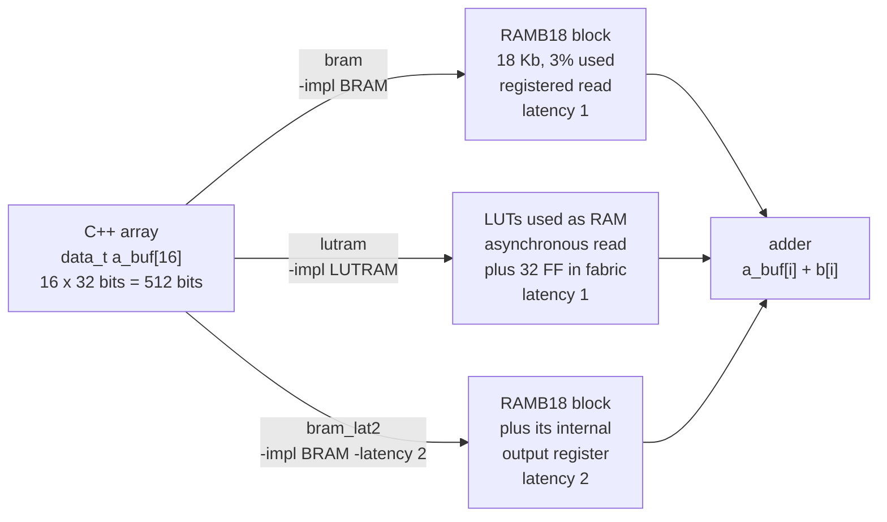

# 2.3 BIND_STORAGE

## 1. Introduction

The `BIND_STORAGE` directive tells Vitis HLS what kind of memory to build for one array, and it makes three separate choices.
The **storage type** (`-type`) fixes the kind of memory and its ports, for example `RAM_1P` for a RAM with one port, `RAM_2P` for a RAM with one read port and one write port, `ROM_1P` for a read-only memory, or `FIFO`.
The **implementation** (`-impl`) fixes which physical resource of the FPGA holds the memory.
The **latency** (`-latency`) fixes how many clock cycles pass between presenting an address and receiving the data.
Without the directive, the tool picks the storage type from the way the code accesses the array and leaves the implementation on `auto`.

This lesson varies the implementation and the latency, and it keeps the storage type fixed at `RAM_1P`.
The two implementations it compares are the two memories every AMD FPGA offers for a small array.
A **block RAM (BRAM)** is a hard memory block built into the device at fixed places, 18 Kb or 36 Kb in size, with a registered read, so the data of a read issued in one cycle arrives in the next.
The reports count block RAM in units of `BRAM_18K`, one 18 Kb half of a 36 Kb block.
A **LUTRAM**, also called distributed RAM, is made of **look-up tables (LUTs)**, the small programmable logic cells of the fabric, which on some slices can be used as tiny memories of 32 or 64 bits each.
A LUTRAM reads asynchronously, which means the data appears within the same cycle as the address, so Vitis places a **flip-flop (FF)**, a one-bit register, behind it to keep the read latency at one cycle.
A third resource, the **UltraRAM (URAM)**, is a larger hard block of 288 Kb; it is far too large for the 16 words of this lesson and is not used here.

The array in this lesson is **local**, declared inside the function.
A local array becomes a memory inside the generated design, so the directive decides what that memory is made of.
An array that is an argument of the top-level function is different, because its memory lives outside the design, and section 9 shows what the directive does there.

**What improves:** the balance of resources, and through the latency option, either the clock rate or the cycle count.
Moving a small array out of block RAM frees a block that a larger array may need, and moving an array into block RAM frees the LUTs that a LUTRAM would occupy.
Raising the latency lets a block RAM use the extra output register that is built into it, which shortens the path from the memory to the logic behind it and helps a design reach a higher clock.
Lowering the latency, where the implementation allows it, removes waiting cycles.

**What it costs:** each choice has its own price, and on this kernel the prices are not the ones the documentation leads you to expect.
A block RAM holds 18 Kb whether the array needs it or not, and the 16 words of 32 bits in this lesson fill 512 bits, which is under 3 percent of one block.
A LUTRAM costs LUTs in proportion to the size of the array, and it becomes wasteful quickly once the array grows beyond a few hundred words.
Those resource costs are real, and the trade between them came out as advertised: moving the array into block RAM took the design from 85 LUT and 55 FF down to 51 and 24 after logic synthesis, at the price of one 18 Kb block of which 3 percent is used.
What did not come out as advertised is the C synthesis estimate of that trade, which puts the two within two LUTs of each other; section 7 compares it with what Vivado builds.
The cost that is easy to miss is a **schedule** cost, and it comes from `-impl`, not from `-latency`: the scheduler charges a read of a local block RAM 1.237 ns and a read of a LUTRAM 0.677 ns, and on this kernel that difference alone pushes the body of `ADD_LOOP` from two states to three.
Forcing the 16-word array into block RAM therefore costs **16 cycles per call**, 82 against 66, on top of the block it occupies.
**`-impl` is not only a resource knob. It changes the delay the scheduler assumes, and a delay change can cost cycles that no later tool gives back.**

The latency option surprised in the other direction, twice.
Raising the block RAM read to two cycles cost **no cycles at all**, 82 against 82, because the extra cycle went into a state the loop body already had.
The familiar rule that an extra cycle of latency is paid on every read holds only when the schedule has no slack to absorb it, and a loop body that a slow read has already stretched usually has some.
The C synthesis estimate then reports that the same option saves 32 flip-flops, and that saving is not real either: after Vivado logic synthesis `bram` and `bram_lat2` are the same circuit, 51 LUT, 24 FF and one block RAM each, because Vivado moves a register that sits behind a block RAM into the block's built-in output register whether or not anyone asked for it.
**On this design `-latency 2` changes nothing that reaches the chip.**
It is worth knowing what it does not do, because the estimate makes it look like a win.

**When to use it:** use it when a resource column in the report is the one that limits the design, when a memory sits on the critical path, or when a later directive needs a specific memory, as lesson 1.5 needed a plain two-port block RAM to make a dependence visible.
Leave it out while the default choice is acceptable, which on this kernel it was: `base` is tied for the fewest cycles and uses no block RAM, and the tool reached that on its own.
Of the three directives, one cost 16 cycles to buy fabric, one asked for the choice the tool had already made, and one changed nothing that reaches the chip.
Check the loop table and the schedule after setting `-impl`, not only the resource columns, because the cycles are the part that no later tool can give back.

The directive never changes what the function computes.
It changes what the memory is built from and, through the latency, when its data arrives, and the schedule adapts to that.

The plan for this lesson listed flip-flops as a third implementation next to block RAM and LUTRAM.
`BIND_STORAGE` has no such implementation: an array is turned into individual registers by `ARRAY_PARTITION -type complete`, which lesson 2.1 covered.
The third variant here is therefore a latency change, which is also the second half of what the directive controls.

Reference: UG1399, [pragma HLS bind_storage](https://docs.amd.com/r/2023.2-English/ug1399-vitis-hls/pragma-HLS-bind_storage) and [set_directive_bind_storage](https://docs.amd.com/r/2023.2-English/ug1399-vitis-hls/set_directive_bind_storage).
The block RAM and its output register are described in UG573, the UltraScale Architecture Memory Resources guide, and LUTRAM is described in UG574, the UltraScale Architecture Configurable Logic Block guide.

## 2. How it works

The diagram shows the same C array going to three different memories, one per solution that sets the directive.
The `base` solution is not drawn, because what it becomes is one of the questions in section 5.



The waveform table shows the read port of `a_buf` for one read, and it is the whole difference between the latencies.
Columns are clock cycles counted from the cycle that presents the address, and the rows are the port signals of the memory.

| Signal                  | cycle 0 | cycle 1  | cycle 2  |
| ----------------------- | ------- | -------- | -------- |
| `a_buf_address0`        | i       | any      | any      |
| `a_buf_ce0`, latency 1  | 1       | 0        | 0        |
| `a_buf_q0`, latency 1   | old     | a_buf[i] | a_buf[i] |
| `a_buf_ce0`, latency 2  | 1       | 1        | 1        |
| `a_buf_q0`, latency 2   | old     | old      | a_buf[i] |

The walkthrough is short because the mechanism is simple.
In cycle 0 the design presents the address `i` and enables the memory with `ce0`, the chip enable.
With a latency of 1, the memory captures the address at the end of cycle 0 and drives the data on `q0` during cycle 1, so the adder can use it in cycle 1.
Nothing needs to hold `q0` afterwards: the generated memory only updates `q0` when `ce0` is high, so the data stays on the port until the next read is issued.
With a latency of 2, the data first passes through a second register at the output of the memory, and it appears on `q0` only in cycle 2.
That second register is also clocked by `ce0`, which is why Vitis holds `ce0` high through the whole read window rather than for the address cycle alone; section 7 points at the two `always` blocks that show it.
The scheduler knows the latency of every memory it builds, so it places the addition in the cycle in which the data arrives, and no wrong value is ever read.
The price is that every operation that depends on the read moves one cycle later **within the schedule**, which is not the same as one cycle later in the loop: if the state it moves into already existed, the loop does not grow.
Block RAM and LUTRAM both deliver the data in cycle 1 at a latency of 1, but they are different circuits, and the time the data needs to travel from the memory to the adder within cycle 1 is not the same for both, which section 5 turns into a prediction.

## 3. The kernel

```cpp
#include "vadd.h"

// Element-wise vector addition through a local buffer. COPY_LOOP stores a in
// a_buf, and ADD_LOOP reads a_buf back. Because a_buf is local, its memory is
// built inside the generated design, and BIND_STORAGE chooses what that
// memory is made of. The solutions change nothing else.
void vadd(const data_t a[N], const data_t b[N], data_t y[N]) {
    data_t a_buf[N];
COPY_LOOP:
    for (int i = 0; i < N; i++) {
        a_buf[i] = a[i];
    }
ADD_LOOP:
    for (int i = 0; i < N; i++) {
        y[i] = a_buf[i] + b[i];
    }
}
```

The kernel is the `vadd` of lesson 1.1 with one change: `a` passes through the local array `a_buf` before it reaches the adder.
The header sets `N = 16` and `data_t` to a 32-bit `int`, so both loops have a **trip count**, the number of times the body executes, of 16.
The buffer does no useful work in this kernel; it stands for any on-chip scratch memory, and it exists so that the design contains a memory whose implementation the directive can choose.
The array is not called `buf`, because `buf` is a reserved word in Verilog, and Vitis would rename it in the generated code.

The **iteration latency** is the number of cycles one pass through a loop body takes, and it is the quantity this lesson changes, in `ADD_LOOP` only.
`COPY_LOOP` writes the buffer, and a write needs no data back, so the read latency does not affect it.

The arguments `a`, `b` and `y` use the default **ap_memory** interface of the Vivado IP flow, a plain memory port with address, enable and data signals that connects to a RAM outside the generated block.
They are the same in every solution; only `a_buf` changes.

The operator delays that the scheduler uses on this part decide how many cycles a loop body needs:

| Operation                                        | Delay                  |
| ------------------------------------------------ | ---------------------- |
| read or write of an ap_memory port of 16 words   | 0.677 ns               |
| two-input adder, 32 bit                          | 1.016 ns               |
| read of a local block RAM of 16 words, latency 1 | 1.237 ns, see below    |
| read of a local LUTRAM of 16 words, latency 1    | unknown until measured |
| read of a local block RAM of 16 words, latency 2 | unknown until measured |

The first two rows were measured in lessons 1.1 and 2.1.
The block RAM row is inferred from lesson 1.5, where the only memory inside the design was a 16-word block RAM of latency 1 and the estimated clock of every solution was 2.253 ns, which is exactly $1.237 + 1.016$, a block RAM read followed by the adder.
Confirm it in `vadd_proj/bram/.autopilot/db/vadd.verbose.sched.rpt` before trusting the predictions that depend on it; section 7 does, and the inference holds.
The clock is 3.33 ns and the uncertainty is 0.90 ns, so the scheduler will not put more than about 2.43 ns of logic into one state.

## 4. The solutions

| Solution    | Directive in `directives_<solution>.tcl`                                     | Expected memory for `a_buf`                            |
| ----------- | ---------------------------------------------------------------------------- | ------------------------------------------------------ |
| `base`      | none                                                                         | chosen by the tool; section 5 asks which               |
| `bram`      | `set_directive_bind_storage -type RAM_1P -impl BRAM "vadd" a_buf`            | one block RAM, read latency 1                          |
| `lutram`    | `set_directive_bind_storage -type RAM_1P -impl LUTRAM "vadd" a_buf`          | LUTs used as RAM, read latency 1                       |
| `bram_lat2` | `set_directive_bind_storage -type RAM_1P -impl BRAM -latency 2 "vadd" a_buf` | one block RAM with its output register, read latency 2 |

Each variant differs from `bram` in one option: `lutram` changes the implementation, and `bram_lat2` changes the latency.
All three pin the storage type to `RAM_1P`, because the two loops never read and write `a_buf` in the same cycle, so one port is all the kernel needs.
The directive needs no other directive to have an effect, so `base` has an empty directives file.
`common/part.tcl` still sets `config_compile -pipeline_loops 0`, so neither loop is pipelined in any solution.

## 5. Predict

Write these numbers down before running anything.

Lessons 1.2 and 1.4 established the latency of sequential unpipelined loops on this install: each loop costs $N\,L_{\textrm{it}}$ cycles in its loop row, plus one cycle in the function, where $L_{\textrm{it}}$ is its iteration latency.
With two loops in a row, the function latency $L$ and the interval $I$, the number of cycles between the starts of two calls, are therefore

$$L = (N\,L_{\textrm{copy}} + 1) + (N\,L_{\textrm{add}} + 1), \qquad I = L + 1.$$

**`COPY_LOOP`** reads `a[i]` from the port in its first state and writes the data into `a_buf` in its second state.
The second state holds $0.677$ ns for the port data and at most $1.237$ ns for the write, 1.914 ns in all, which fits.
So $L_{\textrm{copy}} = 2$ in every solution, the same as the loop of lesson 1.1, and the first loop contributes $16 \cdot 2 + 1 = 33$ cycles everywhere.
Note that `-latency 2` says nothing about writes, so `bram_lat2` pays the same 1.237 ns here as `bram`.

**`ADD_LOOP`** decides the difference.
The schedule tables below sketch one iteration; rows are operations and columns are the states of the body.
`R` marks the state that issues a read, `D` the state in which its data arrives, `A` the addition and `W` the write of `y[i]`.
The exit test and the increment of `i` share the first state of the body, so they add no column.

**`bram`, a block RAM of latency 1:**

| Operation                  | 0 | 1 | 2 |
| -------------------------- | - | - | - |
| read `a_buf[i]` and `b[i]` | R | D |   |
| add                        |   | A |   |
| write `y[i]`               |   |   | W |

State 1 holds the block RAM data and the adder, $1.237 + 1.016 = 2.253$ ns.
The write would add 0.677 ns, which gives 2.930 ns against a budget of 2.43, so it moves into a state of its own and $L_{\textrm{add}} = 3$.
The `b[i]` data arrives in the same state, but its 0.677 ns runs in parallel with the 1.237 ns of the block RAM and does not lengthen the path.
Compare this with lesson 1.1, where both operands came from ap_memory ports: there state 1 held $0.677 + 1.016 + 0.677 = 2.370$ ns and the write fitted, so the loop body had two states.
**The only reason this loop needs a third state is that the scheduler thinks a block RAM read is slower than a port read.**

**`lutram`, a LUTRAM of latency 1**, has the same shape, and the question is whether the write fits.
Call the LUTRAM read delay $d$.
The write joins the adder in state 1 if

$$d + 1.016 + 0.677 \le 2.431, \qquad \textrm{that is} \qquad d \le 0.738 \ \textrm{ns}.$$

- *Outcome (a), a fast read.* If the scheduler models the LUTRAM output register like a port read, $d$ is about 0.677 ns, the write fits, $L_{\textrm{add}} = 2$, and the loop is as fast as lesson 1.1.
- *Outcome (b), a slow read.* If the scheduler charges more than 0.738 ns, the body needs three states like `bram`, and the two implementations differ only in resources.

**`bram_lat2`, a block RAM of latency 2:**

| Operation       | 0 | 1 | 2 | 3 |
| --------------- | - | - | - | - |
| read `b[i]`     | R | D |   |   |
| read `a_buf[i]` | R |   | D |   |
| add             |   |   | A |   |
| write `y[i]`    |   |   |   | W |

The read of `a_buf` needs one more state before its data arrives, and everything that depends on it moves one state later.
Whether that costs a cycle depends on what the extra state has to carry:

- *Outcome (a), a fourth state.* If the data still leaves the memory as slowly as before, the adder and the write cannot share the state in which the data arrives, the body keeps the split it had in `bram` and gains the extra read state on top, so $L_{\textrm{add}} = 4$ and the call costs 16 cycles more than `bram`.
- *Outcome (b), no extra state.* The output register exists to shorten the clock-to-output path of the memory. If the scheduler models that, the read delay drops, the adder and the write finally fit into the state where the data arrives, and the extra read stage lands in a state the body already had. Then $L_{\textrm{add}} = 3$, exactly as in `bram`, and the extra latency is free.

This is the "one-cycle versus two-cycle read" row of the plan, and the interesting part is that its price is not fixed: an extra cycle of latency costs a cycle per iteration only when the schedule has no slack to put it in.
Section 7 decides which outcome this kernel gives.

**`base`** leaves the choice to the tool.
Predict which of `bram` and `lutram` it matches, both in the Memory table and in the latency, and write down what the `ram_style` attribute in its generated memory module will say.

Putting the numbers into the formula:

$$L_{\textrm{bram}} = 33 + (16 \cdot 3 + 1) = 82, \qquad L_{\textrm{lutram}} = 33 + (16 \cdot 2 + 1) = 66 \ \textrm{or} \ 82, \qquad L_{\textrm{bram\_lat2}} = 98 \ \textrm{or} \ 82.$$

The testbench makes 16 calls, so the co-simulation total should be one cycle short of 16 intervals, as it was in lessons 1.4 and 2.1.

Resources follow from the implementation, not from the schedule.
`bram` and `bram_lat2` should each show one `BRAM_18K` and almost no LUTs for the memory, because the output register of `bram_lat2` is inside the block.
`lutram` should show no block RAM and a few dozen LUTs, of the order of one per data bit, plus 32 flip-flops for the output register, although where the report counts those flip-flops is itself something to check.
The rest of the design should differ only by the flip-flops the schedule needs: the **finite state machine (FSM)**, the controller that steps through the states, grows by one one-hot flip-flop per extra state, and any 32-bit value that has to survive a state boundary needs a register of its own.
That second clause is worth writing down for each solution before running, because it is where the flip-flop columns below are decided.

| Quantity                      | `base` | `bram` | `lutram` (a) | `lutram` (b) | `bram_lat2` (a) | `bram_lat2` (b) |
| ----------------------------- | ------ | ------ | ------------ | ------------ | --------------- | --------------- |
| Storage type of `a_buf`       | ?      | RAM_1P | RAM_1P       | RAM_1P       | RAM_1P          | RAM_1P          |
| Implementation of `a_buf`     | ?      | BRAM   | LUTRAM       | LUTRAM       | BRAM            | BRAM            |
| Read latency of `a_buf`       | 1      | 1      | 1            | 1            | 2               | 2               |
| `COPY_LOOP` iteration latency | 2      | 2      | 2            | 2            | 2               | 2               |
| `ADD_LOOP` iteration latency  | ?      | 3      | 2            | 3            | 4               | 3               |
| Function latency              | ?      | 82     | 66           | 82           | 98              | 82              |
| Interval                      | ?      | 83     | 67           | 83           | 99              | 83              |
| `BRAM_18K`                    | ?      | 1      | 0            | 0            | 1               | 1               |

## 6. Run

`BIND_STORAGE` cannot change what the function computes, but this lesson changes when the data of a memory inside the design arrives, and that memory is a real module in the RTL.
The script therefore runs **C and RTL co-simulation (cosim)** for every solution, which drives the same testbench through the generated register-transfer level (RTL) design.
A pass shows that the schedule waits for the data of each memory as long as that memory needs, and the co-simulation report also gives the latency the RTL really takes.
C simulation runs once, in `base`, to prove that the testbench itself passes.

```bash
cd s2_arrays/23_bind_storage
vitis_hls -f run_hls.tcl 2>&1 | tee run.log
```

The same run through the repository Makefile is `make run LESSON=s2_arrays/23_bind_storage`.

Then collect the summary numbers:

```bash
bash ../../common/collect_latency.sh   vadd_proj
bash ../../common/collect_resources.sh vadd_proj
```

You can also run `make check LESSON=s2_arrays/23_bind_storage`, which runs both scripts.

Lesson 2.2 showed that the C synthesis resource estimate can disagree with what Vivado builds, and the implementation of a memory is exactly the kind of decision that Vivado makes last.
This step is not optional in this lesson, because `base` leaves `ram_style` on `auto` and C synthesis can only guess what that becomes:

```bash
vitis_hls -f export_syn.tcl 2>&1 | tee export_syn.log
```

Logic synthesis takes a few minutes per solution, so it is not part of `make run`.

## 7. Read the results

### The log

The solution banners from `run_hls.tcl` show which solution each message belongs to:

```bash
grep -nE "== solution|bind_storage|a_buf|TEST (PASSED|FAILED)|C/RTL co-simulation finished" run.log
```

**The tool prints nothing when it applies `BIND_STORAGE`.**
There is no `Applying ...` line of the kind `ARRAY_PARTITION` and `ARRAY_RESHAPE` produce, and `a_buf` appears in the log only as part of the generated file name `vadd_a_buf_RAM_*.v` during co-simulation compilation.
The only place that confirms the directive took effect is the Storage Report below, so read it rather than the log.
The log does speak up when the directive is applied to something it cannot act on, as section 9 shows.

Every solution ends with `*** C/RTL co-simulation finished: PASS ***`.
`base` prints `TEST PASSED` three times, once for its own `csim_design` and twice inside `cosim_design`, which runs the testbench once in C and once against the RTL; the other three print it twice.

### The Storage Report and the Memory table

The summary report `vadd_proj/<solution>/syn/report/csynth.rpt` holds the Bind Op Report, which lists every operator and the resource it is bound to, and next to it a section headed **`== Storage Report`**, which lists every memory with its usage, implementation and latency.
The section is not called "Bind Storage Report" on this version, so grep for the shorter name:

```bash
for s in base bram lutram bram_lat2; do
    echo "== $s"; grep -A 10 "== Storage Report" vadd_proj/$s/syn/report/csynth.rpt
done
```

The `a_buf_U` row reads:

| Solution    | Usage          | BRAM | Pragma | Impl     | Latency | Bitwidth, Depth, Banks |
| ----------- | -------------- | ---- | ------ | -------- | ------- | ---------------------- |
| `base`      | `ram_1p array` |      |        | `auto`   | 1       | 32, 16, 1              |
| `bram`      | `ram_1p array` | 1    | `yes`  | `bram`   | 1       | 32, 16, 1              |
| `lutram`    | `ram_1p array` |      | `yes`  | `lutram` | 1       | 32, 16, 1              |
| `bram_lat2` | `ram_1p array` | 1    | `yes`  | `bram`   | **1**   | 32, 16, 1              |

Three things in that table are worth stopping on.

The `Usage` column reads `ram_1p array` in **every** solution, including `base`.
The tool had already chosen a single-port RAM on its own, because neither loop touches `a_buf` twice in one cycle, so `-type RAM_1P` asked for what it was going to get anyway.
The `Pragma` column is the only thing that distinguishes a chosen storage type from a requested one, and it is blank exactly in `base`.

The `Impl` column of `base` reads `auto`, not `bram` or `lutram`.
C synthesis has not decided; it has deferred, and the Vivado step below is what settles it.

**The `Latency` column reads 1 for `bram_lat2`, which is wrong.**
The directive did take effect: the schedule report shows `Core 90 'RAM_1P_BRAM' <Latency = 2>`, the generated module is named `vadd_a_buf_RAM_1P_BRAM_2R1W` rather than `..._1R1W`, and that module contains two output registers.
The Storage Report simply prints the default latency of the implementation instead of the one in force.
Take the latency from the module name or from the schedule report, never from this column.

The detailed report `vadd_proj/<solution>/syn/report/vadd_csynth.rpt` has a section headed `== Utilization Estimates`, subsection `+ Detail`, table `* Memory`:

```bash
for s in base bram lutram bram_lat2; do
    echo "== $s"; grep -A 8 "\* Memory:" vadd_proj/$s/syn/report/vadd_csynth.rpt
done
```

| Solution    | Module                     | BRAM_18K | FF | LUT | Words | Bits | Banks |
| ----------- | -------------------------- | -------- | -- | --- | ----- | ---- | ----- |
| `base`      | `a_buf_RAM_AUTO_1R1W`      | 0        | 32 | 8   | 16    | 32   | 1     |
| `bram`      | `a_buf_RAM_1P_BRAM_1R1W`   | 1        | 0  | 0   | 16    | 32   | 1     |
| `lutram`    | `a_buf_RAM_1P_LUTRAM_1R1W` | 0        | 32 | 8   | 16    | 32   | 1     |
| `bram_lat2` | `a_buf_RAM_1P_BRAM_2R1W`   | 1        | 0  | 0   | 16    | 32   | 1     |

`Words`, `Bits` and `Banks` read 16, 32 and 1 everywhere, as they must, because the directive does not change the shape of the array.
`base` and `lutram` are identical in this table, which is the first sign that the tool's own choice is the LUTRAM one.
Both block RAM solutions cost zero fabric FF and LUT for the memory, and `bram_lat2` costs no more than `bram`, because its extra register is inside the block.

### The loop table

```bash
for s in base bram lutram bram_lat2; do
    echo "== $s"; grep -A 8 "\* Loop:" vadd_proj/$s/syn/report/vadd_csynth.rpt
done
```

| Solution    | `COPY_LOOP` iteration latency | `COPY_LOOP` latency | `ADD_LOOP` iteration latency | `ADD_LOOP` latency | Function latency |
| ----------- | ----------------------------- | ------------------- | ---------------------------- | ------------------ | ---------------- |
| `base`      | 2                             | 32                  | 2                            | 32                 | 66               |
| `bram`      | 2                             | 32                  | 3                            | 48                 | 82               |
| `lutram`    | 2                             | 32                  | 2                            | 32                 | 66               |
| `bram_lat2` | 2                             | 32                  | 3                            | 48                 | 82               |

`COPY_LOOP` is 2 in every solution, as predicted: a write needs no data back, and even the 1.237 ns block RAM write fits behind the 0.677 ns port read.
`ADD_LOOP` carries the whole difference, and it answers two of the three open questions at once.
`lutram` took **outcome (a)**, the fast read, so its loop body has two states and its call takes 66 cycles.
`bram_lat2` took **outcome (b)**, no extra state: it matches `bram` exactly at 82 cycles, and the second cycle of read latency cost nothing.

The comparison that matters is `bram` against `lutram`: **the implementation alone, with the latency left at 1 in both, is worth 16 cycles per call.**

### The schedule

The per-state delays are in `vadd_proj/<solution>/.autopilot/db/vadd.verbose.sched.rpt`, which also prints the critical path of every state:

```bash
for s in base bram lutram bram_lat2; do
    echo "== $s"; grep -E "load.*a_buf_load.*CoreInst" vadd_proj/$s/.autopilot/db/vadd.verbose.sched.rpt | head -1
done
```

Each line carries two delays, and they are not the same thing.
The one in brackets after the stage count, as in `Operation 42 [3/3] (0.57ns)`, is what this operation is charged in the state it occupies.
The one at the end, in `Core 90 'RAM_1P_BRAM' <Latency = 2> <II = 1> <Delay = 1.23>`, is the nominal delay of the core.
For a latency of 1 they are equal; for a latency of 2 the core's delay is split across the extra stage and only the smaller part lands in the state that hands the data to the adder.

| Operation                                        | Charged per state | Core                                            |
| ------------------------------------------------ | ----------------- | ----------------------------------------------- |
| read of a local RAM chosen by the tool (`base`)  | 0.677 ns          | `Core 83 'RAM'`, latency 1, delay 0.67          |
| read of a local block RAM, latency 1             | 1.237 ns          | `Core 90 'RAM_1P_BRAM'`, latency 1, delay 1.23  |
| read of a local LUTRAM, latency 1                | 0.677 ns          | `Core 89 'RAM_1P_LUTRAM'`, latency 1, delay 0.67 |
| read of a local block RAM, latency 2             | 0.57 ns           | `Core 90 'RAM_1P_BRAM'`, latency 2, delay 1.23  |

The 1.237 ns inferred from lesson 1.5 is confirmed exactly.
A LUTRAM read is charged the same 0.677 ns as an ap_memory port read, which is outcome (a) and is why `lutram` keeps the two-state body of lesson 1.1.
The last row is the one that explains `bram_lat2`: the core is the same block RAM with the same 1.23 ns, but **with the output register switched on, the part of it that the scheduler has to fit beside the adder drops to 0.57 ns**, less than half.
That is what the register is for in the silicon, and the tool models it.

Vitis charges the memory delay twice, once in the state that presents the address and once in the state that receives the data.
For `bram` that shows up directly, because 1.237 ns is larger than anything else in either state.

**`base` and `lutram`, states 4 and 5, iteration latency 2:**

| Operation                  | 4 | 5 |
| -------------------------- | - | - |
| exit test and `i++`        | A |   |
| read `a_buf[i]` and `b[i]` | R | D |
| add                        |   | A |
| write `y[i]`               |   | W |

State 5 carries $0.677 + 1.016 + 0.677 = 2.370$ ns against the 2.431 ns budget, so the read data, the adder and the write share one state.
This is the schedule of lesson 1.1 and the one section 5 predicted for outcome (a).

**`bram`, states 4 to 6, iteration latency 3:**

| Operation           | 4 | 5 | 6 |
| ------------------- | - | - | - |
| exit test and `i++` | A |   |   |
| read `a_buf[i]`     | R | D |   |
| read `b[i]`         |   | R | D |
| add                 |   |   | A |
| write `y[i]`        |   |   | W |

The state count is the 3 that section 5 predicted, and for the predicted reason: $1.237 + 1.016 + 0.677 = 2.930$ ns does not fit in one state, so the body cannot be two states.
The shape is not the predicted one.
Section 5 assumed the data and the adder would share state 5 and the write would take state 6; instead the scheduler left state 5 holding only the arriving block RAM data (critical path 1.237 ns), pushed the read of `b[i]` one state later, and put the adder and the write together in state 6 ($0.677 + 1.016 + 0.677 = 2.370$ ns).
Both arrangements need three states, so the cycle count is the same either way, but the arrangement the tool chose has a consequence in the flip-flop column, below.

**`bram_lat2`, states 4 to 6, iteration latency 3:**

| Operation           | 4 | 5 | 6 |
| ------------------- | - | - | - |
| exit test and `i++` | A |   |   |
| read `a_buf[i]`     | R |   | D |
| read `b[i]`         |   | R | D |
| add                 |   |   | A |
| write `y[i]`        |   |   | W |

This is outcome (b) drawn out.
The read of `a_buf` now spans three states instead of two, but the third state is state 6, which the body already had.
State 5 carries only the issue of the `b[i]` read, 0.677 ns, and state 6 carries the arriving block RAM data at 0.57 ns in parallel with the arriving port data at 0.677 ns, then the adder and the write: $0.677 + 1.016 + 0.677 = 2.370$ ns again.
The block RAM is no longer on the critical path of any state.
**Raising the latency did not add a state; it used the one the body already had.**
In `bram`, state 5 did nothing but wait 1.237 ns for the block RAM to drive its data.
In `bram_lat2` that same state is the second stage of the read, and the data comes out one state later through a path less than half as long.

### The co-simulation report

Open `vadd_proj/<solution>/sim/report/vadd_cosim.rpt`.
Every call has the same trip counts, so the minimum, average and maximum latency are equal, and they equal the C synthesis function latency exactly: 66, 82, 66 and 82.
The testbench makes 16 calls, 4 directed and 12 random, so the total execution time is one cycle short of 16 intervals: 1071 cycles for `base` and `lutram` at an interval of 67, and 1327 for `bram` and `bram_lat2` at an interval of 83.
All four pass, which is the check that matters for `bram_lat2`: the FSM really does wait the extra cycle, and the `stale` directed case would have caught it if the adder had read the previous value out of `q0`.

### The Verilog

Each memory inside the design is generated as a module of its own, in a file of its own:

```bash
ls vadd_proj/*/syn/verilog/
```

```
base:       vadd_a_buf_RAM_AUTO_1R1W.v       vadd.v
bram:       vadd_a_buf_RAM_1P_BRAM_1R1W.v    vadd.v
lutram:     vadd_a_buf_RAM_1P_LUTRAM_1R1W.v  vadd.v
bram_lat2:  vadd_a_buf_RAM_1P_BRAM_2R1W.v    vadd.v
```

The name encodes the function, the variable, the storage type, the implementation and the port shape, as `hist_acc_RAM_2P_BRAM_1R1W` did in lesson 1.5.
`2R1W` in `bram_lat2` is the read latency showing through the name, and it is the only place in `csynth.rpt` or `vadd_csynth.rpt` where the latency of 2 appears at all; the other correct statement of it is the `<Latency = 2>` field in the verbose schedule report.

The one line worth reading in each memory module is the declaration of the storage array:

```bash
grep -n "ram_style" vadd_proj/*/syn/verilog/vadd_a_buf_*.v
```

```verilog
base:       (* ram_style = "auto"  *)reg [DataWidth-1:0] ram[0:AddressRange-1];
bram:       (* ram_style = "block"  *)reg [DataWidth-1:0] ram[0:AddressRange-1];
bram_lat2:  (* ram_style = "block"  *)reg [DataWidth-1:0] ram[0:AddressRange-1];
lutram:     (* ram_style = "distributed"  *)reg [DataWidth-1:0] ram[0:AddressRange-1];
```

The attribute is the whole physical effect of `-impl` at the RTL level: it is a request to Vivado, which chooses the primitives.
How little else changes is easy to underestimate:

```bash
diff vadd_proj/base/syn/verilog/vadd_a_buf_RAM_AUTO_1R1W.v \
     vadd_proj/lutram/syn/verilog/vadd_a_buf_RAM_1P_LUTRAM_1R1W.v
```

The two files differ in the module name and in that one attribute, and in nothing else.
The `bram` module has the same body again.
**Three of the four memory modules are the same circuit with a different string in an attribute**, which makes it all the clearer that the 16 cycles `bram` loses are not caused by anything in the RTL of the memory: they are caused by the delay the scheduler assumed for it.

The latency is the one option that does change the module:

```bash
diff vadd_proj/bram/syn/verilog/vadd_a_buf_*.v vadd_proj/bram_lat2/syn/verilog/vadd_a_buf_*.v
```

`bram` drives `q0` straight from the storage array:

```verilog
output reg[DataWidth-1:0] q0;
always @(posedge clk) if (ce0) begin
    if (we0) ram[address0] <= d0;
    q0 <= ram[address0];
end
```

`bram_lat2` inserts a second register and makes `q0` a wire:

```verilog
output wire[DataWidth-1:0] q0;
reg [DataWidth-1:0] q0_t0;
reg [DataWidth-1:0] q0_t1;
assign q0 = q0_t1;
always @(posedge clk) if (ce0) q0_t1 <= q0_t0;
always @(posedge clk) if (ce0) begin
    if (we0) ram[address0] <= d0;
    q0_t0 <= ram[address0];
end
```

Both registers are gated by `ce0`, so the enable has to stay high long enough for the data to walk through both of them.
That is visible in `vadd.v`:

```bash
grep -A 2 "a_buf_ce0 = 1'b1" vadd_proj/*/syn/verilog/vadd.v
```

`base`, `bram` and `lutram` assert `a_buf_ce0` in states 3 and 4, the write state of `COPY_LOOP` and the read state of `ADD_LOOP`.
`bram_lat2` asserts it in states 3, 4, 5 and 6, holding it through the whole read window so that the second register clocks.

The last line worth reading is where the adder takes its left operand:

```bash
grep -n "y_d0 =" vadd_proj/*/syn/verilog/vadd.v
```

```verilog
base:       assign y_d0 = (b_q0 + a_buf_q0);
bram:       assign y_d0 = (b_q0 + a_buf_load_reg_230);
lutram:     assign y_d0 = (b_q0 + a_buf_q0);
bram_lat2:  assign y_d0 = (b_q0 + a_buf_q0);
```

`bram` is the only solution that reads its operand out of a fabric register rather than straight off the memory port, and that register is the 32 flip-flops in the next table.

### The resource estimate

```bash
for s in base bram lutram bram_lat2; do
    echo "== $s"; grep -A 14 "== Utilization Estimates" vadd_proj/$s/syn/report/vadd_csynth.rpt
done
```

| Line            | `base`  | `bram`  | `lutram` | `bram_lat2` |
| --------------- | ------- | ------- | -------- | ----------- |
| `BRAM_18K`      | 0       | 1       | 0        | 1           |
| Memory FF       | 32      | 0       | 32       | 0           |
| Memory LUT      | 8       | 0       | 8        | 0           |
| Register FF     | 25      | 58      | 25       | 26          |
| Expression LUT  | 89      | 89      | 89       | 89          |
| Multiplexer LUT | 63      | 69      | 63       | 69          |
| **Total FF**    | **57**  | **58**  | **57**   | **26**      |
| **Total LUT**   | **160** | **158** | **160**  | **158**     |

The flip-flop column is the one that contradicts section 5.
The prediction was that the solutions would differ only by the one-hot FSM bit that an extra state costs, and `bram` against `bram_lat2` differs by 32.
The Register table says where they are:

```bash
grep -A 12 "\* Register:" vadd_proj/bram/syn/report/vadd_csynth.rpt
```

`bram` has a register that no other solution has, `a_buf_load_reg_230`, 32 bits wide.
It exists because of the schedule shape above: the block RAM data arrives in state 5 and the adder runs in state 6, so the value has to survive a state boundary.
`bram_lat2` needs no such register, because its data arrives in the state that uses it; the equivalent register is the block RAM's own output register, which costs nothing in the fabric.
Counting the FSM as well, `bram` and `bram_lat2` both use 6 one-hot bits against 5 in the two-state solutions, and `bram_lat2` therefore lands at $26 = 25 + 1$ flip-flops, the lowest of the four.

**In the estimate, `-latency 2` moves 32 flip-flops out of the fabric and into the block RAM for free.**
Hold that conclusion until the Vivado step below, which withdraws it: Vivado performs the same move on `bram` without being asked, so the two solutions implement identically and only the estimate ever showed a difference.
What survives is the cycle result, which is a scheduling fact and therefore final: the extra latency was not paid in cycles because the schedule had a state for it.

### The estimated clock

```bash
bash ../../common/collect_latency.sh vadd_proj
```

```
solution         best      worst     ii_min     ii_max   clk_est_ns
base               66         66         67         67        2.370
bram_lat2          82         82         83         83        2.370
bram               82         82         83         83        2.370
lutram             66         66         67         67        2.370
```

The estimated clock is 2.370 ns in all four solutions, and in all four it is the same path: the ap_memory read of `b`, the adder, and the ap_memory write of `y`.
`a_buf` is never the critical path, not even in `bram`, where its 1.237 ns sits alone in a state of its own.
This is the honest limit of the lesson: **the clock benefit that `-latency 2` is supposed to buy is invisible here, because the memory was not what set the clock.**
A design whose critical path did run out of a block RAM is the case the option exists for, and this kernel is not it.
What `-impl BRAM` cost, by contrast, is perfectly visible: 16 cycles, in the loop table, for a delay that never showed up in the clock.

### What Vivado builds

After `export_syn.tcl`, the report `vadd_proj/<solution>/impl/report/verilog/export_syn.rpt` lists what logic synthesis actually used:

```bash
for s in base bram lutram bram_lat2; do
    echo -n "$s: "; grep -E "^(BRAM|LUT|FF):" vadd_proj/$s/impl/report/verilog/export_syn.rpt | tr -s ' ' | tr '\n' ' '; echo
done
```

| Quantity                     | `base` | `bram` | `lutram` | `bram_lat2` |
| ---------------------------- | ------ | ------ | -------- | ----------- |
| `BRAM`                       | 0      | 1      | 0        | 1           |
| `LUT`                        | 85     | 51     | 85       | 51          |
| `FF`                         | 55     | 24     | 55       | 24          |
| of which `a_buf_U` LUT       | 69     | 35     | 69       | 35          |
| of which `a_buf_U` FF        | 32     | 0      | 32       | 0           |
| Post-synthesis period (ns)   | 1.064  | 1.569  | 1.064    | 1.569       |

Two pairs, and neither pair is the one the C synthesis estimate suggested.

**`base` is `lutram`, exactly.** Every number matches, and the report names the primitives:

```bash
sed -n '/RTL Synthesis Timing Paths/,$p' vadd_proj/base/impl/report/verilog/export_syn.rpt | head -40
```

```
| a_buf_U/ram_reg_0_15_0_0_i_1 | CLB.LUT.LUT3        |
| a_buf_U/ram_reg_0_15_0_0/SP  | CLB.LUTRAM.RAM32X1S |
| a_buf_U/q0_reg[0]            | REGISTER.SDR.FDRE   |
```

`RAM32X1S` is the distributed-RAM primitive, so Vivado resolved `ram_style = "auto"` to exactly what `-impl LUTRAM` asks for.
That answers the question section 5 left open about `base`: for a 16-word array the tool's own choice is LUTRAM, and the `lutram` directive requests a decision that would have been made anyway.

**`bram` and `bram_lat2` are also identical, and that is the finding that matters.**
Both build one `RAMB18E2`, both use 51 LUT and 24 FF, and both close at 1.569 ns.
The 32-flip-flop gap that C synthesis reported between them, 58 against 26, **is not in the hardware.**
The memory module holds no fabric flip-flops in either solution, and the top level holds 24 in both, so the 32-bit `a_buf_load_reg_230` that C synthesis charged to `bram` has been pulled into the block RAM's own output register — the same register that `-latency 2` asks for explicitly.
Vivado does this wherever a register sits directly behind a block RAM output and its enable can be folded onto the block's output-register enable, which is exactly the shape Vitis generated here.
`bram_lat2` shows the register in use directly, because its timing paths end on the `REGCEB` and `REGCEAREGCE` pins of the `RAMB18E2`, which are the enables of that output register; `bram` reaches the same place by retiming.

So the honest scorecard for logic synthesis is:

- `-impl BRAM` is a real trade. It buys back 34 LUT and 31 FF by taking the array out of the fabric, and it spends one `BRAM_18K` of which it uses 3 percent. It also lengthens the post-synthesis path from 1.064 ns to 1.569 ns, because a block RAM really is slower to read than a LUTRAM, though both are far inside a 3.33 ns clock.
- `-latency 2` changes **nothing at all** after logic synthesis: same cycles, same LUT, same FF, same BRAM, same period as `bram`. Its only measurable effect is on the C synthesis estimate, where it corrects a flip-flop count that was wrong to begin with.


### Predicted and measured

A question mark marks a value that section 5 left open.
**Bold** marks a value that contradicts section 5 or the C synthesis estimate, or that settles one of the open questions.

| Quantity                           | Predicted                       | `base`   | `bram`   | `lutram` | `bram_lat2` |
| ---------------------------------- | ------------------------------- | -------- | -------- | -------- | ----------- |
| `Usage` in the Storage Report      | ? / 1P / 1P / 1P                | `ram_1p` | `ram_1p` | `ram_1p` | `ram_1p`    |
| `Impl` in the Storage Report       | ? / bram / lutram / bram        | `auto`   | `bram`   | `lutram` | `bram`      |
| `Latency` in the Storage Report    | 1 / 1 / 1 / 2                   | 1        | 1        | 1        | **1, wrong** |
| `ram_style` in the memory module   | ? / block / distributed / block | `auto`   | `block`  | `distributed` | `block` |
| Delay of the `a_buf` load (ns)     | ? / 1.237 / $d$ / ?             | 0.677    | 1.237    | 0.677    | **0.57**    |
| `COPY_LOOP` iteration latency      | 2                               | 2        | 2        | 2        | 2           |
| `ADD_LOOP` iteration latency       | ? / 3 / 2 or 3 / 4 or 3         | 2        | 3        | 2 (a)    | 3 (b)       |
| Function latency                   | ? / 82 / 66 or 82 / 98 or 82    | 66       | 82       | 66       | 82          |
| Interval                           | ? / 83 / 67 or 83 / 99 or 83    | 67       | 83       | 67       | 83          |
| Cosim latency                      | equal to the above              | 66       | 82       | 66       | 82          |
| Cosim total, 16 calls              | $16 I - 1$                      | 1071     | 1327     | 1071     | 1327        |
| Estimated clock (ns)               | ? / 2.253 / ? / ?               | 2.370    | **2.370** | 2.370   | 2.370       |
| `BRAM_18K`, C synthesis            | ? / 1 / 0 / 1                   | 0        | 1        | 0        | 1           |
| Memory FF, C synthesis             | ? / 0 / 32 / 0                  | 32       | 0        | 32       | 0           |
| Memory LUT, C synthesis            | ? / 0 / about 32 / 0            | 8        | 0        | **8**    | 0           |
| FF, C synthesis                    | equal to within a few           | 57       | **58**   | 57       | **26**      |
| LUT, C synthesis                   | equal to within a few           | 160      | 158      | 160      | 158         |
| BRAM, Vivado                       | ? / 1 / 0 / 1                   | 0        | 1        | 0        | 1           |
| LUT, Vivado                        | —                               | 85       | **51**   | 85       | **51**      |
| FF, Vivado                         | —                               | 55       | **24**   | 55       | **24**      |

The entries in bold fall into three groups.

**The schedule predictions were right, and they were right for the stated reasons.**
`lutram` took outcome (a) because a LUTRAM read really is charged the same 0.677 ns as a port read, and the inequality $d \le 0.738$ ns from section 5 decided it.
`bram` needed three states because 2.930 ns does not fit in 2.431 ns.
`COPY_LOOP` stayed at 2 everywhere.
The one thing section 5 got wrong about the schedules is the **shape** of the `bram` body, not its length: the scheduler deferred the read of `b[i]` instead of the write of `y[i]`, which cost nothing in cycles but is what created the 32-bit register.

**`bram_lat2` took the outcome that section 5 listed second**, and the reason is the 0.57 ns row of the delay table.
An extra cycle of read latency is not a fixed price; it is free whenever the loop body already has a state for it, and a body that was stretched by a slow read usually does.

**Both surprises in the resource columns are estimation errors, and they point in opposite directions.**
C synthesis charges the LUTRAM memory 8 LUT where Vivado builds 69, so it under-counts by a factor of nine — section 5's guess of "about 32, one per bit" was closer to the truth than the tool's own estimate.
And it charges `bram` 32 flip-flops that Vivado never builds, because it does not model the retiming of a register into a block RAM output.
The net effect is that the C synthesis table ranks `bram` and `lutram` as equal in LUTs (158 against 160) when after synthesis they are 51 against 85, and ranks `bram_lat2` as 32 flip-flops cheaper than `bram` when after synthesis they are the same design.
This is lesson 2.2's rule again, now for memories: **take latency from C synthesis and area from `export_design -flow syn`.**

Finally, the estimated clock was 2.370 ns in all four solutions rather than the 2.253 ns that lesson 1.5 would suggest for a block RAM design.
The reason is that `a_buf` never sits on the critical state: in `bram` the block RAM read has a state to itself, and in `bram_lat2` it is faster than the port read beside it.
The critical path in every solution is the same one, `b` port read, adder, `y` port write, which is the path lesson 1.1 measured.


## 8. Hardware implications

The adder, the counters and the three ap_memory ports are the same in every solution.
What changes is the one memory inside the design, the number of states in the FSM that surrounds it, and the registers that the state boundaries force.

In `bram`, the 16 words of `a_buf` occupy one RAMB18 block, the 18 Kb block RAM primitive of UltraScale+ devices.
The block is a hard macro with its own address decoder, sense amplifiers and input and output registers, so it holds the 512 bits and their output register without a single fabric flip-flop, and Vivado spends only 35 LUTs on the address and enable logic around it. It uses 512 of its 18 432 bits, and the other 97 percent cannot be given to any other array.
The read is synchronous: the block registers the address at the clock edge and delivers the data during the next cycle, and that data then travels on dedicated routing from the block to the fabric.
The scheduler charges that path 1.237 ns, and that single number is what makes this solution the slowest of the four.
It is worth being precise about why, because it is not the block RAM being slow in any physical sense: the same 1.237 ns appears twice in the schedule, once entering the memory and once leaving it, and with the adder and the port write behind it the arithmetic no longer fits in one state.
The loop body grows to three states and the design pays 16 extra cycles per call.
After logic synthesis the whole design closes at 1.569 ns, which is slower than the 1.064 ns of the LUTRAM solutions, so the model was directionally right: reading a block RAM really is the slower of the two.
It was not right by enough to be worth 16 cycles at a 3.33 ns clock, where both numbers leave more than half the period unused.
This is the same failure mode as lesson 2.2, in a milder form: a modelled delay is spent as cycles before any downstream tool can weigh it against the clock that was actually asked for.
What `bram` does buy is fabric: 51 LUT and 24 FF against 85 and 55, because 512 bits of storage and their output register leave the fabric for a hard block. That is the trade the directive is for, and it is a good one when LUTs are what the design is short of.

In `bram_lat2`, the same block is used, and the latency of 2 switches on the optional output register that sits inside every block RAM (UG573 calls it the output register enabled by `DOA_REG` and `DOB_REG`).
That register costs nothing in the fabric, because it already exists in the silicon, and it moves the slow clock-to-output path of the memory array into its own cycle, which is how block RAMs reach their highest clock rates.
The scheduler's number for the shortened path is 0.57 ns against 1.237 ns, and the consequence on this kernel is the opposite of the textbook one twice over.
The extra cycle did not lengthen the loop, because the loop body was already three states long for the reasons above and the extra read stage fitted into the state that was nearly empty.
And the 32 flip-flops that the estimate shows it saving were never going to be built: Vivado already retimes a register that sits behind a block RAM into that same output register, so `bram` gets the hardware without the directive, and the two solutions implement to the same 51 LUT, 24 FF, one block RAM and 1.569 ns.
That is the sharper version of the general point.
The `-latency` option does not create the output register; the register is in the silicon and the synthesis tool will use it when the surrounding logic lets it.
What the option changes is **what the scheduler believes while it is deciding how many states a loop body needs**, and that decision is the one no later tool can revise.
Here the belief happened to cost nothing, because the body had a spare state.
The rule to take away is narrower than the usual one: an extra cycle of read latency is paid per iteration only when the schedule has no state to absorb it, and a loop body that is already longer than its data dependencies require usually has one.
The case where `-latency 2` earns its keep is the case this kernel does not show: a design whose critical path really does run out of a block RAM, where the extra register buys clock rate that the fabric register behind the memory could not.

In `lutram`, no block RAM is used.
Vivado builds the memory from LUTs in the SLICEM slices, which are the slices whose LUTs can be written as well as read, and on UltraScale+ each such LUT can hold 64 bits, or two groups of 32.
The read of a LUTRAM is combinational, so the flip-flops that Vitis puts behind it are ordinary fabric registers, 32 of them, and they are what makes the read latency 1.
Those 32 are reported inside the memory module rather than in the Register table, which is why `lutram` and `bram` look almost equal in the total flip-flop column for completely different reasons, and why the C synthesis estimate hides the fact that after synthesis `lutram` uses 55 flip-flops against 24.
Vivado builds the 16-by-32 array from `RAM32X1S` primitives and charges 69 LUT for it, nine times the 8 that C synthesis estimated, so the LUT cost of a LUTRAM is one of the numbers this flow is worst at predicting.
The scheduler charges a LUTRAM read 0.677 ns, the same as an ap_memory port, so the loop body keeps the two states it had in lesson 1.1, and this is the fastest of the four solutions.
Deep arrays make LUTRAM expensive, because the LUT count grows with the number of bits and the read multiplexer grows with the depth, while a block RAM of 18 Kb costs the same for 16 words as for 512.
The crossover for 32-bit data sits at roughly a few hundred words, and that is why small arrays belong in LUTRAM and large ones in block RAM.
At 16 words this array is nowhere near the crossover, which is why the tool's own choice went the way it did.

In `base`, the tool picks `auto` and defers.
C synthesis then estimates the design as if it were the LUTRAM one, down to the last flip-flop and LUT, and writes `ram_style = "auto"` into the memory module so that Vivado makes the real decision from the size of the array.
The schedule, however, is not deferred: it is built on the 0.677 ns read of the generic RAM core, and it is frozen into the RTL before Vivado sees anything.
That is the asymmetry worth remembering about `auto`: the resource question stays open until logic synthesis, but the timing question is already closed.

For a standard-cell ASIC flow, the implementation names do not carry over at all.
An ASIC has no block RAM and no LUTRAM, and the `ram_style` attribute means nothing to an ASIC synthesis tool, which would read the generated memory module as an array of flip-flops with a read multiplexer.
For 512 bits that may even be the right answer, but for any larger array the designer must replace the generated module with an SRAM macro from a memory compiler, which is a separate step in the flow.
What does carry over is the idea behind the three choices.
A compiled SRAM macro behaves like a block RAM: it has a synchronous read and a fixed latency, and many compilers offer an optional output register, which is the ASIC form of `-latency 2` and has the same effect of one extra cycle for a shorter clock-to-output path.
A small register file built from flip-flops or latches behaves like a LUTRAM: its read is combinational, its area grows quickly with depth, and it suits only small arrays.
The latency option therefore carries over as a schedule decision, because the FSM that Vitis builds around a two-cycle read is correct for any memory with a two-cycle read.
What does not carry over is the free lunch of this lesson: an ASIC synthesis tool does not generally pull a register into an SRAM macro the way Vivado pulls one into a block RAM, so on that flow asking for the macro's output register is a decision someone has to make on purpose.
The delay numbers do not, because 1.237 ns and 0.57 ns are models of the paths in and out of an FPGA block RAM and say nothing about an SRAM macro.
The habit that carries over best is the one this lesson rewards: after changing a memory's implementation or latency, read the loop table before reading the resource table.

## 9. One common mistake and one question

**The mistake: expecting `BIND_STORAGE` to do anything to a top-level array argument.**
Suppose the directive is applied to the argument `a` instead of `a_buf`, as `set_directive_bind_storage -type RAM_1P -impl BRAM "vadd" a`.
The memory that holds `a` lives in the system around the generated block, which reaches it through the ap_memory port, so there is nothing inside the design for the directive to build.
On this version Vitis does not apply part of the directive and drop the rest; it rejects the whole thing and says so:

```
WARNING: [HLS 214-340] The resource pragma (bind_storage) on top-level function argument,
in 'call' is unsupported, please use INTERFACE pragma instead
```

Synthesising that solution gives a design identical to `base` in every number: 66 cycles, 57 flip-flops, 160 LUTs, `a_buf` still on `auto`, and the ports of `a` unchanged.
The warning is the only trace, and `csynth.rpt` looks perfectly normal, so a directive aimed at the wrong array is easy to leave in place for a long time.

The tool's own suggestion is the right one.
What can be described about a memory outside the design belongs to `INTERFACE`, and it does work:

```tcl
set_directive_interface -mode ap_memory -storage_type ram_1p -latency 2 "vadd" a
```

That runs without a warning, keeps the single-port `ap_memory` interface, and tells the scheduler that the external memory answers in two cycles.
The effect lands where it should: `COPY_LOOP`, which reads `a`, goes from an iteration latency of 2 to 3, and the function goes from 66 cycles to 82, while `ADD_LOOP` and `a_buf` are untouched.
`BIND_STORAGE` is for memories Vitis builds; `INTERFACE` is for memories Vitis only talks to.
This is why lesson 1.5 and this lesson both copy the data into a local array before applying `BIND_STORAGE`.

**The question:** `bram` and `bram_lat2` take exactly the same number of cycles, 82, and hold `a_buf` in the same kind of block RAM.
C synthesis reports 58 flip-flops for the first and 26 for the second, and Vivado reports 24 for both.
Account for all three numbers, and say which of them a designer should act on.

<details>
<summary>Answer</summary>

**The 58 and the 26 are a real difference in the RTL.**
Both solutions have a three-state loop body, and in both the adder and the write of `y[i]` sit in the last state, because $1.237 + 1.016 + 0.677 = 2.930$ ns is more than a state can hold, so the adder cannot share a state with the memory read.
The difference is where the read data waits in the meantime.
In `bram` the read has a latency of 1, so the data appears on `a_buf_q0` in the middle state and has to survive until the last one; Vitis inserts `a_buf_load_reg_230`, a 32-bit fabric register, and `vadd.v` reads `assign y_d0 = (b_q0 + a_buf_load_reg_230);`.
In `bram_lat2` the read has a latency of 2, so the data appears on `a_buf_q0` in the state that uses it, `vadd.v` reads `assign y_d0 = (b_q0 + a_buf_q0);`, and the register that holds the value for the extra cycle is `q0_t1` inside the memory module instead.
$58 - 26 = 32$ is exactly that register.

**The 24 is what happens to both when a synthesis tool looks at them.**
`q0_t1` sits directly behind a block RAM output, and so does `a_buf_load_reg_230`; Vivado pulls either of them into the `RAMB18E2`'s built-in output register, which exists in the silicon whether anyone uses it or not.
Both designs end up with the same 51 LUT, 24 FF, one block RAM and 1.569 ns.
`bram_lat2` shows the register in use explicitly, with timing paths ending on the `REGCEB` pin; `bram` arrives there by retiming.
C synthesis does not model that step, which is why it charged `bram` 32 flip-flops that were never built.
The two that are still missing after subtracting those 32 are not specific to this solution: every solution comes out two flip-flops below its estimate, `base` and `lutram` at 55 against 57 and `bram_lat2` at 24 against 26.

**Act on the 82.**
The flip-flop counts are estimates of a decision another tool makes later, and the two that disagree are both wrong about the hardware.
The cycle count is not an estimate: it is frozen into the FSM before Vivado sees the design, and co-simulation confirms it exactly.
That asymmetry is the practical rule of this lesson and of lesson 2.2 before it — **`BIND_STORAGE` decisions should be judged on the loop table first and on the Vivado report second, and on the C synthesis resource estimate not at all.**

One thing the lesson does not show, and should not be read as denying: in a design whose critical path really does leave a block RAM, `-latency 2` buys clock rate, and that is what the option is for.
Here the critical path was the `b` port, the adder and the `y` port, so there was nothing for it to buy.
In a **pipelined** loop the extra latency is cheap for a third reason: it raises the depth $D$ without touching the initiation interval $II$, since the block RAM still accepts a new address every cycle and the output register is itself a pipeline stage, so with $L_{\textrm{loop}} = D + II\,(N - 1)$ it costs one cycle for the whole loop rather than one per iteration.
That is why block RAM latencies of 2 or 3 are normal in pipelined designs.
</details>
