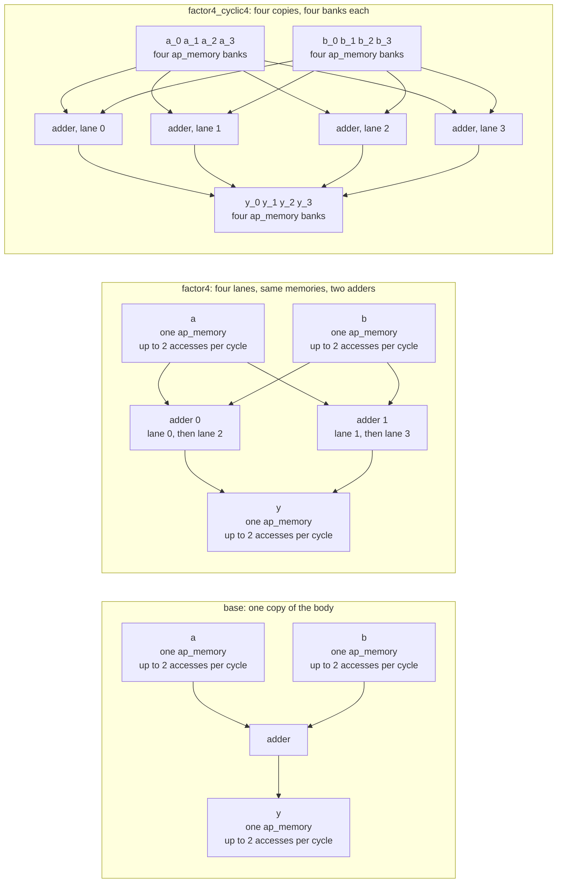

# 3.1 UNROLL

## 1. Introduction

The `UNROLL` directive makes copies of a loop body so that several iterations exist as separate hardware and are executed in the same clock cycles.
A loop that is left alone is **rolled**: the generated design holds one copy of the body, and the controller visits that copy once per iteration.
Unrolling by a **factor** $F$ replaces the body with $F$ copies side by side and divides the **trip count**, the number of times the loop body executes, by the same $F$.
Unrolling completely, which is what the directive does when no factor is given, removes the loop altogether and leaves straight-line hardware for all $N$ iterations.

The directive changes only how the iterations are laid out in space and time, never what the function computes.
The unrolled copies still read the same elements and still write the same results, so C simulation gives the same answer for every solution in this lesson.

**What improves:** the cycle count, when the copies can actually run at the same time.
Two things have to hold for that.
The copies must be independent, which they are here because element $i$ of the output depends on element $i$ of each input and on nothing else.
And the operands of all $F$ copies must be obtainable in the same cycle, which is the part this lesson is about.

**What it costs:** area, in proportion to the number of copies that actually run in the same cycle rather than to the factor.
Copies scheduled in the same cycle each need their own arithmetic, and every copy needs its own address arithmetic and its own share of the memory control.
Copies that the schedule pushes into different cycles are a different matter: an operator can be shared between cycles, so a factor of 4 on a single memory builds two adders rather than four, and the factor is paid for in port multiplexing instead.
The loop counter and the finite state machine become smaller, because there are fewer iterations to count, but that saving is small next to the rest.

**The trap this lesson is built around:** `UNROLL` multiplies the compute, and it does nothing whatsoever to the memory bandwidth.
An array that lives in one memory can be reached through a limited number of **ports**, where a port is one address and data connection through which one access can be made per clock cycle.
The `ap_memory` interface that Vitis gives an array argument in the Vivado IP flow offers at most two ports, so at most two elements of that array can be read in any one cycle.
Four adders that all want an element of `a` in the same cycle therefore cannot be fed, and the schedule spreads their reads over two cycles instead.
The four adders are built, paid for and then left idle half the time.
This is usually called **memory port starvation**, and it is the reason that unrolling a loop over arrays is almost never useful on its own.
The remedy is to give the array more ports by splitting it into **banks**, which is `ARRAY_PARTITION` from lesson 2.1, and the last solution of this lesson does exactly that so that the difference is measurable rather than asserted.

**When to use it:** use it when the loop body reads from registers or from an array that is already split into enough banks, when the trip count is small and the loop control itself is a noticeable part of the cost, or when a pipelined loop cannot reach an initiation interval of 1 and processing several elements per iteration is the only way left to raise the throughput.
Leave it alone when the operands come from a single memory, because then the factor buys cycles far more slowly than it spends area.
A small factor that matches the number of available accesses per cycle, 2 in this kernel, is often the whole of the available benefit.

The directive always changes the hardware, unless the factor is 1, which is the documented way of switching unrolling off again inside a region where it would otherwise be applied.

This lesson keeps `config_compile -pipeline_loops 0` from `common/part.tcl` in force, so no loop is pipelined in any solution and the effect measured here is the effect of `UNROLL` alone.
Pipelining and unrolling are different answers to the same question, and lesson 1.1 covered the other one.

Reference: UG1399, [pragma HLS unroll](https://docs.amd.com/r/2023.2-English/ug1399-vitis-hls/pragma-HLS-unroll) and [set_directive_unroll](https://docs.amd.com/r/2023.2-English/ug1399-vitis-hls/set_directive_unroll).

## 2. How it works

The diagram shows the same loop body as one copy, as four lanes on the memories the kernel starts with, and as four lanes on memories that have been split into four banks each.
Each box that says *adder* is one adder in the generated Verilog, so the box count per subgraph is the arithmetic the solution actually builds.



Note what `factor4` does not have: a third and fourth adder.
Two ports carry two lanes per cycle, so its four lanes take two turns, and because lanes 2 and 3 occupy a cycle of their own the scheduler reuses the two adders that lanes 0 and 1 used.
Four lanes, two adders, and the factor paid for in port multiplexing instead.
In `factor4_cyclic4` all four lanes are served in the same cycle, so no adder can be reused and each lane gets one of its own.

The before and after schedules make the same point in cycles.
Rows are operations and columns are the states of one pass through the loop body.
The letter `R` marks the state in which a read is issued, which is the state that drives the address and the chip enable of the port.
The letter `D` marks the state in which the data of that read is available.
The letter `A` marks an addition and the letter `W` marks a write of a result.

**Before, the rolled loop, one pass per element:**

| Operation             | 0 | 1 |
| --------------------- | - | - |
| read `a[i]` and `b[i]` | R | D |
| add                   |   | A |
| write `y[i]`          |   | W |

**After, unrolled by 4, one pass per four elements:**

| Operation                                    | 0 | 1 | 2 |
| -------------------------------------------- | - | - | - |
| read `a[i]`, `a[i+1]`, `b[i]`, `b[i+1]`      | R | D |   |
| add lanes 0 and 1                            |   | A |   |
| write `y[i]`, `y[i+1]`                       |   | W |   |
| read `a[i+2]`, `a[i+3]`, `b[i+2]`, `b[i+3]`  |   | R | D |
| add lanes 2 and 3                            |   |   | A |
| write `y[i+2]`, `y[i+3]`                     |   |   | W |

Lanes 2 and 3 add in a state that lanes 0 and 1 have finished with, which is why two adders serve all four.

The walkthrough is the comparison of those two tables.
Before the directive, the body is two states long and it is visited sixteen times, which is thirty two cycles of loop.
After unrolling by 4, the body is visited four times, so the loop control runs a quarter as often, and that is the part of the saving that is free.
Inside the body, however, the four lanes cannot all start at once.
Vitis gives the argument `a` a second port as soon as two of its elements are needed in one cycle, and two is where that generosity ends, so lanes 0 and 1 are served in state 0 and lanes 2 and 3 have to wait until state 1.
The body is therefore three states rather than the two that four independent adders would suggest, and the loop costs twelve cycles rather than the eight that a perfect four-way parallel machine would need.
Doubling the factor from 2 to 4 buys four cycles, and what it pays for them is not two more adders but the multiplexing that lets four lanes take turns on two ports.
When the three arrays are split into four banks each, every lane has a port of its own, all four reads are issued in state 0, all four results are written in state 1, and the body is back to two states with a quarter of the visits.

## 3. The kernel

```cpp
#include "vadd.h"

// Element-wise vector addition. VADD_LOOP is the only loop and the target of
// the UNROLL directive. The iterations are independent, so nothing but the
// number of memory accesses per cycle limits how many of them can run at the
// same time. The solutions change nothing else.
void vadd(const data_t a[N], const data_t b[N], data_t y[N]) {
VADD_LOOP:
    for (int i = 0; i < N; i++) {
        y[i] = a[i] + b[i];
    }
}
```

The kernel is exactly the one of lesson 1.1, reused so that the base numbers of the two lessons can be compared directly.
The header sets `N = 16` and `data_t` to a 32 bit `int`, so `VADD_LOOP` has a trip count of 16 and every element is one word.
The loop is labelled, which every lesson in this repository requires, because the label is how the directive names the loop and how the report identifies its row.

Sixteen is divisible by 2 and by 4, which matters for this directive: when the factor does not divide the trip count, Vitis has to keep an exit test inside the unrolled body so that the leftover iterations of the last pass do not run, and section 9 shows what that costs.

The **iteration latency** is the number of cycles that one pass through the loop body takes, and after unrolling, one pass covers $F$ elements rather than one.
Comparing iteration latencies between solutions is therefore misleading on its own, and the quantity to compare is the function latency, which counts the whole loop.

The arguments `a`, `b` and `y` use the default **ap_memory** interface of the Vivado IP flow, which is a plain memory connection with an address, a chip enable, a write enable and data signals, and which connects to a memory outside the generated block.
Vitis builds one port for such an argument and adds a second one, with the signals named `address1`, `ce1`, `q1`, `we1` and `d1`, as soon as two accesses to that array are scheduled in the same cycle.
Two is the maximum, because the interface models a dual-port RAM, and that limit is the subject of this lesson.

The operator delays that the scheduler uses on this part decide how many states a body needs:

| Operation                                      | Delay    |
| ---------------------------------------------- | -------- |
| read or write of an ap_memory port of 16 words | 0.677 ns |
| two-input adder, 32 bit                        | 1.016 ns |

Both were measured in lessons 1.1 and 2.1, and both are independent of the unroll factor, because unrolling duplicates operators rather than widening them.
The clock is 3.33 ns and the clock uncertainty is 0.90 ns, so the scheduler will not put more than about 2.431 ns of logic into one state.
A chain of a port read, an addition and a port write is $0.677 + 1.016 + 0.677 = 2.370$ ns, which fits in one state, and that is why the body of this kernel is two states rather than three.
Lanes that run side by side do not add their delays, because they are separate paths through separate hardware, so the state delay is expected to stay at 2.370 ns in every solution.

## 4. The solutions

| Solution          | Directive in `directives_<solution>.tcl`                                                                                                                                      | The one difference                                        |
| ----------------- | ----------------------------------------------------------------------------------------------------------------------------------------------------------------------------- | --------------------------------------------------------- |
| `base`            | none                                                                                                                                                                          | the loop stays rolled, with one adder                     |
| `factor2`         | `set_directive_unroll -factor 2 "vadd/VADD_LOOP"`                                                                                                                             | two copies of the body, two adders                        |
| `factor4`         | `set_directive_unroll -factor 4 "vadd/VADD_LOOP"`                                                                                                                             | four copies of the body, four adders                      |
| `factor4_cyclic4` | `set_directive_unroll -factor 4 "vadd/VADD_LOOP"` and `set_directive_array_partition -type cyclic -factor 4 -dim 1 "vadd" a`, the same for `b` and for `y`                    | the same four copies, with four banks per array to feed them |

`base`, `factor2` and `factor4` differ in the taught directive alone, which is the rule this repository follows everywhere.

`factor4_cyclic4` breaks that rule on purpose, and it is worth being explicit about why.
The claim of this lesson is that the factor 4 solution is limited by memory ports rather than by arithmetic.
That claim cannot be demonstrated by any solution that keeps the arrays as they are, because every such solution has the same limit, so one solution has to remove it.
`factor4_cyclic4` is therefore `factor4` with the port bound lifted, and the pair `factor4` against `factor4_cyclic4` is the measurement that supports the claim.
It is the one place in the lesson where two directives are in force at once, and the second one is the subject of lesson 2.1 rather than of this one.

The plan for this section listed a complete partition for that solution, and `cyclic` with factor 4 is used instead, for two reasons.
A partial unroll leaves the index arithmetic in place, so the four lanes read `a[i]`, `a[i+1]`, `a[i+2]` and `a[i+3]` where `i` is a run-time value; with a complete partition every element is a separate register, and selecting one of sixteen registers with a run-time index builds a sixteen-to-one multiplexer per lane, which is the `sparsemux` cost that lesson 2.1 measured on `block4`.
A complete partition of the output `y` would also turn it into sixteen separate 32 bit ports, which the surrounding system has to hold in 512 flip-flops.
A cyclic partition with the same factor as the unroll is the pairing that the two directives are designed for: lane $k$ of iteration $i$ touches element $i + k$, and with $i$ a multiple of 4 that element always lives in bank $k$, so each lane is wired to one bank and no multiplexer is needed at all.

Every solution partitions or unrolls nothing else, and `common/part.tcl` keeps automatic pipelining switched off in all four.

## 5. Predict

Write these numbers down before running anything.

Lessons 1.2 and 1.4 established the cycle model for a sequential unpipelined loop on this install: the loop row of the report reads $T \, L_{\textrm{it}}$ cycles, where $T$ is the trip count and $L_{\textrm{it}}$ the iteration latency, the function latency is one cycle more, and the interval, the number of cycles between the starts of two calls, is one more again.
Unrolling changes $T$ and $L_{\textrm{it}}$ together, so with a factor $F$,

$$T = \frac{N}{F}, \qquad L = \frac{N}{F} \, L_{\textrm{it}}(F) + 1, \qquad I = L + 1 .$$

The whole prediction is therefore a prediction of $L_{\textrm{it}}(F)$, and that is where the ports enter.
Each lane needs one read of `a`, one read of `b` and one write of `y`.
Reads of `a` and reads of `b` do not compete, because they are different arrays with their own ports, but the $F$ reads of `a` compete with each other, and two of them fit in a cycle.
Issuing all $F$ reads therefore takes $\lceil F/2 \rceil$ states, the data of a read arrives in the state after the one that issued it, and the writes of `y` fit alongside the arriving data because they too are limited to two per cycle and there are exactly as many writes as reads.
That gives

$$L_{\textrm{it}}(F) = \left\lceil \frac{F}{2} \right\rceil + 1 \qquad \textrm{with one memory per array},$$

against the value that $F$ independent lanes would give if bandwidth were free,

$$L_{\textrm{it}}^{\textrm{ideal}}(F) = 2 .$$

Putting those into the latency formula:

| Factor $F$ | Lanes | $T$ | $L_{\textrm{it}}$, port bound | $L$, port bound | $L$, if bandwidth were free |
| ---------- | ------ | --- | ----------------------------- | --------------- | --------------------------- |
| 1          | 1      | 16  | 2                             | 33              | 33                          |
| 2          | 2      | 8   | 2                             | 17              | 17                          |
| 4          | 4      | 4   | 3                             | 13              | 9                           |
| 8          | 8      | 2   | 5                             | 11              | 5                           |
| 16         | 16     | 1   | 9                             | 10 (8)          | 3                           |

The last row is parenthesised because $F = N$ removes the loop altogether, so the $+1$ for the loop-exit state does not apply; section 9 measures 8.

The shape of that table is the lesson.
The first doubling is free of charge in the sense that it delivers exactly what it promises, because two accesses per cycle is what the interface offers anyway.
Every doubling after it delivers less and less, and the last one, which writes out all sixteen lanes, is worth one cycle.
The right-hand column, which no solution in this lesson reaches without partitioning, is what people expect unrolling to do.

**`base`** is lesson 1.1 again: $L_{\textrm{it}} = 2$, loop latency 32, function latency 33, interval 34.

**`factor2`** should keep $L_{\textrm{it}} = 2$ with a trip count of 8, so 16, 17 and 18.
This depends on Vitis giving `a`, `b` and `y` their second ports, and the confirmation is in the port list of the generated Verilog rather than in any report table.
If the tool refused the second port, the reads would need two states and the body three, giving a function latency of 25, which would be a poor result for twice the arithmetic.

**`factor4`** is the interesting one, and section 2 sketched the schedule that the model predicts.

| Operation                                    | 0 | 1 | 2 |
| -------------------------------------------- | - | - | - |
| exit test and `i` increment                  | A |   |   |
| read `a[i]`, `a[i+1]`, `b[i]`, `b[i+1]`      | R | D |   |
| add lanes 0 and 1                            |   | A |   |
| write `y[i]`, `y[i+1]`                       |   | W |   |
| read `a[i+2]`, `a[i+3]`, `b[i+2]`, `b[i+3]`  |   | R | D |
| add lanes 2 and 3                            |   |   | A |
| write `y[i+2]`, `y[i+3]`                     |   |   | W |

- *Outcome (a), the overlapped schedule.* State 1 both finishes the first pair and issues the second pair of reads. The chain that decides the state delay is the arriving data, the adder and the write, $2.370$ ns, and the addresses of the second pair travel on a separate path of about 0.677 ns, so they do not lengthen it. Then $L_{\textrm{it}} = 3$, the function latency is 13 and the interval is 14.
- *Outcome (b), the separated schedule.* If the scheduler keeps the second pair of reads out of the state that is already writing results, the body needs a fourth state, $L_{\textrm{it}} = 4$, and the function latency is 17. That is exactly the latency of `factor2`, which would mean that the third and fourth adders bought nothing at all.

Both outcomes make the same point, and outcome (b) makes it more sharply, so the prediction to write down is the number 13 with the number 17 next to it.

Either way, lanes 2 and 3 land in a state that lanes 0 and 1 have finished with, and an unpipelined datapath may reuse an operator from one state in the next, so the adder count to predict is **two** and not four.

**`factor4_cyclic4`** should reach the ideal column.
Lane $k$ reads bank $k$ of `a` and of `b` and writes bank $k$ of `y`, each bank is an interface of its own, and no bank is touched twice in a cycle, so all four reads are issued together and all four results are written together.

| Operation                                             | 0 | 1 |
| ----------------------------------------------------- | - | - |
| exit test and `i` increment                           | A |   |
| read bank 0 to bank 3 of `a` and of `b`               | R | D |
| add lanes 0 to 3                                      |   | A |
| write bank 0 to bank 3 of `y`                         |   | W |

That gives $L_{\textrm{it}} = 2$ with a trip count of 4, so a loop latency of 8, a function latency of 9 and an interval of 10.
Against `base` that is a speed-up of $33/9 = 3.7$, which is close to the factor of 4 and is the number that `factor4` alone was supposed to deliver.

**Resources.**
Predict changes rather than absolute numbers, because the absolute numbers depend on parts of the design that this directive does not touch.
Each adder instance should cost about 39 LUT, which is the figure lesson 1.4 measured for this 32 bit addition, where a **LUT**, or look-up table, is the small programmable logic cell that the fabric is built from.
Count instances rather than lanes, because an operator can be shared between states: a solution whose $F$ lanes are spread over $\lceil F/2 \rceil$ states needs only two adders however large $F$ is, while `factor4_cyclic4`, whose four lanes all sit in one state, needs four.
So the Expression table should grow by about 39 LUT from `base` to `factor2`, by about the same again and no more to `factor4`, and by about 117 LUT to `factor4_cyclic4`.
The Multiplexer table is where `factor4` pays instead: two lanes share each of the six ports, so each port address needs a select that neither `base` nor `factor4_cyclic4` needs.
The **flip-flop (FF)** count, where a flip-flop is a one bit register, should barely move, because nothing in this kernel has to be held across a state boundary; the only changes expected are the loop counter becoming narrower as the trip count falls and the finite state machine, the controller that steps through the states, losing or gaining a one-hot bit with the number of body states.
No `BRAM_18K` should appear in any solution, because the kernel has no local array, and no DSP, because addition of 32 bit integers is done in fabric.

The estimated clock should stay at 2.370 ns in all four solutions, because the longest path is the same port read, adder and port write in each of them.

The testbench makes 16 calls, so the co-simulation total should be one cycle short of 16 intervals, as it was in lessons 1.4, 2.1 and 2.3.

| Quantity                       | `base` | `factor2` | `factor4` (a) | `factor4` (b) | `factor4_cyclic4` |
| ------------------------------ | ------ | --------- | ------------- | ------------- | ----------------- |
| Trip count of `VADD_LOOP`      | 16     | 8         | 4             | 4             | 4                 |
| Iteration latency              | 2      | 2         | 3             | 4             | 2                 |
| Loop latency                   | 32     | 16        | 12            | 16            | 8                 |
| Function latency               | 33     | 17        | 13            | 17            | 9                 |
| Interval                       | 34     | 18        | 14            | 18            | 10                |
| Co-simulation total, 16 calls  | 543    | 287       | 223           | 287           | 159               |
| Lanes                          | 1      | 2         | 4             | 4             | 4                 |
| Adder instances                | 1      | 2         | 2             | 2             | 4                 |
| Ports on `a`                   | 1      | 2         | 2             | 2             | 4 banks, 1 each   |
| Estimated clock                | 2.370  | 2.370     | 2.370         | 2.370         | 2.370             |

## 6. Run

`UNROLL` with a factor that divides the trip count cannot change what the function computes, so C simulation runs once, in `base`, to show that the testbench passes.
Co-simulation runs in every solution nonetheless, for a reason specific to this directive.
The unrolled solutions ask the generated design to drive a second port on interfaces that `base` never uses, and `factor4_cyclic4` changes the port list of the block completely.
**C and RTL co-simulation (cosim)**, which drives the same testbench through the generated register-transfer level design, is what checks that those ports are driven correctly and that no lane reads a value before the memory has produced it, and it also reports the latency the RTL really takes.

```bash
cd s3_parallelism/31_unroll
vitis_hls -f run_hls.tcl 2>&1 | tee run.log
```

The same run through the repository Makefile is `make run LESSON=s3_parallelism/31_unroll`.

Then collect the summary numbers:

```bash
bash ../../common/collect_latency.sh   vadd_proj
bash ../../common/collect_resources.sh vadd_proj
```

You can also run `make check LESSON=s3_parallelism/31_unroll`, which runs both scripts.

Logic synthesis is optional in this lesson, because the headline result is a cycle count and cycle counts are decided in C synthesis.
It is still worth one run, because lesson 2.2 showed that the LUT estimate can be wrong by a large factor and this lesson makes a claim about LUTs, namely that most of what `factor4` spends is port multiplexing rather than arithmetic.

```bash
vitis_hls -f export_syn.tcl 2>&1 | tee export_syn.log
```

Every resource number in section 7 is a C synthesis estimate; this run was not made.

## 7. Read the results

The numbers below are from a run of `run_hls.tcl` on Vitis HLS 2023.2 with the part and clock of `common/part.tcl`.
Compare each row with the prediction that section 5 fixed before the run.

### The log

The solution banners from `run_hls.tcl` show which solution each message belongs to:

```bash
grep -nE "== solution|214-188|214-248|TEST (PASSED|FAILED)|co-simulation finished" run.log
```

Do not grep for the word `unroll`: every solution prints a dozen `Unroll/Inline (step n)` design-size lines that have nothing to do with the directive.

`base` produces no unrolling message at all.
Each unrolled solution reports the transformation with an `HLS 214-188` message that names the loop, the function and the factor, in the same family as the `XFORM 203-521` merging message of lesson 1.4 and the `HLS 214-248` partitioning message of lesson 2.1.
This message is the only place where the factor is stated in words:

```
INFO: [HLS 214-188] Unrolling loop 'VADD_LOOP' (src/vadd.cpp:9:5) in function 'vadd' partially with a factor of 2 (src/vadd.cpp:7:0)
INFO: [HLS 214-188] Unrolling loop 'VADD_LOOP' (src/vadd.cpp:9:5) in function 'vadd' partially with a factor of 4 (src/vadd.cpp:7:0)
INFO: [HLS 214-188] Unrolling loop 'VADD_LOOP' (src/vadd.cpp:9:5) in function 'vadd' partially with a factor of 4 (src/vadd.cpp:7:0)
```

The word `partially` is worth noting: a complete unroll is a different code, `HLS 214-186`, and it carries no factor because there is none. Section 9 uses it.

`factor4_cyclic4` additionally prints one `Applying array_partition` line per array, three in total:

```
INFO: [HLS 214-248] Applying array_partition to 'a': Cyclic partitioning with factor 4 on dimension 1.
INFO: [HLS 214-248] Applying array_partition to 'b': Cyclic partitioning with factor 4 on dimension 1.
INFO: [HLS 214-248] Applying array_partition to 'y': Cyclic partitioning with factor 4 on dimension 1.
```

Every solution ends with `*** C/RTL co-simulation finished: PASS ***`.
`base` prints `TEST PASSED` three times, once for its own `csim_design` and twice inside `cosim_design`, which runs the testbench once in C and once against the RTL; the other three print it twice.

### The loop table

```bash
for s in base factor2 factor4 factor4_cyclic4; do
    echo "== $s"; grep -A 6 "\* Loop:" vadd_proj/$s/syn/report/vadd_csynth.rpt
done
```

The **Trip Count** column is the most direct evidence in any report that the directive took effect, because it is the only number that unrolling changes by construction.

| Solution          | Trip count | Iteration latency | Loop latency | Function latency | Interval |
| ----------------- | ---------- | ----------------- | ------------ | ---------------- | -------- |
| `base`            | 16         | 2                 | 32           | 33               | 34       |
| `factor2`         | 8          | 2                 | 16           | 17               | 18       |
| `factor4`         | 4          | 3                 | 12           | 13               | 14       |
| `factor4_cyclic4` | 4          | 2                 | 8            | 9                | 10       |

Every row is the port-bound prediction of section 5, exactly, and `factor4` landed on outcome (a).

Three comparisons matter, and they should be read in this order.
`base` against `factor2` is the honest saving: 33 to 17 cycles, a factor of 1.94, so the second port was granted and the first doubling delivered what it promised.
`factor2` against `factor4` is the port bound: 17 to 13 cycles, a factor of 1.31 for twice the lanes, and the second doubling delivered a third of what it promised.
`factor4` against `factor4_cyclic4` is the size of the bound: 13 to 9 cycles with identical arithmetic in the C code, so four of `factor4`'s thirteen cycles, nearly a third, were the memories and not the loop.

### The schedule

The per-state delays and the state each operation lands in are in the verbose schedule report:

```bash
for s in base factor2 factor4 factor4_cyclic4; do
    echo "== $s"; grep -nE "load|store|add_ln" vadd_proj/$s/.autopilot/db/vadd.verbose.sched.rpt | head -20
done
```

Two things to check against the schedule tables of section 5.

The first is how many states issue reads of `a`: one in `base`, `factor2` and `factor4_cyclic4`, two in `factor4`.
The body of `factor4` is states `ST_2` to `ST_4`. `ST_2` issues `a_load`, `b_load`, `a_load_1` and `b_load_1`; `ST_3` takes their data, runs `add_ln10` and `add_ln10_1`, writes two results, **and** issues `a_load_2`, `b_load_2`, `a_load_3` and `b_load_3`; `ST_4` takes their data, runs `add_ln10_2` and `add_ln10_3` and writes the other two.
So the state that writes the first pair also issues the second pair: outcome (a), and $L_{\textrm{it}} = 3$.
`factor4_cyclic4` issues all eight loads, four of `a` and four of `b`, in `ST_2` and does all four adds and all four stores in `ST_3`.

The second is the per-state critical path, which the report prints as `<State n>` under *Verbose Summary: Timing violations*.
Every state that touches an array reads 2.370 ns, in all four solutions, which is `0.677 + 1.016 + 0.677` as section 3 predicted; the lanes run side by side and do not add their delays.
The states that only step the counter are cheaper: 0.427 ns for the initialisation and 1.216 ns for the `add` and `store` on `i`.

### The Verilog

The second port is visible in the port list of the top module and nowhere in the reports, so this is the one line of generated Verilog worth reading:

```bash
for s in base factor2 factor4 factor4_cyclic4; do
    echo -n "$s: "; grep -cE "a_(address|ce|q)1" vadd_proj/$s/syn/verilog/vadd.v
done
```

The counts are `base: 0`, `factor2: 11`, `factor4: 14`, `factor4_cyclic4: 0`: the second port appears exactly where two accesses to `a` are scheduled in one cycle, and the banked solution does not need it because each bank is reached once per cycle through its own port 0.
For the banked solution, read the module header instead, which lists the twelve banks as separate interfaces:

```bash
sed -n '/^module vadd/,/^);/p' vadd_proj/factor4_cyclic4/syn/verilog/vadd.v
```

The adders are the other thing to see directly, because each adder drives a write data port of its own:

```bash
grep -nE "assign y(_[0-9])?_d[0-9] = " vadd_proj/*/syn/verilog/vadd.v
```

```verilog
// base
assign y_d0 = (b_q0 + a_q0);

// factor2
assign y_d0 = (b_q0 + a_q0);
assign y_d1 = (b_q1 + a_q1);

// factor4  -- two adders, not four
assign y_d0 = (b_q0 + a_q0);
assign y_d1 = (b_q1 + a_q1);

// factor4_cyclic4
assign y_0_d0 = (b_0_q0 + a_0_q0);
assign y_1_d0 = (b_1_q0 + a_1_q0);
assign y_2_d0 = (b_2_q0 + a_2_q0);
assign y_3_d0 = (b_3_q0 + a_3_q0);
```

This is the sharpest result of the lesson, and it is stronger than the prediction.
`factor4` has four lanes in the C code and the schedule report shows four separate `add` operations, `add_ln10` through `add_ln10_3`, but the Verilog has only **two** adders.
Lanes 0 and 1 are in `ST_3` and lanes 2 and 3 are in `ST_4`, so binding gives lanes 0 and 2 the same adder and lanes 1 and 3 the other one.
The port bound did not just leave the extra arithmetic idle; it stopped the tool from building it.
Whatever `factor4` paid for its four extra cycles, it was not adders, and the resource table below says what it was.

The number of lanes, the number of adders and the number of ports are three different counts, and reading them side by side is the point of this lesson: `factor4` has four lanes, two adders and two ports per array, while `factor4_cyclic4` has four lanes, four adders and four banks.

### The resource estimate

```bash
for s in base factor2 factor4 factor4_cyclic4; do
    echo "== $s"; grep -A 14 "== Utilization Estimates" vadd_proj/$s/syn/report/vadd_csynth.rpt
done
```

| Line            | `base` | `factor2` | `factor4` | `factor4_cyclic4` |
| --------------- | ------ | --------- | --------- | ----------------- |
| `BRAM_18K`      | 0      | 0         | 0         | 0                 |
| `DSP`           | 0      | 0         | 0         | 0                 |
| Expression LUT  | 64     | 94        | 102       | 168               |
| Multiplexer LUT | 29     | 29        | 119       | 29                |
| Register FF     | 13     | 16        | 26        | 10                |
| **Total FF**    | 13     | 16        | 26        | 10                |
| **Total LUT**   | 93     | 123       | 221       | 197               |

Account for the difference line by line, as lesson 1.4 did, rather than quoting the totals.

**Expression.** The 32 bit adder is the `y_d0` entry at 39 LUT, and there is one entry per adder instance, not per lane: `base` has `y_d0`, `factor2` and `factor4` have `y_d0` and `y_d1`, and `factor4_cyclic4` has `y_0_d0` through `y_3_d0`. So the arithmetic is 39, 78, 78 and 156 LUT. The rest of the table is loop control and address arithmetic, and it moves the other way: `base` spends 13 LUT on an `icmp` for `i < 16` and 12 on the increment, while every unrolled solution loses the `icmp` entirely, because the exit test on a counter that steps by a power of two is a single bit of `i` and costs nothing. The `or` entries are the address arithmetic: 4 LUT in `factor2` for `i | 1`, 12 LUT in `factor4` for `i | 1`, `i | 2` and `i | 3`, and **none at all** in `factor4_cyclic4`, where every bank is addressed by the same `i >> 2` and there is no per-lane offset to compute. Lesson 2.1 saw the same substitution.

**Multiplexer.** This is where `factor4` pays for its factor. `base`, `factor2` and `factor4_cyclic4` all sit at 29 LUT, which is the 20 LUT next-state function of a four-state FSM plus 9 LUT on the counter. `factor4` reads 119: 6 × 14 = 84 LUT because each of the six port addresses (`a_address0`, `a_address1`, `b_address0`, `b_address1`, `y_address0`, `y_address1`) is a three-input select between the two lanes that share it, plus 26 rather than 20 for the five-state FSM. So of the 98 LUT that `factor4` adds over `factor2`, 90 are port multiplexing and 8 are the two extra address `or` gates: the four cycles it bought cost not one LUT of adder.

**Register.** The FF count stays in single or low double digits everywhere, as predicted, because nothing has to be held across a state boundary except the FSM state and the counter. `factor4` is the highest at 26, because its three-state body needs the truncated index and three zero-extended addresses live across states; `factor4_cyclic4` is the *lowest* at 10, below `base`'s 13, because the address it carries across the state boundary is a 2 bit bank address rather than a 4 bit array index.

**The total.** `factor4_cyclic4` is both faster and smaller than `factor4`: 9 cycles against 13, and 197 LUT against 221. It carries twice the arithmetic, 156 LUT against 78, and still comes out 24 LUT ahead, because the 90 LUT of port multiplexing that banking removes is more than the 66 LUT that the two extra adders add. That comparison, not the cycle count on its own, is the result of the lesson: the port bound was not only costing cycles, it was costing more area than the parallelism it was preventing.

### The co-simulation report

Open `vadd_proj/<solution>/sim/report/vadd_cosim.rpt`.
Every call does the same work, so the minimum, average and maximum latency are equal, and they should equal the C synthesis function latency.
With 16 calls, the total execution time should be one cycle short of 16 intervals.

| Solution          | Cosim latency | Cosim interval | Cosim total | Expected total |
| ----------------- | ------------- | -------------- | ----------- | -------------- |
| `base`            | 33            | 34             | 543         | 543            |
| `factor2`         | 17            | 18             | 287         | 287            |
| `factor4`         | 13            | 14             | 223         | 223 or 287     |
| `factor4_cyclic4` | 9             | 10             | 159         | 159            |

All four pass, min equals avg equals max in every one, and every total is exactly $16 I - 1$. The RTL takes precisely the cycles C synthesis estimated.

A pass in `factor2` and `factor4` is a check that the two ports were used legally, and a pass in `factor4_cyclic4` is a check that the banked interfaces were driven and read in the right order.

### Predicted and measured

| Quantity                      | Predicted                   | `base` | `factor2` | `factor4` | `factor4_cyclic4` |
| ----------------------------- | --------------------------- | ------ | --------- | --------- | ----------------- |
| Trip count                    | 16 / 8 / 4 / 4              | 16     | 8         | 4         | 4                 |
| Iteration latency             | 2 / 2 / 3 or 4 / 2          | 2      | 2         | 3         | 2                 |
| Function latency              | 33 / 17 / 13 or 17 / 9      | 33     | 17        | 13        | 9                 |
| Interval                      | 34 / 18 / 14 or 18 / 10     | 34     | 18        | 14        | 10                |
| Cosim latency                 | equal to the above          | 33     | 17        | 13        | 9                 |
| Cosim total, 16 calls         | $16 I - 1$                  | 543    | 287       | 223       | 159               |
| Lanes in the C code           | 1 / 2 / 4 / 4               | 1      | 2         | 4         | 4                 |
| Adders in the Verilog         | 1 / 2 / 2 / 4               | 1      | 2         | 2         | 4                 |
| Second port on `a`            | no / yes / yes / not needed | no     | yes       | yes       | not needed        |
| Estimated clock (ns)          | 2.370 in all four           | 2.370  | 2.370     | 2.370     | 2.370             |
| Total LUT                     | 39 per adder instance       | 93     | 123       | 221       | 197               |
| of which port multiplexing    | not predicted               | 0      | 0         | 84        | 0                 |
| Total FF                      | nearly unchanged            | 13     | 16        | 26        | 10                |

Every latency, interval and cosim number matched the port-bound prediction exactly, and `factor4` landed on outcome (a).
The prediction that needed revising is area: `factor4` builds two adders, not four, and its 98 extra LUT over `factor2` are port multiplexers.

The single number to extract from the filled table is the cycle saving per LUT, because LUTs are what the three solutions actually spend differently.
Against `base`'s 33 cycles and 93 LUT:

| Solution          | Cycles saved | LUT added | Cycles per LUT |
| ----------------- | ------------ | --------- | -------------- |
| `factor2`         | 16           | 30        | 0.53           |
| `factor4`         | 20           | 128       | 0.16           |
| `factor4_cyclic4` | 24           | 104       | 0.23           |

That is the whole argument of this lesson in one line: the first doubling is three times better value than the second, and the second only becomes worth buying once the arrays are banked to feed it.

## 8. Hardware implications

What physically appears when the directive is applied is a copy of every operator that has to run at the same time as another, and in this kernel that means the 32 bit ripple-carry adder that Vivado builds from LUTs and their carry chains, at 39 LUT each.
How many copies appear is decided by the schedule and not by the factor.
`factor2` gets two adders because both its lanes write in the same state; `factor4` gets two as well, because its lanes 2 and 3 have a state to themselves and an unpipelined datapath is free to reuse an operator from one state in the next; `factor4_cyclic4` gets four, because all four of its lanes write in one state and nothing can be shared.
So the lane count is only an upper bound on the adder count; the accesses per cycle is the real one.
What disappears is loop control: the 13 LUT comparator of `base` vanishes completely, because an exit test on a counter that steps by a power of two is one bit of that counter, and the finite state machine is entered a quarter as often.
Against that, each lane needs an address offset, 4 LUT per `or`, so the net control saving is 9 LUT in `factor2`, 1 in `factor4` and 13 in `factor4_cyclic4`, which needs no offsets at all.
Small, but it is the reason a factor of 2 sometimes pays for itself even when the memories cannot feed more.

What also appears, and is easy to miss because no report table names it, is port logic.
In `base` the address of `a` comes straight from the loop counter.
In `factor4` two lanes share each port, so each port's address is chosen by a multiplexer between two lanes, each port's chip enable is driven from two states rather than one, and the returning data has to be routed to the lane that asked for it.
That logic is 84 of the 119 Multiplexer LUT, 14 for each of the six port addresses, against 0 in `base`, `factor2` and `factor4_cyclic4`.
It is the physical shape of the port bound, and it is the larger part of everything `factor4` spends: the design pays for the wires that let four lanes take turns on two doors, and gets no extra arithmetic for the money.

In `factor4_cyclic4` the doors are what changed.
Each array becomes four separate `ap_memory` interfaces, so the generated block has twelve memory interfaces instead of three, each with its own address, enable and data signals.
The block itself becomes simpler, because no lane shares anything with any other: the multiplexers of `factor4` are gone, the fifth FSM state is gone, the per-lane address offsets are gone because every bank sees the same `i >> 2`, and the total comes out 24 LUT *below* `factor4` even with twice the adders.
The cost has not disappeared; it has moved across the boundary of the block, and it is now the responsibility of the system that instantiates it.
That system must hold `a` in four memories rather than one, and whatever writes `a` must write it in the interleaved order that the cyclic partition assumes.
This is the honest accounting of the pairing of `UNROLL` with `ARRAY_PARTITION`: it does not conjure bandwidth, it requires the surrounding design to supply it.

The transfer to a standard-cell ASIC flow is unusually clean for this directive, which is worth saying because most directives in this repository transfer only in part.
The duplicated adders are ordinary logic, so they carry over exactly: an ASIC synthesis tool sees the two or four adders the RTL contains and builds that many, and the area cost is the same multiple there as here.
The reduced loop control carries over as well, for the same reason.
The port bound carries over most of all, and it is not an FPGA artefact.
A compiled SRAM macro from a memory compiler is typically single port or dual port, and macros with more ports exist but cost area super-linearly in the number of ports, so the rule that a memory serves one or two accesses per cycle is, if anything, stricter on an ASIC than on an FPGA.
Banking is likewise the standard ASIC answer, and splitting an array into four macros to serve four lanes is exactly what a hand-written RTL design would do.
What does not carry over is the specific number two, because it comes from the `ap_memory` model of a dual-port block RAM, and the specific delays, because 0.677 ns is a model of an FPGA memory path.
The habit that carries over best is the arithmetic of section 5: before unrolling by $F$, count how many accesses per cycle the memories can serve, divide, and expect $\lceil F / \textrm{accesses} \rceil$ rather than 1.

The last implication is about what the directive cannot fix.
Unrolling widens a loop; it does not shorten the path through one iteration.
The estimated clock is the same 2.370 ns in all four solutions, because each lane still reads a memory, adds and writes, and putting four such chains side by side leaves each of them exactly as long as it was.
A design that misses its clock target does not improve by unrolling, and a design that is bandwidth bound does not either.
`UNROLL` buys throughput per cycle, and it buys it only when something else is already able to deliver the operands.

## 9. One common mistake and one question

**The mistake: unrolling by a factor that does not divide the trip count, and then reaching for `-skip_exit_check`.**
Suppose the factor is 5 rather than 4 on this kernel, as `set_directive_unroll -factor 5 "vadd/VADD_LOOP"`.
Sixteen is not a multiple of five, so the last pass through the body would cover elements 15, 16, 17, 18 and 19, of which four do not exist.
Vitis handles this correctly and quietly: it keeps a test of the loop bound inside the unrolled body, so that lanes 1 to 4 of the last pass are disabled, and the design still computes the right answer.
The cost is paid in the shape of the hardware rather than in a warning.
Every lane gets its own guard on its memory enable and its own comparator, the addresses stop being cheap because `i + 1` is no longer a bitwise `or` when `i` steps by five, and the schedule of the body becomes irregular because the guarded accesses cannot be packed onto the ports as neatly.
A factor that divides the trip count avoids all of this for free, which is why factors are almost always powers of two on arrays whose length is a power of two.

The tempting response is the `-skip_exit_check` option, which tells Vitis to leave the guard out:

```tcl
set_directive_unroll -factor 5 -skip_exit_check "vadd/VADD_LOOP"
```

That option is safe in exactly one situation, which is a loop whose trip count is known to be a multiple of the factor but whose bound is not a compile-time constant, so that the tool cannot prove the multiple for itself.
Used on this kernel it is simply wrong.
The generated design would read `a[16]` to `a[19]` and write `y[16]` to `y[19]`, which are addresses outside the arrays, so the block would drive addresses that the memories around it do not own.
C simulation would not notice, because the option affects synthesis and not the C code, and C and RTL co-simulation might or might not notice depending on how the testbench memory model responds to an out-of-range address.
The failure would appear in the system, long after the lesson, which is the worst place for it.
The rule is short: match the factor to the trip count, and treat `-skip_exit_check` as a statement about a divisibility that you have proved elsewhere rather than as a way of removing logic you did not want.

**The question:** stay with the arrays as they are, one `ap_memory` per argument, and unroll `VADD_LOOP` completely with `set_directive_unroll "vadd/VADD_LOOP"`.
Predict the function latency and the number of adders, say what limits the result, and say how that result compares with `factor2` in cycles and in area.

<details>
<summary>Answer</summary>

**The latency is 8 cycles and the design contains two adders.**
A complete unroll is the case $F = N = 16$ of the model in section 5.
The loop disappears: the report prints `Loop: N/A`, and the log prints `HLS 214-186` rather than `HLS 214-188` and names no factor.
The reads are what remain expensive: sixteen elements of `a` have to come through two ports, so the schedule issues one pair per state in states 1 to 8, each pair's data arrives in the next state where its two adds and two writes happen, and the last pair's data arrives in state 9.
That is nine states, which the report summarises as a function latency of 8 and an interval of 9, one cycle better than `factor4_cyclic4` and exactly the floor that $N/2$ accesses per cycle allows.

Two adders, not sixteen, for the reason section 7 measured on `factor4`: only one pair of lanes is ever active in a state, and an operator is reusable from one state to the next, so the tool builds one pair of adders and reuses it eight times.
Fourteen of the sixteen lanes exist only in the C code.

**What limits it is bandwidth, and only bandwidth.**
The measured cost is 426 LUT and 9 FF, and 348 of those LUT are the Multiplexer table: each of the six port addresses is now a nine-input select at 49 LUT apiece, and the next-state function of a ten-state FSM costs 54.
The arithmetic is 78 LUT, under a fifth of the total.
So a complete unroll on unpartitioned arrays spends four and a half times the area of `base`, and 82 percent of it on the wiring that lets eight lanes take turns on two ports.
No unroll factor can go below the $N/2$ floor, because the floor is a property of the memories rather than of the loop.

**The comparison that matters is against `factor4_cyclic4`.**
The complete unroll reaches 8 cycles for 426 LUT; `factor4_cyclic4` reaches 9 for 197.
One cycle, 4 percent, costs 229 LUT and more than doubles the design.
`factor2` puts it in sharper relief still: 17 cycles for 123 LUT, so the complete unroll is 2.1 times faster for 3.5 times the area.
That is the practical conclusion of the lesson: when a loop over arrays is slower than you want, the first question is how many accesses per cycle the memories can serve, and the unroll factor should be chosen to match that number rather than chosen first.

Two footnotes.
The sharing happened here because nothing forbade it and the lanes fell in different states; asking for a given number of operator instances, or capping it, is what `ALLOCATION` does, and lesson 4.2 covers it.
And the clock does not change in any of these variants, 2.370 ns throughout, because the longest path through one lane is the same port read, addition and port write.
</details>