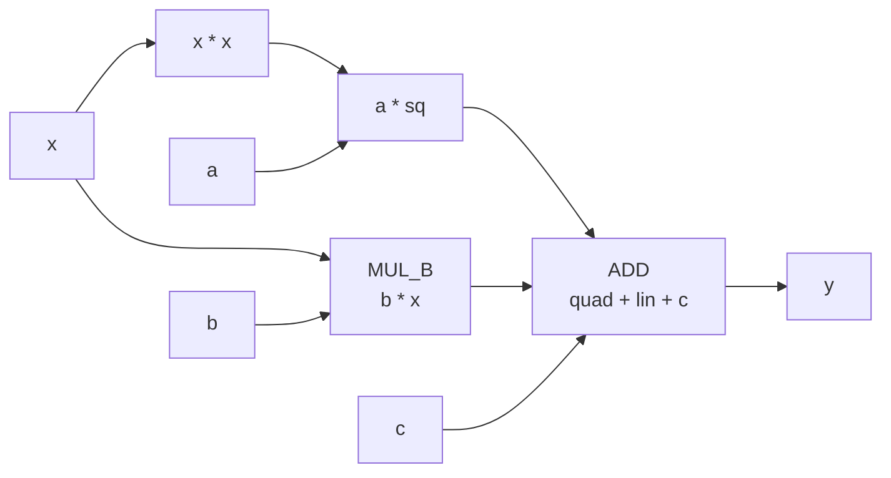
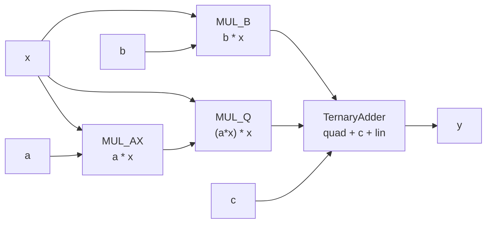

# 3.2 LATENCY

## 1. Introduction

The `LATENCY` directive puts a lower bound, an upper bound, or both, on the number of clock cycles that a scope of the design is allowed to take.
The **latency** of a scope is the number of clock cycles between the moment the scope starts and the moment its last result is produced, and the scope can be a function, a loop, or a labelled region inside a function.
The directive is written `set_directive_latency -min <cycles> -max <cycles> "<scope>"`, and either option may be given on its own.

`LATENCY` is unlike every directive taught so far in this repository, and the difference is worth stating before any code appears.
`PIPELINE`, `UNROLL`, `ARRAY_PARTITION` and `BIND_STORAGE` are transformations: they tell the tool to build something different, and the tool always obeys.
`LATENCY` is a **constraint**: it tells the tool what result would be acceptable and leaves the tool to find a way of reaching it.
A constraint that is already satisfied changes nothing.
A constraint that is not satisfied sends the tool looking for a different design, and the two halves of the directive send it looking in opposite directions.

| Case                             | What the tool does                                                                                                          |
| -------------------------------- | --------------------------------------------------------------------------------------------------------------------------- |
| `-max` above the natural latency | nothing; the constraint is met on arrival                                                                                    |
| `-max` below the natural latency | it compresses the schedule, re-binding operators to faster implementations if it has to, and **it will break the target clock period to get there**, warning rather than failing |
| `-min` below the natural latency | nothing; the constraint is met on arrival                                                                                    |
| `-min` above the natural latency | it keeps the schedule it already had and appends idle states until the minimum is reached                                     |

The second row is the one that surprises people, and it is the reason this lesson measures all four cases instead of asserting them.
It is natural to assume that the clock period is sacred and that an impossible `-max` is simply ignored.
That is not what Vitis HLS does.
Given a latency constraint it cannot meet at the target clock period, it meets the latency and misses the clock, and section 7 shows the resulting design running at 171 MHz on a 300 MHz clock with a timing slack of −3.41 ns.

**What `-min` buys** is not performance but *predictability*: a scope whose latency is pinned to a number produces its `ap_done` at a time the rest of the system can rely on, whatever the scheduler decides to do inside.
That matters when two branches of a `DATAFLOW` design have to stay in step, when a block talks to an external device whose protocol requires a fixed number of cycles between two events, and when a design is brought up against a reference model that counts cycles.
It costs the cycles it adds, plus one flip-flop per added state in the controller and a small amount of next-state logic, and it costs nothing in the datapath.

**What `-max` buys** is a shorter schedule, when a shorter schedule exists at the target clock, and a broken clock when it does not.
Its real cost is attention: a missed clock target is reported as a warning during C synthesis, not as an error, so `vitis_hls` exits with status 0 and a scripted build reports success on a design that no longer closes timing.

**When to use it:** use `-min` when something outside the function needs the function to take a known number of cycles.
Use `-max` as a build-time assertion on a design whose latency you have already measured and want to keep, *together with a check on the log*, so that neither the warning nor the slack can pass unnoticed.
Do not reach for `-max` as a way of making a slow design faster.
The scheduler already produces the shortest schedule it can find at the target clock period; asking for something shorter does not give it a new capability, it only tells it that the clock is now negotiable.
The directive that actually changes how fast a loop retires work is `PIPELINE` from lesson 1.1, and the directive that changes how much work exists per iteration is `UNROLL` from lesson 3.1.

One statement belongs here plainly, because half of the lesson rests on it.
**A `-min` that is at or below the natural latency changes nothing in the hardware.**
The generated Verilog is expected to describe the same design as the baseline, down to the last register and the last gate, and section 7 checks that with a file comparison rather than taking it on trust.
It also shows why the comparison needs one small piece of care before it can be believed.

One further clarification, because the wording of the directive invites it.
On a loop, `LATENCY` constrains the latency of the loop, meaning all of its iterations together, and not the **initiation interval (II)**, which is the number of cycles between the starts of two consecutive iterations of a pipelined loop.
`LATENCY` will not pipeline anything that is not already pipelined, and it will not change the II of anything that is.

Reference: UG1399, [pragma HLS latency](https://docs.amd.com/r/2023.2-English/ug1399-vitis-hls/pragma-HLS-latency) and [set_directive_latency](https://docs.amd.com/r/2023.2-English/ug1399-vitis-hls/set_directive_latency).

## 2. How it works

The kernel of this lesson computes a second-order polynomial, so its operator graph is small enough to draw in full.
Each box is one operation, and the arrows are data dependencies, meaning that an operation cannot begin before the operations feeding it have finished.

As written in C, `a*x*x + b*x + c` has two independent multiplies at the top and a third that waits for one of them:



That is not quite the graph the tool schedules.
LLVM reassociates the quadratic term, so `a * (x * x)` becomes `(a * x) * x`, and the two multiplies that are independent of each other are no longer the two the source suggests:



The reassociation does not change the answer, the number of multiplies, or the depth of the critical path, which is two dependent multiplies either way.
It only changes *which* multiply is the independent one, and it is worth noticing because the schedule report names operations after the reassociated form, not after the source.

Two facts about that graph decide everything in this lesson.
The first is that the chain is `MUL_AX` then `MUL_Q`, with `MUL_B` free to sit beside either of them.
The second is that a 32 bit integer multiply is a multi-cycle operation on this part, because 3.479 ns of combinational multiplier does not fit inside the 2.431 ns that remains of a 3.33 ns clock period after 0.899 ns of clock uncertainty.
Write $S$ for the number of states one multiply occupies.
The two additions, by contrast, are cheap: Vitis fuses them into a single `TernaryAdder` costing 0.731 ns in total, which fits in one state alongside the write of the output port.

The before and after schedules show what the directive does to that.
Rows are operations, columns are states, and a state costs one clock cycle.
`X` marks a state in which a multiplier is busy, `A` the addition, `W` the write of the result to the output port, and a dot a state in which the design does nothing at all.
These tables are the measured schedules of section 7, for which $S = 2$.

**Before, the natural schedule, and also exactly what `min4` produces:**

| Operation             | 1 | 2 | 3 | 4 | 5 |
| --------------------- | - | - | - | - | - |
| `MUL_AX`, `a * x`     | X | X |   |   |   |
| `MUL_Q`, `(a*x) * x`  |   |   | X | X |   |
| `MUL_B`, `b * x`      |   |   | X | X |   |
| `ADD`, `quad + c + lin` |  |   |   |   | A |
| write `y`             |   |   |   |   | W |

Five states, and a reported latency of 4, because latency counts the clock edges between the first state and the last, which is one fewer than the number of states.

**After, with `set_directive_latency -min 16 "poly"`:**

| Operation             | 1 | 2 | 3 | 4 | 5 | 6 to 16 | 17 |
| --------------------- | - | - | - | - | - | ------- | -- |
| `MUL_AX`, `a * x`     | X | X |   |   |   |         |    |
| `MUL_Q`, `(a*x) * x`  |   |   | X | X |   |         |    |
| `MUL_B`, `b * x`      |   |   | X | X |   |         |    |
| `ADD`, `quad + c + lin` |  |   |   |   | A |         |    |
| write `y`             |   |   |   |   | W |         |    |
| idle                  |   |   |   |   |   | . . . . | .  |

The walkthrough is the comparison of those two tables, and the first thing to notice is that the top five rows are the same in both.
The directive did not move a single operation.
It did not persuade the multiplier to finish sooner, it did not merge the additions differently, and it did not change which multiplier instance performs which multiply.
All it did was append twelve states in which the design holds still, and then report `ap_done` in state 17 instead of state 5.
`y_ap_vld` still rises in state 5.

That is the whole mechanism of a minimum latency, and the reason it is so cheap is that an idle state is not a piece of datapath.
The generated design already contains a **finite state machine (FSM)**, the small controller that decides what the datapath does in each cycle, and Vitis builds it as a one-hot register, meaning one flip-flop per state with exactly one of them set at a time.
Adding twelve idle states adds twelve flip-flops and twelve arms to the next-state case statement, and it adds nothing else at all, because no state in the idle span enables an operator, drives an address or loads a register.

**The tighter half of the directive does not run into a wall; it drives straight through it.**
Asking for a maximum latency of 1 asks for a design with two states instead of five, and the only way to reach that is to put the whole chain `MUL_AX` → `MUL_Q` → `ADD` inside two states.
The scheduler gets there in two moves.
It re-binds `MUL_AX` from the pipelined DSP multiplier to a purely combinational LUT multiplier, `mul_32s_32s_32_1_1`, which is carried in the generated Verilog with a `(* use_dsp = "no" *)` attribute, and it then schedules that combinational multiply and the first half of `MUL_Q` into the same state.
The resulting state costs 3.479 + 2.365 = 5.844 ns against a budget of 2.431 ns.
Vitis prints `HLS 200-886` to say that it broke the clock in order to honour the latency, prints `HLS 200-871` to say the estimated period now exceeds the target, writes the RTL, and exits successfully.
The constraint was met. The clock was not.

## 3. The kernel

```cpp
#include "poly.h"

// Second order polynomial on a single sample, a*x*x + b*x + c, written with
// the three multiplies visible so that two of them are independent of each
// other and the third depends on one of them. There is no loop in this kernel
// on purpose: the whole function is a handful of cycles long, so a LATENCY
// constraint on it is visible in one small schedule table, and the padding
// that -min adds is not buried inside a loop body that runs many times.
void poly(data_t x, data_t a, data_t b, data_t c, data_t *y) {
    data_t sq   = x * x;        // MUL_SQ, independent
    data_t lin  = b * x;        // MUL_B,  independent, can run beside MUL_SQ
    data_t quad = a * sq;       // MUL_A,  waits for MUL_SQ
    *y = quad + lin + c;        // ADD_QL and ADD_C
}
```

```cpp
#ifndef POLY_H
#define POLY_H

typedef int data_t;

void poly(data_t x, data_t a, data_t b, data_t c, data_t *y);

#endif // POLY_H
```

The comments name `MUL_SQ` and `MUL_A`, which is how the expression reads, and section 2 has already said that the tool reassociates it into `(a*x)*x` and therefore never builds an `x*x` at all.
The names in the schedule report are `mul_ln17` for `a*x`, `quad` for `(a*x)*x` and `lin` for `b*x`.
This is a small, common and easily missed fact: the operations in the report are the operations of the optimised intermediate representation, not the operations of the source, and the line numbers in their names point at the source line the value came from rather than at the multiply the programmer wrote.

The repository convention is that every loop carries a label, and this kernel satisfies it vacuously, because it contains no loop.
That is the one deliberate departure from the section plan, which listed `poly` as an array kernel.
A loop would multiply the cost of the padding by the trip count and would push the natural latency far above any minimum small enough to write in a table, and the point of this lesson is the relationship between one natural latency and one requested latency, so the loop is left out and returns in lessons 4.1 and 4.2, which use the same polynomial.

The scalar arguments `x`, `a`, `b` and `c` become plain input ports with the `ap_none` protocol, which means a bare bus of wires with no handshake, so a value must simply be stable while the block reads it.
The pointer argument `y` becomes an output port with the `ap_vld` protocol, which is a bus plus one valid signal asserted in the cycle in which the block writes the value.
The block itself keeps the default `ap_ctrl_hs` protocol, the handshake of `ap_start`, `ap_ready`, `ap_idle` and `ap_done` that every lesson in this repository has used so far, and it is `ap_done` that a minimum latency delays.
Keeping `y_ap_vld` and `ap_done` distinct matters in section 7, because the padded solution separates them by twelve cycles.

## 4. The solutions

| Solution | Directive in `directives_<solution>.tcl`     | The one difference                                                       |
| -------- | ---------------------------------------------- | -------------------------------------------------------------------------- |
| `base`   | none                                           | the natural schedule, whatever the scheduler chooses                       |
| `max1`   | `set_directive_latency -min 1 -max 1 "poly"`   | a latency of exactly 1 cycle, which the clock period cannot support        |
| `min4`   | `set_directive_latency -min 4 "poly"`          | a minimum of 4 cycles, which is not above the natural latency              |
| `min16`  | `set_directive_latency -min 16 "poly"`         | a minimum of 16 cycles, which is above the natural latency                 |

All four solutions differ in the taught directive alone, and nothing else in the project changes between them.
The scope in every case is the function `poly`, written without a loop name because the constraint applies to the whole function body.

The section plan listed three solutions, with a single `-min 4`, and this lesson splits that into two.
The reason is that `-min` has two completely different outcomes depending on which side of the natural latency the number falls, and one number cannot show both.
`min4` is the case in which the request is already satisfied and the tool does nothing, which is a result worth measuring rather than asserting, and `min16` is the case in which the tool has to act.
Between them they cover the lower half of the table in section 1, and `max1` covers the upper half.
The fourth case of that table, a maximum above the natural latency, is left out because it is `min4` with the sign reversed and would add a solution without adding a measurement.

`common/part.tcl` keeps `config_compile -pipeline_loops 0` in force as everywhere else, though it has nothing to act on here, and no other `config_*` or `set_directive_*` command is used.

## 5. Predict

Write these numbers down before running anything.

The natural latency of this kernel is the length of its critical path, and the critical path is one multiply feeding a second multiply feeding the additions.
Writing $S$ for the number of states one 32 bit integer multiply occupies, and giving the additions and the port write one state together, the design needs

$$N_{\textrm{states}} = 2S + 1 \qquad\textrm{and}\qquad L_{\textrm{base}} = N_{\textrm{states}} - 1 = 2S .$$

Latency is one less than the state count because it counts the clock edges between the first state and the last, and the interval of a non-pipelined `ap_ctrl_hs` block is one more than its latency, because the block cannot accept a new `ap_start` in the cycle in which it reports `ap_done`.
So the interval equals the state count.

$S$ is not known in advance, because it depends on how Vitis decomposes a 32 by 32 bit multiply onto the DSP48E2 slices of this part and on how many register stages it needs to fit the result inside a 3.33 ns clock.
The prediction is therefore a small table rather than a single number, and the run picks the row.

| $S$ | States $= 2S+1$ | Latency $L = 2S$ | Interval $I = L + 1$ | Where does `min4` sit? |
| --- | --------------- | ---------------- | -------------------- | ---------------------- |
| 1   | 3               | 2                | 3                    | **above** — it would pad |
| 2   | 5               | 4                | 5                    | exactly on it — no padding |
| 3   | 7               | 6                | 7                    | below — no padding     |

The row to write down as the prediction is $S = 2$, so **a function latency of 4 cycles and an interval of 5**.
Note what the last column costs us: the original choice of 4 for the "do nothing" solution is only safe for $S \geq 2$, and if the multiply turned out to be single-state then `min4` would quietly become a second padding case.
Sixteen sits above the natural latency for every plausible $S$, which is what makes `min16` a safe test of the padding case regardless.

**`base`** should report a latency of 4, an interval of 5, and no loop, so the `Loop` section of the report should read `N/A`.

**`min4`** should report the same latency of 4 and the same interval of 5, print no warning, because a satisfied constraint is not worth a message, and produce Verilog identical to `base`.
"Identical" needs one caveat that section 7 will cash in: the directive inserts a pseudo-operation into the intermediate representation, which shifts the numeric suffixes Vitis appends to auto-generated net and register names, so the comparison has to be made modulo those suffixes.

**`min16`** should report a latency of exactly 16 and an interval of exactly 17.
There are two plausible shapes for that padded schedule, and they differ in where the idle states are put.

- *Outcome (a), padding at the end.* The datapath keeps the schedule of `base`, `y` is written and `y_ap_vld` is asserted in state 5 as before, and the remaining states do nothing but step the state machine towards `ap_done`. This is the outcome the mechanism in section 2 describes and the one to predict.
- *Outcome (b), the write pushed to the last state.* The scheduler treats the minimum as a budget, delays the final addition and the write into the last state, and holds the multiply results in registers meanwhile. This would cost two extra 32 bit registers, so about 64 more flip-flops than outcome (a), and it would change when the consumer of `y` sees its data.

**`max1`** is the open question of the lesson, and it is worth writing down both answers before looking.
A maximum of 1 asks for a two-state design, and two dependent 32 bit multiplies plus an addition do not fit in two states at 3.33 ns.
Either the tool refuses, keeps the clock and returns the schedule of `base`, or the tool obeys, meets the latency and misses the clock.
Predict which, and then check three things in the report: the reported latency, the **estimated clock period**, and the **slack**, which is the margin by which the longest path fits inside the budget and which goes negative when it does not.

**Resources.**
Predict changes rather than absolute numbers, as in earlier lessons, because the absolute numbers depend on parts of the design that this directive does not touch.

A **DSP** is a hardened multiply-accumulate slice in the fabric, a **flip-flop (FF)** is a one bit register, and a **LUT**, or look-up table, is the small programmable logic cell that combinational logic is built from.
The kernel has three multiplies, of which `MUL_Q` and `MUL_B` occupy the same states and therefore need two separate multiplier instances, while `MUL_AX` occupies states the others have not started and could in principle share one of them.
A 32 by 32 bit multiply on this part is expected to take three or four DSP slices, which puts the total somewhere between 6 and 12.
That number is not what this lesson measures; lesson 4.1 pins it down with `BIND_OP` and lesson 4.2 forces the sharing with `ALLOCATION`.
What this lesson predicts about it is that **`min4` and `min16` have the same DSP count as `base`**, because neither changes which operations exist or which of them overlap.
`max1` is not covered by that prediction, for the same reason its latency is not: if it re-schedules, it may also re-bind.

| Solution | DSP against `base` | FF against `base`                                | LUT against `base`               |
| -------- | ------------------- | ------------------------------------------------- | --------------------------------- |
| `min4`   | 0                   | 0                                                 | 0                                 |
| `min16`  | 0                   | about +12, outcome (a); about +76, outcome (b)    | small, and worth measuring        |
| `max1`   | open                | open                                              | open                              |

The figure of +12 is the one-hot state register growing from the 5 states that a latency of 4 needs to the 17 states that a latency of 16 needs.
The figure of +76 adds the two 32 bit holding registers that outcome (b) would require.
The LUT column for `min16` is left vague on purpose: a one-hot state register advances by shifting, so an added state needs a flip-flop rather than any decoding logic, but the next-state function is written as a case statement over the state vector and gains one arm per state, so "free" is a claim to check rather than to assume.

**Clock.**
The estimated clock should be identical in `base`, `min4` and `min16`, because the longest path in each of them is the same path through one multiplier stage, and neither `-min` case touches it.

| Quantity                    | `base` | `min4` | `min16` (a) | `min16` (b) | `max1`   |
| --------------------------- | ------ | ------ | ----------- | ----------- | -------- |
| States                      | 5      | 5      | 17          | 17          | open     |
| Function latency            | 4      | 4      | 16          | 16          | 1 or 4   |
| Interval                    | 5      | 5      | 17          | 17          | open     |
| State of the write of `y`   | 5      | 5      | 5           | 17          | open     |
| Estimated clock             | —      | same   | same        | same        | open     |
| Scheduling warning          | no     | no     | no          | no          | yes      |
| Verilog same as `base`      | —      | yes    | no          | no          | open     |

## 6. Run

`LATENCY` cannot change what the function computes.
It moves `ap_done`, and when it cannot be met at the target clock it changes the schedule, the binding and the clock — but every version still multiplies the same values in the same order and adds the same three terms, so every version returns the same `y`.
`max1` swaps one multiplier for a different implementation of a multiplier; it does not swap it for a different operation.
C simulation therefore runs once, in `base`, to show that the testbench passes, and C and RTL co-simulation is not part of this lesson.
That is the rule this repository follows: co-simulation is run when a directive can change behaviour, and here it cannot.

```bash
cd s3_parallelism/32_latency
vitis_hls -f run_hls.tcl 2>&1 | tee run.log
```

The same run through the repository Makefile is `make run LESSON=s3_parallelism/32_latency`.

Then collect the summary numbers:

```bash
bash ../../common/collect_latency.sh   poly_proj
bash ../../common/collect_resources.sh poly_proj
```

You can also run `make check LESSON=s3_parallelism/32_latency`, which runs both scripts.

Co-simulation is optional here and is worth one run for a single reason, which is that it is the cheapest way to see the padded handshake as a waveform rather than as a number, in particular the twelve-cycle gap between `y_ap_vld` and `ap_done` in the padded solution.
If you want that, add `cosim_design -trace_level all` to the loop in `run_hls.tcl` and open the resulting `poly_proj/min16/sim/verilog/*.wdb`.
It is not needed for any number in section 7, and the results below were produced without it.

Logic synthesis is not run in this lesson.
The headline results are a cycle count and a timing violation, and C synthesis reports both: it prints the estimated clock period, the slack and the critical path directly, so the `max1` failure is visible without Vivado.
The one resource claim that needs checking on the RTL rather than in a report, that `min4` and `base` are the same design, is checked on the generated Verilog with `diff`.

## 7. Read the results

The numbers below come from a run of `run_hls.tcl` on Vitis HLS 2023.2 with the part and clock of `common/part.tcl`.
Compare each row with the prediction that section 5 fixed before the run.

**The prediction was right about three solutions and wrong about the fourth.**
`base` landed on $S = 2$, `min4` did nothing at all, `min16` padded at the end exactly as outcome (a) describes, and `max1` met its maximum by breaking the clock.

### The log

The solution banners printed by `run_hls.tcl` show which solution each message belongs to.
Two things make the obvious grep miss the message that matters: the word in it is `Latency` with a capital L, and `SCHED 204-11` is only the harmless "Starting scheduling" line.
This is the grep that works:

```bash
grep -nEi "== solution|WARNING|TEST (PASSED|FAILED)" run.log
```

The whole run produces exactly three warnings, all of them inside `max1`:

```
== solution max1
WARNING: [HLS 200-886] Cannot meet target clock period in 'mul' operation 32 bit ('mul_ln17',
         src/poly.cpp:17) (combination delay: 3.479 ns) to honor Latency constraint (Latency=1)
         in region 'poly'.
WARNING: [HLS 200-871] Estimated clock period (5.844 ns) exceeds the target
         (target clock period: 3.330 ns, clock uncertainty: 0.899 ns, effective delay budget: 2.431 ns).
WARNING: [HLS 200-1016] The critical path in module 'poly' consists of the following:
	wire read operation ('a_read', src/poly.cpp:16) on port 'a' (src/poly.cpp:16) [20]  (0.000 ns)
	'mul' operation 32 bit ('mul_ln17', src/poly.cpp:17) [23]  (3.479 ns)
	'mul' operation 32 bit ('quad', src/poly.cpp:17) [24]  (2.365 ns)
```

Read `HLS 200-886` carefully, because its wording is the lesson: *cannot meet target clock period ... **to honor Latency constraint***.
The tool is not reporting a failure to meet the latency. It is reporting that it met the latency and gave up the clock to do it.
`base`, `min4` and `min16` print no warning of any kind, and `base` prints `TEST PASSED` once, from its `csim_design`.

| Solution | Scheduling warning present | Message identifier and text                                              |
| -------- | -------------------------- | -------------------------------------------------------------------------- |
| `base`   | no                         | —                                                                          |
| `max1`   | yes, three                 | `HLS 200-886` clock period broken to honour `Latency=1`; `HLS 200-871` estimated 5.844 ns against a 2.431 ns budget; `HLS 200-1016` the offending path |
| `min4`   | no                         | —                                                                          |
| `min16`  | no                         | —                                                                          |

Note that all three are warnings and not errors, so `vitis_hls` exits with status 0 and a scripted build reports success.
`min4` producing no message at all is a result in its own right: a satisfied constraint is silent, so the absence of a warning tells you nothing about whether a directive did anything.

### The performance table

The table to read is the performance summary of each solution:

```bash
sed -n '/Performance Estimates/,/Utilization Estimates/p' poly_proj/base/syn/report/poly_csynth.rpt
```

The `+ Latency` summary rows of the four solutions:

```
base    |        4|        4|  13.320 ns|  13.320 ns|    5|    5|       no|
max1    |        1|        1|   5.844 ns|   5.844 ns|    2|    2|       no|
min4    |        4|        4|  13.320 ns|  13.320 ns|    5|    5|       no|
min16   |       16|       16|  53.280 ns|  53.280 ns|   17|   17|       no|
```

| Solution | Latency, cycles | Latency, absolute | Interval | Pipeline type | Loop section |
| -------- | ---------------- | ----------------- | -------- | ------------- | ------------ |
| `base`   | 4                | 13.320 ns         | 5        | no            | N/A          |
| `max1`   | 1                | 5.844 ns          | 2        | no            | N/A          |
| `min4`   | 4                | 13.320 ns         | 5        | no            | N/A          |
| `min16`  | 16               | 53.280 ns         | 17       | no            | N/A          |

The `Loop` section reads `N/A` in all four solutions, because the kernel has no loop.
The interval is one more than the latency in every row, which is the relationship every non-pipelined lesson in this repository has measured.

The absolute latency column repays a second look.
For `base`, `min4` and `min16` it is the cycle count times the 3.33 ns target.
For `max1` it is $1 \times 5.844$ ns, not $1 \times 3.33$ ns: Vitis has quietly switched to the *estimated* period, because the target is no longer achievable.
So the one column that looks like it should make `max1` shine is itself the evidence that something is wrong with it, and reading only the cycle count would miss it entirely.

This is also where the throughput arithmetic belongs.
`base` retires one sample every 5 cycles at 3.33 ns, so 16.65 ns per sample.
`min16` retires one every 17 cycles at the same clock, 56.61 ns per sample, which is 29 percent of the throughput of `base` for exactly the same arithmetic.
`max1` retires one every 2 cycles at 5.844 ns, 11.69 ns per sample, which really is 1.42 times faster than `base` — but only if the entire surrounding design is willing to run at 171 MHz instead of 300 MHz, and the whole point of a global clock is that it is not a per-block choice.

### The schedule

The per-state detail lives in the verbose scheduling report, which is where the value of $S$ is actually readable, because the multiply appears there as an operation spanning several states in the form `[2/2]` then `[1/2]`:

```bash
grep -nE "^State [0-9]+|ST_[0-9]+ : Operation.*(mul|add|write|ret) " \
    poly_proj/base/.autopilot/db/poly.verbose.sched.rpt
```

Each multiply is bound to `Core 3 'Multiplier' <Latency = 1>` and occupies two states: one to apply its inputs and one in which its registered output is available and is captured into a holding register.
So $S = 2$, and `base` has $2S + 1 = 5$ states and a latency of 4, which is the predicted row of the table in section 5.

| Operation                   | State in `base` | State in `min4` | State in `min16` | State in `max1` |
| --------------------------- | --------------- | --------------- | ---------------- | --------------- |
| `MUL_AX`, `mul_ln17 = a*x`  | 1–2             | 1–2             | 1–2              | 1 (combinational) |
| `MUL_Q`, `quad = mul_ln17*x`| 3–4             | 3–4             | 3–4              | 1–2             |
| `MUL_B`, `lin = b*x`        | 3–4             | 3–4             | 3–4              | 1–2             |
| `ADD`, ternary adder        | 5               | 5               | 5                | 2               |
| write of `y`                | 5               | 5               | 5                | 2               |
| `ap_done` / `ap_ready`      | 5               | 5               | **17**           | 2               |

The write of `y` is in state 5 in `base` and in state 5 in `min16`, so this is **outcome (a)**: the padding is appended after the work, and the flip-flop count should rise by about twelve rather than about seventy-six.
States 6 to 16 of `min16` are completely empty in the report — `<Delay = 0.00>` with no operations listed — and state 17 carries only the `spectopmodule` and `specinterface` pseudo-operations, which are bookkeeping and not hardware.
The generated Verilog says the same thing more directly:

```verilog
// min16, y_ap_vld
always @ (*) begin
    if ((1'b1 == ap_CS_fsm_state5)) begin
        y_ap_vld = 1'b1;
    end else begin
        y_ap_vld = 1'b0;
    end
end

// min16, ap_ready  (ap_done is the same condition)
always @ (*) begin
    if ((1'b1 == ap_CS_fsm_state17)) begin
        ap_ready = 1'b1;
```

A consumer that watches `y_ap_vld` sees the result after 4 cycles in both solutions.
A consumer that watches `ap_done` waits 16.
That gap is the entire deliverable of `-min`, and it is also the trap: the padding does not make the data later, it makes the *handshake* later, and a system that was built around `ap_done` as a proxy for "the answer is ready" now waits twelve cycles for nothing.

The `max1` column is the interesting one.
Its state 1 issues the combinational `a*x` *and* the first half of both DSP multiplies, and its state 2 finishes them and does the addition and the write.
That is why the report lists the state 1 critical path as 5.844 ns: the combinational multiply and the first stage of `quad` are chained inside one state.

```
 <State 1>: 5.844ns
	'mul' operation 32 bit ('mul_ln17', src/poly.cpp:17) [23]  (3.479 ns)
	'mul' operation 32 bit ('quad',     src/poly.cpp:17) [24]  (2.365 ns)
```

### The Verilog

This is the check that makes the do-nothing case into a measurement rather than an assertion:

```bash
diff poly_proj/base/syn/verilog/poly.v poly_proj/min4/syn/verilog/poly.v
diff poly_proj/base/syn/verilog/poly.v poly_proj/max1/syn/verilog/poly.v
diff poly_proj/base/syn/verilog/poly.v poly_proj/min16/syn/verilog/poly.v
```

The `min4` comparison needs reading rather than counting.
`diff` reports 16 changed lines on each side, and every one of them is a name:

```diff
-wire  signed [31:0] grp_fu_70_p2;
-reg  signed [31:0] mul_ln17_reg_99;
+wire  signed [31:0] grp_fu_76_p2;
+reg  signed [31:0] mul_ln17_reg_105;
...
-assign y = (add_ln18_fu_76_p2 + lin_reg_109);
+assign y = (add_ln18_fu_82_p2 + lin_reg_115);
```

Every numeric suffix has shifted by exactly 6.
The cause is visible in the schedule report: the directive inserts a `speclatency` pseudo-operation into the intermediate representation, which consumes value numbers, and Vitis names auto-generated nets and registers after those numbers.
Normalise the suffixes away and the two files are byte for byte the same:

```bash
norm() { sed -E 's/_(reg|fu)_[0-9]+/_\1_N/g' "$1"; }
diff <(norm poly_proj/base/syn/verilog/poly.v) <(norm poly_proj/min4/syn/verilog/poly.v) && echo same
```

| Comparison             | `diff` output                    | Confined to names | Same hardware |
| ---------------------- | -------------------------------- | ----------------- | ------------- |
| `base` against `min4`  | 56 lines of output, 16 each side | yes, all of them | **yes**  |
| `base` against `max1`  | 141 lines of output              | no               | no       |
| `base` against `min16` | 190 lines of output              | no               | no       |

So the strict claim "identical files" is false and the claim that matters, "identical hardware", is true.
That distinction is worth carrying out of this lesson: a `diff` on generated RTL is a useful regression check only if you normalise the parts of the name that encode compiler bookkeeping rather than structure.

The one line of Verilog worth reading on its own is the declaration of the state register, because it is where the padding physically lives:

```bash
for s in base max1 min4 min16; do
    echo -n "$s: "; grep -h "reg.*ap_CS_fsm\b" poly_proj/$s/syn/verilog/poly.v
    echo -n "     states: "; grep -c "parameter    ap_ST_fsm_state" poly_proj/$s/syn/verilog/poly.v
done
```

```verilog
// base
(* fsm_encoding = "none" *) reg   [4:0] ap_CS_fsm;
parameter    ap_ST_fsm_state1 = 5'd1;   ...   parameter ap_ST_fsm_state5 = 5'd16;

// min16
(* fsm_encoding = "none" *) reg   [16:0] ap_CS_fsm;
parameter    ap_ST_fsm_state1 = 17'd1;  ...   parameter ap_ST_fsm_state17 = 17'd65536;
```

| Solution | Width of `ap_CS_fsm` | Number of `ap_ST_fsm_state` parameters |
| -------- | -------------------- | -------------------------------------- |
| `base`   | 5                    | 5                                      |
| `max1`   | 2                    | 2                                      |
| `min4`   | 5                    | 5                                      |
| `min16`  | 17                   | 17                                     |

The width of that register is the number of states, because the parameters are one-hot constants, and the difference between `base` and `min16` is exactly the twelve states the directive asked for.

It is also worth confirming which datapath instances each solution builds, since the claim is that the `-min` cases changed only the controller:

```bash
grep -n "poly_mul_32s_32s_32" poly_proj/*/syn/verilog/poly.v
```

```
base   : poly_mul_32s_32s_32_2_1 x3     (NUM_STAGE 2)
min4   : poly_mul_32s_32s_32_2_1 x3     (NUM_STAGE 2)
min16  : poly_mul_32s_32s_32_2_1 x3     (NUM_STAGE 2)
max1   : poly_mul_32s_32s_32_2_1 x2     (NUM_STAGE 2)
         poly_mul_32s_32s_32_1_1 x1     (NUM_STAGE 1, no clock port at all)
```

The instance name carries the number of stages, which is where $S$ can be read a second time.
`max1` is the only solution whose instance list differs, and the module it added is declared with `(* use_dsp = "no" *)` and has no `clk`, `ce` or `reset` port, because it is purely combinational.
That single substitution is what made a latency of 1 reachable, and it is also what cost 1053 LUTs and broke the clock.

### The resource estimate

```bash
bash ../../common/collect_resources.sh poly_proj
```

| Solution | DSP | FF  | LUT  | DSP against `base` | FF against `base` | LUT against `base` |
| -------- | --- | --- | ---- | ------------------ | ----------------- | ------------------ |
| `base`   | 9   | 596 | 242  | 0                  | 0                 | 0                  |
| `max1`   | 6   | 332 | 1229 | **−3**             | **−264**          | **+987**           |
| `min4`   | 9   | 596 | 242  | 0                  | 0                 | 0                  |
| `min16`  | 9   | 608 | 300  | 0                  | **+12**           | **+58**            |

Account for it line by line rather than quoting the totals.

| Line            | `base` | `max1` | `min4` | `min16` |
| --------------- | ------ | ------ | ------ | ------- |
| Instance DSP    | 9      | 6      | 9      | 9       |
| Instance FF     | 495    | 330    | 495    | 495     |
| Instance LUT    | 147    | 1151   | 147    | 147     |
| Expression LUT  | 64     | 64     | 64     | 64      |
| Multiplexer LUT | 31     | 14     | 31     | 89      |
| Register FF     | 101    | 2      | 101    | 113     |

**`min4` is `base`, to the digit, on every line.** That is the do-nothing case, measured.

**`min16` moves two numbers and no others.**
The register line rises from 101 to 113 FF, and the whole of that is `ap_CS_fsm` growing from 5 bits to 17; the three 32 bit data registers `mul_ln17_reg`, `lin_reg` and `quad_reg` are unchanged, which is the flip-flop signature of outcome (a).
The multiplexer line rises from 31 to 89 LUT, and that is the one prediction in section 5 that was too optimistic.
The shift register itself is free, but `ap_NS_fsm` is a case statement over the state vector, and the report's `Input Size` column for it goes from 6 to 18 — one arm per state plus the default.
Twelve added states cost 58 LUT, about 4.8 LUT each.
So the honest version of "a minimum latency is almost free" is: **one flip-flop and roughly five LUTs per idle cycle**, not one flip-flop and nothing.
On a padding of twelve that is negligible; on a padding of a few thousand, applied to a function with many live values, it is not.
Expression and instance lines do not move at all: no arithmetic was added, no operand gained a second source, and the three multiplies are the same three multiplies bound to the same three instances.

**`max1` moves everything.**
One multiply left the DSP columns and reappeared in the LUT column: instance LUT goes from 147 to 1151, of which 1053 is the single combinational `mul_32s_32s_32_1_1` and the other 98 is the two surviving DSP multipliers at 49 each.
Instance FF falls from 495 to 330 because the combinational multiplier has no pipeline register, and register FF collapses from 101 to 2 because a two-state design has nothing to hold across a state boundary except a two-bit state.
The net effect is a design with **a third fewer DSPs, 44 percent fewer flip-flops, and five times the LUTs** — and a broken clock.
It is worth sitting with that table for a moment, because `max1` is not obviously worse on any single resource line.
The thing that makes it unusable is not in this table at all. It is the slack.

The estimated clock belongs in the same picture, because a directive that does not touch the datapath must not touch the critical path either:

```bash
bash ../../common/collect_latency.sh poly_proj
```

| Solution | Estimated clock, ns | Slack, ns | Estimated Fmax, MHz | Meets the 3.33 ns target |
| -------- | ------------------- | --------- | ------------------- | ------------------------ |
| `base`   | 2.365               | +0.06     | 422.83              | yes                      |
| `max1`   | 5.844               | **−3.41** | **171.12**          | **no**                   |
| `min4`   | 2.365               | +0.06     | 422.83              | yes                      |
| `min16`  | 2.365               | +0.06     | 422.83              | yes                      |

Three of the four solutions report the identical 2.365 ns, which is one DSP multiplier stage, and they report it because none of them touched the datapath.
`max1` reports 5.844 ns and the only negative slack in the lesson.
Vitis prints the same information a second time as `**** Estimated Fmax` at the end of every solution in `run.log` — 171.12 MHz for `max1` against 422.83 MHz for the other three — and that one line is the cheapest possible build-time check.

### Predicted and measured

| Quantity                     | Pred. `base` | Meas. | Pred. `max1`  | Meas.     | Pred. `min4` | Meas. | Pred. `min16` | Meas. |
| ---------------------------- | ------------ | ----- | ------------- | --------- | ------------ | ----- | ------------- | ----- |
| Multiply span $S$, states    | 2            | 2 ✓   | 2             | 2 and 1   | 2            | 2 ✓   | 2             | 2 ✓   |
| States                       | 5            | 5 ✓   | open          | 2         | 5            | 5 ✓   | 17            | 17 ✓  |
| Function latency             | 4            | 4 ✓   | 1 or 4        | 1         | 4            | 4 ✓   | 16            | 16 ✓  |
| Interval                     | 5            | 5 ✓   | open          | 2         | 5            | 5 ✓   | 17            | 17 ✓  |
| State of the write of `y`    | 5            | 5 ✓   | open          | 2         | 5            | 5 ✓   | 5 (outcome a) | 5 ✓   |
| DSP                          | 6 to 12      | 9 ✓   | open          | 6         | same         | 9 ✓   | same          | 9 ✓   |
| FF against `base`            | —            | 596   | open          | −264      | 0            | 0 ✓   | about +12     | +12 ✓ |
| LUT against `base`           | —            | 242   | open          | +987      | 0            | 0 ✓   | small         | +58 ✗ |
| Estimated clock, ns          | —            | 2.365 | open          | 5.844     | same         | same ✓| same          | same ✓|
| Scheduling warning           | no           | no ✓  | yes           | yes ✓     | no           | no ✓  | no            | no ✓  |
| Same hardware as `base`      | —            | —     | open          | no        | yes          | yes ✓ | no            | no ✓  |

Two entries deserve to be marked as misses rather than glossed over.

The **LUT cost of padding** was predicted as "small, and worth measuring", and +58 for twelve states is small in absolute terms but is not the zero that a one-hot shift register suggests. The next-state decode is the part that grows, and it grows linearly in the number of states.

The **`max1` outcome** was left open on purpose, and the answer is the one that ought to be uncomfortable: Vitis treats the target clock period as negotiable in the presence of a latency constraint. If section 5 had asserted the other answer, the run would have contradicted it, and every downstream claim about `-max` being free would have been wrong.

## 8. Hardware implications

Three of the four solutions behaved essentially as a mental model of "the directive is a constraint, not a transformation" predicts, and the fourth is the reason that model needs a second half.

In `min4`, **nothing appeared and nothing disappeared**.
The register table, the expression table and the multiplexer table hold the same entries as `base`, line for line, and the normalised file comparison in section 7 confirms that the two solutions are the same design under two names.
A constraint that the design already satisfies produces no logic and no message.
This is the sense in which `LATENCY` is different from the transformations taught earlier: it is possible to write a `LATENCY` directive, have the tool read it, have it appear in the log as `Running: set_directive_latency`, and end up with the same bitstream.

In `min16`, what appeared is twelve flip-flops and 58 LUTs, and nothing else.
The one-hot state register grows from five bits to seventeen, and the next-state case statement gains twelve arms.
No entry appears in the expression table, because no arithmetic was added.
No entry appears in the register table beyond the state, because the write of `y` did not move and nothing had to be held across the idle span.
No DSP appears, because the three multiplies are the same three multiplies bound to the same instances.
Had the flip-flop increase been near seventy-six instead of twelve, the schedule report would have explained why, and the explanation would have been outcome (b) of section 5.
That is the one way in which a minimum latency can become expensive, and it is worth knowing that it is possible, because a minimum of a few thousand cycles applied to a function with many live values is a real way to spend flip-flops on nothing.

The performance cost of `min16` is exactly what was asked for and should not be described as a surprise.
The padded block occupies its caller for 17 cycles per call instead of 5, so a system that calls it back to back runs at 29 percent of the throughput it had, and the design does no more work for it.
That is the correct trade only when the fixed timing is worth more than the cycles, which is the `DATAFLOW` balancing and external protocol case from section 1.

`max1` is the solution that earns the lesson.
It met its constraint.
It produced a design that is genuinely faster in nanoseconds per sample, 11.69 against 16.65, and that uses three fewer DSP slices than the baseline.
And it is unusable, because it reports −3.41 ns of slack on a design whose baseline had +0.06 ns, and because a block that runs at 171 MHz in a 300 MHz design is not a fast block, it is a design that does not close timing.
None of that appeared as an error.
The run exited 0, the reports were written, and three of the four numbers on the resource line moved in the direction a reader is trained to like.
**The only signal that separates a good result from an unusable one here is the slack and the estimated clock period, and neither of them is in the latency table.**

**Does this carry over to a standard-cell ASIC flow?**
The `-min` half carries over completely, and it is one of the few things in this repository that is entirely technology independent.
A latency constraint is a statement about a schedule, a schedule is a property of the state machine that high level synthesis writes, and a state machine is the same object whether it is mapped to look-up tables and flip-flops in a fabric or to standard cells and flip-flops in a library.
Twelve idle states cost twelve flip-flops on this part and they cost twelve flip-flops in a standard-cell flow, give or take the encoding that logic synthesis chooses, and in both cases the datapath is untouched.

The `-max` half carries over as a *policy* rather than as a physical fact.
"Meet the latency, break the clock, warn" is a decision Vitis HLS makes, and every scheduling-based HLS tool has to make some version of it; what it is not is a law of hardware.
The part of `max1` that is genuinely FPGA-specific is the escape route the tool took: it had a hardened DSP multiplier and a soft LUT multiplier to choose between, and swapping one for the other is how it bought the cycle.
An ASIC library offers the same kind of choice between a slow compact multiplier and a fast wide one, so the mechanism transfers even if the numbers do not.

The parts that are FPGA-specific in the `-min` half are the ones this directive does not control.
The value of $S$ is 2 because a 32 by 32 bit multiply has to be decomposed onto DSP48E2 slices whose input widths are 27 and 18 bits and needs one register stage to fit 3.33 ns; an ASIC flow with a Wallace-tree multiplier from a library, or a retimed array multiplier, would very likely land on a different $S$ and therefore on a different natural latency.
The consequence is practical.
A minimum latency written as an absolute number of cycles is a number that was correct for one technology, one clock period and one operator library, and it does not travel.
`min4` is the proof in miniature: it was chosen to be safely below the natural latency, and it landed exactly *on* it, because the multiply turned out to span two states rather than three.
If a design needs a function to take at least as long as some other function, the robust way to express that is to measure both after synthesis and set the constraint from the measurement, rather than to carry a constant from one project into the next.

One last implication concerns what the directive cannot do.
`LATENCY` moves the boundaries between states.
It never shortens the logic between two of them.
When there is no legal way to move a boundary, the tool does not make the logic faster; it moves the boundary anyway and lets the path run long.
A design that misses its clock target does not improve by being given a larger latency budget, and a design that is too slow does not improve by being given a smaller one — it only stops reporting the problem in the column you were watching.

## 9. One common mistake and one question

**The mistake: treating `-max` as an assertion, and not reading the log.**
The directive reads like a contract, and in a static timing tool it would be one: an unmet constraint in Vivado implementation is a negative slack that appears in every report and that a scripted flow can fail on.
`LATENCY` is not that, and the way it fails is worse than simply being ignored.

The version of this mistake that most people expect is "I asked for a maximum, the tool could not reach it, and it silently gave me something slower."
The version this lesson actually measured is the opposite and more dangerous: **the tool reached the maximum by giving up the clock.**
`max1` reports a latency of 1, which is exactly what was asked for, and a 5.844 ns critical path on a 3.33 ns clock.
A reader who checks only the latency table sees a constraint that was honoured.
A reader who checks only the DSP column sees an improvement.
The problem is two columns away, in the slack, and the build exited with status 0.

There is a second version of the same mistake that is worth naming, because it is easy to make in a different lesson's kernel.
Putting `LATENCY` on a pipelined loop and expecting it to change the initiation interval does not work, because the constraint is on the loop's total latency and the II is set by `PIPELINE`.
A minimum latency on a pipelined loop with a fixed trip count is met by padding after the last iteration drains, and a maximum latency below what the loop's structure allows sends the scheduler looking for a way out with the same freedom it used here.

The remedy for both is the same and takes two lines.
Grep the log for the scheduler's warnings as part of every build, case-insensitively, and fail the build yourself when one appears:

```bash
vitis_hls -f run_hls.tcl 2>&1 | tee run.log
grep -nEi "WARNING.*(latency constraint|exceeds the target)" run.log \
    && { echo "latency constraint bought at the cost of the clock"; exit 1; }
```

Two details in that grep are the difference between catching `max1` and missing it.
The message says `Latency` with a capital L, so the match has to be case-insensitive; and the message that matters, `HLS 200-886`, is about the *clock period*, not about the latency, so grepping for a failed latency finds nothing.
Checking the reported slack is the belt-and-braces version, and `collect_latency.sh` already prints the estimated clock period for every solution, so comparing that column against the target costs nothing.

Used that way, `-max` becomes genuinely useful: it is a regression test on the schedule, which catches the day when someone changes a data type, a clock period or a directive elsewhere and the function quietly becomes two cycles longer.
Used without the grep, it is worse than decoration, because it can turn a timing-clean design into a failing one and report success.

**The question:** `min16` gives the scheduler twelve cycles of slack that `base` does not have, and `MUL_Q` and `MUL_B` are the only two operations in the kernel that are forced to run at the same time.
If those two multiplies were spread over different cycles, one multiplier instance could do both, and the design would need fewer DSP slices.
So does the padded solution use fewer DSP slices than `base`, and if not, which directive would actually achieve that?

<details>
<summary>Answer</summary>

**No. `min16` uses the same 9 DSP slices as `base`, and the directive that reduces the count on purpose is `ALLOCATION`, which is lesson 4.2.**

The reasoning turns on the order in which Vitis makes its decisions.
Scheduling comes first and assigns every operation to a state, then binding assigns the scheduled operations to physical operator instances, and an instance can be shared only by operations that the schedule has already placed in disjoint states.
A minimum latency does not enter that sequence as a budget the scheduler is invited to spend.
It is applied as a floor on the result: the scheduler produces the schedule it would have produced anyway, the tool observes that the result is shorter than the floor, and it appends idle states until the floor is reached.
The measurement confirms it exactly — `MUL_Q` and `MUL_B` are in states 3 and 4 in both `base` and `min16`, so binding still sees two overlapping multiplies and still needs two instances, and the twelve spare states at the end are spare for nothing.

This is worth stating as a general rule, because it is the practical difference between the two halves of the directive.
`-min` is applied after scheduling and can therefore only add cycles.
`-max` is applied during scheduling and can therefore change the result — including the binding.

And this kernel does show that second effect, which is a bonus the lesson was not originally built to deliver.
`max1` uses **6** DSP slices, three fewer than `base`.
It is tempting to read that as the sharing the question was hoping for, and it is not.
No instance was shared: `max1` still builds three separate multipliers.
What happened is that the scheduler needed `a*x` to finish inside a fraction of a state, no DSP multiplier can do that, so it re-bound that one multiply to a combinational LUT multiplier.
The three DSP slices did not become unnecessary; they became 1053 look-up tables and a 3.479 ns combinational path.
A tight maximum can change your resource mix dramatically, and the direction it moves you is whichever direction makes the schedule fit, not whichever direction you wanted.

The directive that removes a DSP on purpose is `set_directive_allocation -limit 1 -type operation "poly" mul`, which tells the tool that at most one multiplier may exist.
That is a constraint on binding rather than on the schedule, and the scheduler responds to it by serialising `MUL_Q` and `MUL_B` so that one instance can serve all three multiplies.
The latency rises to roughly $3S + 1 = 7$ states, so about 6 cycles, and the DSP count falls to a third.
Notice that this is the same trade the question hoped `-min` would make on its own, obtained by constraining the resource and letting the latency follow, rather than by constraining the latency and hoping the resource follows.

As a rule of thumb, constrain the thing you actually care about: `ALLOCATION` when the DSP budget is the problem, `PIPELINE` when the throughput is the problem, and `LATENCY` only when a specific number of cycles is itself the requirement.

</details>
