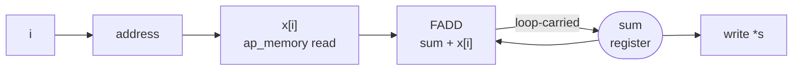

# 3.3 PERFORMANCE

## 1. Introduction

The `PERFORMANCE` directive states a performance target for a loop and leaves the tool to work out which transformations will reach it.
It is written `set_directive_performance -target_tl <value> -target_ti <value> -unit <unit> "<function>/<loop label>"`, and either target may be given on its own.
The **transaction latency (TL)** of a loop is the number of clock cycles between the loop starting and the loop finishing, so for a single loop it is simply the loop latency.
The **transaction interval (TI)** is the number of cycles between the start of one execution of that loop and the start of the next, which matters when the loop sits inside an outer loop or inside a `DATAFLOW` region, and which for a loop executed once per function call is the same thing as the interval of the function.
This lesson uses `-target_tl`, because the kernel has a single loop that runs once per call, and a latency target is the only one of the two that says something the interval does not already say.

`PERFORMANCE` is different in kind from everything taught so far in this repository, and the difference is the whole point of the lesson.
`PIPELINE` in lesson 1.1 and `UNROLL` in lesson 3.1 are instructions: they name a transformation and a parameter, and the tool carries them out.
`LATENCY` in lesson 3.2 is a constraint on a schedule the scheduler was going to produce anyway.
`PERFORMANCE` is a **goal**: it names a number that the finished loop should hit and gives the tool permission to choose the combination of pipelining, unrolling and operator binding that hits it.
The tool answers by writing the directives you did not write, and the log says so in as many words: `INFO: [HLS 214-269] Inferring pragma 'pipeline II=9' for loop 'ACC_LOOP' ... due to performance pragma`.

What it does with a given target is not what the name suggests, and every row of the table below is measured in section 7 rather than assumed.

| Where the target falls                                   | What Vitis HLS 2023.2 actually does                                                                          |
| -------------------------------------------------------- | ------------------------------------------------------------------------------------------------------------ |
| far above the latency the loop already has               | pipelines anyway, at an interval derived from the target, buying nothing and costing LUTs (`tl_slack`)         |
| just above it                                            | pipelines at a shorter interval, gets genuinely faster, and breaks the target clock period doing it (`tl_loose`) |
| equal to it                                              | pipelines at the tightest interval the recurrence allows, re-binding the adder to a different core (`tl_reach`) |
| below it, but reachable in fact                          | **refuses the request**, leaves the loop unpipelined, prints one `INFO` line (`tl_miss`)                        |
| far below anything the loop's structure permits          | refuses, with a `WARNING` as well as the `INFO` (`tl_tight`)                                                   |

The last two rows are the ones that change how the directive should be used.
This tool does not do its best and report the shortfall.
It converts the target into an initiation interval, and if that interval is one it will not schedule, it **drops the pragma entirely** and leaves you with the loop you started with.
The design it refuses to build for a target of 160 cycles is the same design it happily builds for a target of 224, and that design finishes in 147.

**What it buys** is that the number you write is the number you care about.
A latency target survives a change of data type, a change of clock period and a change of part, whereas an initiation interval of 1 and an unroll factor of 4 are answers to a question about a specific design on a specific part, and they stop being the right answers the moment anything underneath them moves.
A target also composes: on a design with several loops, giving each the latency the system needs lets the tool spend area where it actually buys something, instead of pipelining everything to an initiation interval of 1 out of habit.
And the tool will reach for transformations you might not have thought of: `tl_reach` here is met by swapping the floating-point adder for a completely different implementation, which by hand is a `BIND_OP` directive from lesson 4.1.

**What it costs** is control and predictability.
You do not know what hardware you asked for until you read the report, and every one of its failure modes is quiet: a target that is dropped prints an `INFO` line, and a target met by a design that is slower or that breaks the clock prints an `INFO` line saying it succeeded.
It also costs whatever the chosen transformations cost, which in this lesson is 187 LUT in `tl_reach` and the entire timing margin in `tl_loose`.

**When to use it:** use it when you can state what the surrounding system needs and you do not have a reason to prefer one route to it over another, and use it in preference to hand-written `PIPELINE` and `UNROLL` when a design has many loops and only some of them are on the critical path.
Use it with a build check that greps the log, because section 7 measures three different ways for it to disappoint you silently.
Do not use it on a loop that already carries a `PIPELINE` or `UNROLL` directive, because the two mechanisms are answering the same question and the documentation lists them as mutually exclusive on the same loop.

One statement belongs here plainly, because it is the one thing about the directive that is exactly as advertised.
**`PERFORMANCE` contributes no hardware of its own.**
There is no register, no comparator and no state that exists because the directive was written.
Everything that appears in the generated Verilog appears because the tool applied `PIPELINE` and chose an operator binding, and it is the same hardware that writing `PIPELINE` and `BIND_OP` by hand would have produced.

What is *not* true, and what this lesson was originally written expecting to be true, is that a target which is already met leaves the design alone.
`tl_slack` asks for 400 cycles from a loop that takes 224, and the tool pipelines it at an initiation interval of 14, which for a 14-state iteration is no overlap whatsoever.
The result is one cycle *slower* than the baseline and 27 LUT larger.
A goal with slack in it is not a no-op.

Two prerequisites are worth naming now.
The first is that converting a latency target into an initiation interval requires the tool to know how many iterations the loop runs, so a loop with a run-time bound needs `LOOP_TRIPCOUNT` from lesson 1.2, and the target will then be met against the average trip count rather than against the real one.
The kernel here has a compile-time bound of 16, so the question does not arise.
The second is the `-unit` option.
Every solution in this lesson passes `-unit cycle` explicitly, which is the right habit, but section 7 measures what a bare `-target_tl 90` actually does in 2023.2 and the answer is not the one the documentation led this lesson to expect.

Reference: UG1399, [pragma HLS performance](https://docs.amd.com/r/2023.2-English/ug1399-vitis-hls/pragma-HLS-performance) and [set_directive_performance](https://docs.amd.com/r/2023.2-English/ug1399-vitis-hls/set_directive_performance).

## 2. How it works

The kernel accumulates sixteen floating-point numbers into one running total.
Its operator graph has a feature that none of the kernels in sections 1, 2 and 3 have had so far, which is a cycle:



The edge marked *loop-carried* is a **loop-carried dependence**, meaning that an operation in one iteration needs a value produced by the same operation in the previous iteration.
Lesson 1.5 met one of these in a histogram and removed it with `DEPENDENCE`, because that one was false: two iterations only collided when they touched the same bin.
This one is real and cannot be removed by any directive, because every iteration genuinely needs the total that the iteration before it produced.

That single edge sets a floor on how fast the loop can go, and the floor is called the **recurrence bound**.
Write $L_{\textrm{fadd}}$ for the latency of one 32-bit floating-point addition, measured in clock cycles from the cycle in which its operands are applied to the cycle in which its registered result is available.
No iteration can apply its operands before the previous iteration's result has come out of the adder and been written back into the accumulator, so the **initiation interval (II)**, the number of cycles between the starts of two consecutive iterations of a pipelined loop, is bounded below by the length of that round trip:

$$II_{\min} = L_{\textrm{fadd}} + w ,$$

where $w$ is the handful of cycles the schedule spends getting the result back to the adder's input.
Vitis computes $II_{\min}$ itself and prints it, as "the minimal achievable II of 9 determined by recurrent II equal to 9", and the exact bookkeeping behind that 9 is the tool's.
What this lesson measures is the part that matters: **$II_{\min}$ moves when either term moves**, and section 7 catches the tool moving both — shrinking $L_{\textrm{fadd}}$ by changing the adder, and shrinking $w$ by forwarding the adder's output straight into the next iteration instead of giving the write-back a state of its own.

This is why the kernel uses `float` rather than `int`.
A 32-bit integer addition fits in one clock period of 3.33 ns on this part, so an integer accumulator would give $II_{\min} = 1$ and every target in the lesson would be met without the tool having to think.
A floating-point addition is a multi-cycle operation, and the recurrence turns that latency into a hard limit on the whole loop.

The important twist, and the one that makes this lesson different from a `PIPELINE` lesson, is that **$L_{\textrm{fadd}}$ is not a constant**.
It is a property of the core the tool chose, and the tool has more than one core to choose from.
Section 7 measures both of the ones it uses here:

| Core                | Module                             | `<Latency>` | States spanned | DSP | LUT | Delay of one stage |
| ------------------- | ---------------------------------- | ----------- | -------------- | --- | --- | ------------------ |
| `FAddSub_fulldsp`   | `acc_fadd_32ns_32ns_32_11_full_dsp_1` | 10       | 11             | 2   | 236 | 2.262 ns           |
| `FAddSub_nodsp`     | `acc_fadd_32ns_32ns_32_8_no_dsp_1`    | 7        | 8              | 0   | 376 | 2.292 ns           |

Measured, the eleven-state core reaches $II = 11$ under a plain hand-written `PIPELINE`, and $II = 10$ when the tool is pushed harder and forwards the result; it never reaches 9.
The eight-state core reaches 9, which is the floor Vitis reports.
So a target tight enough to demand $II = 9$ is a target that cannot be met by scheduling alone, and the tool reaches it by changing which adder the design contains.
That is the whole mechanism of `tl_reach`, and no directive in the lesson mentions an adder.

**The baseline schedule.**
One iteration of the unpipelined loop occupies fourteen states, which section 7 reads off the schedule report:

| State(s) | What happens                                                     |
| -------- | ---------------------------------------------------------------- |
| 2        | loop test `icmp_ln16`, increment `add_ln16`, address of `x[i]` driven onto the `ap_memory` port |
| 3        | read data `x_load` returns (the `RAM` core has `<Latency = 1>`, so the load spans two states) |
| 4 – 14   | the floating-point addition `sum_1` (`<Latency = 10>`, eleven states)                          |
| 15       | `sum` written back, branch to state 2                            |

So $L_{\textrm{it}} = 14$, the loop latency is $16 \times 14 = 224$, the function latency is 225 and the interval is 226.
Nothing overlaps: the memory port is busy in two of every fourteen cycles and the adder in eleven, and neither is ever busy while the other is.

**The pipelined schedule.**
`tl_reach` collapses the same work into eleven states and starts a new iteration every nine cycles.
Laying the two out as cycle ranges rather than as a grid, because a fourteen-cycle iteration does not fit in a readable table:

| Iteration | `base`, cycles | `tl_reach`, cycles |
| --------- | -------------- | ------------------ |
| 0         | 2 – 15         | 1 – 11             |
| 1         | 16 – 29        | 10 – 20            |
| 2         | 30 – 43        | 19 – 29            |
| …         | …              | …                  |
| 15        | 212 – 225      | 136 – 146          |

Iteration 1 in `base` cannot begin until iteration 0 has completely finished, at cycle 16.
In `tl_reach` it begins at cycle 10, while iteration 0 is still inside the adder, and applies its own operands to the adder in cycle 12, which is the first cycle in which iteration 0's updated accumulator is visible: iteration 0's addition runs in cycles 3 to 10 and writes `sum` back in cycle 11.
The adder is busy in eight of every nine cycles, so this is not a lazy schedule with room left in it: the loop is running at the speed of its own dependence, with a shorter adder than the one it started with.

What matters for this lesson is that **neither schedule was asked for directly**.
The directive that produced the second one says nothing about pipelining, names no initiation interval and names no adder.
It says that the loop should finish within 224 cycles, and the tool works backwards from 224 to `pipeline II=9` and from `II=9` to a different floating-point core.

The tool has a third option it never uses here, which is to unroll.
On this kernel unrolling does not help, because sixteen dependent additions remain sixteen dependent additions however they are grouped, and a floating-point sum may not be regrouped without changing the answer.
Section 7 confirms that no `HLS 214-188` or `HLS 214-186` appears in any solution.

## 3. The kernel

```cpp
#include "acc.h"

// Sum of N floating-point numbers into one running accumulator. The single
// loop carries a real dependence through sum: every iteration needs the total
// the previous iteration produced. Unlike the histogram of lesson 1.5, this
// dependence is not false and no directive removes it, so it sets the floor on
// how fast the loop can run. Measured on this part, that floor is an initiation
// interval of 9, which is the adder's latency plus the cycles the schedule
// spends writing the result back into the accumulator.
//
// sum = 0.0f is not folded away. Adding positive zero to negative zero yields
// positive zero rather than negative zero, so the initialisation is a real
// addition of a real constant and the loop performs sixteen additions rather
// than fifteen. The testbench has a directed case that fails if a tool folds it.
void acc(const data_t x[N], data_t *s) {
    data_t sum = 0.0f;
ACC_LOOP:
    for (int i = 0; i < N; i++) {
        sum += x[i];            // FADD, loop-carried through sum
    }
    *s = sum;
}
```

```cpp
#ifndef ACC_H
#define ACC_H

// One 32-bit IEEE-754 single-precision type. The width and the type both
// matter to this lesson. A 32-bit integer addition fits in one clock period of
// 3.33 ns on this part, so an integer accumulator would have a recurrence
// bound of one cycle and every target in the lesson would be met without the
// tool having to choose anything. A floating-point addition is a multi-cycle
// operation here -- measured at eleven states for the DSP-based core the tool
// picks by default -- and the loop-carried dependence turns that latency into
// the floor on the initiation interval.
const int N = 16;

typedef float data_t;

void acc(const data_t x[N], data_t *s);

#endif // ACC_H
```

The loop carries the label `ACC_LOOP`, which the repository requires of every loop and which this lesson needs for a second reason: the directive is scoped to a loop rather than to a function, so the label is part of the directive's argument and a typo in it makes the directive apply to nothing.

Three things in the generated design differ from what the source appears to say, and all three show up in the schedule report under names that do not match the C.

The first is the initial value.
`sum = 0.0f` followed by `sum += x[0]` looks like something a compiler would fold into `sum = x[0]`, and for an integer accumulator it would.
For a floating-point accumulator it may not, because adding positive zero to negative zero yields positive zero rather than negative zero, so the first addition is a real addition of a real constant and the loop performs sixteen additions rather than fifteen.
Section 7 confirms the trip count of 16 in every solution, and the `neg_zeros` case in the testbench fails if a tool ever folds it away.

The second is the accumulator itself.
In the intermediate representation `sum` is not a variable that is written each iteration but a value selected between the initial constant and the previous iteration's result.
In the schedule report the addition appears as `%sum_1 = fadd i32 %sum_load, i32 %bitcast_ln17`, named after the source line the value came from and not after the variable the programmer declared, and the loop control appears as `icmp_ln16` and `add_ln16`.

The third is the array argument.
`const data_t x[N]` becomes an `ap_memory` interface, which is a set of ports comprising an address, a clock enable, and a read data bus, on which a read costs one cycle before the data is available; the schedule report shows it bound to `Core 83 'RAM' <Latency = 1>` and spanning two states.
It is not a **block RAM (BRAM)**, the dedicated on-chip memory of the fabric; the memory itself lives outside the block and the testbench models it.

The remaining scalar output `*s` becomes an output port with the `ap_vld` protocol, a data bus plus one valid signal, and the block keeps the default `ap_ctrl_hs` handshake of `ap_start`, `ap_ready`, `ap_idle` and `ap_done`.

## 4. The solutions

The targets walk downwards, from one the loop meets with room to spare to one nothing can meet.

| Solution   | Directive in `directives_<solution>.tcl`                              | Where the target sits                                             |
| ---------- | ---------------------------------------------------------------------- | ------------------------------------------------------------------ |
| `base`     | none                                                                   | the natural schedule, with no pipelining and no unrolling          |
| `tl_slack` | `set_directive_performance -target_tl 400 -unit cycle "acc/ACC_LOOP"` | far above the 224 cycles the loop already takes                    |
| `tl_loose` | `set_directive_performance -target_tl 240 -unit cycle "acc/ACC_LOOP"` | just above it                                                      |
| `tl_reach` | `set_directive_performance -target_tl 224 -unit cycle "acc/ACC_LOOP"` | equal to it, and the tightest target this installation accepts     |
| `tl_miss`  | `set_directive_performance -target_tl 160 -unit cycle "acc/ACC_LOOP"` | below it, and reachable in fact, since `tl_reach` finishes in 147  |
| `tl_tight` | `set_directive_performance -target_tl 20 -unit cycle "acc/ACC_LOOP"`  | below anything the recurrence permits                              |

All six solutions differ in the taught directive alone.
The scope is the loop `ACC_LOOP` inside the function `acc` in all five variants, and no other `set_directive_*` command appears anywhere in the lesson.
`common/part.tcl` keeps `config_compile -pipeline_loops 0` in force, as in every other lesson, which is what makes `base` an honestly unpipelined baseline; it does not stop a `PERFORMANCE` target from pipelining, as `tl_slack` through `tl_reach` demonstrate.

Two things about these numbers should be stated rather than hidden.

The first is that they were **calibrated against a first run**, and they are not the numbers this lesson was first written with.
The lesson originally used 128, 90 and 20, chosen on the assumption that the floating-point adder would have a latency of four or five cycles and that the baseline loop would therefore take 96 or 112 cycles.
The adder turns out to span eleven states, the baseline takes 224, and all three original targets fell below the acceptance window and were refused, producing three identical copies of the baseline and demonstrating nothing.
Section 5 keeps the prediction that the repository's standing models make, and section 7 records which parts of those models survived contact with the tool.

The second is a deviation from the section plan.
The plan lists a single variant with a target loop latency, and this lesson uses five.
The reason is that the tool has five distinguishable behaviours on this one kernel and one number cannot show five outcomes.
The plan also does not say which of the two targets to use, and this lesson uses `-target_tl` throughout rather than `-target_ti`, because the kernel has one loop executed once per call.
`-target_ti` was measured once during calibration and behaves more simply: `-target_ti 160` on this loop derives `II = 160/16 = 10` directly, which is worth knowing but does not need a solution of its own.
A design where `-target_ti` is the interesting knob is a `DATAFLOW` design, which is section 6.

## 5. Predict

Write these numbers down before running anything.
Section 4 is honest that the six targets were chosen after a calibration run established $L_{\textrm{fadd}}$ and the window of targets the tool accepts, so those two facts are given here rather than guessed.
Everything else below is a genuine prediction about what the tool will do with each target, and section 7 marks the four that are wrong.

Everything follows from $L_{\textrm{fadd}}$, the latency in cycles of one 32-bit floating-point addition on this part, which is not known in advance.
Following the convention that lesson 3.2 measured for the integer multiplier, an operator with a reported latency of $L$ occupies $L+1$ states: one in which its operands are applied and $L$ more before its registered result is available.
Adding the two states in which the `ap_memory` read is issued and returns, and one in which the accumulator is written back, one iteration of the unpipelined loop occupies

$$L_{\textrm{it}} = 2 + (L_{\textrm{fadd}} + 1) + 1 = L_{\textrm{fadd}} + 4 .$$

The repository's standing models then give the baseline directly.
An unpipelined loop has a loop latency of $T \times L_{\textrm{it}}$ for a trip count $T$, the function latency is one more than that, and the interval of a non-pipelined `ap_ctrl_hs` block is one more than its latency, because the block cannot accept a new `ap_start` in the cycle in which it asserts `ap_done`.
A pipelined loop has a loop latency of $D + II(N-1)$, where $D$ is its depth.

| $L_{\textrm{fadd}}$ | $L_{\textrm{it}}$ | `base` loop | `base` function | `base` interval | $II_{\min}$ |
| ------------------- | ----------------- | ----------- | --------------- | --------------- | ----------- |
| 4                   | 8                 | 128         | 129             | 130             | 4           |
| 7                   | 11                | 176         | 177             | 178             | 7           |
| 10                  | 14                | 224         | 225             | 226             | 10          |

**The row to write down is $L_{\textrm{fadd}} = 10$**, which is what the calibration run of section 4 established: the default binding is `FAddSub_fulldsp`, it reports `<Latency = 10>`, and the generated module is named `acc_fadd_32ns_32ns_32_11_full_dsp_1` after the eleven states it spans.
That row is a prediction of the baseline only.
Everything the directive does on top of it is a prediction about the tool's behaviour, and that is where this lesson spends its uncertainty.

**`base`** should report a loop latency of 224 with an iteration latency of 14, a function latency of 225, an interval of 226, and `no` in the pipeline column of the loop table.

**`tl_slack`**, at 400 cycles against a loop that takes 224, is the one whose prediction the repository's model gets wrong, and it is worth writing the wrong prediction down.
The model says: a goal that is already met is not a reason to build anything, so the design should be identical to `base` and the log should be silent.
The measurement says otherwise, and section 7 records what it says instead.

**`tl_loose`**, at 240, is close enough to the baseline that a small overlap would reach it.
Predict that the tool pipelines, that the initiation interval it derives is somewhere between 10 and 14, and that the loop latency lands between 162 and 224.
The open question is the *clock*: buying a cycle of depth in a schedule this tight means chaining operations that were in separate states, and lesson 3.2 measured exactly that trade being made without comment.
Predict a timing warning here, and predict that section 7 has to report the estimated period next to the latency to see it.

**`tl_reach`**, at 224, asks for precisely the latency the loop already has.
It is the tightest target this installation accepts, which is itself a prediction worth checking: 223 is accepted, 208 is not.
Predict $II = 9$, which is below what the eleven-state adder can sustain, so predict further that the tool changes the adder, that the DSP count falls to zero, that the LUT count rises sharply, and that the design is nonetheless the fastest in the lesson.

**`tl_miss`**, at 160 cycles, is the solution that decides how the directive should be used.
`tl_reach` finishes the whole function in 147 cycles, so a design meeting 160 exists and the tool knows how to build it.
Two outcomes are plausible:

- *Outcome (a).* The tool builds the same $II = 9$ design it built for `tl_reach` and reports the target met, because 147 is comfortably inside 160.
- *Outcome (b).* The tool derives an initiation interval below 9 from the target, finds it unschedulable, and drops the pragma, producing the baseline with the target missed by 65 cycles. **This is the outcome to predict**, on the evidence that the acceptance boundary sits between 208 and 223 rather than anywhere near the achievable latency.

**`tl_tight`**, at 20 cycles, requires an initiation interval of about one, and section 2 has established that the recurrence forbids anything below 9 with any available adder.
Sixteen dependent floating-point additions cannot complete in twenty cycles under any grouping, so unrolling cannot rescue it either.
Predict a refusal.
The open question is whether it is the *same* refusal as `tl_miss` or a louder one, and whether the two refused solutions produce the same hardware; section 7 checks that with a normalised `diff` rather than taking it on trust.

**Resources.**
A **flip-flop (FF)** is a one-bit register and a **DSP** is a hardened multiply-accumulate slice in the fabric, which floating-point cores on this part use for the significand multiply and, in the `full_dsp` variants, for parts of the addition as well.
Predict changes against `base` rather than absolute numbers.

| Solution   | DSP against `base` | FF against `base`             | LUT against `base`                            |
| ---------- | ------------------ | ------------------------------- | ----------------------------------------------- |
| `tl_slack` | 0                  | 0                               | small and positive, if it builds anything at all |
| `tl_loose` | 0                  | negative, from a shorter FSM    | positive, from pipeline control                 |
| `tl_reach` | **-2**             | small                           | **large and positive**, the fabric adder        |
| `tl_miss`  | 0                  | 0                               | 0                                               |
| `tl_tight` | 0                  | 0                               | 0                                               |

The reasoning behind the `tl_reach` row is that pipelining does not add arithmetic but re-binding replaces it.
There is one floating-point adder in every solution, because the recurrence means only one iteration is ever inside the adder's *operand* stage at a time even though several are inside its pipeline.
What changes in `tl_reach` is which adder, and a `no_dsp` implementation of a floating-point addition trades two DSP slices for a few hundred LUT.

**Clock.**

| Quantity                       | `base` | `tl_slack` | `tl_loose` | `tl_reach` | `tl_miss` | `tl_tight` |
| ------------------------------ | ------ | ---------- | ---------- | ---------- | --------- | ---------- |
| Iteration latency / depth      | 14     | 14         | 13         | 11         | 14        | 14         |
| Initiation interval            | none   | none       | 10 – 14    | 9          | none      | none       |
| Loop latency                   | 224    | 224        | 162 – 224  | 145        | 224       | 224        |
| Function latency               | 225    | 225        | 164 – 226  | 147        | 225       | 225        |
| Interval                       | 226    | 226        | 165 – 227  | 148        | 226       | 226        |
| Target met                     | —      | yes        | yes        | yes        | **no**    | **no**     |
| Estimated clock                | 2.262  | same       | **worse**  | slightly worse | same  | same       |
| Verilog the same as `base`     | —      | yes        | no         | no         | **yes**   | **yes**    |

The `tl_slack` column of that table is the repository's model speaking, and section 7 records that the model is wrong: four of its eight entries for that solution are misses, including every entry that says the design is left alone.

## 6. Run

Unlike lesson 3.2, this lesson runs C and RTL co-simulation on every solution, and the reason is specific to what `PERFORMANCE` is.

A `LATENCY` constraint cannot change what a function computes, because moving a state boundary does not change which operand reaches which operator.
A `PERFORMANCE` target makes no such promise, because it does not say what the tool will do.
Two of the things it could do would change the answer: splitting the accumulation into partial sums, since floating-point addition is not associative and $(a+b)+c$ is not in general $a+(b+c)$, or binding the addition to a core that rounds differently.
The second is not hypothetical here — `tl_reach` really does run on a different adder — so co-simulation is not a formality in this lesson, it is the check that the substituted core returns identical bits.

The testbench supports that by comparing floating-point results **bit for bit** against a reference model that sums in the same order in the same precision, rather than against a tolerance.
A tolerance would hide precisely the reassociation and the rounding differences the co-simulation is there to detect, so the tolerance is deliberately zero, and the random vectors mix large and small magnitudes so that a regrouped sum would differ in the low bits.

```bash
cd s3_parallelism/33_performance
vitis_hls -f run_hls.tcl 2>&1 | tee run.log
```

The same run through the repository Makefile is `make run LESSON=s3_parallelism/33_performance`.

Then collect the summary numbers:

```bash
bash ../../common/collect_latency.sh   acc_proj
bash ../../common/collect_resources.sh acc_proj
```

`make check LESSON=s3_parallelism/33_performance` runs both scripts.

Two notes on reading the log.
Co-simulation runs the testbench twice, so each solution prints `TEST PASSED` twice and the whole run prints it twelve times; anything other than twelve is a failure even if no line says so.
And before reading any result, confirm that the directive exists in this installation, which `run_hls.tcl` does for you at the top and which costs one line by hand:

```bash
vitis_hls -eval 'puts [info commands set_directive_performance]'
```

Logic synthesis is not run in this lesson, so every resource number in section 7 is a C synthesis estimate.
The standing caveat from lessons 2.1 and 2.2 applies: the LUT estimate can reverse the ranking between two designs that Vivado then ranks the other way, while the flip-flop estimate tracks.
The largest resource claim this lesson makes is about the DSP count and about which adder module exists, and the estimate reports both exactly, so `export_syn.tcl` is not needed here.

## 7. Read the results

The numbers below come from a run of `run_hls.tcl` on Vitis HLS 2023.2.2 (build 4101106) with the part `xcku5p-ffvb676-2-e` and the 3.33 ns clock of `common/part.tcl`.
Compare each row with the prediction that section 5 fixed before the run.

### The log

The solution banners printed by `run_hls.tcl` say which solution each message belongs to.
The grep has to cover five different families of message, because the whole question of this lesson is which directives the tool wrote on your behalf:

```bash
grep -nEi "== solution|214-269|200-1470|200-1957|214-392|200-871|214-188|214-186|200-880|TEST (PASSED|FAILED)" run.log
```

`HLS 214-269` is the line that did not exist in any earlier lesson: it is the tool printing the `PIPELINE` pragma it decided to write.
`HLS 200-1470 Pipelining result` is the line lesson 1.1 read to get the achieved initiation interval and the pipeline depth.
`HLS 200-1957` is the verdict on the performance pragma itself and is the only message emitted for every solution that carries one.
`HLS 214-392` is the loud form of a refusal and `HLS 200-871` is a timing violation.
`HLS 214-188` is a partial unroll and `HLS 214-186` a complete one, both from lesson 3.1; lesson 3.1 also warns not to grep for the bare word `unroll`, because every solution prints a dozen unrelated `Unroll/Inline (step n)` design-size lines.
`HLS 200-880` is the carried-dependence refusal from lesson 1.5.

| Solution   | `214-269` inferred pragma | `200-1470` target / final II / depth | `214-392` | `200-1957` verdict | `200-871` |
| ---------- | ------------------------- | ------------------------------------ | --------- | ------------------ | --------- |
| `base`     | —                         | —                                    | —         | —                  | —         |
| `tl_slack` | `pipeline II=22`, then `pipeline II=15` | 15 / **14** / 14      | —         | **Successfully applied** `TL='400'` | — |
| `tl_loose` | `pipeline II=11`, then `pipeline II=10` | 10 / 10 / 13          | —         | **Successfully applied** `TL='240'` | **yes** |
| `tl_reach` | `pipeline II=9`           | 9 / 9 / **11**                       | —         | **Successfully applied** `TL='224'` | — |
| `tl_miss`  | —                         | —                                    | —         | **Failed to apply** `TL='160'`      | — |
| `tl_tight` | —                         | —                                    | **yes**   | **Failed to apply** `TL='20'`       | — |

Four things in that table are worth stating as results.

**The tool really does write the directive.**
`214-269` appears in three solutions whose directives file contains no `PIPELINE` and no `UNROLL`, and it names the pragma in the same syntax you would have written:

```
INFO: [HLS 214-269] Inferring pragma 'pipeline II=9' for loop 'ACC_LOOP'
  (src/acc.cpp:16:5) in function 'acc' due to performance pragma
  (directives_tl_reach.tcl:24:9)
```

**It guesses twice.**
`tl_slack` and `tl_loose` each print two `214-269` lines, a first interval that it then revises downwards.
`tl_slack` derives 22 from a target of 400, revises to 15, and the pipeliner delivers 14.
Only the last one is what got built, so a script that greps for the first match reads the wrong number.

**`200-1957` is the only reliable verdict.**
It is printed once per solution carrying the directive, in one of exactly two forms, and it is an `INFO` in both cases.
`tl_miss` produces that line and nothing else: no warning, no error, and a design that misses its target by 65 cycles.

**`214-392` is not a reliable signal of a refusal.**
`tl_miss` is refused without it and `tl_tight` is refused with it:

```
WARNING: [HLS 214-392] Cannot apply performance pragma target_tl=20 cycles for
  loop 'ACC_LOOP' (src/acc.cpp:16:5) in function 'acc'. The target requires a
  pipeline II less than the minimal achievable II of 9 determined by recurrent
  II equal to 9 (directives_tl_tight.tcl:31:9)
```

That message carries the one number that explains the whole lesson, the minimal achievable II of 9, and it is emitted for some refused targets and not for others.
Sweeping the target across its whole range during calibration put the boundary between 128, which warns, and 136, which does not, while every value from 20 to 208 is refused identically in the hardware.

No `214-188`, no `214-186` and no `200-880` appears in any solution.
The tool never unrolled, and the carried-dependence message of lesson 1.5 is not part of how `PERFORMANCE` reports a refusal; it appears only when a `PIPELINE` directive is written by hand and the pipeliner searches downwards through the intervals the dependence forbids.

### The acceptance window

The single most useful measurement in this lesson is not any one solution but the sweep behind them.
Holding the kernel fixed and moving only the target, with `-unit cycle` throughout:

| `-target_tl` | Applied | Final II | Loop latency | Function latency | Est. clock | Adder module |
| ------------ | ------- | -------- | ------------ | ---------------- | ---------- | ------------ |
| 20           | no      | —        | 224          | 225              | 2.262      | 11-stage `full_dsp` |
| 90           | no      | —        | 224          | 225              | 2.262      | 11-stage `full_dsp` |
| 128          | no (warns) | —     | 224          | 225              | 2.262      | 11-stage `full_dsp` |
| 136          | no      | —        | 224          | 225              | 2.262      | 11-stage `full_dsp` |
| 144          | no      | —        | 224          | 225              | 2.262      | 11-stage `full_dsp` |
| 160          | no      | —        | 224          | 225              | 2.262      | 11-stage `full_dsp` |
| 176          | no      | —        | 224          | 225              | 2.262      | 11-stage `full_dsp` |
| 200          | no      | —        | 224          | 225              | 2.262      | 11-stage `full_dsp` |
| 208          | no      | —        | 224          | 225              | 2.262      | 11-stage `full_dsp` |
| **223**      | **yes** | 9        | 145          | 147              | 2.292      | **8-stage `no_dsp`** |
| 224          | yes     | 9        | 145          | 147              | 2.292      | 8-stage `no_dsp`    |
| 225          | yes     | 9        | 145          | 147              | 2.292      | 8-stage `no_dsp`    |
| 240          | yes     | 10       | 162          | 164              | **2.689**  | 11-stage `full_dsp` |
| 260          | yes     | 11       | 177          | 179              | **2.689**  | 11-stage `full_dsp` |
| 280          | yes     | 12       | 193          | 195              | 2.262      | 11-stage `full_dsp` |
| 300          | yes     | 12       | 193          | 195              | 2.262      | 11-stage `full_dsp` |
| 400          | yes     | 14       | 224          | 226              | 2.262      | 11-stage `full_dsp` |
| 1000         | yes     | 14       | 224          | 226              | 2.262      | 11-stage `full_dsp` |

Read that table from the bottom up and the directive stops being mysterious.
A very slack target gives a very slack interval, which the pipeliner clamps at the depth of one iteration, and at that point pipelining buys nothing and the design is one cycle slower than the baseline.
Tightening the target shortens the interval, one cycle at a time, until 223, where the shortest interval this loop can sustain is reached by changing the adder.
Below 223 the tool stops helping entirely.

The two facts to take away are that **the response is monotone but the cliff is not where the achievable latency is**, and that **the mapping from a target to an interval is not a division**.
A target of 160 is refused although the design the tool builds for a target of 224 finishes the whole function in 147, which means `-target_tl` cannot be used to ask for the best a loop can do: you have to ask for something looser than the answer you want and then read what you got.

### The `-unit` question

This lesson writes `-unit cycle` in every solution, on the documented grounds that the default unit is a unit of time and that a bare `-target_tl 90` would therefore ask for ninety seconds and constrain nothing.
That is not what 2023.2 does.

| Form                             | Interpreted as | Behaves as     |
| -------------------------------- | -------------- | -------------- |
| `-target_tl 224 -unit cycle`     | 224 cycles     | applied, `II=9` |
| `-target_tl 224` with no `-unit` | 224 cycles     | applied, `II=9`, identical result |
| `-target_tl 160 -unit cycle`     | 160 cycles     | refused        |
| `-target_tl 160` with no `-unit` | 160 cycles     | refused, identical result |
| `-target_tl 224 -unit sec`       | —              | rejected: `ERROR: [HLS 207-5500] The expression must be a constant floating number` |

The tool's own message settles it without ambiguity, because it prints the unit it used: a bare `-target_tl 90` is reported back as `Cannot apply performance pragma target_tl=90 cycles`.
So on this installation the omission is harmless.
Write `-unit cycle` anyway: it costs nothing, it documents the intent for a reader, and it is the one part of the directive whose default is worth not depending on.

### The performance table

The table to read is the performance summary of each solution, which carries both the function rows and the `Loop` section:

```bash
sed -n '/Performance Estimates/,/Utilization Estimates/p' acc_proj/base/syn/report/acc_csynth.rpt
```

The `+ Latency` summary rows of the six solutions:

```
base    |      225|      225|  0.749 us|  0.749 us|  226|  226|       no|
tl_slack|      226|      226|  0.753 us|  0.753 us|  227|  227|       no|
tl_loose|      164|      164|  0.546 us|  0.546 us|  165|  165|       no|
tl_reach|      147|      147|  0.490 us|  0.490 us|  148|  148|       no|
tl_miss |      225|      225|  0.749 us|  0.749 us|  226|  226|       no|
tl_tight|      225|      225|  0.749 us|  0.749 us|  226|  226|       no|
```

| Solution   | Function latency | Latency, absolute | Interval | Est. clock, ns | Slack, ns | Est. Fmax, MHz | Target | Target met |
| ---------- | ---------------- | ----------------- | -------- | -------------- | --------- | -------------- | ------ | ---------- |
| `base`     | 225              | 0.749 us          | 226      | 2.262          | +0.169    | 442.09         | —      | —          |
| `tl_slack` | **226**          | 0.753 us          | **227**  | 2.262          | +0.169    | 442.09         | 400    | yes        |
| `tl_loose` | 164              | 0.546 us          | 165      | **2.689**      | **-0.258** | **371.89**    | 240    | yes, in cycles only |
| `tl_reach` | **147**          | 0.490 us          | **148**  | 2.292          | +0.139    | 436.30         | 224    | yes        |
| `tl_miss`  | 225              | 0.749 us          | 226      | 2.262          | +0.169    | 442.09         | 160    | **no**     |
| `tl_tight` | 225              | 0.749 us          | 226      | 2.262          | +0.169    | 442.09         | 20     | **no**     |

Slack here is the effective delay budget minus the estimated period.
The budget is the target period minus the clock uncertainty, $3.330 - 0.899 = 2.431$ ns, and it is the number Vitis compares against; `collect_latency.sh` prints the estimated period for every solution and `run.log` carries the same information once per solution as `**** Estimated Fmax`.

Three rows of that table are the lesson.

**`tl_slack` is slower than `base`.**
A target of 400 cycles on a loop that takes 224 produced a design with a function latency of 226 and an interval of 227, one cycle worse on both, for 27 extra LUT.
The prediction in section 5 that a met goal changes nothing is wrong, and it is wrong in the direction that costs rather than saves.

**`tl_loose` met its target and broke the clock.**
164 cycles against a target of 240 is a real improvement over 225, and it is bought with an estimated period of 2.689 ns against a budget of 2.431, which is a violation of the clock the design was asked to run at.
This is the same failure lesson 3.2 measured for `LATENCY`, reproduced here by a *slack* target rather than an impossible one, which makes it the more dangerous version: nothing about the number 240 suggests that it is asking for anything difficult.

**The absolute latency column does not reveal it.**
Lesson 3.2 noted that Vitis switches the absolute latency to the estimated period when timing fails.
It did not do that here: `tl_loose` reports 0.546 us, which is exactly $164 \times 3.33$ ns, computed at a clock period the design cannot achieve.
The absolute latency column is therefore not a timing check, and the estimated period has to be read on its own.

The `Loop` section is where the chosen transformation shows itself:

| Solution   | Trip count | Iteration latency | Loop latency | Achieved II | Target II | Pipelined |
| ---------- | ---------- | ----------------- | ------------ | ----------- | --------- | --------- |
| `base`     | 16         | 14                | 224          | -           | -         | no        |
| `tl_slack` | 16         | 14                | 224          | 14          | 15        | yes       |
| `tl_loose` | 16         | 13                | 162          | 10          | 10        | yes       |
| `tl_reach` | 16         | 11                | 145          | 9           | 9         | yes       |
| `tl_miss`  | 16         | 14                | 224          | -           | -         | no        |
| `tl_tight` | 16         | 14                | 224          | -           | -         | no        |

Three reading notes.

The `II` column has separate achieved and target sub-columns, and for a solution whose initiation interval was never requested by name the target sub-column shows what the tool derived from the latency goal.
`tl_slack` is the only row where the two differ: the tool asked itself for 15 and the pipeliner delivered 14, because 14 is the depth of one iteration and an interval longer than the depth is meaningless.

The loop `Latency` cell of a pipelined loop reads one cycle below $D + II(N-1)$, exactly as lesson 1.1 measured: `tl_reach` shows 145 where the model gives $11 + 9 \times 15 = 146$, with the missing cycle appearing in the function latency, which is 147 rather than 146.
The comparison against the prediction is therefore made on function latency.

A trip count of 16 appears in every row, since `N` is a compile-time constant.
A `?` in that column would mean the loop bound was not resolved and that the tool had nothing to convert the latency target into, which is the case that needs `LOOP_TRIPCOUNT`.

### The schedule

The per-state detail is where $L_{\textrm{fadd}}$ is actually readable, because the addition appears there as an operation spanning several states in the form `[11/11]` down to `[1/11]`:

```bash
grep -nE "^State [0-9]+|ST_[0-9]+ : Operation.*(fadd|load|store) " \
    acc_proj/base/.autopilot/db/acc.verbose.sched.rpt | head -40
```

| Quantity                                             | `base`                                     | `tl_reach`                              |
| ---------------------------------------------------- | ------------------------------------------ | --------------------------------------- |
| Core the addition is bound to, and its `<Latency>`    | `Core 18 'FAddSub_fulldsp' <Latency = 10>` | `Core 17 'FAddSub_nodsp' <Latency = 7>` |
| Number of states the addition spans                   | 11 (ST_4 … ST_14)                          | 8 (ST_3 … ST_10)                        |
| $L_{\textrm{fadd}}$                                   | 10                                         | 7                                       |
| Number of FSM states                                  | 15                                         | 11                                      |
| States per iteration                                  | 14                                         | 11, overlapping every 9                 |
| Delay of one adder stage                              | 2.262 ns                                   | 2.292 ns                                |

The measured schedules, read off the report rather than drawn from the model:

| Where                | `base`                                     | `tl_reach`                                 |
| -------------------- | ------------------------------------------ | ------------------------------------------ |
| prologue             | ST_1: `i = 0`, `sum = 0.0f`                | folded into ST_1 of the pipeline           |
| loop test, `i+1`, address | ST_2                                  | ST_1                                       |
| `x_load` returns     | ST_3                                       | ST_2                                       |
| `fadd`               | ST_4 … ST_14                               | ST_3 … ST_10                               |
| `sum` written back   | ST_15                                      | ST_11                                      |
| iteration 0 occupies | cycles 2 – 15                              | cycles 1 – 11                              |
| iteration 1 occupies | cycles 16 – 29                             | cycles 10 – 20                             |
| iteration 15 occupies| cycles 212 – 225                           | cycles 136 – 146                           |

`tl_loose` is the interesting middle case and it is worth reading its schedule too.
It has a depth of 13 rather than 14, and the missing state is the write-back: the schedule report chains the store of `sum` onto the last stage of the adder rather than giving it a state of its own, and the timing report names exactly that chain as the critical path:

```
WARNING: [HLS 200-1016] The critical path in module 'acc' consists of the following:
	'fadd' operation 32 bit ('sum', src/acc.cpp:17) [28]  (2.262 ns)
	'store' operation 0 bit ('sum_write_ln14', ...) [31]  (0.427 ns)
```

$2.262 + 0.427 = 2.689$ ns, which is the estimated period in the table above, against a budget of 2.431.

The same cycle is visible a third time in the utilisation tables.
`tl_loose` is the only solution that has no `sum_1_reg_*` flip-flop and the only one whose multiplexer list contains `ap_sig_allocacmp_sum_load`: the adder's output is not registered separately and then re-read, it is forwarded through a multiplexer into the next iteration's operand.
So the cycle that `tl_loose` saves over `tl_slack` is paid for in nanoseconds, and the same trade shows up in the schedule report, in the timing report and in the resource table.

Two places where the scheduled operations do not match the source expression should be confirmed here rather than assumed.

| Question                                                  | Measured                                                        |
| ---------------------------------------------------------- | ---------------------------------------------------------------- |
| Is the initial `0.0f + x[0]` present as a real addition?    | yes; the trip count is 16 and the `neg_zeros` testbench case passes |
| Name the report gives the accumulator value                 | `%sum_1 = fadd i32 %sum_load, i32 %bitcast_ln17`, line 17          |
| Name the report gives the loop index comparison             | `%icmp_ln16 = icmp_eq i5 %i_1, i5 16`, with `%add_ln16` alongside it |
| Does the unpipelined loop pay a separate control state?     | no; the test, the increment and the address share ST_2 with the read issue |

The last row settles the question lesson 1.4 raised.
The exit comparator sits inside the first state of the loop body rather than in a state of its own, so the fourteen states of an iteration are two for the memory read, eleven for the adder and one for the write-back, with the loop control folded into the first of them.

### The Verilog

The claim that a refused target changes nothing is checked with a file comparison, using the normalisation that lesson 3.2 established, since a directive can shift the numeric suffixes Vitis appends to auto-generated names without changing any logic:

```bash
norm() { sed -E 's/_(reg|fu)_[0-9]+/_\1_N/g' "$1"; }
for s in tl_slack tl_loose tl_reach tl_miss tl_tight; do
    echo "== $s: $(diff <(norm acc_proj/base/syn/verilog/acc.v) \
                       <(norm acc_proj/$s/syn/verilog/acc.v) | wc -l) diff lines"
done
```

| Comparison                    | `diff` lines, normalised | `diff` lines, raw | Same hardware |
| ----------------------------- | ------------------------ | ----------------- | ------------- |
| `base` against `tl_slack`     | 259                      | 291               | no            |
| `base` against `tl_loose`     | 560                      | 579               | no            |
| `base` against `tl_reach`     | 543                      | 573               | no            |
| `base` against `tl_miss`      | **0**                    | 106               | **yes**       |
| `base` against `tl_tight`     | **0**                    | 106               | **yes**       |
| `tl_miss` against `tl_tight`  | **0**                    | 0                 | **yes**       |

The last three rows carry the lesson's sharpest result.
`tl_miss` and `tl_tight` are byte-for-byte identical to each other and identical to `base` once the auto-generated suffixes are normalised, and the 106 raw diff lines are entirely renumbered `_fu_` and `_reg_` names, the same artefact lesson 3.2 documented.
The normalisation is worth doing rather than trusting, and it is checkable in one line: every raw difference line pairs up with its normalised twin, which is what makes "the same design" a measurement rather than an assertion.

```bash
diff acc_proj/base/syn/verilog/acc.v acc_proj/tl_miss/syn/verilog/acc.v \
  | grep -E "^[<>]" | sed -E 's/_(reg|fu)_[0-9]+/_\1_N/g; s/^[<>] //' \
  | sort | uniq -c | awk '$1 % 2 != 0'     # prints nothing
```

A target of 160 cycles, a target of 20 cycles and no target at all produce one design.
One of them was reported with a warning, one with an `INFO`, and one with nothing, and none of that is visible in the hardware.

Next, the module list, which is where a pipelined loop announces itself structurally.
Lesson 1.1 measured a pipelined loop staying inside the top function and generating one helper module, `<top>_flow_control_loop_pipe.v`, while lesson 1.5 measured a pipelined loop that shares a function with other loops being lifted into a module of its own named `<top>_Pipeline_<LABEL>`.
This kernel has a single loop, so the expectation is the first shape, and it holds:

```bash
for s in base tl_slack tl_loose tl_reach tl_miss tl_tight; do
    echo "== $s"; ls acc_proj/$s/syn/verilog/
done
```

| Solution   | Adder module in `syn/verilog/`          | `flow_control_loop_pipe` | `acc_Pipeline_ACC_LOOP` |
| ---------- | ----------------------------------------- | ------------------------ | ----------------------- |
| `base`     | `acc_fadd_32ns_32ns_32_11_full_dsp_1.v`  | no                       | no                      |
| `tl_slack` | `acc_fadd_32ns_32ns_32_11_full_dsp_1.v`  | **yes**                  | no                      |
| `tl_loose` | `acc_fadd_32ns_32ns_32_11_full_dsp_1.v`  | **yes**                  | no                      |
| `tl_reach` | **`acc_fadd_32ns_32ns_32_8_no_dsp_1.v`** | **yes**                  | no                      |
| `tl_miss`  | `acc_fadd_32ns_32ns_32_11_full_dsp_1.v`  | no                       | no                      |
| `tl_tight` | `acc_fadd_32ns_32ns_32_11_full_dsp_1.v`  | no                       | no                      |

The `tl_reach` row is the re-binding, and it is the single most consequential thing the directive did in this lesson.
The module name carries the number of pipeline stages, so $L_{\textrm{fadd}}$ can be read off it and cross-checked against the schedule report: eleven stages for the DSP core and eight for the fabric core, matching the `<Latency = 10>` and `<Latency = 7>` the scheduler reported.
Nothing in `directives_tl_reach.tcl` mentions an adder, a core, an implementation or a DSP.

The one line of Verilog worth reading on its own is the pipeline's valid chain, because it is the physical difference between an unpipelined loop and a pipelined one:

```bash
grep -cE "^reg +ap_enable_reg_pp0_iter" acc_proj/*/syn/verilog/acc.v
```

| Solution   | `ap_enable_reg_pp0_iter*` declarations | `ap_CS_fsm_pp0_stage0` references | `ap_CS_fsm` bits |
| ---------- | ----------------------------------- | --------------------------------- | -------------- |
| `base`     | 0                                   | 0                                 | 15             |
| `tl_slack` | **0**                               | **0**                             | 14             |
| `tl_loose` | 3                                   | 10                                | 10             |
| `tl_reach` | 3                                   | 10                                | 9              |
| `tl_miss`  | 0                                   | 0                                 | 15             |
| `tl_tight` | 0                                   | 0                                 | 15             |

`tl_slack` is the degenerate case lesson 1.1 first measured: when the initiation interval equals the depth, nothing ever overlaps, so the tool builds a plain state sequence with no `pp0` state and no valid bit at all.
The loop table calls it pipelined and the Verilog contains no pipeline.
What it does contain is one fewer FSM state, an `ap_done_reg`, an `acc_flow_control_loop_pipe` module, and three new 9-LUT multiplexers in the utilisation table — `ap_done_int`, `ap_sig_allocacmp_i_1` and `ap_sig_allocacmp_sum_load_1` — which are exactly the 27 extra LUT.

`tl_loose` and `tl_reach` overlap two iterations, which is $\lceil D / II \rceil$ for $13/10$ and for $11/9$, so a short chain here is expected rather than a sign that pipelining failed.
The three declarations are `ap_enable_reg_pp0_iter0`, `ap_enable_reg_pp0_iter1` and `ap_enable_reg_pp0_iter0_reg`, of which the resource report counts two as flip-flops: one valid bit per overlapping stage, exactly as the ratio predicts.

### The resource estimate

```bash
bash ../../common/collect_resources.sh acc_proj
```

| Solution   | DSP | FF  | LUT | DSP vs `base` | FF vs `base` | LUT vs `base` |
| ---------- | --- | --- | --- | ------------- | ------------ | ------------- |
| `base`     | 2   | 485 | 344 | 0             | 0            | 0             |
| `tl_slack` | 2   | 485 | 371 | 0             | 0            | **+27**       |
| `tl_loose` | 2   | 452 | 405 | 0             | **-33**      | **+61**       |
| `tl_reach` | **0** | 488 | 531 | **-2**      | +3           | **+187**      |
| `tl_miss`  | 2   | 485 | 344 | 0             | 0            | 0             |
| `tl_tight` | 2   | 485 | 344 | 0             | 0            | 0             |

Account for the deltas line by line from the utilisation tables rather than quoting the totals, which is the convention lesson 3.2 used and lesson 3.1 needed in order to discover that 90 of 98 added LUTs were port multiplexing and none were arithmetic:

| Line            | `base` | `tl_slack` | `tl_loose` | `tl_reach` | `tl_miss` | `tl_tight` |
| --------------- | ------ | ---------- | ---------- | ---------- | --------- | ---------- |
| Instance DSP    | 2      | 2          | 2          | **0**      | 2         | 2          |
| Instance FF     | 369    | 369        | 369        | **374**    | 369       | 369        |
| Instance LUT    | 236    | 236        | 236        | **376**    | 236       | 236        |
| Expression LUT  | 25     | 25         | 29         | 29         | 25        | 25         |
| Multiplexer LUT | 83     | 110        | 140        | 126        | 83        | 83         |
| Register FF     | 116    | 116        | **83**     | 114        | 116       | 116        |

Four questions answered from those six rows.

**Do the Instance rows move?**
Only in `tl_reach`, and there they move because the instance is a different module.
`fadd_32ns_32ns_32_11_full_dsp_1` costs 2 DSP, 369 FF and 236 LUT; `fadd_32ns_32ns_32_8_no_dsp_1` costs 0 DSP, 374 FF and 376 LUT.
That single substitution is 140 of the 187 extra LUT and all of the DSP saving, and it is arithmetic rather than control: this is the one solution in which `PERFORMANCE` changed what the datapath is made of.
No solution has two adders, because the recurrence means a second one would have nothing to do, which is the useful half of a loop-carried dependence.

**Where does the Register FF change come from?**
It goes *down* in `tl_loose`, from 116 to 83, and that is the timing violation showing up in the resource table.
`base`, `tl_slack` and `tl_reach` all carry a `sum_1_reg_*` holding the registered adder output; `tl_loose` does not, because the adder output feeds the accumulator directly.
The 33 flip-flops it saves are the 32 bits of that register plus one, and their absence is the 0.427 ns of store delay that pushed the period to 2.689 ns.
A resource table that got *smaller* is worth reading twice.

**Does the Expression LUT row change?**
It rises from 25 to 29 in both pipelined-and-overlapping solutions, and the four extra LUT are named in the report: `ap_condition_*` (`and`, 2 LUT) and `ap_enable_pp0` (`xor`, 2 LUT), which are pipeline control rather than arithmetic.
The comparator and the increment are unchanged at 13 and 12 LUT in all six solutions, which confirms that lesson 3.1's finding about an unrolled loop losing its comparator does not apply here, because nothing unrolled.

**Does the Multiplexer LUT row change?**
Yes, in every solution that the tool touched, and it is the largest control cost in the lesson.
`base` multiplexes three things; `tl_slack` multiplexes six and `tl_loose` ten, the new entries being `ap_done_int`, the `ap_enable_reg_pp0_iter*` bits and the `ap_sig_allocacmp_*` signals that feed the adder and the counter from either the register or the incoming value.
The FSM decode itself gets cheaper as the state count falls, from 65 LUT over a 16-input `ap_NS_fsm` in `base` to 54 over a 10-input one in `tl_reach`, which is 4.1 and 5.4 LUT per state respectively and brackets the 4.8 lesson 3.2 measured.

### Predicted and measured

| Quantity                        | Pred. `base` | Meas. | Pred. `tl_slack` | Meas. | Pred. `tl_loose` | Meas. | Pred. `tl_reach` | Meas. | Pred. `tl_miss` | Meas. | Pred. `tl_tight` | Meas. |
| ------------------------------- | ------------ | ----- | ---------------- | ----- | ---------------- | ----- | ---------------- | ----- | --------------- | ----- | ---------------- | ----- |
| $L_{\textrm{fadd}}$, cycles     | 10           | 10 ✔  | 10               | 10 ✔  | 10               | 10 ✔  | 10               | **7 ✘** | 10             | 10 ✔  | 10               | 10 ✔  |
| Iteration latency / depth       | 14           | 14 ✔  | 14               | 14 ✔  | 13               | 13 ✔  | 11               | 11 ✔  | 14              | 14 ✔  | 14               | 14 ✔  |
| Achieved II                     | none         | none ✔ | **none**        | **14 ✘** | 10 – 14          | 10 ✔  | 9                | 9 ✔   | none            | none ✔ | none            | none ✔ |
| Loop latency                    | 224          | 224 ✔ | 224              | 224 ✔ | 162 – 224        | 162 ✔ | 145              | 145 ✔ | 224             | 224 ✔ | 224              | 224 ✔ |
| Function latency                | 225          | 225 ✔ | **225**          | **226 ✘** | 164 – 226        | 164 ✔ | 147              | 147 ✔ | 225             | 225 ✔ | 225              | 225 ✔ |
| Interval                        | 226          | 226 ✔ | **226**          | **227 ✘** | 165 – 227        | 165 ✔ | 148              | 148 ✔ | 226             | 226 ✔ | 226              | 226 ✔ |
| Target met                      | —            | —     | yes              | yes ✔ | yes              | yes ✔ | yes              | yes ✔ | **no**          | no ✔  | **no**           | no ✔  |
| Tool applied `PIPELINE` unasked | no           | no ✔  | **no**           | **yes ✘** | yes          | yes ✔ | yes              | yes ✔ | no              | no ✔  | no               | no ✔  |
| Tool applied `UNROLL` unasked   | no           | no ✔  | no               | no ✔  | no               | no ✔  | no               | no ✔  | no              | no ✔  | no               | no ✔  |
| Tool re-bound the adder         | no           | no ✔  | no               | no ✔  | no               | no ✔  | **yes**          | yes ✔ | no              | no ✔  | no               | no ✔  |
| DSP against `base`              | —            | —     | 0                | 0 ✔   | 0                | 0 ✔   | -2               | -2 ✔  | 0               | 0 ✔   | 0                | 0 ✔   |
| FF against `base`               | —            | —     | 0                | 0 ✔   | negative         | -33 ✔ | small            | +3 ✔  | 0               | 0 ✔   | 0                | 0 ✔   |
| LUT against `base`              | —            | —     | small positive   | +27 ✔ | positive         | +61 ✔ | large positive   | +187 ✔ | 0             | 0 ✔   | 0                | 0 ✔   |
| Estimated clock, ns             | 2.262        | 2.262 ✔ | same           | 2.262 ✔ | **worse**     | 2.689 ✔ | slightly worse | 2.292 ✔ | same        | 2.262 ✔ | same          | 2.262 ✔ |
| Slack, ns                       | positive     | +0.169 ✔ | positive      | +0.169 ✔ | **negative** | -0.258 ✔ | positive     | +0.139 ✔ | positive   | +0.169 ✔ | positive     | +0.169 ✔ |
| Verilog the same as `base`      | —            | —     | **yes**          | **no ✘** | no            | no ✔  | no               | no ✔  | **yes**         | yes ✔ | **yes**          | yes ✔ |
| Co-simulation matches C exactly | yes          | yes ✔ | yes              | yes ✔ | yes              | yes ✔ | yes              | yes ✔ | yes             | yes ✔ | yes              | yes ✔ |

Two misses and one near-miss are worth naming.

**`tl_slack` was predicted to be a no-op and is not.**
The model said a goal already met is not a reason to build anything, and the measurement is a pipelined loop with an interval equal to its own depth, one cycle of extra function latency and 27 extra LUT.
This is the prediction whose failure changes how the directive should be described: `PERFORMANCE` does not compare the target to the current latency, it converts the target to an interval and applies it.

**$L_{\textrm{fadd}}$ is not a property of the kernel.**
It was predicted at 10 for every solution because that is what `base` binds, and `tl_reach` has 7.
An operator latency that a `PIPELINE` lesson could treat as a constant of the part is, for a goal-style directive, one of the variables the tool is allowed to move.

**Every co-simulation passed, including the one that matters.**
`tl_reach` runs a different floating-point adder from every other solution and returned bit-identical results on all twenty directed and random vectors, including `regroup_bait`, which is constructed so that any reassociation of the sum shows up in the high bits.
Twelve `TEST PASSED` lines, no failures.
The tool changed the circuit that performs the arithmetic and did not change the arithmetic.

## 8. Hardware implications

**`PERFORMANCE` itself is not present in the hardware.**
This is the sharpest way to state what the directive is, and it survives every measurement in section 7.
Search the generated Verilog for anything attributable to it and there is nothing to find: no register holds a target, no comparator checks a latency, no state exists because a goal was written.
Everything that differs between `base` and `tl_reach` differs because the tool applied `PIPELINE` and chose a different operator binding, and it is the same logic that `PIPELINE` and `BIND_OP` written by hand would have produced.
The directive is a compile-time decision procedure whose entire output is other directives, and the log prints them: `Inferring pragma 'pipeline II=9' ... due to performance pragma`.
That makes it unusual among the directives in this repository: `ARRAY_PARTITION` builds memories, `UNROLL` builds adders, `BIND_STORAGE` chooses a RAM primitive, and `PERFORMANCE` builds nothing that could not have been written by hand.

**What appeared in `tl_reach` is arithmetic, not just control.**
This is the part that a `PIPELINE` lesson does not prepare you for.
The control is there, and it is the cheap half: two `ap_enable_reg_pp0_iter` valid bits, an `ap_done_reg`, the `ap_sig_allocacmp_*` multiplexers and the `acc_flow_control_loop_pipe` helper module that lesson 1.1 first met, together about 47 LUT.
The expensive half is that the floating-point adder is a different adder.
`fadd_32ns_32ns_32_11_full_dsp_1`, which uses two DSP slices and 236 LUT, became `fadd_32ns_32ns_32_8_no_dsp_1`, which uses no DSP and 376 LUT, because eleven stages cannot close a recurrence at an interval of nine and eight stages can.
A directive that named a number of cycles moved the design off the hardened multiply-accumulate slices and into the fabric.
On a part where DSP is the scarce resource that is a win; on a part where LUT is scarce it is a loss; and in neither case did anyone ask for it.

**The cost of a target that is already met.**
`tl_slack` is the cheapest experiment in the lesson and the one most worth remembering.
A target of 400 cycles on a loop that finishes in 224 produced a "pipelined" loop whose initiation interval equals its own depth, which means no two iterations ever overlap.
The generated Verilog contains no `pp0` stage and no valid bits; what it contains is a flow-control module, an extra done register and 27 LUT of multiplexing, and one cycle more function latency than the baseline.
The practical consequence is a rule: **a `PERFORMANCE` target is not free just because it is slack, so do not leave one in a design as documentation of an intent.**

**The cost of a target that is nearly met.**
`tl_loose` is the same trap one notch tighter.
A target of 240 is met, in cycles, and it is met by chaining the write-back of the accumulator onto the last stage of the adder so that the depth falls from 14 to 13.
That chain is 2.689 ns long against a 2.431 ns budget, so the design that meets its cycle target does not meet its clock.
The resource table shows it as 33 flip-flops *saved*, which is the least intuitive way a timing violation has appeared in this repository so far.
Report the estimated clock period next to every latency, always, and note that the absolute-latency column will not help: Vitis computed it as $164 \times 3.33$ ns at a period the design cannot achieve.

**The cost of a target that is refused.**
Nothing, in hardware.
`tl_miss` and `tl_tight` are byte-for-byte the baseline.
The target you write does not appear in the hardware, so a target left far too aggressive does no harm beyond a line in a log.
The harm is entirely informational, and it is entirely in whether anyone reads the report — which is exactly why `tl_miss` is the dangerous one: it is the case where the design silently fails to be what the system needs.

**The performance arithmetic.**
Compute it from the measured interval rather than the latency, since back-to-back calls are limited by the interval, and at 3.33 ns per cycle:

| Solution   | Interval, cycles | Achievable period, ns | ns per call | ns per sample | Speed-up over `base` |
| ---------- | ---------------- | --------------------- | ----------- | ------------- | -------------------- |
| `base`     | 226              | 3.33                  | 752.6       | 47.0          | 1.00                 |
| `tl_slack` | 227              | 3.33                  | 755.9       | 47.2          | **0.996**            |
| `tl_loose` | 165              | **3.588**             | 592.0       | 37.0          | 1.27                 |
| `tl_reach` | 148              | 3.33                  | 492.8       | 30.8          | **1.53**             |
| `tl_miss`  | 226              | 3.33                  | 752.6       | 47.0          | 1.00                 |
| `tl_tight` | 226              | 3.33                  | 752.6       | 47.0          | 1.00                 |

The achievable period for `tl_loose` is its estimated 2.689 ns plus the 0.899 ns of uncertainty, because the design does not close at 3.33 ns and the surrounding clock would have to be slowed to 279 MHz to accept it.
Even after that penalty it is faster than the baseline in wall-clock terms, which is the honest version of the result and also the reason the trade is tempting: the number that broke is a constraint on the whole clock domain, not on this block's throughput.
`tl_reach` is faster still and closes timing, so on this kernel there is no trade to make.

The speed-up available is 1.53 and no more, because the recurrence leaves the adder busy in eight of every nine cycles.
The cycles that pipelining recovers are the memory read and the write-back, not any of the adder's own work.

**Does this carry over to a standard-cell ASIC flow?**

The *mechanism* carries over completely and is the most technology-independent thing in this lesson.
A recurrence bound is a property of a dependence graph and an operator latency, and it constrains any scheduler that has ever been written.
A tool that converts a latency goal into a schedule will hit the same floor in an ASIC flow, and the reason will be identical.

The *numbers* do not, and this is the practical consequence.
$L_{\textrm{fadd}}$ on this part is set by a soft floating-point core that Vitis assembles from DSP48E2 slices and fabric logic, and the number of pipeline stages it needs is a function of the 3.33 ns clock period and of what fits between two flip-flops in that fabric.
A standard-cell flow with a library floating-point adder, or a retimed one, will land on a different latency, and the recurrence bound will move with it.
So a `-target_tl` written as an absolute cycle count is a number that was correct for one technology at one clock period, and it is exactly the kind of constant that silently stops being met when a design is retargeted.
The advantage over writing `PIPELINE -II 9` by hand is real but narrower than it first appears: the goal survives a change of operator latency in the sense that the tool will re-derive the interval, and it does not survive in the sense that the goal itself may fall outside the acceptance window and be dropped.

Two things here are specifically FPGA-shaped.
The first is that the floating-point adder is a soft core with variants, so the tool has a `full_dsp` and a `no_dsp` implementation to choose between, and the re-binding measured in `tl_reach` is a jump between two discrete, named modules with a visible DSP count.
An ASIC library offers an analogous choice between a compact slow adder and a wide fast one, and a retiming pass makes the same trade continuously, so the escape route exists there too; what does not exist is the step change in a report column that makes it obvious here.
The second is that the `ap_memory` interface charges one cycle for a read whether the memory behind it is a block RAM, distributed LUT RAM or registers, and it is that cycle, plus the write-back cycle, that pipelining recovers.

**One implication about the directive's boundaries.**
`PERFORMANCE` may choose transformations; it may not choose to compute something different.
It will not reassociate the floating-point sum, it will not narrow the data type, and it will not decide that an approximate answer is close enough, and those are precisely the three things that would actually make a target of twenty cycles reachable.
It will, as `tl_reach` shows, change the circuit that performs the arithmetic, provided the arithmetic itself is unchanged, and twelve bit-exact co-simulation passes are what establish that the distinction is real rather than nominal.
A goal-style directive is only as powerful as the set of transformations it is permitted to draw from, and the size of that set is not visible in the syntax of the directive.
Writing a number does not enlarge it.

## 9. Two common mistakes and one question

**The first mistake: expecting the tool to do its best.**

Every other constraint in this repository degrades gracefully.
A `LATENCY` maximum that cannot be met is met as closely as the tool can manage, with a warning.
A plain `PIPELINE` on this very loop settles at `II = 11` and prints an `HLS 200-880` carried-dependence violation for each shorter interval it tried and gave up on: 1, 2, 3, 4, 7, 9 and 10.
`PERFORMANCE` does not work that way.
`tl_miss` asks for 160 cycles, a design meeting 160 exists, the tool builds it one solution later from a *looser* target, and the answer to 160 is to drop the pragma and emit `INFO: [HLS 200-1957] Failed to apply performance pragma with Target TL='160'`.

The misreading is dangerous rather than merely wrong because of how it fails.
It does not produce an error.
It produces the baseline, which is a perfectly working design, plus one `INFO` line in a log of 2207.
A reader who then looks at the latency table sees 225 cycles where they asked for 160, concludes that `PERFORMANCE` does not work, and goes back to writing `PIPELINE` by hand.
The directive worked exactly as specified; the specification was rejected.

**The second mistake: reading silence as success.**

The reverse of the same confusion is the one that ships.
`-target_tl 400` on a loop that already takes 224 is reported as `Successfully applied`, and it produces a design one cycle slower and 27 LUT larger than doing nothing.
`-target_tl 240` is also reported as `Successfully applied`, and it produces a design that misses the clock.
"Applied" means the tool inferred a pipeline pragma and the pipeliner reached the interval it inferred.
It does not mean the design got faster, and it does not mean the design still closes timing.

There is a third version of the same class of mistake, which is the unit, and on this installation it is the only one that turns out to be harmless.
The documented default for `-unit` is a unit of time, which would make `-target_tl 90` a request for ninety seconds, but 2023.2 reports a bare target back as `target_tl=90 cycles` and produces a bit-identical result to `-unit cycle`.
Write `-unit cycle` anyway.

The remedy for all of them is the same and takes three checks rather than one, because the directive has three distinct failure modes:

```bash
vitis_hls -f run_hls.tcl 2>&1 | tee run.log

# 1. Was the pragma applied at all?
grep -q "Failed to apply performance pragma" run.log && \
    { grep -n "Failed to apply performance pragma" run.log; exit 1; }

# 2. Does the design still meet the clock?
grep -q "HLS 200-871" run.log && \
    { grep -n "HLS 200-871" run.log; exit 1; }

# 3. Did the latency actually come down?
bash ../../common/collect_latency.sh acc_proj | awk '
    $1=="tl_reach" && $2+0 > 224 { print "target missed:", $1, $2; bad=1 }
    END { exit bad }' || exit 1
```

Run those three against this lesson's own `run.log` and the first one fires, because `tl_miss` and `tl_tight` are deliberately refused; in a real design that is the point of the check.

The general form of the rule is that a goal-style directive needs its own regression check, because every one of its failure modes is quiet.
A constraint whose violation is reported as a warning at least prints something at a severity a build script notices; a `PERFORMANCE` target that is dropped prints an `INFO`, and a `PERFORMANCE` target that is met because it was too easy prints an `INFO` saying it succeeded.
`200-1957` is the line to grep for, in both of its forms, alongside `HLS 200-871` and the `HLS 200-886` of lesson 3.2.

**The question:** the measurement says a target of twenty cycles is unreachable, and section 2 explains why: sixteen dependent floating-point additions cannot be compressed by scheduling.
Suppose the twenty-cycle figure is a real system requirement rather than a number someone typed.
What would actually get you there, why can `PERFORMANCE` not do it for you, and which of the available routes changes the answer the kernel computes?

<details>
<summary>Answer</summary>

**Nothing that `PERFORMANCE` is permitted to do will get you there, and this measurement lets us say something stronger than the usual hand-wave: even unlimited parallelism does not get you there with this adder.**

Start from the bound.
The loop latency of a pipelined loop is $D + II(N-1)$, and $II$ cannot go below the recurrence bound while a single accumulator carries the sum.
Measured, that bound is 9 cycles and the resulting function latency is 147.
The only ways to reduce it are to stop having one accumulator, to shorten the adder, to shorten the data, or to change the requirement.

**Route one, partial sums, which changes the answer.**
Split the accumulation into $C$ independent chains and add the partial sums at the end.
Iterations of the same chain are then $C$ apart in the pipeline, so the recurrence needs only $C \times II \geq 9$, and with $C = 9$ or more the loop runs at $II = 1$ and finishes in about $11 + 15 = 26$ cycles.
But the reduction that follows is not free: adding $C$ partial sums takes $\lceil \log_2 C \rceil$ dependent additions, and each of those costs the full eight cycles of the adder.
For $C = 4$ that is 2 levels and 16 more cycles on top of a loop that now takes about 56; for $C = 16$ it is 4 levels and 32 more cycles on top of about 26.
**The best any grouping reaches is roughly 58 cycles, not 20**, because a binary tree over sixteen values is four adders deep and four adders is 32 cycles however many adders you build.
It also produces a different number, because floating-point addition is not associative, which is why the tool will not do it unasked, and why the testbench compares bit for bit: a tolerance would have let exactly this transformation pass unnoticed.
To grant permission you write `config_compile -unsafe_math_optimizations`, and the name of that option is an accurate description of what you are agreeing to.

**Route two, a shorter adder, which does not change the answer and may break the clock.**
$L_{\textrm{fadd}}$ is a property of the core, not a law, and this lesson measured the tool exercising that fact on its own: `tl_reach` swapped an eleven-stage core for an eight-stage one.
`BIND_OP` in lesson 4.1 lets you request a specific implementation and latency directly.
The cost is the one `tl_loose` measured on the clock: fewer stages means more combinational delay per stage, and 2.262 ns for one stage of the current core is already most of a 2.431 ns budget.
A one- or two-stage single-precision adder is not going to fit, so this route combined with route one might reach 30 or 40 cycles, not 20.

**Route three, a narrower type, which changes the answer.**
Half precision or a fixed-point accumulator has a shorter addition and therefore a shorter recurrence, and a fixed-point accumulator has the further property of being associative, which makes route one free of numerical objection.
A 32-bit fixed-point accumulator would put the whole loop at $II = 1$ with a one-cycle add and finish well inside twenty cycles.
This is a data-type decision, not a directive, and it is outside this repository.

**Route four, question the requirement.**
Twenty cycles for a sixteen-element floating-point sum at 300 MHz is 66.6 ns, and if the requirement is really about throughput rather than latency, then the interval matters and the latency does not.
Sixteen independent sums pipelined against each other retire one result every few cycles while each individual sum still takes 147, and that is a completely different design with a completely different directive behind it.
Distinguishing a latency requirement from a throughput requirement is the first thing to do with any number like this, and it is exactly the distinction that `-target_tl` and `-target_ti` are there to express.

The general lesson is the one section 8 ends on.
A goal-style directive can only search the space of transformations it is allowed to apply, and that space is bounded by the requirement that the answer does not change.
When a target is unreachable the tool is not failing; it is telling you that the target is on the other side of a decision only you can make.
What this lesson adds is that it may tell you the same thing about a target that is perfectly reachable, in the same quiet voice, so the value of the directive is only as good as the check you put around it.

</details>
