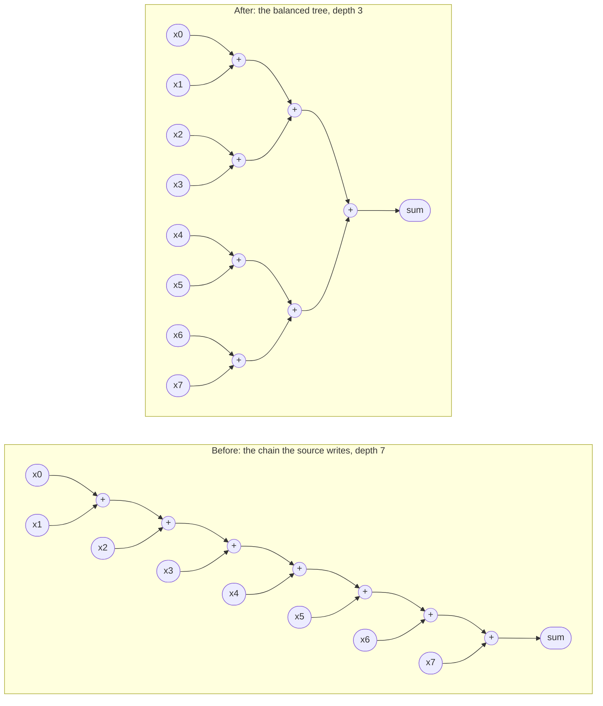

# 3.5 EXPRESSION_BALANCE

## 1. Introduction

EXPRESSION_BALANCE controls whether Vitis HLS may regroup a chain of associative operations, such as a run of additions, into a balanced tree.
An operation is associative when the grouping of its operands does not change the result, so that $(a+b)+c$ equals $a+(b+c)$.
Regrouping operands in this way is called reassociation.
A balanced tree is the grouping in which independent operations sit side by side, so the longest path of dependent operations, called the depth, falls from $n-1$ to $\lceil \log_2 n \rceil$ for $n$ operands.

What improves is latency, meaning the number of clock cycles from start to result, because a shorter dependent path needs fewer states of the finite state machine (FSM) that sequences the design.
What it costs is area.
In a chain, the operations happen one after another, so one partial sum is alive at a time and the tool can let one physical operator serve several of them in turn.
In a tree, several operations happen at the same moment, so each one needs its own operator and every partial sum needs its own register.
UG1399 puts it directly: expression balancing prohibits sharing and results in increased area.

This lesson measures both sides of that trade, on an integer sum of 32 scalars: **the latency falls from 5 cycles to 1, and the flip-flop count rises from 166 to 354.**

The defaults differ by type, and that difference is the second subject of this lesson.
For integers, balancing is on by default, because two's-complement addition is associative even when it overflows and wraps, so every grouping returns the same bits.
For `float` and `double`, balancing is off by default, because IEEE 754 arithmetic rounds after every operation, and rounding at different points gives different answers.
Vitis therefore keeps the order written in the C source for floating-point types, so that the hardware returns exactly what C simulation returns.

Use `-off` when area matters more than latency, or when you want a chain kept so that operators can be shared.
Use the directive without `-off` rarely, because for integers it restates the default.
Use neither form to speed up a floating-point sum without reading section 9 first.

The one question the documentation does not settle is whether the directive reaches floating-point expressions.
Section 7 answers it by measurement: **it does not.**

References: UG1399, [Optimizing Logic Expressions](https://docs.amd.com/r/2023.1-English/ug1399-vitis-hls/Optimizing-Logic-Expressions) and [set_directive_expression_balance](https://docs.amd.com/r/2022.2-English/ug1399-vitis-hls/set_directive_expression_balance).
The logic-expressions page names `config_compile -unsafe_math_optimizations` as the way to enable balancing for floating-point types.
The directive page says only that the directive enables balancing in its scope, without saying whether that reaches floats.

## 2. How it works



Both graphs contain seven adders and compute the same mathematical sum.
In the chain, every adder waits for the one before it, so the result is seven additions deep.
In the tree, the four first-level adders have no dependence on each other and can all run at once, and the result is only three additions deep.
For floats, the tree also computes a different number, because the partial sums are rounded at different points.

The scheduler, though, does not count graph depth.
It counts nanoseconds, and it has a transformation that changes the arithmetic of this picture before balancing is even considered.

**Ternary-adder fusion.**
Vitis does not build a 32-bit integer addition out of one binary adder per `+`.
Where two additions are chained, it fuses them into a single three-input adder, a **ternary adder**, whose root delay is 0.731 ns against 1.016 ns for one binary adder.
A chain of $n-1$ additions therefore becomes roughly one binary adder followed by $(n-2)/2$ ternary adders, so its delay path is about *half* the depth of its dependence graph.

This is why the choice of $n$ decides whether this lesson can measure anything at all.
Against the 2.431 ns per-state budget of section 5, three ternary adders in series cost 2.193 ns and fit in one state:

| operands $n$ | chain delay path | chain states | tree states | states saved |
| ------------ | ---------------- | ------------ | ----------- | ------------ |
| 8            | 1.02 + 3 x 0.73 = 3.21 ns | 2 | 2 | **0** |
| 32           | 1.02 + 15 x 0.73 = 11.98 ns | 6 | 2 | **4** |

At eight operands the chain and the tree land in the same two states, the directive changes the RTL but buys nothing, and the lesson has no latency to report.
At thirty-two the gap is wide enough to be the point.
That is why the integer kernel below sums 32 scalars and not 8.

## 3. The kernels

The lesson uses two kernels rather than one, because the two things it measures interfere with each other when they share a function.

`src/sum32.cpp` — the integer case, where the trade is visible:

```cpp
 1  #include "sum32.h"
 2
 3  // One integer sum of 32 scalars, written as the chain C's left-to-right
 4  // grouping gives it. There is no loop and no float here: this kernel exists to
 5  // make the chain long enough that balancing it changes the state count.
 6  // See README.md section 3 for why the inputs are scalars and not an array.
 7  void sum32(int a0, int a1, int a2, int a3, int a4, int a5, int a6, int a7,
 8             int a8, int a9, int a10, int a11, int a12, int a13, int a14,
 9             int a15, int a16, int a17, int a18, int a19, int a20, int a21,
10             int a22, int a23, int a24, int a25, int a26, int a27, int a28,
11             int a29, int a30, int a31, int *s) {
12      *s = a0  + a1  + a2  + a3  + a4  + a5  + a6  + a7
13         + a8  + a9  + a10 + a11 + a12 + a13 + a14 + a15
14         + a16 + a17 + a18 + a19 + a20 + a21 + a22 + a23
15         + a24 + a25 + a26 + a27 + a28 + a29 + a30 + a31;
16  }
```

`src/fsum8.cpp` — the float case, where the question is whether the directive applies at all:

```cpp
 1  #include "fsum8.h"
 2
 3  // One float sum of 8 scalars, the same shape as the integer chain in sum32.
 4  // Whether Vitis is allowed to regroup this expression is the question this
 5  // kernel answers, and the answer differs from the integer case because IEEE
 6  // 754 addition is not associative. See README.md section 1.
 7  void fsum8(float f0, float f1, float f2, float f3,
 8             float f4, float f5, float f6, float f7,
 9             float *sf) {
10      *sf = f0 + f1 + f2 + f3 + f4 + f5 + f6 + f7;
11  }
```

Neither kernel has a loop, as in lesson 3.2, so the location of every directive is the function itself.
C groups `+` from left to right, so each expression is the chain drawn on the left of section 2.

**Why two functions and not one.**
Putting both sums in one function is tempting, because one directive location would then govern both and any difference between them would come from type alone.
It does not work, for two reasons that this lesson learned the hard way.
The float chain is 77 states deep and the integer sum is 2 to 6, so the float half sets the function latency and hides the integer result behind it: `ap_done` never moves no matter what the directive does to the integers.
And an 8-operand integer sum, chosen to match the float one, is below the crossover in section 2, so it has no latency difference to hide in the first place.
Separating them lets each kernel report its own latency, and lets the integer one be as long as it needs to be.

**Why the inputs are scalars.**
A scalar argument becomes an `ap_none` port, which is a plain input wire whose value is available in the first state.
An array argument would become an `ap_memory` port that delivers at most two words per cycle, so reading 32 values would take 16 cycles on its own and would feed the chain no faster than a tree could use it, hiding the effect this lesson measures.
A 32-argument function signature is ugly, and it is the price of measuring the scheduler rather than the memory port.
Each pointer becomes an output port with an `ap_vld` strobe, a one-cycle valid signal the FSM raises in the state that writes the output, so `s_ap_vld` and `sf_ap_vld` are how each kernel is timed.

**The testbenches.**
Both follow lesson 3.3: poison the output before the call, compare bit for bit against a reference model written in the same left-to-right order as the source, run directed vectors first and then 1000 random vectors from a fixed seed, and return the error count so any failure makes cosim fail.

`tb/sum32_tb.cpp` **cannot detect reassociation**, and says so in its header.
Two's-complement addition is associative even when it wraps, so every grouping of the same 32 operands returns the same bits.
That is exactly why the tool is free to balance the expression, and it means the only evidence of balancing is in the schedule and the RTL, never in the results.
Its random integers are drawn from $[-2^{25}, 2^{25})$, so 32 of them sum to at most $2^{30}$ and cannot overflow a signed `int`, whose overflow is undefined behavior in C.

`tb/fsum8_tb.cpp` **can** detect reassociation, bit-exactly, and that is its whole purpose:

| directed case      | float inputs                     | chain result | adjacent-pair tree result |
| ------------------ | -------------------------------- | ------------ | ------------------------- |
| `zeros`            | all `+0.0f`                      | `+0.0`       | `+0.0`                    |
| `neg_zeros`        | all `-0.0f`                      | `-0.0`       | `-0.0`                    |
| `extremes`         | all `1.0f`                       | `8.0`        | `8.0`                     |
| `signs`            | $+2^{k}$ and $-2^{k}$ alternating | exact        | exact                     |
| `regroup_bait`     | $2^{24}$ then seven `1.0f`       | 16777216     | 16777222                  |
| `regroup_bait_rev` | seven `1.0f` then $2^{24}$       | 16777224     | 16777222                  |

In the chain, $2^{24}$ absorbs each added 1 one at a time, because the spacing between neighboring floats at $2^{24}$ is 2 and every $2^{24}+1$ is a tie that rounds back to the even neighbor.
In the tree, the ones are first added to each other, so they reach the large value as an exact 2 or 4 and survive.
The reversed case catches a tree that happens to pair the operands differently.
`neg_zeros` catches a tool that would start the sum from a `+0.0` constant.
The expected values were checked in single precision with numpy, and the run confirms them.

## 4. The solutions

Each kernel is built in its own project with the same three solutions, so six solutions in all.

| solution  | directives file                  | contents                                          |
| --------- | -------------------------------- | ------------------------------------------------- |
| `off`     | `directives_<top>_off.tcl`       | `set_directive_expression_balance -off <top>`      |
| `default` | `directives_<top>_default.tcl`   | comment only, no directive                        |
| `on`      | `directives_<top>_on.tcl`        | `set_directive_expression_balance <top>`          |

EXPRESSION_BALANCE is a directive Vitis applies on its own, so each kernel needs all three: `off` against `default` shows what the default does, and `default` against `on` shows whether the explicit directive adds anything.

All six share `common/part.tcl`, which sets the part, the 3.33 ns clock with 0.90 ns uncertainty, and `config_compile -pipeline_loops 0`.
That last setting has nothing to act on here, because neither kernel has a loop.
The project sets no `config_compile -unsafe_math_optimizations`, because that is a configuration, not the directive, and it would apply to every solution.

## 5. Predict

The scheduler plans each state against about 2.431 ns, which is the 3.33 ns clock minus the 0.90 ns uncertainty.
On this part a 32-bit binary adder costs 1.016 ns and a fused ternary adder 0.731 ns, so three ternary adders (2.193 ns) fit in one state and four (2.924 ns) do not.
The default float adder is the 11-stage `FAddSub_fulldsp` core measured in lesson 3.3, so each dependent float addition spans eleven states and produces its result in the last of them, which means the write of the output shares that final state rather than needing one of its own.

**`sum32`, `off`.**
The chain's delay path is one binary adder plus 15 ternary adders, $1.016 + 15 \times 0.731 = 11.98$ ns, which needs $\lceil 11.98 / 2.431 \rceil = 5$ states.
So `s_ap_vld` in state 5, latency 4, interval 5.

**`sum32`, `default` and `on`.**
The tree is five additions deep, and with fusion its delay path is one binary adder plus three ternary adders, $1.016 + 3 \times 0.731 = 3.21$ ns, which needs 2 states.
So `s_ap_vld` in state 2, latency 1, interval 2 — three states better than `off`.

**`fsum8`, all three.**
The float sum is not balanced in any solution, so the depth stays 7, the design has $11 \times 7 = 77$ states, `sf_ap_vld` is raised in state 77, the latency is 76 and the interval 77.
If `on` does balance it, the depth becomes 3, the design has 33 states, the latency falls to 32, and cosim fails on `regroup_bait`.
That failure would be the evidence.

The estimated clock should be about 2.193 ns for `sum32`, set by the three chained ternary adders, for a slack of $2.431 - 2.193 = +0.238$ ns.
For `fsum8` it should be 2.262 ns, the float adder stage, for a slack of $+0.169$ ns — unless the tool shares one adder core between the seven additions, in which case an operand multiplexer joins the critical path and the estimate gets worse.
Lesson 3.3 saw exactly that in its `tl_loose` solution, at 2.689 ns against the 2.262 ns of an unshared core.

## 6. Run

```bash
cd s3_parallelism/35_expression_balance
vitis_hls -f run_hls.tcl 2>&1 | tee run.log
for p in sum32_proj fsum8_proj; do
  bash ../../common/collect_latency.sh   $p
  bash ../../common/collect_resources.sh $p
done
```

The loop in `run_hls.tcl` builds each kernel in its own project:

```tcl
foreach top {sum32 fsum8} {
    open_project -reset ${top}_proj
    set_top $top
    add_files     $lesson_dir/src/$top.cpp     -cflags "-I$lesson_dir/src"
    add_files -tb $lesson_dir/tb/${top}_tb.cpp -cflags "-I$lesson_dir/src"
    foreach sol {off default on} {
        open_solution -reset $sol -flow_target vivado
        source $common_dir/part.tcl
        source $lesson_dir/directives_${top}_${sol}.tcl
        csynth_design
        if {[catch {cosim_design} err]} {
            puts "COSIM FAILED in $top/$sol: $err"
        }
    }
}
```

Co-simulation, often shortened to cosim, drives the generated RTL with the C testbench and compares its outputs.
It runs on every solution because this directive can change behavior: for `sum32` it is a plain correctness check, but for `fsum8` it is the experiment, since `on` is the solution where the tool might regroup a float sum.
The `catch` exists so that a reassociating solution reports its failure and the run still finishes.
There is no separate `csim_design` call, because `cosim_design` compiles and runs the same testbench, twice per solution.
A clean run therefore prints `TEST PASSED` exactly twelve times, and this run does.

The collectors print, sorted by solution name rather than build order:

```text
solution         best      worst     ii_min     ii_max   clk_est_ns
default             1          1          2          2        2.193
off                 5          5          6          6        2.193
on                  1          1          2          2        2.193

solution   module          BRAM_18K    DSP       FF      LUT   URAM
default    sum32                  0      0      354     1083      0
off        sum32                  0      0      166     1036      0
on         sum32                  0      0      354     1083      0

solution         best      worst     ii_min     ii_max   clk_est_ns
default            76         76         77         77        2.665
off                76         76         77         77        2.665
on                 76         76         77         77        2.665

solution   module          BRAM_18K    DSP       FF      LUT   URAM
default    fsum8                  0      2      478      707      0
off        fsum8                  0      2      478      707      0
on         fsum8                  0      2      478      707      0
```

Those twelve rows are the whole lesson in miniature.
`sum32` moves on every column that matters.
`fsum8` does not move at all.

## 7. Read the results

### 7.1 The log

```bash
grep -nE "^== kernel|^== solution|\[XFORM 203-11\]|\[HLS 200-(871|886|1016)\]|Estimated Fmax|TEST PASSED|COSIM FAILED" run.log
```

`XFORM 203-11` is the balancing message: "Balancing expressions in function ..." followed by a count of balanced expressions.
The `HLS 200-871`, `200-886` and `200-1016` identifiers catch a clock violation, and none of the six solutions shows one.

```text
17:== kernel sum32
27:== solution sum32/off
126:INFO: [HLS 200-789] **** Estimated Fmax: 456.00 MHz
1207:== solution sum32/default
1245:INFO: [XFORM 203-11] Balancing expressions in function 'sum32' (src/sum32.cpp:7)...31 expression(s) balanced.
1305:INFO: [HLS 200-789] **** Estimated Fmax: 456.00 MHz
2386:== solution sum32/on
2425:INFO: [XFORM 203-11] Balancing expressions in function 'sum32' (src/sum32.cpp:7)...31 expression(s) balanced.
2485:INFO: [HLS 200-789] **** Estimated Fmax: 456.00 MHz
3566:== kernel fsum8
3576:== solution fsum8/off
3651:INFO: [HLS 200-789] **** Estimated Fmax: 375.21 MHz
18964:== solution fsum8/default
19038:INFO: [HLS 200-789] **** Estimated Fmax: 375.21 MHz
34351:== solution fsum8/on
34426:INFO: [HLS 200-789] **** Estimated Fmax: 375.21 MHz
```

| kernel  | solution  | `203-11` lines | balanced count | `TEST PASSED` | `COSIM FAILED` |
| ------- | --------- | -------------- | -------------- | ------------- | -------------- |
| `sum32` | `off`     | none           | —              | 2             | none           |
| `sum32` | `default` | 1, at `src/sum32.cpp:7` | 31    | 2             | none           |
| `sum32` | `on`      | 1, at `src/sum32.cpp:7` | 31    | 2             | none           |
| `fsum8` | `off`     | none           | —              | 2             | none           |
| `fsum8` | `default` | none           | —              | 2             | none           |
| `fsum8` | `on`      | **none**       | —              | 2             | none           |

There are exactly two `XFORM 203-11` lines in the entire log, and both belong to `sum32`.

**`fsum8/on` is the headline.**
An explicit `set_directive_expression_balance fsum8` on a function whose only expression is a float sum produces **no balancing message at all**.
The tool did not decline for lack of an opportunity — the opportunity is a seven-deep chain sitting in plain sight — it simply does not consider floating-point expressions balanceable.
The message reports the location of the *function*, `src/sum32.cpp:7`, not of the expression, so its absence cannot be blamed on a line-number quirk.

The count for `sum32` is 31, which is every addition in the expression.

### 7.2 `sum32`: the trade, measured

| solution  | est. clock (ns) | slack (ns) | latency | interval | FSM states | `s` state | cosim latency | cosim total cycles |
| --------- | --------------- | ---------- | ------- | -------- | ---------- | --------- | ------------- | ------------------ |
| `off`     | 2.193           | +0.238     | **5**   | **6**    | **6**      | **6**     | 5             | 6035               |
| `default` | 2.193           | +0.238     | **1**   | **2**    | **2**      | **2**     | 1             | 2011               |
| `on`      | 2.193           | +0.238     | 1       | 2        | 2          | 2         | 1             | 2011               |

Slack is the effective delay budget minus the estimated period, as in lesson 3.3: the budget is the target minus the uncertainty, $3.330 - 0.899 = 2.431$ ns.
The estimated period of 2.193 ns is exactly $3 \times 0.731$, three chained ternary adders, and corresponds to the 456.00 MHz that `run.log` reports.
All three solutions hit the same clock, which is the point: **balancing bought cycles, not nanoseconds.**
Cosim confirms both latencies exactly, and the total execution time falls from 6035 to 2011 cycles over the same 1006 calls, a 3.0x throughput gain.

The per-state delays say how each shape was packed:

```text
off                        default and on
State 1 <Delay = 1.01>     State 1 <Delay = 1.74>
State 2 <Delay = 2.19>     State 2 <Delay = 2.19>
State 3 <Delay = 2.19>
State 4 <Delay = 2.19>
State 5 <Delay = 2.19>
State 6 <Delay = 2.19>
```

`off` spends state 1 on a single binary adder and then packs exactly three ternary adders into each of states 2 to 6: $31 = 1 + 5 \times 6$ additions.
`default` puts thirteen additions in state 1 and the remaining eighteen plus the write in state 2.

```bash
for s in off default on; do
  echo "== $s"
  grep -E "^ST_[0-9]+ : Operation .*(= add |Write)" \
       sum32_proj/$s/.autopilot/db/sum32.verbose.sched.rpt
done
```

```text
== off, state 1 and the head of state 2
ST_1 : (1.01ns)                             %add_ln12   = add i32 %a1_read, i32 %a0_read
ST_2 : (0.00ns) (grouped into TernaryAdder) %add_ln12_1 = add i32 %add_ln12,   i32 %a2_read
ST_2 : (0.73ns) (root node of TernaryAdder) %add_ln12_2 = add i32 %add_ln12_1, i32 %a3_read
ST_2 : (0.00ns) (grouped into TernaryAdder) %add_ln12_3 = add i32 %add_ln12_2, i32 %a4_read
ST_2 : (0.73ns) (root node of TernaryAdder) %add_ln12_4 = add i32 %add_ln12_3, i32 %a5_read
ST_2 : (0.00ns) (grouped into TernaryAdder) %add_ln12_5 = add i32 %add_ln12_4, i32 %a6_read
ST_2 : (0.73ns) (root node of TernaryAdder) %add_ln12_6 = add i32 %add_ln12_5, i32 %a7_read

== default and on, state 1 in full
ST_1 : (1.01ns)                             %add_ln15    = add i32 %a1_read,  i32 %a0_read
ST_1 : (1.01ns)                             %add_ln15_1  = add i32 %a2_read,  i32 %a3_read
ST_1 : (1.01ns)                             %add_ln15_4  = add i32 %a6_read,  i32 %a7_read
ST_1 : (1.01ns)                             %add_ln15_8  = add i32 %a8_read,  i32 %a9_read
ST_1 : (1.01ns)                             %add_ln15_9  = add i32 %a10_read, i32 %a11_read
ST_1 : (1.01ns)                             %add_ln15_12 = add i32 %a14_read, i32 %a15_read
ST_1 : (1.01ns)                             %add_ln15_17 = add i32 %a18_read, i32 %a19_read
ST_1 : (1.01ns)                             %add_ln15_20 = add i32 %a22_read, i32 %a23_read
ST_1 : (1.01ns)                             %add_ln15_23 = add i32 %a24_read, i32 %a25_read
ST_1 : (1.01ns)                             %add_ln15_24 = add i32 %a26_read, i32 %a27_read
ST_1 : (0.00ns) (grouped into TernaryAdder) %add_ln15_26 = add i32 %a28_read, i32 %a29_read
ST_1 : (1.01ns)                             %add_ln15_27 = add i32 %a30_read, i32 %a31_read
ST_1 : (0.73ns) (root node of TernaryAdder) %add_ln15_28 = add i32 %add_ln15_27, i32 %add_ln15_26
```

The two shapes are unmistakable.
In `off` every addition takes the previous result and one fresh input port — the chain of the source, exactly as written, with the first pair swapped to `a1 + a0` by a front-end canonicalisation that is not balancing.
In `default` the first thirteen additions take **two input ports each**: they are the leaves of a tree, and they all happen at once.

Note the line-number suffixes.
In `off` they track the source lines the additions were written on, `_ln12` through `_ln15`.
In `default` every operation is renamed `add_ln15_*`: balancing rebuilt the expression as one object and attributed the whole of it to the last line it spans.
That renaming is itself a reliable signal that the expression was rewritten.

```bash
grep -n -B1 "s_ap_vld = 1'b1;" sum32_proj/*/syn/verilog/sum32.v
```

```text
sum32_proj/off/syn/verilog/sum32.v:     if ((1'b1 == ap_CS_fsm_state6))
sum32_proj/default/syn/verilog/sum32.v: if ((1'b1 == ap_CS_fsm_state2))
sum32_proj/on/syn/verilog/sum32.v:      if ((1'b1 == ap_CS_fsm_state2))
```

### 7.3 `sum32`: where the area went

| solution  | DSP | FF      | LUT      | Expression LUT | Multiplexer LUT | Register FF |
| --------- | --- | ------- | -------- | -------------- | --------------- | ----------- |
| `off`     | 0   | **166** | **1036** | 999            | 37              | 166         |
| `default` | 0   | **354** | **1083** | 1069           | 14              | 354         |
| `on`      | 0   | 354     | 1083     | 1069           | 14              | 354         |

Here LUT means the look-up tables that implement general logic and FF means flip-flops; there are no DSP slices, because integer addition on this part is built from LUTs and the dedicated carry chain.

Accounting for the change from `off` to `default` line by line:

| table       | row name                             | `off`      | `default`  | delta    | what it is |
| ----------- | ------------------------------------ | ---------- | ---------- | -------- | ---------- |
| Expression  | 31 `+` rows on `add_ln*` and `s`      | 999 LUT    | 1069 LUT   | **+70**  | 1 binary + 15 ternary adders, against 11 binary + 10 ternary |
| Multiplexer | `ap_NS_fsm`                           | 37 LUT     | 14 LUT     | **-23**  | FSM next-state decode, 7 inputs against 3 |
| Register    | partial sums + `ap_CS_fsm`            | 166 FF     | 354 FF     | **+188** | 5 live partial sums against 11 |
| **Total**   |                                       | **1036 LUT, 166 FF** | **1083 LUT, 354 FF** | **+47 LUT, +188 FF** | |

Three readings come out of this table, and together they are the textbook trade made concrete.

**The Expression rows show how a ternary adder is billed.**
A standalone 32-bit binary adder is one row at 39 LUT.
A fused ternary adder appears as two rows at 32 LUT each, the "grouped" operation and the "root node", for 64 LUT.
`off` has 1 binary and 15 ternary adders: $39 + 15 \times 64 = 999$.
`default` has 11 binary and 10 ternary adders: $11 \times 39 + 10 \times 64 = 1069$.
Both realise all 31 additions — nothing was shared in either solution — but the chain gets to use the cheaper operator more often, because a chain is exactly the shape ternary fusion wants.
The tree's leaves have no chained predecessor to fuse with, so they stay binary.

**The Register rows are the real cost, and they are the tree's parallelism made visible.**
`off` runs six states and carries **one** 32-bit partial sum across each of its five state boundaries, for $5 \times 32 + 6 = 166$ FF including the 6-bit one-hot FSM.
`default` runs two states with a single boundary, but **eleven** partial sums cross it at once, for $11 \times 32 + 2 = 354$ FF.
This is precisely what "a tree needs its own operator, and its own register, for every simultaneous operation" means, and it more than doubles the flip-flop count.

**The multiplexer row goes the other way.**
A 6-state FSM needs more next-state decode than a 2-state one, so `off` pays 37 LUT where `default` pays 14.
That 23 LUT refund is why the total LUT delta is only +47 rather than +70.

```bash
norm() { sed -E 's/_(fu|reg)_[0-9]+/_\1_N/g' "$1"; }
diff <(norm sum32_proj/default/syn/verilog/sum32.v) \
     <(norm sum32_proj/on/syn/verilog/sum32.v) | wc -l
```

| comparison              | raw diff lines | normalised diff lines |
| ----------------------- | -------------- | --------------------- |
| `default` against `on`  | **0**          | **0**                 |
| `off` against `default` | 326            | 320                   |

`default` and `on` are byte-identical, so normalisation is not even needed.
For an integer expression, `set_directive_expression_balance` without `-off` produces exactly the file the tool produces with no directive at all.

### 7.4 `fsum8`: the null result

| solution  | est. clock (ns) | slack (ns) | latency | interval | FSM states | `sf` state | DSP | FF  | LUT |
| --------- | --------------- | ---------- | ------- | -------- | ---------- | ---------- | --- | --- | --- |
| `off`     | 2.665           | -0.234     | 76      | 77       | 77         | 77         | 2   | 478 | 707 |
| `default` | 2.665           | -0.234     | 76      | 77       | 77         | 77         | 2   | 478 | 707 |
| `on`      | 2.665           | -0.234     | 76      | 77       | 77         | 77         | 2   | 478 | 707 |

| comparison              | raw diff lines |
| ----------------------- | -------------- |
| `off` against `default` | **0**          |
| `default` against `on`  | **0**          |

**All three solutions are byte-identical.**
Every number matches, every line of Verilog matches, and no balancing message was printed for any of them.
The schedule confirms the shape directly: seven `fadd` operations, each spanning eleven states, each taking the previous result and one fresh input port.

```text
ST_1  to ST_11 : (2.26ns)  %add  = fadd i32 %f0_read, i32 %f1_read
ST_12 to ST_22 : (2.26ns)  %add1 = fadd i32 %add,  i32 %f2_read
ST_23 to ST_33 : (2.26ns)  %add2 = fadd i32 %add1, i32 %f3_read
ST_34 to ST_44 : (2.26ns)  %add3 = fadd i32 %add2, i32 %f4_read
ST_45 to ST_55 : (2.26ns)  %add4 = fadd i32 %add3, i32 %f5_read
ST_56 to ST_66 : (2.26ns)  %add5 = fadd i32 %add4, i32 %f6_read
ST_67 to ST_77 : (2.26ns)  %add6 = fadd i32 %add5, i32 %f7_read
ST_77          : (0.00ns)  %write_ln10 = write ... i32 %sf, i32 %bitcast_ln10
```

No `fadd` anywhere takes two input ports except the first, on `f0` and `f1`.
That is line 10 exactly as written, in all three solutions, and it is the answer to the question section 1 left open.

The resource detail explains the 2.665 ns, which is the one number in this kernel that misses its prediction:

| table       | row                                    | value |
| ----------- | -------------------------------------- | ----- |
| Instance    | `fadd_32ns_32ns_32_11_full_dsp_1_U1`   | 2 DSP, 369 FF, 236 LUT — **one core** |
| Expression  | —                                      | empty: there is no integer arithmetic in this kernel |
| Multiplexer | `ap_NS_fsm` / `grp_fu_93_p0` / `_p1`   | 414 + 14 + 43 = 471 LUT |
| Register    | `ap_CS_fsm` / `reg_105`                | 77 + 32 = 109 FF |

The seven sequential float additions **share one adder core**, with `reg_105` holding the running partial sum, `grp_fu_93_p0` selecting between that register and `f0`, and `grp_fu_93_p1` selecting among `f1` through `f7`.
The core's own delay is 2.262 ns, and the scheduler charges 2.66 ns to the state in which each `fadd` starts against 2.26 ns for its remaining ten states.
The difference, 0.403 ns, is that seven-way operand multiplexer sitting in front of the shared core.
Sharing saved six copies of a 2-DSP, 369-FF, 236-LUT core and cost 0.403 ns of clock — a trade the tool made without being asked, and the same one lesson 3.3 measured in its `tl_loose` solution.

Vitis raises no clock-violation message even though the estimate is 0.234 ns over the 2.431 ns budget, because the estimate is still well under the 3.33 ns target itself; the uncertainty is a scheduling margin, not a limit the reporter checks.

### 7.5 Predicted and measured

| kernel  | quantity          | predicted | `off` | `default` | `on` |
| ------- | ----------------- | --------- | ----- | --------- | ---- |
| `sum32` | latency           | 4, 1, 1   | **5 ✗** | 1 ✓ | 1 ✓ |
| `sum32` | interval          | 5, 2, 2   | **6 ✗** | 2 ✓ | 2 ✓ |
| `sum32` | `s` state         | 5, 2, 2   | **6 ✗** | 2 ✓ | 2 ✓ |
| `sum32` | est. clock (ns)   | 2.193     | 2.193 ✓ | 2.193 ✓ | 2.193 ✓ |
| `sum32` | `default` = `on`  | identical | — | 0 diff lines ✓ | 0 diff lines ✓ |
| `fsum8` | latency           | 76        | 76 ✓ | 76 ✓ | 76 ✓ |
| `fsum8` | interval          | 77        | 77 ✓ | 77 ✓ | 77 ✓ |
| `fsum8` | `sf` state        | 77        | 77 ✓ | 77 ✓ | 77 ✓ |
| `fsum8` | est. clock (ns)   | 2.262     | **2.665 ✗** | **2.665 ✗** | **2.665 ✗** |
| `fsum8` | float regrouped?  | no        | no ✓ | no ✓ | **no ✓** |
| both    | `TEST PASSED`     | 2 each    | 2 ✓ | 2 ✓ | 2 ✓ |

Two misses, both instructive and both anticipated as risks in section 5.

**`sum32/off` needs six states, not five.**
The prediction divided the chain's total delay by the state budget, $\lceil 11.98 / 2.431 \rceil = 5$, which assumes the scheduler can fill every state to the brim.
It cannot: it packs whole ternary adders, three to a state at 2.193 ns, and the one leftover binary adder at the head of the chain gets a state of its own at 1.016 ns.
So the count is $1 + \lceil 15 / 3 \rceil = 6$, not $\lceil 11.98 / 2.431 \rceil$.
**The lesson is to predict in units of whole operators, not nanoseconds** — the scheduler does not split an adder across a state boundary.
Note that this miss makes the directive look *better* than predicted: the saving is four states, not three.

**`fsum8`'s clock is 2.665 ns, not 2.262 ns**, because the float adder is shared and its operand multiplexer joins the critical path, as section 7.4 sets out.
Section 5 flagged this as the open question about sharing, and the Instance table answered it.

## 8. Hardware implications

**In the integer half, the trade is real and it is worth knowing its shape.**
One directive moved a 32-operand sum from 6 states to 2, and from 166 flip-flops to 354.
Buying a 5x latency improvement with a 113% increase in registers and a 4.5% increase in LUTs is usually a good deal, which is why it is the default — but it is a deal, not a free lunch, and on a design that instantiates this sum a thousand times the flip-flop cost is what will bite.
`-off` is the lever for that case, and it is the only form of this directive that ever changes an integer design.

The flip-flop cost is the part most often forgotten, so it is worth restating mechanically.
A chain has one value in flight at a time, so it needs one register per state boundary, and it can have many boundaries cheaply.
A tree has many values in flight at once, so it needs many registers at its one boundary.
Balancing does not merely convert cycles into adders; it converts *sequential* storage into *parallel* storage, and parallel storage is what costs flip-flops.

**Ternary-adder fusion decides where the crossover sits.**
This is the piece that does not appear in the documentation and that a depth-counting mental model will get wrong.
A chain of $n-1$ integer additions is not $n-1$ adder delays deep; it is about $(n-2)/2$ ternary-adder delays deep, and at 0.731 ns each, three of them fit in a 2.431 ns state.
An 8-operand sum therefore shows no latency difference at all between `off` and `default`, and a 32-operand one shows four states.
Before reaching for this directive, or before predicting what removing it will do, work out how many *whole ternary adders* the chain becomes and how many fit in a state.

**In the float half, nothing happened, and the reason is arithmetic rather than engineering.**
IEEE 754 addition is not associative, so regrouping a float sum changes the number the circuit returns.
Vitis will not make that change on the strength of a scheduling directive, and this lesson shows it will not make it even when explicitly asked: `fsum8/on` produced no balancing message and RTL identical to `fsum8/off`, down to the byte.
Had it balanced the sum, four float additions would have become simultaneous in the first eleven states, which needs at least four adder cores at 2 DSP each — DSP would have gone from 2 to at least 8 — and the latency would have fallen from 76 to 32.
The twelve `TEST PASSED` lines are the proof that none of it happened.

**Portability to an ASIC flow.**
The decision to balance is taken before any RTL exists, so the tree, the state boundaries and the registers carry over unchanged to a standard-cell flow.
Within a single state, an ASIC logic synthesizer such as Design Compiler or Genus rebuilds a multi-operand integer sum on its own, typically as a carry-save tree, so the 70-LUT Expression difference is the kind of difference that would be erased downstream.
Across state boundaries it cannot help, because it does not move registers between FSM states, so **the four states `sum32` saves are real in both flows, and so are the 188 flip-flops they cost.**
The 1.016 ns binary and 0.731 ns ternary delays that decide how many additions fit in a state reflect the FPGA carry chain and its dedicated `CARRY8` blocks, so an ASIC library would pack the states differently and would move the crossover point of section 2.
The float cores and their DSP slices are FPGA-only and would become a library floating-point adder.
The rule that float reassociation changes results comes from IEEE 754, not from the technology, so it carries over unchanged.

**The practical rule.**
For integers, the tool has already balanced your expression; the directive without `-off` is a no-op on the generated RTL, and the useful form is `-off`, when registers are scarcer than cycles.
For floats, the directive does nothing in either form, and section 9 says what to do instead.

## 9. One common mistake and one question

**The mistake: expecting the directive to speed up a rolled accumulation loop.**
Lesson 3.3's `acc` loop computes `sum += x[i]`, and it looks like a long chain of additions.
Expression balancing works on an expression inside one scope, however, and a rolled loop contains a single addition whose other operand is last iteration's result held in a register.
There is no expression of 32 terms to regroup, so the directive has nothing to act on until the loop is unrolled, which is lesson 3.1.
For a `float` sum, even the unrolled expression stays a chain, for the reason this lesson measures.

A second mistake worth naming: **expecting the state count to follow the depth of the dependence graph.**
It follows the delay of the longest path measured in whole operators, and on an integer sum the tool halves that path with ternary adders before the scheduler ever sees it.

**The question.**
You want `fsum8` to become a tree, and you also want cosim to stay bit-exact against C simulation.
What do you change, and why does neither the directive nor `config_compile -unsafe_math_optimizations` meet the second condition?

<details>
<summary>Answer</summary>

Rewrite line 10 as the tree itself:

```cpp
*sf = ((f0 + f1) + (f2 + f3)) + ((f4 + f5) + (f6 + f7));
```

The C source now specifies the tree, so C simulation computes the tree, and Vitis keeps the written order for floats, so the RTL computes the same tree.
The two agree bit for bit, and the design drops from 77 states to 33, so the latency falls from 76 to 32 cycles.
The testbench's reference model has to change with it, and `regroup_bait` then expects 16777222 instead of 16777216, because the tree is a different computation with a different correctly rounded answer.

Expect the area to move as well, in the same direction `sum32` moved.
The tree's four first-level additions are simultaneous, so the single shared `fadd` core of section 7.4 becomes several, and the 2 DSP of every solution here becomes at least 8.
That is the trade this lesson's float kernel never got to make, and it is the same trade its integer kernel made in flip-flops.

Any tool-driven reassociation changes the hardware while leaving the C chain as the reference, so a bit-exact testbench fails on `regroup_bait`.
The directive turns out not to offer the option at all — section 7.4 shows `on` leaving the expression untouched and printing no balancing message — so `-unsafe_math_optimizations` is the only tool-side route, and it applies to every function in the solution rather than one scope, which is a second reason this lesson does not use it.
**The only reassociation of floats that stays bit-exact against C simulation is one written in the C source.**

</details>
