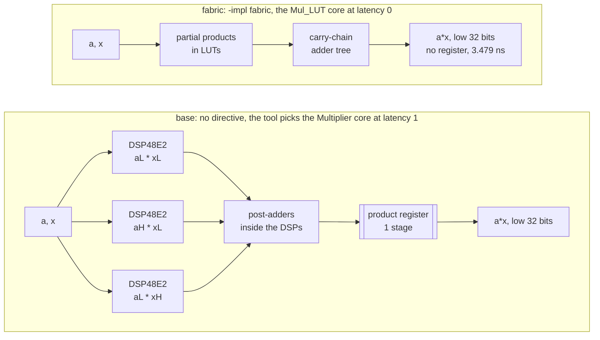

# 4.1 BIND_OP

## 1. Introduction

BIND_OP tells Vitis HLS which hardware to build for one arithmetic operation in the source, and how many clock cycles that hardware may take.
An *operation* is a single C++ operator, such as the `*` in `b * x`.
The hardware that carries it out is called a *core*, which is a prebuilt block from the tool's library, and choosing a core for an operation is called *binding*.
Without the directive, the tool binds every operation itself.
With it, you choose the implementation, the latency, or both, one variable at a time.

The directive has two settings.
The first, `-impl`, chooses the resource the core is built from.
For a multiply on this part the two choices are `dsp` and `fabric`.
A *DSP slice* is a hard block on the FPGA; on UltraScale+ it is the DSP48E2, which contains a 27 by 18 bit multiplier, an adder and its own pipeline registers.
*Fabric* means the general programmable logic, built from LUTs and FFs.
A *LUT*, or lookup table, is the small programmable cell that implements arbitrary logic, and an *FF*, or flip-flop, is a one-bit register.
The second setting, `-latency`, chooses how many clock cycles the core takes from its inputs to its result, which is the number of register stages placed inside it.

What improves depends on which setting you change and in which direction.
Moving a multiply to fabric frees DSP slices for the rest of a larger design, and it costs about a thousand LUT per 32-bit multiply.
Raising the latency shortens the logic between registers, so the core can run at a faster clock, and it costs extra cycles and extra registers.
Lowering the latency to zero removes the registers and saves cycles.
The price is that the whole multiply must then fit inside one clock period, and lesson 3.2 already showed that Vitis breaks the clock rather than refusing such a request.

The two settings are less independent than they look, and that is the surprise of this lesson.
Naming `-impl` without naming `-latency` does not leave the pipelining to the scheduler's timing judgement.
It selects a specific library core, and the core it selects is the combinational one.
Section 7 shows `-impl fabric` alone producing a design that misses the clock by 1.05 ns, for exactly this reason.

Use BIND_OP when the automatic choice does not suit the rest of the system.
Typical cases are running out of DSP slices, a timing path through a multiply that fails in Vivado, or an operator whose latency must match a hand-written pipeline beside it.
Every variant in this lesson changes the hardware, unlike 1.2 LOOP_TRIPCOUNT or the satisfied `-min` of 3.2.

The Tcl command is described in UG1399 at [set_directive_bind_op](https://docs.amd.com/r/2023.2-English/ug1399-vitis-hls/set_directive_bind_op).
The pragma page, [pragma HLS bind_op](https://docs.amd.com/r/2023.2-English/ug1399-vitis-hls/pragma-HLS-bind_op), holds the table of legal operation, implementation and latency combinations.

## 2. How it works

The directive names a function and a variable, and it binds the operation whose result is assigned to that variable.
It binds exactly one operation per directive, so a function with three multiplies needs three directives to move all of them.



A 32-bit C++ multiply keeps only the low 32 bits of the full 64-bit product, but the DSP multiplier is only 27 by 18 bits wide.
The core therefore splits each operand into a low part of 17 bits and a high part of 15 bits, $a = 2^{17}a_H + a_L$, and builds the product from partial products.

$$
a\,x \bmod 2^{32} \;=\; \left(a_L x_L \;+\; 2^{17}\left(a_H x_L + a_L x_H\right) \;+\; 2^{34} a_H x_H\right) \bmod 2^{32}
$$

The last term is a multiple of $2^{34}$, so it vanishes modulo $2^{32}$ and never needs to be built.
Three partial products remain, each fitting in one 27 by 18 multiplier, which is why lesson 3.2 measured 3 DSP per multiply and 9 DSP for the function.
The exact split point is the core's own choice, but the count of three follows from the widths.
The `fabric` implementation builds the same partial products from LUTs and sums them with carry chains, which is why it costs no DSP and roughly a thousand LUT.

The latency setting is independent of the implementation in the sense that both `dsp` and `fabric` cores exist at several latencies.
It is *not* independent in the sense that leaving it out means "whatever the tool likes".
Vitis HLS names its multiply cores `Multiplier`, `Mul_DSP` and `Mul_LUT`, and only the first of the three is the pipelined one the scheduler reaches for on its own.
Writing `-impl dsp` or `-impl fabric` moves the operation to `Mul_DSP` or `Mul_LUT`, whose latency is 0 unless `-latency` says otherwise.
Each register stage that `-latency` does add costs one more state wherever the core sits on the critical path.

## 3. The kernel

```cpp
#include "poly.h"

// Lesson 4.1 BIND_OP. The body is the poly kernel of lesson 3.2, unchanged.
// Each multiply is assigned to a named variable, because BIND_OP selects the
// operation it binds through the variable that receives the result.
// LLVM reassociates a * (x * x) into (a * x) * x, so the multiply named sq
// does not survive as written. README section 7 checks what happens to it.
void poly(data_t x, data_t a, data_t b, data_t c, data_t *y) {
    data_t sq   = x * x;        // MUL_SQ
    data_t lin  = b * x;        // MUL_B
    data_t quad = a * sq;       // MUL_A
    *y = quad + lin + c;        // ADD_QL and ADD_C
}
```

The kernel has no loop, so there is nothing to label, and the comments name each operation instead.
`data_t` is `int`, so every multiply is a signed 32-bit multiply whose result is truncated to 32 bits.
The scalar arguments become *ap_none* ports, which are bare input buses with no handshake.
The pointer becomes an *ap_vld* output port, which is a bus with one valid signal.

In 3.2 the schedule never contained `x * x`.
LLVM, the compiler framework underneath Vitis, rewrote `a * (x * x)` as `(a * x) * x` because the two forms give the same result modulo $2^{32}$.
The surviving multiplies in `base` are therefore `mul_ln11`, which is `a * x` and takes its name from the line the rewrite came from, then `quad`, which is `mul_ln11 * x`, and `lin` beside them.
The critical path is two multiplies deep either way, and one fused three-input adder produces `y` in the last state.
Whether a directive written against `sq` survives that rewrite is the open question of the lesson, and section 7 answers it.

## 4. The solutions

| Solution | Directive on `sq`, `lin` and `quad` | The one difference from `base`                                    |
| -------- | ----------------------------------- | ----------------------------------------------------------------- |
| `base`   | none                                | none; the tool picks `Multiplier` on DSP slices with latency 1     |
| `fabric` | `-op mul -impl fabric`              | the multiplies leave the DSP slices; no latency is requested       |
| `lat0`   | `-op mul -impl dsp -latency 0`      | DSP multiplies with no register stage                              |
| `lat3`   | `-op mul -impl dsp -latency 3`      | DSP multiplies with three register stages                          |

In `lat0` and `lat3`, `-impl dsp` restates the resource the tool already chooses in `base`.
It is there so that the tool cannot meet an unusual latency by quietly switching to fabric, which is what `max1` did in 3.2.
With the implementation fixed, the latency is the only effective difference.
Each solution file holds three directives, one per multiply, because one directive binds one operation.

## 5. Predict

Lesson 3.2 measured that a multiply core of latency $L$ occupies $L + 1$ states, because its result is registered and read in the state after the last stage.
Two such multiplies sit on the critical path, followed by one state for the adder and the port write.
A *state* is one clock cycle of the controller's finite state machine, and the *interval* is the number of cycles between the start of one call and the earliest start of the next.

$$
\textrm{states} = 2(L+1) + 1, \qquad \textrm{latency} = \textrm{states} - 1, \qquad \textrm{interval} = \textrm{latency} + 1
$$

With $L = 1$ this gives the 5 states, latency 4 and interval 5 measured in 3.2.

These are the predictions, written before running.

| Solution | $L$ per multiply       | States | Latency | Interval | DSP | LUT            | Estimated clock      |
| -------- | ---------------------- | ------ | ------- | -------- | --- | -------------- | -------------------- |
| `base`   | 1                      | 5      | 4       | 5        | 9   | 242            | 2.365 ns             |
| `fabric` | 1, if the tool picks 1 | 5      | 4       | 5        | 0   | about 3,250    | below 3.33 ns        |
| `lat0`   | 0                      | 3      | 2       | 3        | 9   | about 242      | **above 3.33 ns**    |
| `lat3`   | 3                      | 9      | 8       | 9        | 9   | about 242      | at most 2.365 ns     |

The two headline numbers are these: `lat3` has latency 8, and `fabric` uses 0 DSP.

The `fabric` LUT figure starts from base's 242 LUT, removes the three DSP cores at 49 LUT each, and adds three fabric multipliers at the 1,053 LUT measured in 3.2 for the combinational fabric core, giving $242 - 3 \cdot 49 + 3 \cdot 1053 = 3254$.
A pipelined fabric core adds registers on top of this, so treat the figure as a lower bound.
The 3.2 fabric core had a delay of 3.479 ns, which does not fit in the 2.431 ns budget per state.
Split into two stages, however, each half is about 1.74 ns, so a single register stage should be enough, and I predict the tool picks $L = 1$ and keeps latency 4.

`lat0` asks three cascaded DSP multipliers and their post-adders to settle in one state.
This is essentially the same combinational multiply that broke the clock in 3.2, only placed in DSPs rather than LUTs.
I predict a negative slack with the `HLS 200-871` warning, and a run that still exits 0.

`lat3` should keep the estimated clock at or below base's 2.365 ns and spend its extra registers on four more states.
Those registers are the ones that would let the design close at a faster clock, but at 3.33 ns base already meets timing, so the extra latency buys nothing here.

Schedule sketches, where `[k/n]` means stage k of an n-state core counted down as Vitis prints it:

**base**, $L = 1$:

| Operation     | S1    | S2    | S3    | S4    | S5     |
| ------------- | ----- | ----- | ----- | ----- | ------ |
| `a*x`         | [2/2] | [1/2] |       |       |        |
| `quad`        |       |       | [2/2] | [1/2] |        |
| `lin`         |       |       | [2/2] | [1/2] |        |
| add, write y  |       |       |       |       | y_ap_vld |

**lat0**, $L = 0$:

| Operation     | S1    | S2    | S3       |
| ------------- | ----- | ----- | -------- |
| first multiply| comb  |       |          |
| `quad`        |       | comb  |          |
| `lin`         |       | comb  |          |
| add, write y  |       |       | y_ap_vld |

**lat3**, $L = 3$:

| Operation     | S1    | S2    | S3    | S4    | S5    | S6    | S7    | S8    | S9       |
| ------------- | ----- | ----- | ----- | ----- | ----- | ----- | ----- | ----- | -------- |
| first multiply| [4/4] | [3/4] | [2/4] | [1/4] |       |       |       |       |          |
| `quad`        |       |       |       |       | [4/4] | [3/4] | [2/4] | [1/4] |          |
| `lin`         |       |       |       |       | [4/4] | [3/4] | [2/4] | [1/4] |          |
| add, write y  |       |       |       |       |       |       |       |       | y_ap_vld |

`lin` has slack, because it depends only on inputs, so the tool may start it earlier than drawn.
That would not change the state count.

## 6. Run

```bash
cd hls-directives/s4_resources/41_bind_op
vitis_hls -f run_hls.tcl 2>&1 | tee run.log
```

This runs C simulation once in `base` and C synthesis in all four solutions.
Co-simulation is not run, because BIND_OP cannot change what the function computes.
Every core still delivers the low 32 bits of the same product, and only its cost and its cycle count change.
The line that would run it is present in `run_hls.tcl`, commented out, if you want to see the nine-state handshake of `lat3` as a waveform.

The whole run takes well under a minute. C simulation prints `TEST PASSED: 2513 vectors` in `base`, and each of the four solutions then prints one `Estimated Fmax` line.

The Vivado synthesis export is optional and slow, a few minutes per solution:

```bash
vitis_hls -f export_syn.tcl 2>&1 | tee export.log
```

It is the only way to check two numbers that C synthesis estimates poorly.
The first is the real LUT cost of the fabric multipliers.
The second is whether the extra registers of `lat3` cost any fabric FF at all, or whether Vivado packs them into the DSP slices' internal pipeline registers, just as it moved `bram_lat2`'s output register into the block RAM in 2.3.
Section 7 shows that C synthesis does not even try to answer the second one.

## 7. Read the results

### The log

```bash
grep -n "Running: set_directive_bind_op" run.log
grep -Ein "WARNING.*(latency constraint|exceeds the target|critical path)" run.log
grep -n  "Estimated Fmax" run.log
```

Grep the exact command name rather than `bind_op`, because the lesson directory is itself called `41_bind_op` and appears in every path Vitis prints.
BIND_STORAGE printed no message of its own when it was applied (2.3), and BIND_OP behaves the same way: the only trace in the log is the Tcl echo of the nine directives.
The absolute paths have been shortened to `src/poly.cpp` in the blocks below; everything else is as printed.

```text
120:INFO: [HLS 200-1510] Running: set_directive_bind_op -op mul -impl fabric poly sq
121:INFO: [HLS 200-1510] Running: set_directive_bind_op -op mul -impl fabric poly lin
122:INFO: [HLS 200-1510] Running: set_directive_bind_op -op mul -impl fabric poly quad
206:INFO: [HLS 200-1510] Running: set_directive_bind_op -op mul -impl dsp -latency 0 poly sq
207:INFO: [HLS 200-1510] Running: set_directive_bind_op -op mul -impl dsp -latency 0 poly lin
208:INFO: [HLS 200-1510] Running: set_directive_bind_op -op mul -impl dsp -latency 0 poly quad
289:INFO: [HLS 200-1510] Running: set_directive_bind_op -op mul -impl dsp -latency 3 poly sq
290:INFO: [HLS 200-1510] Running: set_directive_bind_op -op mul -impl dsp -latency 3 poly lin
291:INFO: [HLS 200-1510] Running: set_directive_bind_op -op mul -impl dsp -latency 3 poly quad

158:WARNING: [HLS 200-1015] Estimated delay (3.479ns) of 'mul' operation 32 bit ('sq', src/poly.cpp:9) exceeds the target cycle time (target cycle time: 3.330ns, clock uncertainty: 0.899ns, effective cycle time: 2.431ns).
161:WARNING: [HLS 200-871] Estimated clock period (3.479 ns) exceeds the target (target clock period: 3.330 ns, clock uncertainty: 0.899 ns, effective delay budget: 2.431 ns).
163:WARNING: [HLS 200-1016] The critical path in module 'poly' consists of the following:
244:WARNING: [HLS 200-871] Estimated clock period (3.330 ns) exceeds the target (target clock period: 3.330 ns, clock uncertainty: 0.899 ns, effective delay budget: 2.431 ns).
246:WARNING: [HLS 200-1016] The critical path in module 'poly' consists of the following:

106:INFO: [HLS 200-789] **** Estimated Fmax: 422.83 MHz
192:INFO: [HLS 200-789] **** Estimated Fmax: 287.44 MHz
275:INFO: [HLS 200-789] **** Estimated Fmax: 300.30 MHz
351:INFO: [HLS 200-789] **** Estimated Fmax: 437.25 MHz
```

Two solutions break the clock, not one.
`lat0` was predicted to, and it does, at line 244.
`fabric` was not, and it does too, at lines 158 to 165, and it is the worse of the two.
Both critical paths are the same single line: one unregistered multiply straight from the `x` port.

```text
	wire read operation ('x', src/poly.cpp:8) on port 'x' [20]  (0.000 ns)
	'mul' operation 32 bit ('sq', src/poly.cpp:9) [22]  (3.479 ns)     <- fabric
	'mul' operation 32 bit ('sq', src/poly.cpp:9) [22]  (3.330 ns)     <- lat0
```

The four `Estimated Fmax` lines, in solution order, are 422.83, 287.44, 300.30 and 437.25 MHz against a 300.30 MHz target.
They are the fastest check of the whole lesson: `base` and `lat3` clear the target, `fabric` and `lat0` do not.

Note how `lat0` fails.
Its estimated period is 3.330 ns, exactly the target, so the ratio in the Fmax line looks like a pass at 300.30 MHz.
The warning fires all the same, because the comparison a scheduler makes is against the *effective budget* of 2.431 ns, which is the 3.330 ns period minus 0.899 ns of clock uncertainty.
Reading Fmax alone would have hidden this one; reading the slack column of the synthesis summary, −0.90 ns, would not.

### The Bind Op Report

```bash
for s in base fabric lat0 lat3; do
  echo "== $s"; grep -A 12 "== Bind Op Report" poly_proj/$s/syn/report/csynth.rpt
done
```

As 2.3 found for its Storage Report, this section exists only in `syn/report/csynth.rpt`.
Each multiply appears as one row, with its variable name, its `Impl`, its `Latency` and its DSP count.

**Count the rows first**, and read the `Variable` column before anything else.

```text
== base
+-------------------------+-----+--------+----------+-----+------+---------+
| Name                    | DSP | Pragma | Variable | Op  | Impl | Latency |
+-------------------------+-----+--------+----------+-----+------+---------+
| + poly                  | 9   |        |          |     |      |         |
|   mul_32s_32s_32_2_1_U1 | 3   |        | lin      | mul | auto | 1       |
|   mul_32s_32s_32_2_1_U3 | 3   |        | mul_ln11 | mul | auto | 1       |
|   mul_32s_32s_32_2_1_U2 | 3   |        | quad     | mul | auto | 1       |
+-------------------------+-----+--------+----------+-----+------+---------+

== fabric
+-------------------------+-----+--------+----------+-----+--------+---------+
| Name                    | DSP | Pragma | Variable | Op  | Impl   | Latency |
+-------------------------+-----+--------+----------+-----+--------+---------+
| + poly                  | 0   |        |          |     |        |         |
|   mul_32s_32s_32_1_1_U1 |     | yes    | sq       | mul | fabric | 0       |
|   mul_32s_32s_32_1_1_U2 |     | yes    | lin      | mul | fabric | 0       |
|   mul_32s_32s_32_1_1_U3 |     | yes    | quad     | mul | fabric | 0       |
+-------------------------+-----+--------+----------+-----+--------+---------+

== lat0
+-------------------------+-----+--------+----------+-----+------+---------+
| Name                    | DSP | Pragma | Variable | Op  | Impl | Latency |
+-------------------------+-----+--------+----------+-----+------+---------+
| + poly                  | 9   |        |          |     |      |         |
|   mul_32s_32s_32_1_1_U3 | 3   | yes    | sq       | mul | dsp  | 2       |
|   mul_32s_32s_32_1_1_U1 | 3   | yes    | lin      | mul | dsp  | 2       |
|   mul_32s_32s_32_1_1_U2 | 3   | yes    | quad     | mul | dsp  | 2       |
+-------------------------+-----+--------+----------+-----+------+---------+

== lat3
+-------------------------+-----+--------+----------+-----+------+---------+
| Name                    | DSP | Pragma | Variable | Op  | Impl | Latency |
+-------------------------+-----+--------+----------+-----+------+---------+
| + poly                  | 9   |        |          |     |      |         |
|   mul_32s_32s_32_4_1_U3 | 3   | yes    | sq       | mul | dsp  | 2       |
|   mul_32s_32s_32_4_1_U1 | 3   | yes    | lin      | mul | dsp  | 2       |
|   mul_32s_32s_32_4_1_U2 | 3   | yes    | quad     | mul | dsp  | 2       |
+-------------------------+-----+--------+----------+-----+------+---------+
```

Three things come out of these four tables.

**The directive on `sq` is not lost; it prevents the rewrite that would have lost it.**
`base` lists `lin`, `mul_ln11` and `quad`, which is the reassociated graph of 3.2, with `x * x` gone.
All three directive solutions list `sq`, `lin` and `quad`, the graph exactly as the C is written.
Binding an operation pins the value it produces, so LLVM may no longer reassociate `a * (x * x)` into `(a * x) * x`, and `sq = x * x` survives into the schedule.
The Design Size Report shows the same thing in another form: 18 instructions after HW Transforms in `base`, 27 in the other three.
The graph is two multiplies deep either way, so no state count changes because of it, but the names in every later report do change, and a name that exists in `base` is not guaranteed to still exist once the neighbouring operations are bound.

**The `Pragma` column is the check that a directive was accepted**, and it reads `yes` on all nine bound operations.
It is blank in `base`, which is the reference.
The Pragma Report at the bottom of the same file repeats each directive with its source line, which is the quickest way to spot a directive that was silently dropped because it named a variable that no longer exists.

**The `Latency` column is not trustworthy here.**
It reads 1 for `base` and 0 for `fabric`, which are both right, and then 2 for every `dsp` row in both `lat0` and `lat3`, which is neither the 0 that was asked for nor the 3.
Read the instance name instead.
Vitis names a multiply core `mul_32s_32s_32_<states>_<n>`, where `<states>` is $L + 1$: `_2_1` in `base` is $L = 1$, `_1_1` in `fabric` and `lat0` is $L = 0$, and `_4_1` in `lat3` is $L = 3$.
The schedule report below confirms it independently.

### The performance table

```bash
for s in base fabric lat0 lat3; do
  echo "== $s"; grep -A 8 "+ Latency:" poly_proj/$s/syn/report/poly_csynth.rpt
done
```

| Solution | Latency (cycles) | Latency (absolute) | Interval | Slack     | Estimated clock |
| -------- | ---------------- | ------------------ | -------- | --------- | --------------- |
| `base`   | 4                | 13.320 ns          | 5        | **+0.06** | 2.365 ns        |
| `fabric` | **2**            | 6.958 ns           | **3**    | **−1.05** | 3.479 ns        |
| `lat0`   | 2                | 6.660 ns           | 3        | **−0.90** | 3.330 ns        |
| `lat3`   | 8                | 26.640 ns          | 9        | **+0.14** | 2.287 ns        |

`lat0` and `lat3` are exactly as predicted, at 2 and 8 cycles.
`fabric` is not: it came out at 2 cycles, not 4, because the tool took the combinational `Mul_LUT` core and not a pipelined one.
Latency 2 in a directive named `fabric` is the whole lesson in one number.
Asking only for a resource still fixed the latency, and it fixed it at the one value that cannot meet this clock.

Remember the 3.2 gotcha in the absolute column: `fabric` reports 6.958 ns for 2 cycles, which is $2 \times 3.479$, its own broken period rather than the 3.33 ns it was asked for.
The cycle columns are the ones to compare.

### The schedule

```bash
for s in base fabric lat0 lat3; do
  echo "== $s"
  grep -hoE "Core [0-9]+ '[A-Za-z_]+' <Latency = [0-9]+>" \
    poly_proj/$s/.autopilot/db/poly.verbose.sched.rpt | sort -u
done
```

```text
== base
Core 10 'TAddSub' <Latency = 0>
Core 3 'Multiplier' <Latency = 1>
== fabric
Core 10 'TAddSub' <Latency = 0>
Core 4 'Mul_LUT' <Latency = 0>
== lat0
Core 10 'TAddSub' <Latency = 0>
Core 5 'Mul_DSP' <Latency = 0>
== lat3
Core 10 'TAddSub' <Latency = 0>
Core 5 'Mul_DSP' <Latency = 3>
```

This is where the latency of the chosen core is stated plainly, and it is the report to believe.
Three different cores appear across the four solutions.
`base` uses `Multiplier`, the pipelined core the scheduler picks on its own.
Naming an implementation switches the operation to `Mul_DSP` or `Mul_LUT`, which are different library cores, and which sit at latency 0 until `-latency` moves them.
The ternary adder is `TAddSub` at latency 0 everywhere, unchanged, as expected from a directive that only touched `mul`.

The measured state assignments, read from the same file, match every prediction except `fabric`'s depth:

| Solution | S1              | S2              | S3              | S4     | S5              | S6              | S7              | S8              | S9     |
| -------- | --------------- | --------------- | --------------- | ------ | --------------- | --------------- | --------------- | --------------- | ------ |
| `base`   | `mul_ln11`[2/2] | `mul_ln11`[1/2] | `quad`,`lin`[2/2] | `quad`,`lin`[1/2] | add, y |     |       |       |        |
| `fabric` | `sq` comb       | `quad`,`lin` comb | add, y        |        |                 |                 |                 |                 |        |
| `lat0`   | `sq` comb       | `quad`,`lin` comb | add, y        |        |                 |                 |                 |                 |        |
| `lat3`   | `sq`[4/4]       | `sq`[3/4]       | `sq`[2/4]       | `sq`[1/4] | `quad`,`lin`[4/4] | `quad`,`lin`[3/4] | `quad`,`lin`[2/4] | `quad`,`lin`[1/4] | add, y |

The formula $\textrm{states} = 2(L+1)+1$ holds in all four: 5, 3, 3 and 9.
`lin` was drawn with slack in section 5 and the scheduler did not use it; it runs beside `quad` in every solution.

### The Verilog

```bash
grep -Hn "use_dsp" poly_proj/*/syn/verilog/poly_mul_*.v
```

```text
poly_proj/fabric/syn/verilog/poly_mul_32s_32s_32_1_1.v:5:  (* use_dsp = "no" *)  module poly_mul_32s_32s_32_1_1(din0, din1, dout);
poly_proj/lat0/syn/verilog/poly_mul_32s_32s_32_1_1.v:5:  (* use_dsp = "yes" *)  module poly_mul_32s_32s_32_1_1(din0, din1, dout);
poly_proj/lat3/syn/verilog/poly_mul_32s_32s_32_4_1.v:5:  (* use_dsp = "yes" *)  module poly_mul_32s_32s_32_4_1(clk,ce,reset,din0, din1, dout);
```

Three lines, not four.
`base` does not appear, because the automatic `Multiplier` core carries no `use_dsp` attribute at all: it leaves the decision to Vivado's own inference, which puts a 32-bit multiply in DSP slices anyway.
Every bound core carries the attribute explicitly, and that attribute is the binding as it reaches the implementation tool.

The port lists in the same grep output tell the rest of the story without opening the files.
`fabric` and `lat0` have no `clk`, `ce` or `reset` port, which is what latency 0 means in RTL: a single `assign dout = $signed(din0) * $signed(din1);` and nothing else.
The two modules are identical apart from the `use_dsp` value.
`lat3`'s core is clocked, and its body holds exactly three register banks, which is the requested $L = 3$:

```verilog
assign tmp_product = $signed(din0_reg) * $signed(din1_reg);
always @(posedge clk) if (ce) begin
    din0_reg <= din0; din1_reg <= din1;   // stage 1, input registers
    buff0    <= tmp_product;              // stage 2
    buff1    <= buff0;                    // stage 3
end
assign dout = buff1;
```

The instantiation in `poly.v` passes `NUM_STAGE(4)` for `lat3`, `NUM_STAGE(2)` for `base` and `NUM_STAGE(1)` for the other two, matching the `<states>` field of the module name.

### Resources

| Table       | `base`      | `fabric`     | `lat0`     | `lat3`      |
| ----------- | ----------- | ------------ | ---------- | ----------- |
| Instance    | 9 DSP, 495 FF, 147 LUT | 0 DSP, 0 FF, 3159 LUT | 9 DSP, 102 FF, 141 LUT | 9 DSP, 102 FF, 141 LUT |
| Expression  | 64 LUT      | 64 LUT       | 64 LUT     | 64 LUT      |
| Multiplexer | 31 LUT      | 20 LUT       | 20 LUT     | 54 LUT      |
| Register    | 101 FF      | 99 FF        | 99 FF      | 105 FF      |
| **Total**   | **9 DSP, 596 FF, 242 LUT** | **0 DSP, 99 FF, 3243 LUT** | **9 DSP, 201 FF, 225 LUT** | **9 DSP, 207 FF, 259 LUT** |

Each fabric multiplier costs 1,053 LUT, the same figure 3.2 measured for the one combinational core `max1` produced, and three of them account for 3,159 of `fabric`'s 3,243 LUT.
The predicted 3,254 was 11 LUT high, the difference being the multiplexer table shrinking from 31 to 20 LUT with two fewer states.

### Predicted and measured

| Quantity                | Solution | Predicted     | Measured                    |
| ----------------------- | -------- | ------------- | --------------------------- |
| Latency, cycles         | `base`   | 4             | 4 ✓                         |
| Latency, cycles         | `fabric` | 4             | **2** ✗ (core came out at $L=0$) |
| Latency, cycles         | `lat0`   | 2             | 2 ✓                         |
| Latency, cycles         | `lat3`   | 8             | 8 ✓                         |
| DSP                     | `fabric` | 0             | 0 ✓                         |
| DSP                     | `lat0`   | 9             | 9 ✓                         |
| LUT                     | `fabric` | about 3,250   | 3,243 ✓                     |
| Estimated clock         | `fabric` | below 3.33 ns | **3.479 ns, slack −1.05** ✗ |
| Estimated clock         | `lat0`   | above 3.33 ns | 3.330 ns, slack −0.90 ~ (broken, but exactly on the target, not above it) |
| Estimated clock         | `lat3`   | 2.365 ns      | 2.287 ns ✓                  |
| FF                      | `lat3`   | more than base| **207, down from 596** ✗    |
| Rows bound in `fabric`  | `fabric` | 3             | 3 ✓, and all three named as in the C |

Three rows missed, and two of them have a single cause: an unstated `-latency` is 0, not "whatever fits".
Both of `fabric`'s misses, its latency and its clock, followed from that one wrong assumption.
The third, `lat3`'s FF, missed for an unrelated reason, and section 8 explains it: C synthesis does not charge a `Mul_DSP` core for its pipeline registers at all.

The fix for `fabric` is to state the latency as well, `-op mul -impl fabric -latency 2`, which asks for the pipelined version of the same LUT multiplier and is the natural next experiment on this lesson.

## 8. Hardware implications

In `fabric`, nine DSP48E2 slices disappear and three LUT multipliers appear.
Each of these is an array of partial-product LUTs feeding carry chains, and with the latency left unstated there are no pipeline registers inside them at all.
The change appears almost entirely in the Instance table, 147 LUT to 3,159, because each multiply is its own submodule.
The Expression table does not move, since the ternary adder is unchanged, and the Multiplexer table only shrinks with the state count.
FF falls from 596 to 99 rather than rising, because the multipliers no longer contain any registers and the FSM is down to 3 states.
This is the trade in its rawest form: 9 DSP bought back for 3,001 LUT and a clock that no longer closes.

In `lat0`, the three DSPs remain but the product registers inside each core disappear.
Instance FF falls from 495 to 102, and the total from 596 to 201.
The critical path now runs from an input port straight through one DSP cascade to a state register, and at an estimated 3.330 ns that single path is the whole clock period, which is why the design misses the 2.431 ns budget.
Note that `lat0` and `fabric` have the same schedule, 3 states, and differ only in where the multiply sits: in DSPs at 3.330 ns, or in LUTs at 3.479 ns.

In `lat3`, the same nine DSPs carry three register stages each instead of base's one, and the Verilog shows all three banks.
C synthesis does not charge anything for them: Instance FF stays at 102, exactly what `lat0`'s register-free cores reported, and the only FF `lat3` adds over `lat0` are the 6 extra FSM bits, 201 to 207.
That is an estimation artefact and not a result.
A DSP48E2 contains optional input registers (AREG and BREG), a multiplier output register (MREG) and an output register (PREG); the three banks the core generates line up with them one for one, and the C synthesis model simply assumes the packing succeeds.
`export_syn.tcl` is the only way to confirm it, exactly as 2.3 had to confirm the BRAM output register.
Note also that `base`'s instance FF of 495 is not comparable with these: it comes from the different `Multiplier` core, whose model charges 165 FF per instance.
Comparing FF across two different cores in C synthesis compares two estimation models, not two pieces of hardware.

The controller is the one place where `lat3` visibly pays.
The FSM grows from 5 to 9 states, its register grows from 5 to 9 FF, and the next-state multiplexer grows from 31 to 54 LUT, about 5.8 LUT per added state against the 4.8 measured in 3.2.
Total LUT rises from 242 to 259 in spite of the multiply cores each getting 2 LUT cheaper.
What it buys is 0.078 ns off the estimated period, 2.365 ns to 2.287 ns, which at this clock is worth nothing.

Only part of this lesson carries over to a standard-cell ASIC flow.
The `dsp` and `fabric` choice is FPGA-only.
An ASIC has no DSP slices, and either binding becomes a multiplier built from standard cells, usually generated by the synthesis tool's datapath library.
The latency choice does carry over.
A core with three register stages becomes a multiplier with three pipeline register banks, and a retiming synthesis tool can move those registers through the multiplier to balance the stage delays.
The trade-off it expresses, more cycles and more registers in exchange for a shorter critical path, is the same on both targets.

## 9. Two common mistakes and one question

**Mistake one: binding one variable and expecting every multiply to change.**
BIND_OP binds the single operation whose result is assigned to the named variable.
Putting `-impl fabric` on `quad` alone leaves the other two multiplies in DSP slices, and the report still shows two `dsp` rows and 6 DSP.
In a larger function the leftover DSPs are easy to miss.
There is a second-order effect too: an operation that is not bound is still free to be reassociated away, as `sq` was in `base`, so a partial binding can leave rows whose `Variable` name you never wrote.
Always count the rows in the Bind Op Report against the number of operations you meant to move, and check that the `Variable` column holds the names you expect.

**Mistake two: reading `-impl` as a resource hint and leaving `-latency` to the tool.**
This is what `fabric` did in this lesson, and it produced a design 1.05 ns short of its clock.
`-impl` on its own does not mean "use fabric, pipelined as needed".
It selects a specific library core, and that core is combinational.
If the operation is on a path that has to close timing, state `-latency` in the same directive.

**Question.** `lat3` still uses 9 DSP, adds four cycles, and C synthesis reports only 6 more FF than `lat0`, all of them in the controller.
Its estimated period improves by 0.078 ns.
What did those extra register stages buy in this lesson, and in what kind of design would they pay off?

<details>
<summary>Answer</summary>

In this lesson they bought nothing.
The function is not pipelined, so each call has to wait out the full latency, and the extra stages only lengthen it: 8 cycles instead of 4, for 0.078 ns of period.
At 3.33 ns, base already meets timing with 0.06 ns of slack, so a shorter logic path per stage buys no usable margin either.
The reason the improvement is so small is that the stages are not splitting the multiply into three; the DSP48E2's own registers were already breaking that path in `base`, and `lat3` mostly just enables more of them.

The stages pay off in two situations.
The first is a tighter clock, where a one-stage core no longer fits in a period and the design needs more stages to close timing at all.
The second is a pipelined loop.
There a new iteration enters every II cycles, where the *initiation interval* (II) is the number of cycles between successive iteration starts, so a deeper core adds only a few cycles of pipeline fill to the total while allowing a faster clock for every iteration.
Deep operator latency is a throughput tool, and on a single unpipelined call like this one it is pure cost.

</details>
