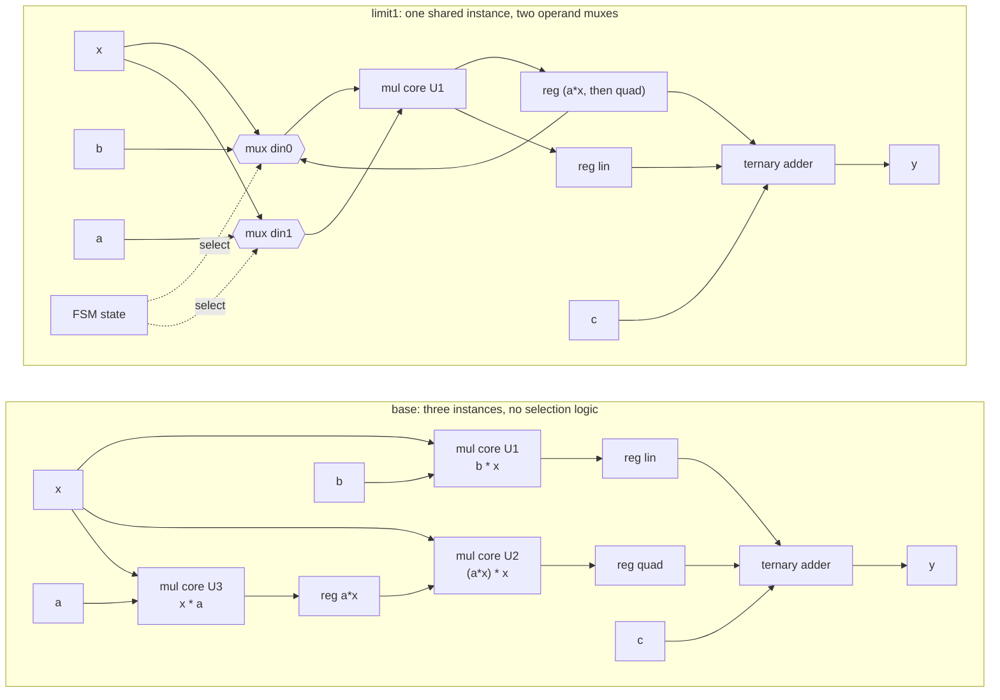

# 4.2 ALLOCATION

## 1. Introduction

ALLOCATION sets an upper limit on how many hardware instances of an operation, or of a function, the tool may build inside a scope.
This lesson uses the operation form on the three multiplies of the scalar `poly` kernel of lessons 3.2 and 4.1.

Two words have to be kept apart.
A **core** is the prebuilt block Vitis uses to implement an operation, here a 32-bit multiplier called `mul_32s_32s_32_2_1`, and an **instance** is one physical copy of that core in the generated hardware.
An **operation** is a single `*` in the compiled program.
Three multiplies in the program are three operations, and how many instances carry them is a separate decision the tool makes when it *binds* them.

Without the directive the tool gives every operation its own instance unless it has a reason not to.
When the limit is lower than the number of instances it would otherwise build, some operations must **share** one: the same instance computes a different multiply in different clock cycles.
A **multiplexer**, a selector that forwards one of several inputs depending on a control signal, then decides which operands reach the shared instance in each cycle.

What improves is area.
Every 32-bit multiply on this part binds to a core built from three DSP slices and 49 LUTs.
A **DSP slice** is the hard multiply-and-add block built into the FPGA fabric, a DSP48E2 on UltraScale+; a **LUT**, or lookup table, is the small programmable logic cell that implements general logic.
Three multiplier instances therefore cost 9 DSP slices, two cost 6, and one costs 3.

What it costs is a multiplexer in front of the shared instance and the control logic that drives it, and in principle it can also cost time, because that multiplexer sits on the path into the multiplier.
If the shared instance cannot fit all of its multiplies into the cycles the original schedule offered, the function also needs more cycles.
Neither cost materialised on this kernel, and section 7 is careful about what that does and does not prove.

Use ALLOCATION when DSP slices, or another hard resource, are the scarce thing on the device and the function has cycles in which an instance would otherwise sit idle.
Do not use it to save a few LUTs on small operators such as adders, because the multiplexer it adds usually costs more LUTs than the operator it removes.

ALLOCATION changes hardware, but it never changes what the function computes.
A limit at or above the number of instances the tool builds anyway changes nothing; `-limit 3` on this kernel would be such a case.

Lesson 4.1 BIND_OP chose *which* core implements an operation. This lesson chooses *how many copies* of that core exist.

References: UG1399 [pragma HLS allocation](https://docs.amd.com/r/2023.2-English/ug1399-vitis-hls/pragma-HLS-allocation) and [set_directive_allocation](https://docs.amd.com/r/2023.2-English/ug1399-vitis-hls/set_directive_allocation).

## 2. How it works



In `base`, each multiply has its own instance and every instance always sees the same two operands, so no selection logic is needed at all.
In `limit1`, one instance performs all three multiplies in turn, so its inputs must be selected per state.
The **finite state machine (FSM)** is the controller that steps the design through its states, and its state bits drive the multiplexer selects.

Two details of that picture are worth stating in advance, because both are easy to get wrong.

**Both inputs need a multiplexer, not one.**
It is tempting to reason that `x` is an operand of all three multiplies, so one input could be wired straight to `x`.
That is true of the mathematics and false of the hardware, because the tool does not put `x` on the same port every time.
Section 9 comes back to this.

**One register can serve several products.**
`base` needs a separate capture register per instance, because the cores run with `ce` tied high and their output registers are overwritten every cycle.
A shared instance produces its products at different times, so one register can hold each in turn.
Sharing therefore removes flip-flops as well as DSP slices, which is the opposite of the usual expectation that sharing trades area for control logic.

`limit2` lies between the two designs: two instances, one of which is shared between two multiplies.

## 3. The kernel

`src/poly.cpp`:

```cpp
void poly(data_t x, data_t a, data_t b, data_t c, data_t *y) {
    data_t sq   = x * x;        // MUL_SQ, reassociated away
    data_t lin  = b * x;        // MUL_B,  independent
    data_t quad = a * sq;       // MUL_A,  waits for the reassociated a * x
    *y = quad + lin + c;        // ADD_QL and ADD_C, fused into one adder
}
```

`data_t` is a 32-bit signed `int`, defined in `src/poly.h`.
The function has no loop, so there is no loop to label and one schedule table covers the whole function.

As lessons 3.2 and 4.1 both found, LLVM reassociates `a * (x * x)` into `(a * x) * x`, so the multiply written as `sq` never reaches the scheduler.
The three multiplies that do are:

| Name in the reports | Computes         | Depends on   |
|---------------------|------------------|--------------|
| `mul_ln24`          | `x * a`          | nothing      |
| `lin`               | `b * x`          | nothing      |
| `quad`              | `mul_ln24 * x`   | `mul_ln24`   |

Three operations, two of them independent, one dependent — which is exactly the shape a sharing directive needs.
The two adds fuse into a single **ternary adder**, an adder with three inputs, that shares a state with the write to `y`.

**The kernel must be written this way.**
Writing the same polynomial as `quad = a * x * x` lets LLVM factor `x` out of `a*x*x + b*x` and emit Horner's rule, `((a*x + b)*x) + c`.
That is two chained multiplies instead of three, they can never overlap, the tool shares one instance on its own, and the allocation limit has nothing left to do — `-limit 1` becomes a measured no-op.
The comment at the top of `src/poly.cpp` says so, and it is there because this lesson was first written with that form and measured nothing.

## 4. The solutions

| Solution | Directive                                                    | Multiplier instances allowed |
|----------|--------------------------------------------------------------|------------------------------|
| `base`   | none                                                         | unlimited; the tool builds 3 |
| `limit2` | `set_directive_allocation -limit 2 -type operation poly mul` | 2                            |
| `limit1` | `set_directive_allocation -limit 1 -type operation poly mul` | 1                            |

The scope is the function `poly` in both variants, and the operation is `mul`.
No helper directive is needed, because the tool applies ALLOCATION to any scheduled function on its own.

**Roster deviation.**
The roster lists only `base` and `limit1`.
`limit2` was added because `-limit 1` does two different things at once on this kernel.
First it reuses a core in states where that core would otherwise be idle, since `mul_ln24` and `quad` never overlap.
Second it forces `quad` and `lin`, which `base` runs in the same states, onto one core and therefore into different states.
`limit2` does only the first, so comparing `base` with `limit2` and then `limit2` with `limit1` separates the cost of pure sharing from the cost of rescheduling.

## 5. Predict

Lesson 4.1 measured this kernel with no directives at 5 states, latency 4 cycles, interval 5 cycles, 9 DSP, 596 flip-flops, 242 LUTs and an estimated clock of 2.365 ns against a 3.33 ns target.
**Latency** is the number of clock cycles from the start of the function to its result, and **interval** is the number of cycles before the function can accept a new call.
A **flip-flop (FF)** is a one-bit register.

Each multiplier core has one internal register, so a multiply spans two states; the verbose schedule marks the first as `[2/2]` and the second as `[1/2]`, counting down.
Because of that register the core is pipelined: it can accept a new pair of operands in the state where it is finishing the previous product.

The `base` schedule:

| Operation                    | S1  | S2  | S3  | S4  | S5  |
|------------------------------|-----|-----|-----|-----|-----|
| `mul_ln24` (`x*a`)           | 2/2 | 1/2 |     |     |     |
| `quad` (`mul_ln24*x`)        |     |     | 2/2 | 1/2 |     |
| `lin` (`b*x`)                |     |     | 2/2 | 1/2 |     |
| ternary add, write `y`       |     |     |     |     | yes |
| **multiplies in flight**     | 1   | 1   | 2   | 2   | 0   |

At most two multiplies are in flight at once, so the third instance is pure waste and `limit2` should keep this exact schedule.

The predicted `limit1` schedule, with every multiply on the one instance A:

| Operation                    | S1    | S2    | S3    | S4    | S5  |
|------------------------------|-------|-------|-------|-------|-----|
| `mul_ln24` (`x*a`)           | A 2/2 | A 1/2 |       |       |     |
| `lin` (`b*x`)                |       | A 2/2 | A 1/2 |       |     |
| `quad` (`mul_ln24*x`)        |       |       | A 2/2 | A 1/2 |     |
| ternary add, write `y`       |       |       |       |       | yes |
| **new issues on A**          | 1     | 1     | 1     | 0     | 0   |

`lin` depends on nothing, so it can take the issue slot in state 2, where the core is otherwise only finishing `mul_ln24`.
`quad` still starts in state 3, the earliest cycle in which its operand exists, so the critical chain is untouched and the latency should stay at 4.
If the scheduler instead placed `lin` after `quad`, the add would move to state 6 and the latency would become 5.

The DSP count follows directly from the limit:

$$\textrm{DSP} = 3 \times n_{\textrm{inst}} \quad\Rightarrow\quad 9,\ 6,\ 3 .$$

Written down before running:

1. **DSP 9, 6 and 3, and latency 4 with interval 5 in all three solutions.**
2. **The estimated clock rises in `limit2` and `limit1`, to somewhere near 2.8 ns.**

The second prediction comes from the budget.
The target is 3.33 ns and the clock uncertainty is 0.899 ns, so a state may use 2.431 ns, and `base` already uses 2.365 ns of it for one multiplier stage.
That leaves 0.066 ns, less than a single LUT delay.
Lesson 3.5 saw exactly this effect measured: a shared floating-point adder raised its estimated clock from 2.262 ns to 2.665 ns through its seven-way operand multiplexer, with no change to the schedule.
Any multiplexer delay charged to these states should therefore break the budget.

For resources, the instance lines should fall by 165 FF and 49 LUT per removed instance, and the operand multiplexers should add some LUTs back.

## 6. Run

From `s4_resources/42_allocation/`:

```bash
vitis_hls -f run_hls.tcl 2>&1 | tee run.log
bash ../../common/collect_latency.sh poly_proj
bash ../../common/collect_resources.sh poly_proj
```

C simulation runs once, in `base`, and reports `TEST PASSED: 1012 vectors`.
Every solution is synthesized.
There is no co-simulation, because ALLOCATION changes which instance computes a product, never the product itself.
`run_hls.tcl` has a commented `cosim_design` line; enable it to watch `limit1`'s multiplexers switch between states in a waveform.
The directed vector `{x,a,b,c} = {3,2,5,-7}` has `a != b`, so a swapped operand select would give 44 instead of 26.

## 7. Read the results

### The log

```bash
grep -n "Running: set_directive_allocation" run.log
grep -n "Estimated Fmax" run.log
grep -Ei "WARNING|exceeds the target|HLS 200-871" run.log
```

**ALLOCATION prints no message of its own when it is applied.**
The only trace of it in the log is Vitis echoing the Tcl command as it sources the directives file, exactly as BIND_STORAGE behaved in lesson 2.3.
There are no warnings in the whole run, and the `Estimated Fmax` line reads **422.83 MHz for all three solutions**.
Confirmation that the directive did anything has to come from the reports below, not from the log.

### The Instance table

```bash
for s in base limit2 limit1; do
  echo "== $s"
  sed -n '/\* Instance:/,/^$/p' poly_proj/$s/syn/report/poly_csynth.rpt | tail -n +4
done
```

| Solution | `mul_32s_32s_32_2_1` rows | DSP | FF  | LUT |
|----------|---------------------------|-----|-----|-----|
| `base`   | `U1`, `U2`, `U3`          | 9   | 495 | 147 |
| `limit2` | `U1`, `U2`                | 6   | 330 |  98 |
| `limit1` | `U1`                      | 3   | 165 |  49 |

Three, two and one, each row identical at 3 DSP, 165 FF and 49 LUT.
**Prediction 1 is confirmed on the resource side**, and this table is the direct evidence that the directive was obeyed.

### The Multiplexer table

```bash
for s in base limit2 limit1; do
  echo "== $s"
  sed -n '/\* Multiplexer:/,/^$/p' poly_proj/$s/syn/report/poly_csynth.rpt | tail -n +4
done
```

| Solution | `ap_NS_fsm` | `grp_fu_67_p0` | `grp_fu_67_p1` | Operand mux LUT |
|----------|-------------|----------------|----------------|-----------------|
| `base`   | 31 LUT      | —              | —              | **0**           |
| `limit2` | 31 LUT      | 14 LUT, size 3 | 14 LUT, size 3 | **28**          |
| `limit1` | 31 LUT      | 20 LUT, size 4 | 14 LUT, size 3 | **34**          |

`base` has no operand multiplexer at all: its only multiplexer is the next-state logic of the FSM, which every design has.
The shared solutions each gain a pair of rows named after the shared instance's input ports.
`Input Size` counts the arms of the case statement including the `'bx` default, so size 3 means two real sources and size 4 means three.

**Both ports are multiplexed, in both shared solutions.**
That was not predicted, and section 9 is about why.

### The schedule

```bash
grep -E "^ST_[0-9]+ : Operation .*'mul'" \
  poly_proj/limit1/.autopilot/db/poly.verbose.sched.rpt | cut -c1-120
```

The measured `limit1` schedule:

| Operation                    | S1    | S2    | S3    | S4    | S5  |
|------------------------------|-------|-------|-------|-------|-----|
| `mul_ln24` (`x*a`)           | A 2/2 | A 1/2 |       |       |     |
| `lin` (`b*x`)                |       | A 2/2 | A 1/2 |       |     |
| `quad` (`mul_ln24*x`)        |       |       | A 2/2 | A 1/2 |     |
| ternary add, write `y`       |       |       |       |       | yes |

This is the predicted table, operation for operation.
`lin` did take the issue slot in state 2 rather than queueing behind `quad`, so the pipelined core absorbed the third multiply for free and the critical chain `mul_ln24` → `quad` → add is untouched.
`limit2` keeps the `base` schedule exactly, as predicted, and simply puts `mul_ln24` and `quad` on the same instance.

### The performance table

```bash
bash ../../common/collect_latency.sh poly_proj
```

| Solution | Latency (cycles) | Interval (cycles) | States | Estimated clock | Slack     | Fmax       |
|----------|------------------|-------------------|--------|-----------------|-----------|------------|
| `base`   | 4                | 5                 | 5      | 2.365 ns        | +0.066 ns | 422.83 MHz |
| `limit2` | 4                | 5                 | 5      | 2.365 ns        | +0.066 ns | 422.83 MHz |
| `limit1` | 4                | 5                 | 5      | 2.365 ns        | +0.066 ns | 422.83 MHz |

**Prediction 1 is fully confirmed. Prediction 2 is wrong.**
Sharing cost nothing in cycles, which was expected, and it also cost nothing in estimated clock period, which was not.

The verbose report says why the estimate did not move:

```bash
sed -n '/Verbose Summary: Timing violations/,/Verbose Summary: Binding/p' \
  poly_proj/limit1/.autopilot/db/poly.verbose.sched.rpt
```

Every state's critical path lists the `mul` operation at 2.365 ns and nothing else.
The operand multiplexer appears nowhere in it, in any state, in any solution.
**The estimated clock period is a scheduling-time number, and the multiplexer is inserted afterwards, during binding.**
So the right reading of the table above is not "the multiplexer is free" but "C synthesis did not charge for it here."

Lesson 3.5 is the proof that this is not a general rule: there the same report did show the shared operator's multiplexer, and the estimate rose by 0.403 ns.
Which way it goes is not something to predict from the directive.
This lesson has no `export_syn.tcl`, so Vivado is not run and the question is left open; lesson 4.1's `export_syn.tcl` is the pattern to copy if you want to settle it.

### Resources

```bash
bash ../../common/collect_resources.sh poly_proj
```

| Solution | DSP | FF  | LUT | DSP vs `base` | FF vs `base` | LUT vs `base` |
|----------|-----|-----|-----|---------------|--------------|---------------|
| `base`   | 9   | 596 | 242 | 0             | 0            | 0             |
| `limit2` | 6   | 399 | 221 | **−3**        | **−197**     | **−21**       |
| `limit1` | 3   | 234 | 178 | **−6**        | **−362**     | **−64**       |

These are C synthesis estimates, not Vivado results.

**Every column improves.**
That is worth pausing on, because the expected shape of a sharing result is "fewer DSPs, more LUTs", and the LUT column went the other way.
The line-by-line table in section 8 accounts for it.

### The Verilog

```bash
grep -c "poly_mul_32s_32s_32_2_1 #(" poly_proj/*/syn/verilog/poly.v
grep -nE "grp_fu_[0-9]+_p[01] = " poly_proj/limit1/syn/verilog/poly.v
```

`grep -c` prints the path beside each count, so read the names rather than the order:
`base` 3, `limit2` 2, `limit1` 1.
In `base` the three instances are wired to their operands directly, with no intermediate signal:

```verilog
mul_32s_32s_32_2_1_U1( ..., .din0(b),                .din1(x), ... );
mul_32s_32s_32_2_1_U2( ..., .din0(mul_ln24_reg_99),  .din1(x), ... );
mul_32s_32s_32_2_1_U3( ..., .din0(x),                .din1(a), ... );
```

In `limit1` the single instance is wired to `grp_fu_67_p0` and `grp_fu_67_p1`, and those are driven by the state machine:

```verilog
always @ (*) begin
    if      (ap_CS_fsm_state3) grp_fu_67_p0 = reg_90;   // quad
    else if (ap_CS_fsm_state2) grp_fu_67_p0 = b;        // lin
    else if (ap_CS_fsm_state1) grp_fu_67_p0 = x;        // mul_ln24
    else                       grp_fu_67_p0 = 'bx;
end
always @ (*) begin
    if      (ap_CS_fsm_state3 | ap_CS_fsm_state2) grp_fu_67_p1 = x;
    else if (ap_CS_fsm_state1)                    grp_fu_67_p1 = a;
    else                                          grp_fu_67_p1 = 'bx;
end
```

Each select is guarded by an `ap_CS_fsm_state` condition, which is the FSM driving the multiplexers.
The `'bx` default is the don't-care in the states where the instance is only finishing a product and its inputs are unused; it is what lets the synthesiser build the smallest selector.

The register that makes the sharing work is one line further down:

```verilog
always @ (posedge ap_clk) begin
    if ((1'b1 == ap_CS_fsm_state4) | (1'b1 == ap_CS_fsm_state2)) begin
        reg_90 <= grp_fu_67_p2;
    end
end
```

**One register captured twice**: `a*x` at the end of state 2, then `quad` at the end of state 4.
`base` needs three such registers, one per instance.

### Predicted and measured

| Quantity             | Pred. `base` | Meas. | Pred. `limit2` | Meas.     | Pred. `limit1` | Meas.     |
|----------------------|--------------|-------|----------------|-----------|----------------|-----------|
| Multiplier instances | 3            | 3 ✓   | 2              | 2 ✓       | 1              | 1 ✓       |
| DSP                  | 9            | 9 ✓   | 6              | 6 ✓       | 3              | 3 ✓       |
| Latency (cycles)     | 4            | 4 ✓   | 4              | 4 ✓       | 4              | 4 ✓       |
| Interval (cycles)    | 5            | 5 ✓   | 5              | 5 ✓       | 5              | 5 ✓       |
| Operand mux ports    | none         | none ✓| 1              | **2 ✗**   | 1              | **2 ✗**   |
| Estimated clock (ns) | 2.365        | 2.365✓| about 2.8      | **2.365 ✗**| about 2.8     | **2.365 ✗**|
| FF                   | 596          | 596 ✓ | lower          | 399 ✓     | lower          | 234 ✓     |
| LUT                  | 242          | 242 ✓ | about 200      | 221 ✓     | about 180      | 178 ✓     |

Two predictions missed, and they are the interesting ones: the number of ports that need selecting, and the timing cost of selecting them.

## 8. Hardware implications

What disappears is two thirds of the multiplier hardware.
Each removed instance frees three DSP48E2 slices, the 49 LUTs that stitch them into a 32-bit product, and the 165 flip-flops of its pipeline register.
What appears is a pair of 32-bit multiplexers built from LUTs in front of the surviving instance, with selects taken from FSM state bits the design already has.
The state count does not change, so the FSM itself does not grow — `ap_NS_fsm` stays at 31 LUT and `ap_CS_fsm` at 5 FF in all three solutions.

Account for the totals line by line rather than quoting them.

| Line                                | `base` | `limit2` | `limit1` | `limit2` − `base` | `limit1` − `base` |
|-------------------------------------|--------|----------|----------|-------------------|-------------------|
| Instance DSP                        | 9      | 6        | 3        | **−3**            | **−6**            |
| Instance FF                         | 495    | 330      | 165      | **−165**          | **−330**          |
| Instance LUT                        | 147    | 98       | 49       | **−49**           | **−98**           |
| Expression LUT (the ternary adder)  | 64     | 64       | 64       | 0                 | 0                 |
| Multiplexer LUT, `ap_NS_fsm`        | 31     | 31       | 31       | 0                 | 0                 |
| Multiplexer LUT, operand select     | 0      | 28       | 34       | **+28**           | **+34**           |
| Register FF                         | 101    | 69       | 69       | **−32**           | **−32**           |
| **Total DSP**                       | **9**  | **6**    | **3**    | **−3**            | **−6**            |
| **Total FF**                        | **596**| **399**  | **234**  | **−197**          | **−362**          |
| **Total LUT**                       | **242**| **221**  | **178**  | **−21**           | **−64**           |

Three things in that table are worth reading carefully.

**The arithmetic does not move.**
The Expression line is 64 LUT in every solution, because the ternary adder is the same adder and no arithmetic was added or removed.
A directive that only reallocates operations must leave this line alone, and it does.

**The operand multiplexer is cheap here, and that is a property of the kernel, not of the directive.**
Thirty-four LUTs buys the removal of 98 LUTs of multiplier fabric, so sharing pays for itself in LUTs as well as in DSPs.
It is cheap because there are only three multiplies and the selects are one-hot FSM states.
Lesson 3.5's seven-way multiplexer on a float adder is the case where this line dominates instead; the rule of thumb is that the multiplexer grows with the number of sharers while the saving grows only with the number of instances removed.

**The register line falls, which is the counterintuitive one.**
`base` spends 96 FF on three 32-bit product registers, `mul_ln24_reg`, `lin_reg` and `quad_reg`, because each instance has its own output that must be captured before the core overwrites it.
The shared solutions spend 64 FF on two, `lin_reg` and the shared `reg_NN` that holds `a*x` and then `quad`.
Sharing an instance also shares the register behind it.
This only works because the shared products are needed at different times; if two products had to be live simultaneously, the registers would come back.

The idea carries over to a standard-cell ASIC flow, and it pays off more there.
A 32-bit array multiplier in standard cells occupies thousands of gates, while a three-input 32-bit multiplexer is a few dozen cells, so every shared multiply saves real die area.
On an FPGA the DSP slices exist whether you use them or not, so sharing only helps when DSPs run out or another design on the same device needs them.
The DSP counts and the three-slices-per-multiply granularity are FPGA-only, and the `use_dsp` attribute is ignored by an ASIC synthesis tool, which builds each core from its own multiplier library instead.

The timing cost carries over in principle, because the multiplexer sits on the multiplier input path in both technologies — but note that this lesson never measured that cost, only failed to see it in a pre-binding estimate.
An ASIC flow also shows a power effect the FPGA estimate hides entirely: the shared multiplier's inputs change every cycle, so it switches more often than three instances that each held steady operands.

## 9. One common mistake and one question

**Mistake: reading the DSP count and stopping there.**
The DSP column is the result the directive was aimed at, so it is tempting to call the lesson done once it reads 3.
This lesson makes that especially tempting, because every other column improved too.
But the estimated clock period stayed at exactly 2.365 ns in all three solutions *while the datapath gained two multiplexers*, and section 7 shows that the number simply does not include them: they are added after scheduling, and the per-state critical path lists only the multiply.
A number that cannot move is not evidence that nothing moved.
Read the `Estimated Fmax` line and the slack alongside the resource table as lessons 3.2 and 3.5 already taught, and when the margin is as thin as the 0.066 ns here, run the design through Vivado before believing it.

**Question: `limit1` shares one instance between three multiplies, and `x` is an operand of all three — `x*a`, `b*x` and `mul_ln24*x`. So why does the Multiplexer table show a multiplexer on *both* ports instead of wiring one port straight to `x`?**

<details>
<summary>Answer</summary>

Because `x` is not on the same port in all three multiplies.

The operands reach the core in the order LLVM left them in the IR, and the reassociation that turned `a * (x * x)` into `(a * x) * x` produced `mul i32 %x_read, i32 %a_read` — `x` first.
The other two are `mul i32 %b_read, i32 %x_read` and `mul i32 %mul_ln24, i32 %x_read` — `x` second.
The `base` Verilog shows this directly, with `x` on `din1` of `U1` and `U2` but on `din0` of `U3`.

So the shared instance sees `x` on `din0` in state 1 and on `din1` in states 2 and 3, and neither port has a constant source:

- `din0` selects between `x`, `b` and `reg_90` — three sources, `Input Size` 4 with the default, 20 LUT.
- `din1` selects between `a` and `x` — two sources, `Input Size` 3 with the default, 14 LUT.

The tool does not canonicalise commutative operands to make sharing cheaper, so the port assignment it happens to have is the port assignment you pay for.
Had `x` landed on the same port every time, `din1` would have been a wire and the operand multiplexer cost would have been 20 LUT instead of 34.

The general lesson is that the cost of sharing depends on the *shape* of the operand graph, not just on how many operations share.
Check it against the Verilog grep in section 7, which lists assignments for both `_p0` and `_p1`.

</details>
