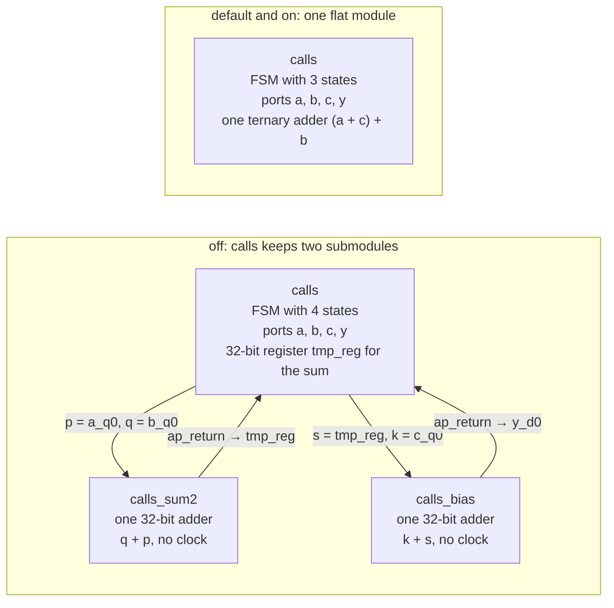

# 4.3 INLINE

## 1. Introduction

**Inlining** copies the body of a called function into the function that calls it, so the call disappears and the callee's operations become ordinary operations of the caller.
In Vitis HLS, every function that is not inlined becomes its own RTL module, called a **submodule**.
Every call to that function becomes an **instance** of the module.
The caller drives each instance through whatever block-level protocol the callee needs: a callee with a latency raises `ap_start` and waits for `ap_done`, while a purely combinational callee, like the two helpers in this lesson, keeps only `ap_ready` and `ap_return`.
The INLINE directive decides which of the two outcomes, inlined or submodule, a given function gets.

The directive is placed on the function that should disappear, never on the function that receives it.
`set_directive_inline sum2` asks the tool to inline `sum2` into every caller.
`set_directive_inline -off sum2` forbids inlining, so `sum2` stays a submodule.
The `-recursive` option extends the request to every function below the named one.

Inlining improves the schedule because the scheduler sees the caller's and the callee's operations at the same time.
It can then chain them into one clock cycle, fuse them into a single operator, share operators between them, and drop the handshake.
Inlining costs two things.
First, each call site receives its own copy of the callee's logic.
Second, the RTL loses a module boundary that made one part of the design easy to find in the reports, to simulate on its own, or to reuse.

**For small functions, `set_directive_inline` changes nothing in hardware**, because Vitis HLS already inlines small functions on its own ([UG1399, pragma HLS inline](https://docs.amd.com/r/2023.2-English/ug1399-vitis-hls/pragma-HLS-inline)).
This lesson measures exactly that: `on` and `default` produce byte-identical Verilog.
For a small helper, the setting that actually changes hardware is `-off`.
You would use `-off` when you want a function to remain a visible block that you can find in the reports, reuse, or control separately.
You would use the plain directive when the tool keeps a larger function as a submodule and you want the scheduler to optimize across its boundary.
The Tcl form is documented under [set_directive_inline](https://docs.amd.com/r/2023.2-English/ug1399-vitis-hls/set_directive_inline).

## 2. How it works



In `off`, the top module `calls` owns the loop, the memory ports and the finite state machine, which is the controller that steps through the loop's clock cycles; the machine is called the **FSM** from here on.
The two additions live inside two separate submodules.
Each submodule contains one 32-bit adder and nothing else.
The scheduler of `calls` treats each call as an opaque operation with a fixed delay, which this tool version models at 1.016 ns.
It cannot look inside the calls, so it cannot merge the two adds into a single operator.
It must therefore run the calls one after the other, and the sum produced by `calls_sum2` has to be stored in a register (`tmp_reg`) so that `calls_bias` can read it in the next state.

In `default` and `on`, both helper bodies have been copied into `calls` before scheduling.
The scheduler then sees the single expression `a[i] + b[i] + c[i]`.
It builds that expression as a **ternary adder**, which is one adder with three inputs; Vitis calls the core `TAddSub`.
On this FPGA, a ternary adder is built from look-up tables that first squeeze three bits into two and then feed one carry chain, so it is only slightly slower than a two-input adder.
A **LUT** (look-up table) is the FPGA's basic logic cell, and a **carry chain** is the dedicated fast path that ripples carries through an adder.
The whole datapath fits in one module, and the two submodules, their handshakes and the intermediate register disappear.

## 3. The kernel

`src/calls.h`

```cpp
#ifndef CALLS_H
#define CALLS_H

typedef int data_t;
const int N = 16;

void calls(const data_t a[N], const data_t b[N], const data_t c[N],
           data_t y[N]);

#endif
```

`src/calls.cpp`

```cpp
#include "calls.h"

// Lesson 4.3 INLINE. Two one-line helpers, each called once per iteration.
// sum2 adds a and b, and bias adds c to that sum. Written out, the loop body
// is y[i] = a[i] + b[i] + c[i]; the function boundaries are the only thing
// that separates the two additions. Do not merge the helpers into one: two
// adds split across two functions are what inlining has to put back together.
//
// INLINE decides whether those boundaries survive into the RTL, never what
// is computed, so this file is identical in every solution.
static data_t sum2(data_t p, data_t q) { return p + q; }    // line 11
static data_t bias(data_t s, data_t k) { return s + k; }    // line 12

void calls(const data_t a[N], const data_t b[N], const data_t c[N],
           data_t y[N]) {
CALLS_LOOP:
    for (int i = 0; i < N; i++) {
        y[i] = bias(sum2(a[i], b[i]), c[i]);
    }
}
```

The kernel has one loop, `CALLS_LOOP`, which runs 16 times.
The four arrays are top-level arguments, so each one becomes its own **ap_memory** port.
An ap_memory port is a simple RAM interface with an address, an enable and a data line.
A read on such a port returns its data one cycle after the address is issued.
Because each array has its own port, the three reads never compete for a port.

| Name in the reports (measured)                     | Computes          | Depends on                 |
|----------------------------------------------------|-------------------|----------------------------|
| `CALLS_LOOP`                                       | 16 iterations     | nothing                    |
| `off`: instance `tmp_sum2_fu_102`, module `sum2`   | `a_q0 + b_q0`     | reads of `a` and `b`       |
| `off`: instance `tmp_1_bias_fu_110`, module `bias` | `tmp_reg + c_q0`  | `tmp_sum2_fu_102`, read of `c` |
| `default`, `on`: `add_ln12_1` then `add_ln12`      | `(a + c) + b`     | reads of `a`, `b`, `c`     |

Operations that come from an inlined function keep the callee's source line in their names.
Both adds end up named after **line 12**, not one after line 11 and one after line 12: once `sum2` is inlined into `bias` and `bias` into `calls`, the tool reassociates the three-operand sum and both surviving `add` instructions are attributed to `bias`, so the report shows `add_ln12_1` and `add_ln12`.
The second one drives the memory data port directly, so in the Expression table it appears under the port name `y_d0` rather than under `add_ln12`.
Reassociation also changes the grouping: the generated Verilog is `add_ln12_1 = a_q0 + c_q0` and `y_d0 = add_ln12_1 + b_q0`, not `(a + b) + c` as the C source is written.
Addition is associative for `int` in this range, so the result is unchanged; only the operand order inside the ternary adder differs.

## 4. The solutions

| Solution  | Directives in `directives_<solution>.tcl`                         | Measured hierarchy           |
|-----------|-------------------------------------------------------------------|------------------------------|
| `off`     | `set_directive_inline -off "sum2"`, `set_directive_inline -off "bias"`| `calls` with two submodules  |
| `default` | none                                                              | `calls` alone (tool inlines) |
| `on`      | `set_directive_inline "sum2"`, `set_directive_inline "bias"`      | `calls` alone                |

The only difference between the solutions is the INLINE setting on the two helpers.
The lesson follows the `off`, `default` and `on` pattern of 1.3 LOOP_FLATTEN and 3.5 EXPRESSION_BALANCE, because Vitis applies inlining on its own.
In both of those lessons, `default` turned out identical to one of the other two solutions, so `default` is here to show which side the tool picks.
It picks `on`: the two RTL directories are byte-identical.

**Roster note.**
The roster names the `calls` kernel with `off`, `default` and `on`, and this lesson keeps exactly those three solutions.
The kernel's shape is defined here for the first time: two helpers split one three-operand sum, so that inlining has an optimization to unlock and does not merely rename modules.
No `-recursive` variant was added.
`-recursive` differs from a plain INLINE only when some function in the middle of a call chain would otherwise stay a submodule.
Helpers this small are inlined at every level by default, so such a variant would reproduce `default` a third time.

## 5. Predict

The loop model from the earlier lessons still applies.
It says that an unpipelined loop takes the trip count $T$ times the iteration latency $L_\textrm{it}$, and that the function adds one cycle on top of the loop:

$$L_\textrm{fn} = T \cdot L_\textrm{it} + 1, \qquad \textrm{interval} = L_\textrm{fn} + 1$$

The **iteration latency** is the number of clock cycles one pass through the loop body takes.
The **interval** is the number of cycles before the function can accept its next call.

The per-cycle budget is 2.431 ns, which is the 3.33 ns target clock minus the 0.899 ns clock uncertainty.
The operator delays this tool version uses on this part are:

| Operation                                      | Delay    |
|------------------------------------------------|----------|
| read or write on an ap_memory port             | 0.677 ns |
| call to a combinational submodule (`sum2`, `bias`) | 1.016 ns |
| ternary adder, root node (`TAddSub`)           | 0.731 ns |
| ternary adder, grouped node                    | 0.000 ns |
| 5-bit counter `icmp` or `add`                  | 0.789 ns |
| store to the local loop counter                | 0.427 ns |

Placing several operations back to back within one cycle is called **chaining**.
Note that an opaque call costs *more* than the fused ternary adder it replaces: 1.016 ns against 0.731 ns, and `off` pays it twice.

Every solution spends one preheader state (state 1) setting `i = 0`, so the tables below number the states from the start of the function; the loop body is states 2 onward.

**`default` and `on`.**
State 2 runs the exit test and the counter increment and issues all three reads.
State 3 receives the three data words, feeds them to the ternary adder and writes `y[i]`, which chains to 0.677 + 0.000 + 0.731 + 0.677 = 2.085 ns, comfortably inside the 2.431 ns budget.
Two body states, so the iteration latency is 2.

| Operation                               | S2 | S3 |
|-----------------------------------------|----|----|
| exit test `i == 16`, increment `i + 1`  | ●  |    |
| issue reads of `a[i]`, `b[i]`, `c[i]`   | ●  |    |
| `(a + c) + b` in one ternary adder      |    | ●  |
| write `y[i]`                            |    | ●  |

**`off`.**
Chaining a read, both calls and the write would take 0.677 + 1.016 + 1.016 + 0.677 = 3.386 ns, more than the budget.
Even leaving the write for a later state, the read and the two calls reach 2.709 ns, which is still too much.
The tool must therefore close the state after the first call and store the sum in a register.
It also delays the read of `c`: `c_q0` is not needed until the `bias` call, so the address is issued one state later than the addresses of `a` and `b`.
Three body states, so the iteration latency is 3.

| Operation                               | S2 | S3 | S4 |
|-----------------------------------------|----|----|----|
| exit test `i == 16`, increment `i + 1`  | ●  |    |    |
| issue reads of `a[i]`, `b[i]`           | ●  |    |    |
| call `sum2`, register the sum in `tmp_reg` |    | ●  |    |
| issue read of `c[i]`                    |    | ●  |    |
| call `bias`                             |    |    | ●  |
| write `y[i]`                            |    |    | ●  |

**Prediction 1:** the function latency is 49 cycles for `off` and 33 cycles for both `default` and `on`, which makes the intervals 50 and 34.

**Prediction 2:** `default` and `on` produce identical Verilog, and `off` keeps `calls_sum2.v` and `calls_bias.v` as separate files.

**Prediction 3:** `off` reports a **higher** estimated clock than `default`, not a lower one.
Its slowest state is S4, which chains the read of `c`, the `bias` call and the write: 0.677 + 1.016 + 0.677 = 2.370 ns.
That is more than `default`'s 2.085 ns, because an opaque call is modelled as slower than the ternary adder it hides.
So `off` loses on both axes at once: more cycles *and* a longer critical path.
This is worth stating explicitly, because the intuition "smaller states mean a faster clock" is a natural one and it is wrong here.

## 6. Run

INLINE moves operations across a function boundary but cannot change a result.
C simulation therefore runs once, in `default`, which is the source as written, and every solution runs C synthesis only.

```bash
cd s4_resources/43_inline
vitis_hls -f run_hls.tcl 2>&1 | tee run.log

# C simulation, once
grep "TEST PASSED" run.log

# Inlining messages per solution
awk '/^== solution/{s=$3} /HLS 214-178/{n[s]++} END{for (k in n) print k, n[k]}' run.log

# Module files per solution
for s in off default on; do echo "== $s"; ls calls_proj/$s/syn/verilog/; done

# Latency and resources, same scripts as earlier lessons
bash ../../common/collect_latency.sh calls_proj
bash ../../common/collect_resources.sh calls_proj

# Is on identical to default?
diff -r calls_proj/default/syn/verilog calls_proj/on/syn/verilog && echo IDENTICAL
```

The `diff` comes back clean, so no suffix normalization is needed.

Before you run anything, check that the three `directives_*.tcl` files are not empty.
An empty `directives_off.tcl` or `directives_on.tcl` silently turns that solution into a second copy of `default`: the run still succeeds, all three solutions report 33 cycles, and nothing in the log says that a directive was missing.
The reliable check is the log echo, `INFO: [HLS 200-1510] Running: set_directive_inline ...`, which appears once per directive actually applied.

## 7. Read the results

### The log

INLINE prints nothing of its own when the directive is applied; only the echoed `Running: set_directive_inline` line appears.
The inliner's own message, `INFO: [HLS 214-178] Inlining function 'sum2(int, int)' into 'calls(...)'`, is printed **only when the tool decides to inline on its own**.
An explicit `set_directive_inline` suppresses it, so `on` prints nothing even though it does inline both helpers.

| Solution  | `HLS 214-178` lines, predicted | Measured |
|-----------|--------------------------------|----------|
| `off`     | 0                              | 0        |
| `default` | 2                              | 2        |
| `on`      | 2                              | **0**    |

This is the one prediction in the lesson that the tool contradicts, and it is a useful one to get wrong.
The count of `HLS 214-178` lines answers "did the tool inline this on its own?", not "is this function inlined?".
To answer the second question, list `syn/verilog/` or look at the Instance table.
It also means the advice at the end of section 9 has a limit: an empty grep for `HLS 214-178` proves that the *heuristic* did not fire, not that the function survived as a submodule.

### The Instance table

Open `calls_proj/<solution>/syn/report/calls_csynth.rpt` and read the `Instance` table under the utilization detail.

```bash
grep -A10 "\* Instance:" calls_proj/off/syn/report/calls_csynth.rpt
```

In `off` the table has two rows, one per helper:

```
+-------------------+-------+---------+----+---+----+-----+
|      Instance     | Module| BRAM_18K| DSP| FF| LUT| URAM|
+-------------------+-------+---------+----+---+----+-----+
|tmp_1_bias_fu_110  |bias   |        0|   0|  0|  39|    0|
|tmp_sum2_fu_102    |sum2   |        0|   0|  0|  39|    0|
+-------------------+-------+---------+----+---+----+-----+
|Total              |       |        0|   0|  0|  78|    0|
+-------------------+-------+---------+----+---+----+-----+
```

39 LUT each is the cost of one 32-bit adder, and both show 0 FF.
An **FF** (flip-flop) stores one bit of a register.
The adders hold no FF because a latency-0 function has nothing to store.
Note that the `Module` column prints the C name, `sum2` and `bias`, while the Verilog file and module are called `calls_sum2` and `calls_bias`: the tool prefixes the top function's name in the RTL to keep module names unique across a project.

In `default` and `on` the Instance table is `N/A`.
The additions appear in the `Expression` table instead, as the two nodes of the ternary adder, 32 LUT each:

```
|add_ln12_1_fu_130_p2  |         +|   0|  0|  32|          32|          32|
|y_d0                  |         +|   0|  0|  32|          32|          32|
```

64 LUT for the fused pair against 78 LUT for the two separate adders: fusing the boundary away saves 14 LUT on the arithmetic alone.

### The performance table

| Solution  | FSM states | Iteration latency | Function latency | Interval | Estimated clock (ns) |
|-----------|------------|-------------------|------------------|----------|----------------------|
| `off`     | 4          | 3                 | 49               | 50       | 2.370                |
| `default` | 3          | 2                 | 33               | 34       | 2.085                |
| `on`      | 3          | 2                 | 33               | 34       | 2.085                |

The latency numbers come from the `Latency` summary and the `Loop` table of `calls_csynth.rpt`, or in one line from `collect_latency.sh`:

```
solution         best      worst     ii_min     ii_max   clk_est_ns
default            33         33         34         34        2.085
off                49         49         50         50        2.370
on                 33         33         34         34        2.085
```

The per-state critical paths are printed under `Verbose Summary: Timing violations` in `calls_proj/<solution>/.autopilot/db/calls.verbose.sched.rpt`.
They confirm the predicted chains exactly:

| State | `off`                                          | `default` and `on`                                   |
|-------|------------------------------------------------|------------------------------------------------------|
| 1     | 0.427 ns, store `i = 0`                        | 0.427 ns, store `i = 0`                              |
| 2     | 1.216 ns, `icmp` + counter store               | 1.216 ns, counter add + store                        |
| 3     | 1.693 ns, read `a` + call `sum2`               | **2.085 ns**, read + ternary adder + write `y`       |
| 4     | **2.370 ns**, read `c` + call `bias` + write `y` | —                                                  |

### The Verilog

```bash
grep -n "^calls_sum2 \|^calls_bias " calls_proj/off/syn/verilog/calls.v
cat calls_proj/off/syn/verilog/calls_sum2.v
grep -n "add_ln1[12]\|y_d0 = " calls_proj/default/syn/verilog/calls.v
```

The first grep finds the two instantiations inside `calls.v`, which are the physical form of the kept function boundary:

```verilog
calls_sum2 tmp_sum2_fu_102(
    .ap_ready(tmp_sum2_fu_102_ap_ready),
    .p(a_q0),
    .q(b_q0),
    .ap_return(tmp_sum2_fu_102_ap_return)
);

calls_bias tmp_1_bias_fu_110(
    .ap_ready(tmp_1_bias_fu_110_ap_ready),
    .s(tmp_reg_175),
    .k(c_q0),
    .ap_return(tmp_1_bias_fu_110_ap_return)
);
```

`tmp_reg_175` on the `.s` port of `calls_bias` is the 32-bit register that carries the sum from state 3 into state 4.
That register is the whole price of the kept boundary, in one wire.

The whole of `calls_sum2.v` is four lines of logic:

```verilog
module calls_sum2 (ap_ready, p, q, ap_return);
output   ap_ready;
input  [31:0] p;
input  [31:0] q;
output  [31:0] ap_return;
assign ap_ready = 1'b1;
assign ap_return = (q + p);
endmodule //calls_sum2
```

There is no `ap_clk`, no `ap_rst`, no `ap_start` and no `ap_done`.
Because the function has latency 0, Vitis HLS reduces the block-level protocol to a constant `ap_ready` at the RTL stage already, rather than emitting a handshake for logic synthesis to optimize away.
So in this lesson, the handshake is *not* what `off` costs; the extra state and the extra register are.

The third grep shows the fused addition in `default`:

```verilog
assign add_ln12_1_fu_130_p2 = (a_q0 + c_q0);
assign y_d0 = (add_ln12_1_fu_130_p2 + b_q0);
```

Both source lines of the helpers now feed one expression in `calls.v`, and the second add drives the `y` port's data input directly with no register in between.

### Predicted and measured

| Quantity                          | Predicted `off`, `default`, `on` | Measured `off`, `default`, `on` | Match |
|-----------------------------------|----------------------------------|---------------------------------|-------|
| Verilog module files              | 3, 1, 1                          | 3, 1, 1                         | yes   |
| `HLS 214-178` lines               | 0, 2, 2                          | 0, 2, 0                         | **no**, see above |
| Iteration latency                 | 3, 2, 2                          | 3, 2, 2                         | yes   |
| Function latency                  | 49, 33, 33                       | 49, 33, 33                      | yes   |
| Interval                          | 50, 34, 34                       | 50, 34, 34                      | yes   |
| Instance rows                     | 2, 0, 0                          | 2, 0, 0                         | yes   |
| Estimated clock (ns)              | `off` highest                    | 2.370, 2.085, 2.085             | yes   |
| `default` against `on` RTL diff   | identical                        | identical                       | yes   |

## 8. Hardware implications

In `off`, two small modules physically exist, each containing one 32-bit adder.
Because the adders cannot merge across the boundary, `calls` also needs a 32-bit register to carry the sum from state 3 into state 4, plus one more FSM state to spend that cycle.
In `default` and `on`, both modules, the register and the extra state disappear, and one ternary adder replaces the two separate adders.

Totals from the utilization summary:

| Solution  | FF | LUT |
|-----------|----|-----|
| `off`     | 46 | 138 |
| `default` | 13 | 118 |
| `on`      | 13 | 118 |

The differences, `off` minus `default`, line by line:

| Line in the report                          | Predicted FF | Predicted LUT       | Measured FF | Measured LUT |
|---------------------------------------------|--------------|---------------------|-------------|--------------|
| Instance, `tmp_sum2_fu_102`                 | 0            | about +39           | 0           | +39          |
| Instance, `tmp_1_bias_fu_110`               | 0            | about +39           | 0           | +39          |
| Expression, fused ternary adder             | 0            | minus its full cost | 0           | −64          |
| Register, `tmp_reg_175`, sum from S3 to S4  | +32          | 0                   | +32         | 0            |
| `ap_CS_fsm`, one more one-hot state         | +1           | 0                   | +1          | 0            |
| `ap_NS_fsm` and state decode                | 0            | a few more          | 0           | +6           |
| **Total**                                   | **+33**      | —                   | **+33**     | **+20**      |

In this table, `ap_CS_fsm` is the FSM's state register and `ap_NS_fsm` is the logic that chooses the next state.
The FSM uses **one-hot** encoding, which means one bit per state, so the fourth state costs exactly one more FF: `ap_CS_fsm` goes from 3 to 4 bits, and its multiplexer from 20 to 26 LUT.

The LUT total is the interesting one.
`off` pays +78 LUT for the two instances and gets back −64 LUT because `default` has to build the ternary adder, so the arithmetic difference alone is only +14 LUT; the remaining +6 LUT is the wider FSM.
In other words, the boundary costs almost nothing in LUTs here.
What it really costs is the 32 FF of `tmp_reg_175` and the 16 extra clock cycles, which is 49 against 33, a 48 % longer runtime for the same result.

Everything in this lesson carries over to a standard-cell ASIC flow, because HLS fixes the schedule before either back end runs.
The extra state and the 32-bit register appear in the ASIC netlist exactly as in the FPGA one.
The fusion also has a direct ASIC counterpart.
An ASIC synthesis tool builds `a + b + c` from a **carry-save adder**, which squeezes three numbers into two without propagating carries, followed by one ordinary adder.
The FPGA's ternary adder is the same idea mapped onto LUTs and a carry chain.
ASIC synthesis tools usually perform this merging only within one module, so a kept hierarchy boundary blocks it in both flows unless the boundary is dissolved during synthesis.

## 9. One common mistake and one question

**Mistake: placing the directive on the caller.**
`set_directive_inline calls` does not mean "inline everything into `calls`".
It means "inline `calls` into whatever calls it", and a top function has no caller.
The helpers are left exactly as the default heuristic chose.
The directive belongs on the function that should disappear, which here is `sum2` and `bias`.
If you really want every function below a given function inlined, use `-recursive` on it.
Before adding any INLINE directive, list `syn/verilog/` to see whether the function is already gone.
Do not use `grep HLS 214-178` for this: as the table in section 7 shows, the message reports the heuristic's decision, so a function that was inlined by an explicit directive produces no message at all.

**Question.**
In `off`, state 3 uses only 1.693 ns of its 2.431 ns budget, and state 4 uses 2.370 ns.
State 3 looks like it has room to spare, so why can the scheduler not move the `bias` call up into state 3 and save a cycle per iteration?

<details>
<summary>Answer</summary>

Two independent reasons, and either one alone is enough.

*Timing.* `bias` needs the result of `sum2`, so the two calls would have to chain inside one state, after the read that feeds `sum2`.
That chain is 0.677 + 1.016 + 1.016 = 2.709 ns before the write of `y[i]` is even counted, already past the 2.431 ns budget.
The spare 0.738 ns in state 3 is less than the 1.016 ns a second call costs.

*Structure.* The scheduler cannot see that `sum2` and `bias` are each a single adder.
It models both as opaque operations of fixed delay, so it cannot fold them into one ternary adder the way it does in `default`, where the same three operands and one write fit into 2.085 ns.
Inlining does not merely remove a handshake; it gives the scheduler the *information* it needs to pick a better operator.

The fused ternary adder in `default` costs 0.731 ns, less than a single opaque call.
That is why `default` finishes an iteration in two states where `off` needs three: 33 cycles against 49, at the same 3.33 ns target clock, so 110 ns against 163 ns.

</details>
