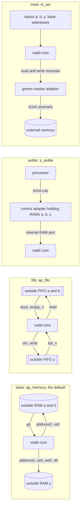

# 5.1 INTERFACE

## 1. Introduction

The INTERFACE directive chooses the **port protocol** of a top-level argument.
A port protocol is the set of wires that the generated block uses to exchange an argument with the outside world, together with the rules that say in which clock cycle those wires carry valid data.
Every earlier lesson used the default protocol for its arrays, **ap_memory**, in which the block drives an address and a chip enable and receives the data one clock cycle later, exactly as if a RAM sat outside it.
This lesson keeps the `vadd` kernel of 1.1 and 3.1 unchanged and switches the protocol of its three arrays between four choices.

**ap_fifo** turns an array into a first-in first-out stream.
A FIFO port has no address.
It has a data bus and a pair of **handshake** signals: `empty_n` or `full_n` driven by the outside to say that data is available or that space is free, and `read` or `write` driven by the block to say that it takes or delivers a word in this cycle.
**s_axilite** places the argument behind an **AXI4-Lite** slave.
AXI4-Lite is the simple single-word version of Arm's AXI bus (Arm IHI 0022), which a processor uses to read and write words at addresses.
**m_axi** turns the block into an **AXI4 master**, which fetches the data itself from memory addresses it is given, the way an accelerator reads external DDR memory.

What improves depends on the mode.
ap_fifo removes the address wires and the RAM read delay in front of the adder.
s_axilite lets a processor load and read back the arrays with no glue logic.
m_axi lets the block reach a memory far larger than anything that fits beside it.

What it costs is logic that does not appear anywhere in the C code.
s_axilite and m_axi each add an **adapter**, a pre-written block of RTL that translates between the bus and the core that the tool built from the C code.
m_axi also adds the latency of the bus itself, and that latency is a property of the system, not of the kernel.

Use INTERFACE at the boundary of your design, and choose whatever the surrounding system actually provides.
The directive acts only on arguments of the top function; inside the design the tool picks connections on its own.
It changes hardware and it changes port-level behavior, so this lesson runs co-simulation in every solution.

Reference: [UG1399, set_directive_interface](https://docs.amd.com/r/2023.2-English/ug1399-vitis-hls/set_directive_interface).

**Roster deviations.**
The roster lists ap_memory, ap_fifo, s_axilite and m_axi as four variants.
ap_memory is already the default for array arguments in the Vivado flow, so an explicit ap_memory solution would be byte-identical to `base`, and ap_memory therefore **is** `base` here.
Its `-latency` and `-storage_type` options change the storage model rather than the protocol, and 2.3 already showed that `-latency 2` works on a top-level argument.
The m_axi solution uses `-offset direct` rather than `-offset slave`, so that the solution contains exactly one adapter; section 9 explains what `-offset slave` would add.

## 2. How it works



In `base` and `fifo` the core is the whole block, and the RAM or FIFO it talks to lives outside it.
The two differ in what one access costs.
An ap_memory read is a request followed by a reply, because the address goes out in one cycle and the data comes back in the next.
A FIFO read has no request: the next word is already waiting on `dout`, so the block *may* use it in the same cycle in which it raises `read`. Whether the scheduler actually does is the question section 7 answers, and the answer is a surprise.
In `axilite` and `maxi` the tool inserts an adapter inside the block.
The s_axilite adapter stores each array in a small memory of its own, which the processor fills over AXI4-Lite before the block starts, and which the core reads through an internal RAM port that behaves like ap_memory.
The m_axi adapter turns the core's requests into AXI4 transactions on five channels (read address, read data, write address, write data and write response), and the data travels to and from a memory that the block does not own.

## 3. The kernel

`src/vadd.h`

```cpp
#ifndef VADD_H
#define VADD_H

typedef int data_t;
const int N = 16;

void vadd(const data_t a[N], const data_t b[N], data_t y[N]);

#endif
```

`src/vadd.cpp`

```cpp
#include "vadd.h"

// Lesson 5.1 INTERFACE. The same vadd as 1.1 and 3.1. Every element of a
// and b is read exactly once and every element of y is written exactly once,
// in index order, which is what makes ap_fifo legal. Only the port protocol
// of a, b and y changes between solutions; this file never does.
void vadd(const data_t a[N], const data_t b[N], data_t y[N]) {
VADD_LOOP:
    for (int i = 0; i < N; i++) {
        y[i] = a[i] + b[i];
    }
}
```

The line numbers match 1.1 and 3.1, so the loop is still reported at `src/vadd.cpp:9`.
The access pattern is the property this lesson depends on.
Because `i` only ever counts upward by one and each array is touched once per iteration, the order in which elements cross the port is fixed at compile time, and that is the condition a FIFO needs.

Note that the directive is applied to the *arguments*, not to the loop, and that the array shape in the signature does not survive into hardware: in `base` and `axilite` the Interface table calls `a` an **array**, but in `fifo` and `maxi` it calls the same argument a **pointer**, because a stream and a bus master have no notion of an indexable object.

## 4. The solutions

Each solution applies its directive to all three arrays, because a protocol change on one array alone would leave the other two setting the schedule.

| Solution  | Directive on each of `a`, `b` and `y`               | Ports of `a` in `vadd.v`                     | Inside the block, besides the core |
| --------- | --------------------------------------------------- | -------------------------------------------- | ---------------------------------- |
| `base`    | none, so ap_memory by default                       | `a_address0[3:0]`, `a_ce0`, `a_q0[31:0]`     | nothing                            |
| `fifo`    | `-mode ap_fifo`                                     | `a_dout[31:0]`, `a_empty_n`, `a_read`        | nothing                            |
| `axilite` | `-mode s_axilite -bundle control`                   | none of its own; `s_axi_control_*` is shared | control adapter with three RAMs    |
| `maxi`    | `-mode m_axi -bundle gmem -offset direct -depth 16` | 64-bit input `a`; `m_axi_gmem_*` is shared   | one gmem master adapter            |

Exactly three ports per array in `fifo`, and no `*_num_data_valid` or `*_fifo_cap`, which some ap_fifo interfaces carry: nothing in this loop asks how full a stream is.
`-depth 16` builds no hardware.
It tells co-simulation how many words the memory model behind the master must hold, and for a pointer argument the tool cannot know that on its own.

## 5. Predict

The model from earlier lessons gives the latency of an unpipelined loop body run $T$ times, with $L_\textrm{it}$ cycles per iteration:

$$L_\textrm{fn} = T \cdot L_\textrm{it} + 1, \qquad \textrm{interval} = L_\textrm{fn} + 1$$

For `base`, 3.1 measured $L_\textrm{it} = 2$, so $L_\textrm{fn} = 16 \cdot 2 + 1 = 33$.
The second state exists only because the ap_memory read returns one cycle after its address.

**Prediction 1: `fifo` has a function latency of 17.**
A FIFO read has no address phase, so the read of `a` and `b`, the 1.016 ns add and the write of `y` should fit in one state, which gives $L_\textrm{it} = 1$ and $L_\textrm{fn} = 16 \cdot 1 + 1 = 17$.
The estimated clock should stay at or below the 2.370 ns of `base`, because the chain is the same read, add and write with no RAM output delay in front.
This prediction rests on an assumption that is worth writing down, because it is the one the run will refute: that a blocking read and a blocking write which depends on it may share a state.

**Prediction 2: `axilite` has a function latency of 33, exactly like `base`.**
The core reads the adapter's internal RAMs with the same one-cycle latency as an outside RAM, so its schedule does not change, and all of the difference should be area.

For `maxi` I predict a direction rather than a number.
All three arrays share one read channel on `gmem`, and one 32-bit read channel delivers at most one word per cycle.
Each iteration needs two words, so no schedule can beat two cycles per iteration, which is already what `base` takes, and the requests and write responses come on top of that.
The C synthesis latency must therefore be strictly above 33.
The co-simulation latency should be higher still, because C synthesis schedules against an assumed bus latency while co-simulation drives a real AXI memory model.
`maxi` should be the first solution in this repo where C synthesis and co-simulation disagree by more than a cycle or two.

Port-level timing for `base`, first two iterations and the end of the call.
An `x` means the value is not used in that cycle.

| Signal       | c0  | c1  | c2        | c3  | c4        | … | c32         | c33 |
| ------------ | --- | --- | --------- | --- | --------- | - | ----------- | --- |
| state        | S1  | S2  | S3        | S2  | S3        |   | S3          | S2  |
| `a_address0` | x   | 0   | x         | 1   | x         |   | x           | 16  |
| `a_ce0`      | 0   | 1   | 0         | 1   | 0         |   | 0           | 1   |
| `a_q0`       | x   | x   | a[0]      | x   | a[1]      |   | a[15]       | x   |
| `y_address0` | x   | x   | 0         | x   | 1         |   | 15          | x   |
| `y_we0`      | 0   | 0   | 1         | 0   | 1         |   | 1           | 0   |
| `y_d0`       | x   | x   | a[0]+b[0] | x   | a[1]+b[1] |   | a[15]+b[15] | x   |
| `ap_done`    | 0   | 0   | 0         | 0   | 0         |   | 0           | 1   |

`a_ce0` is asserted in every S2, including the last one in c33, where `i` has already reached 16.
The block issues one read too many and throws the answer away, which is normal for an unpipelined loop whose exit test lives in the same state as the read.

Predicted port-level timing for `fifo` **if prediction 1 held**, with one stall inserted in c3 where the outside FIFO of `a` runs empty.
Signals of `b` behave like those of `a`.

| Signal      | c0   | c1        | c2        | c3, stall | c4        | … | c18 |
| ----------- | ---- | --------- | --------- | --------- | --------- | - | --- |
| state       | S1   | S2        | S2        | S2        | S2        |   | S2  |
| `a_empty_n` | 1    | 1         | 1         | 0         | 1         |   | x   |
| `a_read`    | 0    | 1         | 1         | 0         | 1         |   | 0   |
| `a_dout`    | a[0] | a[0]      | a[1]      | x         | a[2]      |   | x   |
| `b_read`    | 0    | 1         | 1         | 0         | 1         |   | 0   |
| `y_write`   | 0    | 1         | 1         | 0         | 1         |   | 0   |
| `y_din`     | x    | a[0]+b[0] | a[1]+b[1] | x         | a[2]+b[2] |   | x   |
| `ap_done`   | 0    | 0         | 0         | 0         | 0         |   | 1   |

Two things in the stall column would matter.
`b_read` also drops, although `b` still has data, because a state cannot half-happen: as soon as any access in it cannot complete, the whole state is held.
`ap_done` therefore arrives in c18 instead of c17, since every stall cycle adds one cycle to the call.
The co-simulation wrapper keeps every input FIFO full and never fills the output, so co-simulation should show no stalls and equal C synthesis.
Section 7 shows what the tool actually built, and the difference is instructive.

| Quantity                      | base  | fifo          | axilite         | maxi              |
| ----------------------------- | ----- | ------------- | --------------- | ----------------- |
| Iteration latency (cycles)    | 2     | 1             | 2               | above 2           |
| Function latency, C synthesis | 33    | 17            | 33              | above 33          |
| Interval                      | 34    | 18            | 34              | above 34          |
| Cosim total, 16 calls         | 543   | 287           | 543             | above C synthesis |
| Estimated clock (ns)          | 2.370 | 2.370 or less | 2.370           | ?                 |
| Adapter in the Instance table | none  | none          | `control_s_axi` | `gmem_m_axi`      |

## 6. Run

```bash
cd s5_interfaces/51_interface
vitis_hls -f run_hls.tcl 2>&1 | tee run.log       # csim in base, csynth and cosim in all four
vitis_hls -f export_syn.tcl 2>&1 | tee export.log # Vivado synthesis of all four, for real area

# Did every solution pass? Expect 9: one from csim, two per cosim.
grep -c "TEST PASSED" run.log
grep "COSIM FAILED" run.log

# Which solution does a message belong to?
grep -nE "== solution|214-142|214-115|200-1603|TEST PASSED" run.log

# The directives that were applied
grep "Running: set_directive_interface" run.log

# Latency and resources, same scripts as earlier lessons
bash ../../common/collect_latency.sh vadd_proj
bash ../../common/collect_resources.sh vadd_proj

# The Interface section of each report
for s in base fifo axilite maxi; do
  echo "== $s"; awk '/== Interface/{f=1} f' vadd_proj/$s/syn/report/vadd_csynth.rpt
done

# Co-simulation latency, the only number that includes a bus
grep -H "Verilog" vadd_proj/*/sim/report/vadd_cosim.rpt

# Per-call cosim latency, which the summary hides
head -20 vadd_proj/axilite/sim/verilog/vadd.performance.result.transaction.xml

# Top-level ports and module files per solution
for s in base fifo axilite maxi; do
  echo "== $s"; grep -E "^\s*(input|output)" vadd_proj/$s/syn/verilog/vadd.v
  ls vadd_proj/$s/syn/verilog/
done

# Why maxi is slow: which bursts the tool inferred and which it dropped
python3 -c "import sys,re;[print(m) for m in re.findall(r'msg_body=\"([^\"]*)\"', open(sys.argv[1]).read())]" \
  vadd_proj/maxi/.autopilot/db/burst.xml

# What the adapter was told to ask the bus for
grep -E "I_ARLEN|I_AWLEN|NUM_READ_OUTSTANDING" vadd_proj/maxi/syn/verilog/vadd.v

# The address map of axilite: memories, not registers
grep -E "ADDR_(A|B|Y)_(BASE|HIGH)" vadd_proj/axilite/syn/verilog/vadd_control_s_axi.v

# Post-synthesis area and critical path from Vivado
grep -HE "^(LUT|FF|DSP|BRAM|SRL|URAM)|CP achieved" vadd_proj/*/impl/report/verilog/vadd_export.rpt

# Which primitives Vivado actually instantiated
for s in base fifo axilite maxi; do
  echo "== $s"
  grep -A 18 "^| Ref Name" vadd_proj/$s/impl/verilog/report/vadd_utilization_synth.rpt | head -18
done
```

## 7. Read the results

Every number below comes from Vitis HLS 2023.2.2 on `xcku5p-ffvb676-2-e` with the 3.33 ns clock of `common/part.tcl`, which also sets `config_compile -pipeline_loops 0`.

### The log

`grep -c "TEST PASSED" run.log` returns **9**: one from `csim_design` in `base`, and two from each of the four co-simulations, because `cosim_design` runs the testbench once in C and once against the RTL.
`grep "COSIM FAILED" run.log` returns nothing, so all four protocols carry the 16 calls of the testbench correctly.
There is one `Running: set_directive_interface` line per argument in `fifo`, `axilite` and `maxi` and none in `base`, nine in total.
Here is the `a` line of each; the `b` and `y` lines are identical but for the argument name:

```text
INFO: [HLS 200-1510] Running: set_directive_interface -mode ap_fifo vadd a
INFO: [HLS 200-1510] Running: set_directive_interface -mode s_axilite -bundle control vadd a
INFO: [HLS 200-1510] Running: set_directive_interface -mode m_axi -bundle gmem -offset direct -depth 16 vadd a
```

Two message families are worth reading rather than skipping.

In `fifo`, the tool prints one warning per stream:

```text
WARNING: [HLS 214-142] Implementing stream: may cause mismatch if read and write accesses are not in sequential order on port 'a'
```

It prints this for `a`, `b` and `y` even though this kernel's order is provably correct.
That is the point: 214-142 is a reminder, not a check.
Section 9 shows what the tool does when the order really is wrong.

In `maxi`, the burst messages explain the whole latency of the solution, and `run.log` gives only the headline:

```text
INFO: [HLS 214-115] Multiple burst writes of length 16 and bit width 32 in loop 'VADD_LOOP' has been inferred on bundle 'gmem'.
INFO: [HLS 200-1603] Design has inferred MAXI bursts and missed bursts, see Vitis HLS GUI synthesis summary report for detailed information.
```

Note what the first line does *not* say: writes were inferred, reads were not, and 200-1603 points at a GUI report for the reason.
From a script, that report is `vadd_proj/maxi/.autopilot/db/burst.xml`, and the command in section 6 pulls the five messages that matter out of it:

```text
Sequential read of length 16 has been inferred            <- a,  214-116
Sequential read of length 16 has been inferred            <- b,  214-116
Sequential write of length 16 has been inferred           <- y,  214-116
Could not burst due to multiple potential reads to the same bundle in the same region.   <- 214-224
Multiple burst writes of length 16 and bit width 32 in loop 'VADD_LOOP' has been inferred on bundle 'gmem'.
```

Read them in order.
The tool first finds that all three accesses are sequential runs of 16 words, which is exactly the burst it wants.
Then 214-224 takes the two **reads** back: `a` and `b` are in the same bundle and in the same region of code, and one read channel cannot serve two bursts at once, so neither burst is issued.
The write survives.
The Verilog shows the outcome as two constants on the adapter instance:

```verilog
.I_ARLEN(32'd1),    // every read is a single-word request
.I_AWLEN(32'd16),   // the writes are one 16-beat burst
```

So `y` leaves the block as a single AXI4 burst set up once before the loop, while `a` and `b` are fetched one word at a time, sixteen round trips each. That is the cost of putting them in one bundle.

### The Interface table

The Interface section of `vadd_csynth.rpt` lists every RTL port with its direction, width, protocol and the C argument it came from, and it is the fastest way to confirm that the directive took effect.

`base`, three ports per input array and four for the output:

```text
|a_address0  |  out|    4|   ap_memory|             a|         array|
|a_ce0       |  out|    1|   ap_memory|             a|         array|
|a_q0        |   in|   32|   ap_memory|             a|         array|
|y_address0  |  out|    4|   ap_memory|             y|         array|
|y_ce0       |  out|    1|   ap_memory|             y|         array|
|y_we0       |  out|    1|   ap_memory|             y|         array|
|y_d0        |  out|   32|   ap_memory|             y|         array|
```

`fifo`, the address gone and a handshake in its place, and the C type now `pointer`:

```text
|a_dout      |   in|   32|     ap_fifo|             a|       pointer|
|a_empty_n   |   in|    1|     ap_fifo|             a|       pointer|
|a_read      |  out|    1|     ap_fifo|             a|       pointer|
|y_din       |  out|   32|     ap_fifo|             y|       pointer|
|y_full_n    |   in|    1|     ap_fifo|             y|       pointer|
|y_write     |  out|    1|     ap_fifo|             y|       pointer|
```

`axilite`, where `a`, `b` and `y` have no ports of their own at all.
Seventeen `s_axi_control_*` signals appear instead, the Source Object is the **bundle** `control` rather than an argument, and `ap_rst` has become `ap_rst_n` because AXI resets are active low:

```text
|s_axi_control_AWADDR   |   in|    8|       s_axi|       control|         array|
|s_axi_control_WDATA    |   in|   32|       s_axi|       control|         array|
|s_axi_control_ARADDR   |   in|    8|       s_axi|       control|         array|
|s_axi_control_RDATA    |  out|   32|       s_axi|       control|         array|
|ap_rst_n               |   in|    1|  ap_ctrl_hs|          vadd|  return value|
```

The 8-bit address is the register map of the whole slave, and the adapter divides it up:

```verilog
ADDR_A_BASE = 8'h40,  ADDR_A_HIGH = 8'h7f,
ADDR_B_BASE = 8'h80,  ADDR_B_HIGH = 8'hbf,
ADDR_Y_BASE = 8'hc0,  ADDR_Y_HIGH = 8'hff,
```

Each range is 64 bytes, which is 16 words of 32 bits: one small memory per array, not sixteen registers per array.
The RTL confirms it with three instances of `vadd_control_s_axi_ram`, each carrying `MEM_STYLE = "auto"` so that Vivado, not Vitis HLS, decides between LUTs and block RAM.

`maxi`, 45 bus signals on five channels plus the three base addresses as plain scalar inputs:

```text
|m_axi_gmem_ARADDR    |  out|   64|       m_axi|          gmem|       pointer|
|m_axi_gmem_ARLEN     |  out|    8|       m_axi|          gmem|       pointer|
|m_axi_gmem_RDATA     |   in|   32|       m_axi|          gmem|       pointer|
|m_axi_gmem_AWADDR    |  out|   64|       m_axi|          gmem|       pointer|
|m_axi_gmem_WDATA     |  out|   32|       m_axi|          gmem|       pointer|
|m_axi_gmem_BRESP     |   in|    2|       m_axi|          gmem|       pointer|
|a                    |   in|   64|     ap_none|             a|        scalar|
|b                    |   in|   64|     ap_none|             b|        scalar|
|y                    |   in|   64|     ap_none|             y|        scalar|
```

`ap_none` means no handshake at all: the value must simply be stable while the block runs.
That is what `-offset direct` buys, and it is also its limitation, since something outside the block has to hold those 192 bits steady.

### The performance table

| Quantity                            | base  | fifo  | axilite         | maxi          |
| ----------------------------------- | ----- | ----- | --------------- | ------------- |
| Iteration latency (cycles)          | 2     | 2     | 2               | 13            |
| Loop latency                        | 32    | 32    | 32              | 208           |
| Function latency, C synthesis       | 33    | 33    | 33              | 214           |
| Interval, C synthesis               | 34    | 34    | 34              | 215           |
| Cosim latency, min / avg / max      | 33/33/33 | 33/33/33 | 355/488/498 | 298/298/298   |
| Cosim total, 16 calls               | 543   | 543   | 5669            | 4783          |
| Estimated clock (ns)                | 2.370 | 2.231 | 2.370           | 2.431         |
| C synthesis FF                      | 13    | 72    | 283             | 1204          |
| C synthesis LUT                     | 93    | 122   | 367             | 1067          |
| C synthesis BRAM_18K                | 0     | 0     | 0               | 4             |
| Adapter instance                    | none  | none  | `control_s_axi_U` | `gmem_m_axi_U` |
| of which the adapter (FF / LUT / BRAM) | –  | –     | 270 / 274 / 0   | 830 / 694 / 4 |
| Vivado LUT                          | 41    | 43    | 100             | 1254          |
| Vivado FF                           | 12    | 72    | 58              | 2046          |
| Vivado BRAM_18K                     | 0     | 0     | 5               | 2             |
| Vivado CP achieved (ns)             | 0.703 | 0.824 | 2.101           | 1.569         |

The `base` column repeats what 3.1 measured on the same kernel: 33 cycles, 13 FF, 93 LUT, 2.370 ns.

**`fifo` did not get faster.**
Its function latency is 33, not the 17 of prediction 1, and its loop still takes two cycles per iteration.
The next subsection explains why, because the reason is the most useful thing in this lesson.
What `fifo` did win is the clock: 2.231 ns against 2.370 ns, a 0.139 ns shorter critical path, because the 0.677 ns RAM output delay that 3.1 measured at the front of the read-add-write chain is replaced by a flip-flop output.

**`axilite` matched prediction 2 in C synthesis and broke it in co-simulation.**
The core's schedule is 33 cycles, identical to `base` down to every line of the Expression, Multiplexer and Register tables.
But co-simulation reports 355 for the first call and 498 for the steady state, and the per-call file shows how it settles:

```text
                             latency        interval
transaction       0:             355             211
transaction       1:             488             347
transaction       2:             496             353
transaction       3:             498             355
```

This is not the core being slow.
It is the bus doing the work that `base` got for free from an outside RAM.
The co-simulation wrapper cannot pulse `ap_start` until it has pushed `a` and `b` into the adapter one word at a time over AXI4-Lite, and the generated testbench wires exactly that:

```verilog
assign ap_start = AESL_slave_start | AESL_slave_start_lock;
assign AESL_slave_write_start_in = slave_start_status & control_write_data_finish;
```

The latency counter starts when the wrapper starts the transaction, which is before those 32 word writes, and stops at `ap_done`.
So roughly 465 of the 498 cycles are AXI4-Lite traffic and 33 are arithmetic, and the 16-word read-back of `y` is *not* even in the number.
Treat 498 as a floor on what this interface costs, not as a measurement of it.

**`maxi` matched both of its predictions.**
C synthesis gives 214 cycles, far above 33, and co-simulation gives 298, above the 214.
The gap is the first one in this repo that a reader cannot explain from the C code at all: C synthesis schedules against a modelled bus, co-simulation drives a real AXI memory model, and 84 cycles over 16 iterations is what the difference between the two came to here.

### Why prediction 1 failed

The `fifo` FSM still has three states, and the Verilog says plainly what is in each of them:

```verilog
// state 2: pop a and b, and register what came out
always @ (posedge ap_clk) begin
    if ((1'b1 == ap_CS_fsm_state2)) begin
        a_read_reg_105 <= a_dout;
        b_read_reg_110 <= b_dout;
    end
end
// state 2 stalls only on the inputs
ap_block_state2 = (((icmp_ln9_fu_73_p2 == 1'd0) & (b_empty_n == 1'b0)) |
                   ((icmp_ln9_fu_73_p2 == 1'd0) & (1'b0 == a_empty_n)));
// state 3: add and push, and stall only on the output
assign y_din = (b_read_reg_110 + a_read_reg_105);
// y_write = 1 when (y_full_n == 1'b1) && ap_CS_fsm_state3
```

So the read and the write are in **different** states, and each state blocks on its own handshake.
That is not a missed optimisation, it is the only correct schedule.
Suppose the tool had put all three accesses in one state, as prediction 1 assumed.
`a_read` and `b_read` are asserted combinationally in that state; a FIFO read is destructive, so the words are gone the moment the cycle ends.
If `y_full_n` were low in that same cycle the state would have to be repeated — but `a` and `b` have already been consumed, and a FIFO has no way to put them back.
Splitting the pop from the push is what makes the stall recoverable: state 2 can be held without having read anything, and state 3 can be held with the data safe in `a_read_reg_105` and `b_read_reg_110`.

Those two 32-bit registers are where the 59 extra flip-flops of the `fifo` column come from: 64 bits added for the captured words, minus the 5-bit address register that `base` needed and `fifo` has no use for.

The measured port-level timing therefore alternates two states just as `base` does, with handshakes where the addresses were.
The table shows two different stalls: c3, where the outside FIFO of `a` has run empty, and c5, where the outside FIFO of `y` is full.
Signals of `b` behave like those of `a`.
With those two stall cycles the call ends in c35 instead of c33.

| Signal      | c0   | c1   | c2        | c3, stall | c4   | c5, stall | c6        | c7   | … | c35 |
| ----------- | ---- | ---- | --------- | --------- | ---- | --------- | --------- | ---- | - | --- |
| state       | S1   | S2   | S3        | S2        | S2   | S3        | S3        | S2   |   | S2  |
| `a_empty_n` | 1    | 1    | 1         | 0         | 1    | 1         | 1         | 1    |   | 1   |
| `a_dout`    | a[0] | a[0] | a[1]      | x         | a[1] | a[2]      | a[2]      | a[2] |   | x   |
| `a_read`    | 0    | 1    | 0         | 0         | 1    | 0         | 0         | 1    |   | 0   |
| `b_read`    | 0    | 1    | 0         | 0         | 1    | 0         | 0         | 1    |   | 0   |
| `y_full_n`  | 1    | 1    | 1         | 1         | 1    | 0         | 1         | 1    |   | 1   |
| `y_write`   | 0    | 0    | 1         | 0         | 0    | 0         | 1         | 0    |   | 0   |
| `y_din`     | x    | x    | a[0]+b[0] | a[0]+b[0] | x    | a[1]+b[1] | a[1]+b[1] | a[1]+b[1] |   | x   |
| `ap_done`   | 0    | 0    | 0         | 0         | 0    | 0         | 0         | 0    |   | 1   |

`b_read` drops in c3 with `b` still full of data, because `a` and `b` share state 2 and a state cannot half-happen; that part of prediction 1 was right.
What the prediction got wrong is that `y_full_n` is *not* in `ap_block_state2` at all, so a full output FIFO holds state 3 and never blocks a read.
In c5 and c6 `y_din` is stable across the stall for free, because it is driven from the two capture registers rather than from the ports, and for the same reason it still shows the previous sum in c3 and c7, where nothing is being written.
One detail of the capture is worth seeing: the register load is `if (state2)` with no block condition, so in c3 the registers do latch the undefined `a_dout`, and in c4 they latch `a[1]` over it. The FSM did not leave state 2, so nothing downstream ever sees the garbage.

Co-simulation sees neither stall.
Its wrapper keeps both input FIFOs primed and drains the output, so `fifo` measures 33 cycles per call and 543 in total, the same as `base`, which confirms that the two cycles per iteration are the schedule and not the environment.

### Predicted and measured

| Prediction                                   | Measured           | Match |
| -------------------------------------------- | ------------------ | ----- |
| `fifo` function latency 17                   | 33                 | no    |
| `fifo` clock at or below 2.370 ns            | 2.231 ns           | yes   |
| `axilite` function latency 33                | 33                 | yes   |
| `maxi` C synthesis latency above 33          | 214                | yes   |
| `maxi` cosim latency above its C synthesis   | 298 against 214    | yes   |
| `fifo` cosim equals C synthesis              | 33 and 33          | yes   |
| `axilite` cosim equals C synthesis           | 355–498 against 33 | no    |

Two misses, and they miss in opposite directions.
Prediction 1 was too optimistic about the schedule because it ignored what a destructive read means for a stall.
The `axilite` co-simulation prediction was too optimistic about the measurement because it assumed the number covered only the core; the AXI transfers turned out to sit inside the window.
Both are the same lesson stated twice: for an INTERFACE change, the cycle count of the loop is not the cost of the interface.

### Where maxi's 214 cycles go

`maxi` is the only solution whose FSM is worth walking through, and it has 19 states against three.
From the Verilog:

| States    | What happens                                                    | Cycles |
| --------- | --------------------------------------------------------------- | ------ |
| 1         | issue the write address of the 16-beat `y` burst, wait `AWREADY` | 1      |
| 2         | loop test on `i`                                                | 1      |
| 3, 4      | issue `ARVALID` for `a`, then for `b`, one word each             | 2      |
| 5 – 10    | unconditional, the read latency the scheduler assumes of the bus | 6      |
| 11, 12    | wait `RVALID` for `a`, then for `b`                              | 2      |
| 13        | the addition                                                    | 1      |
| 14        | one `W` beat of the burst, wait `WREADY`                         | 1      |
| 15 – 19   | drain, then accept `BVALID` on the write response                | 5      |

States 2 to 14 are the loop body, so $L_\textrm{it} = 13$ and the loop costs $16 \cdot 13 = 208$, which the report confirms.
Adding state 1 and the five epilogue states gives $1 + 208 + 5 = 214$.

Ten of those thirteen cycles belong to the two single-word reads: two to issue the addresses, six of assumed bus latency, two to take the data back.
All ten exist only because 214-224 dropped the read bursts.
Had `a` and `b` kept theirs, the address issue and the latency would have been paid once for the whole array instead of once per element, states 3 to 12 would have collapsed into a stream of `RVALID` beats, and the loop would have been bound by the one word per cycle that the read channel can deliver — the two cycles per iteration that section 5 argued was the floor.
The fix is not a different INTERFACE mode but a different bundle: `-bundle gmem_a` on `a` and `-bundle gmem_b` on `b` gives each its own read channel and its own burst.
That costs a second adapter and a second AXI port, which is the trade this lesson is about.

## 8. Hardware implications

In `base` the protocol costs nothing inside the block.
The address output is the loop counter itself, `assign a_address0 = i`, which is why 3.1 found no address logic in `base`.

In `fifo` the address outputs disappear but the state does not, so the saving is smaller and the cost is larger than prediction 1 suggested.
Line by line, against `base`:

| Line of the report                     | base | fifo | Why it moved                                                                 |
| -------------------------------------- | ---- | ---- | ---------------------------------------------------------------------------- |
| `ap_CS_fsm` FF                         | 3    | 3    | still three states; the read and the write cannot share one                  |
| `ap_NS_fsm` LUT                        | 20   | 20   | same state graph, so the same next-state logic                               |
| Expression LUT                         | 64   | 66   | the adder (39) and the counter (12+13) are unchanged; `ap_block_state2` adds 2 |
| Multiplexer LUT                        | 29   | 56   | three new 9-LUT entries, `a_blk_n`, `b_blk_n`, `y_blk_n`                     |
| Register FF                            | 13   | 72   | `a_read_reg_105` and `b_read_reg_110` add 64; the 5-bit address register goes |
| Total LUT                              | 93   | 122  | +29, all of it handshake logic                                               |
| Total FF                               | 13   | 72   | +59, almost all of it the two captured words                                 |

The `*_blk_n` signals are the per-port "this port is not blocking me" outputs the tool keeps for every stream, and `ap_block_state2` is the `or` of the two input conditions.
Together they are the whole hardware price of ap_fifo on this kernel: 29 LUT and 59 FF, in exchange for 0.139 ns of clock and the freedom to attach a producer instead of a memory.

In `axilite` the core is the `base` core, and not approximately: its Expression table is the same three entries totalling 64 LUT, its Multiplexer table the same 29, its Register table the same 13 FF, and its `a_address0`, `a_ce0`, `a_q0` core-side ports are wired straight into `control_s_axi_U`.
Everything new is in that one instance, 270 FF and 274 LUT: an address decoder, the AXI4-Lite handshake registers and write-response logic, and the three 16-word memories.
C synthesis reports 0 BRAM_18K for it because `MEM_STYLE = "auto"` leaves the choice to Vivado, which is exactly why the area row of this lesson comes from `export_syn.tcl`.

In `maxi` the core itself grows, and the reason is visible in the Expression table:

```text
|add_ln10_fu_205_p2    |         +|   0|  0|  70|          63|          63|   <- address of a[i]
|add_ln10_1_fu_220_p2  |         +|   0|  0|  70|          63|          63|   <- address of b[i]
|add_ln10_2_fu_240_p2  |         +|   0|  0|  39|          32|          32|   <- the vector add
```

The arithmetic the C code asks for is 39 LUT.
The arithmetic the interface asks for is 140 LUT, two 63-bit adders that compute a 64-bit byte address per element, and they exist only because the read bursts were dropped: `y`, which kept its burst, needs no adder at all, since its address is issued once in state 1 as `sext_ln9_2` and the adapter counts the beats.
The 374 register FF are the same story, and the Register table names every one of them: two 63-bit sign-extended base addresses, two 64-bit computed addresses, two 32-bit captured read words, the 32-bit sum on its way to the `W` channel, a 19-bit one-hot FSM and the 5-bit counter.
The `gmem_m_axi_U` adapter adds 830 FF, 694 LUT and the only block RAM that C synthesis charges anywhere in this lesson, 4 BRAM_18K of request and data buffering sized by `NUM_READ_OUTSTANDING = 16` and `NUM_WRITE_OUTSTANDING = 16`.

In a standard-cell ASIC flow, `base` and `fifo` carry over unchanged, because their ports are plain wires with a documented timing, and `valid`/`ready` style handshakes like ap_fifo are standard practice in ASIC design.
The AXI adapters are ordinary Verilog and AXI is an Arm standard used in ASIC systems-on-chip, so they carry over as well.
Their memories and FIFO buffers, however, would synthesize into flip-flop arrays unless they are replaced with SRAM macros.
That the adapters contain no FPGA primitives is easy to confirm, and the command prints nothing:

```bash
grep -lE "RAMB|SRL16E|SRLC32E|DSP48" vadd_proj/*/syn/verilog/*.v
```

Every block RAM and shift register in this lesson — the 2.5 tiles Vivado gives `axilite` and the 2 × `RAMB18E2` and 238 × `SRL16E` it gives `maxi` — is inferred by Vivado from a behavioural array in that Verilog. Vitis HLS never writes an FPGA primitive itself, which is what makes the RTL portable and what makes its own BRAM estimate a guess.

### What Vivado says

`export_syn.tcl` runs Vivado synthesis on the RTL that `run_hls.tcl` produced and reports what it actually built.
This is the only area number in the lesson that is worth quoting, and it disagrees with the C synthesis estimate in all four solutions, in both directions.

| Solution  | LUT  | FF   | BRAM_18K | SRL | CP achieved (ns) | C synthesis had said       |
| --------- | ---- | ---- | -------- | --- | ---------------- | -------------------------- |
| `base`    | 41   | 12   | 0        | 0   | 0.703            | 93 LUT, 13 FF, 0 BRAM      |
| `fifo`    | 43   | 72   | 0        | 0   | 0.824            | 122 LUT, 72 FF, 0 BRAM     |
| `axilite` | 100  | 58   | 5        | 0   | 2.101            | 367 LUT, 283 FF, 0 BRAM    |
| `maxi`    | 1254 | 2046 | 2        | 238 | 1.569            | 1067 LUT, 1204 FF, 4 BRAM  |

The primitives behind those totals are in the Primitives table of `impl/verilog/report/vadd_utilization_synth.rpt`:

| Solution  | Registers          | LUTs                                    | Carry and memory                                     |
| --------- | ------------------ | --------------------------------------- | ---------------------------------------------------- |
| `base`    | 11 `FDRE`, 1 `FDSE` | 44, of which 35 are `LUT2`             | 4 `CARRY8`                                           |
| `fifo`    | 71 `FDRE`, 1 `FDSE` | 48, of which 38 are `LUT2`             | 4 `CARRY8`                                           |
| `axilite` | 57 `FDRE`, 1 `FDSE` | 100, all of them logic                 | 4 `CARRY8`, 2 `RAMB36E2`, 1 `RAMB18E2`               |
| `maxi`    | 2040 `FDRE`, 6 `FDSE` | 1016 logic plus 238 `SRL16E`         | 69 `CARRY8`, 2 `RAMB18E2`                            |

Four things in these two tables are worth more than the numbers themselves.

**The LUT estimate is consistently high.**
C synthesis counts each operator at its worst case and cannot see the constant folding, the carry chains or the LUT packing that Vivado does.
`base` at 41 against an estimate of 93 is the honest measure of that gap, and `fifo` (43 against 122) and `axilite` (100 against 367) are wider still.
`maxi` is the one solution where the estimate comes out *low*, 1067 against 1254, and the next paragraph says why.

**`axilite`'s three arrays went into block RAM.**
C synthesis reported 0 BRAM and 283 FF because `MEM_STYLE = "auto"` deferred the choice; Vivado chose block RAM, and the flip-flop count collapsed from 283 to 58 while `LUT as Memory` stayed at 0.
It spent two `RAMB36E2` and one `RAMB18E2` — 2.5 block RAM tiles — on three arrays of sixteen 32-bit words.
A `RAMB36E2` holds 1024 words of that width, so an array of 16 occupies about 1.6 % of the block it sits in.
That is the ordinary consequence of asking for a memory-mapped interface on a tiny array: the adapter is written for arrays of any size, and `auto` picks the storage that scales, not the storage that fits.
`-storage_type` from lesson 2.3 is the lever that overrides it.

**`maxi`'s flip-flop count is 70 % above the estimate, and 238 of its LUTs are memory.**
`SRL16E` is a LUT configured as a 16-deep shift register, and those 238 plus the 2046 flip-flops are the `NUM_READ_OUTSTANDING = 16` and `NUM_WRITE_OUTSTANDING = 16` buffers of the adapter.
C synthesis charged that storage as 4 BRAM_18K; Vivado built most of it out of fabric and kept only 2 `RAMB18E2`.
The same buffers, counted three different ways, which is why the LUT estimate that was 2× too high everywhere else comes out low here.
Note also the 69 `CARRY8` cells against 4 in `base`: that is the 64-bit address arithmetic of section 8 showing up as carry chains.

**`CP achieved` is not the clock of a real system, and it does not even rank the solutions the way the HLS estimate does.**
The block is synthesized out of context, so Vivado sees only register-to-register paths inside it and none of the memory, bus or routing delay that the HLS estimate models at the ports.
`fifo` is the clearest case: Vitis HLS estimated 2.231 ns, better than `base`'s 2.370 ns, while Vivado measured 0.824 ns, worse than `base`'s 0.703 ns.
Both are correct about different things, and neither is the frequency the block will run at once a memory, a bus and a floorplan are attached.
Use these four numbers against each other only with that in mind, and never as an absolute.

## 9. One common mistake and one question

**The mistake: a second AXI4-Lite slave that nobody asked for.**
Real IP usually sets `-offset slave` on its m_axi arguments, so that a processor writes the base addresses into registers, and it usually moves `ap_start` and `ap_done` into the same registers with an s_axilite directive on the function's return.
The offsets land in an AXI4-Lite bundle named `control`.
If the s_axilite directive on the return is written without `-bundle control`, the tool builds a second AXI4-Lite slave, and the IP ends up with two register maps, two sets of `s_axi_*` ports and two drivers.
The fix is to write `-bundle control` on every s_axilite directive, including the ones that seem too obvious to need it.
Count the slaves in the generated top level with:

```bash
grep -oE "s_axi_[A-Za-z0-9]+_AWADDR" vadd_proj/<solution>/syn/verilog/vadd.v | sort -u
```

In `axilite` this prints one line, `s_axi_control_AWADDR`, because all three directives named the same bundle.
`maxi` avoids the problem differently, by using `-offset direct`, which keeps the solution to a single adapter and passes the addresses as the three `ap_none` scalars of section 7.

**The question.**
Suppose line 10 became `y[i] = a[i] + b[N-1-i];`.
Which of a, b and y could still be ap_fifo, and what would happen if you applied ap_fifo to all three?

<details>
<summary>Answer</summary>

`a` and `y` could still be FIFOs, because each is still accessed once per element in increasing index order.
`b` could not, because it is now read from element 15 down to element 0, and a FIFO delivers words only in the order in which they arrived.
A FIFO has no address, so no amount of logic in the block can fetch element 15 first.

What the tool does about it is the part worth knowing, and it is not what you would hope.
Running that kernel with ap_fifo on all three arguments, everything else unchanged:

- C synthesis **succeeds**. There is no error. The only complaint is the same `HLS 214-142` warning about sequential order that this lesson's correct kernel also gets, for `a`, `b` and `y` alike.
- C simulation **passes**, because in C `b[N-1-i]` is just an index.
- Co-simulation **fails**: `TEST FAILED: 240 mismatches`, and `*** C/RTL co-simulation finished: FAIL ***`.

240 of 256 elements, not all of them: call 0 of the testbench is the all-zero vector, and a sum of zeros is the same in any order.

The mismatches say what the hardware computed:

```text
MISMATCH call 1 element 0: got 0, expected 1500
MISMATCH call 1 element 1: got 101, expected 1401
```

With the ramp vector, `a[i] = i` and `b[i] = 100i`, so `got 101` is `a[1] + b[1]` where `a[1] + b[14]` was asked for.
The block simply popped `b` in arrival order and ignored the index entirely.
It did not fetch the wrong element by accident; ap_fifo gave it no way to express which element it wanted, so the index was dropped at the interface.

The lesson is that ap_fifo is an assertion you make about your own code, not a constraint the tool enforces.
Nothing between the C and the bitstream will stop you, which is why every solution in this lesson is co-simulated.
Reproduce it with the ramp vector of `tb/vadd_tb.cpp`, case 1 of `fill_directed`, which exists for exactly this purpose: it puts a distinct, order-revealing value in every element, so a stream that delivers the right words in the wrong order cannot hide.

</details>
