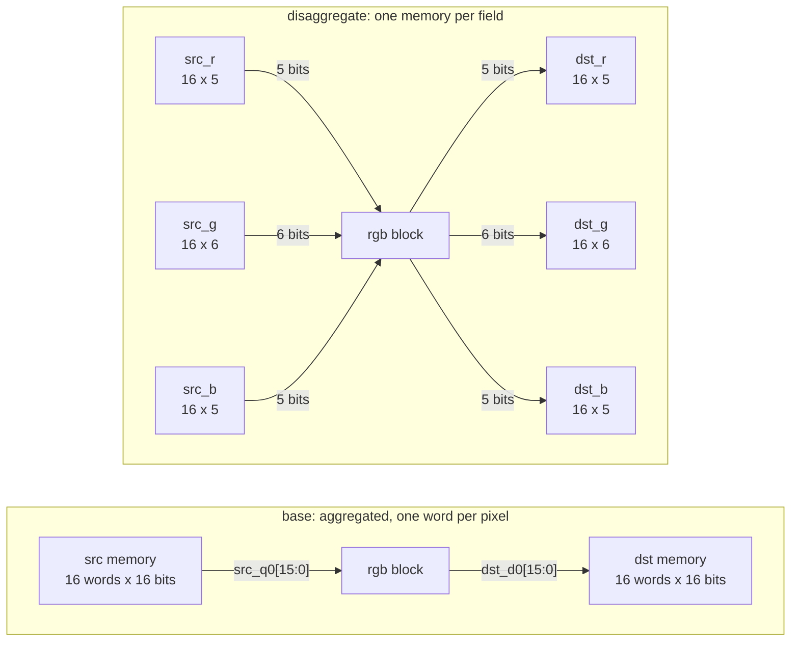

# 5.2 AGGREGATE and DISAGGREGATE

## 1. Introduction

A **struct** is a C++ type that groups several named fields, here the red, green and blue channels of one pixel.
When a struct is an argument of the top-level function, Vitis HLS has to decide how its fields become wires.
**AGGREGATE** packs all fields of the struct into one wide word, so one port carries a whole pixel.
**DISAGGREGATE** does the opposite: it splits the struct into its fields, and each field gets its own port.
For an array of structs, disaggregation turns one array of pixels into one array per channel.

The **compact** option of AGGREGATE sets the alignment of the fields inside the wide word.
With `-compact bit` the fields are packed back to back, with no gaps.
With `-compact byte` every field starts on a byte boundary, and the unused bits in between are **padding**, which means bits that carry no data.

What improves is control over the boundary of the block.
An aggregated word lets a caller move a whole pixel in one access, and a bit-packed word wastes no memory width.
A disaggregated struct lets each field live in its own memory, which is what a downstream block that consumes only one channel wants.

What it costs is width or port count, never cycles in this kernel.
Byte alignment widens every word by the padding.
Disaggregation multiplies the number of address, enable and data ports.

Use AGGREGATE with an explicit `-compact` option when another block or a software driver depends on an exact bit layout.
Use DISAGGREGATE when the fields are stored or consumed separately.

**Neither directive changes the logic inside the block in this lesson.**
Every field sits at a bit offset known at compile time, so reading or writing a field is a constant selection of wires.
The directives change which wires leave the block and how wide they are.

References: [UG1399 pragma HLS aggregate](https://docs.amd.com/r/2023.2-English/ug1399-vitis-hls/pragma-HLS-aggregate), [UG1399 pragma HLS disaggregate](https://docs.amd.com/r/2023.2-English/ug1399-vitis-hls/pragma-HLS-disaggregate), and [UG1399 Vitis HLS Alignment Rules and Semantics](https://docs.amd.com/r/2021.2-English/ug1399-vitis-hls/Vitis-HLS-Alignment-Rules-and-Semantics).

**Roster deviations.**
The roster planned an `rgb` struct, and this lesson keeps it, but with RGB565 fields of five, six and five bits instead of three bytes.
With three 8-bit fields every compact mode produces the same 24-bit word, so the padding this lesson is about would never appear.
The lesson also has four solutions instead of three.
The documentation disagrees about the default alignment for an `ap_memory` port, so the lesson measures it: exactly one of `aggregate_bit` and `aggregate_byte` should turn out identical to `base`.

## 2. How it works

`ap_memory` is the default protocol for an array argument, as lesson 5.1 showed: the block drives an address and an enable, and receives the data one cycle later.
The diagram shows the memories that the caller must provide in `base` and in `disaggregate`.



In `base`, one read of `src` delivers all three channels of pixel `i` at once, and the block cuts the word into its fields with fixed wire slices.
The swap of red and blue is then only a different order of those slices on the way into `dst_d0`.
In `disaggregate`, each channel arrives on its own port, so no slicing is needed at all, and the swap is a crossing of two 5-bit buses.
All six memories are addressed by the same loop counter, so all three reads happen in the same cycle, just as the single wide read does in `base`.
The two solutions move the same bits in the same cycles.
Only the grouping of the bits into ports differs.

## 3. The kernel

```cpp
// src/rgb.h
#ifndef RGB_H
#define RGB_H

#include <ap_int.h>

struct pix_t {
    ap_uint<5> r;
    ap_uint<6> g;
    ap_uint<5> b;
};

const int N = 16;

void rgb(const pix_t src[N], pix_t dst[N]);

#endif
```

```cpp
// src/rgb.cpp
#include "rgb.h"

void rgb(const pix_t src[N], pix_t dst[N]) {
RGB_LOOP:
    for (int i = 0; i < N; i++) {
        pix_t p = src[i];
        pix_t q;
        q.r = p.b;
        q.g = p.g;
        q.b = p.r;
        dst[i] = q;
    }
}
```

The kernel converts 16 RGB565 pixels to BGR565 by exchanging the red and blue fields.
Red and blue are both five bits wide, so the exchange never truncates or extends a value.
The loop contains no arithmetic, so any difference in area between solutions comes from the ports and not from the datapath.

## 4. The solutions

| Solution         | Directive on `src` and `dst`            | Expected port word                       |
| ---------------- | --------------------------------------- | ---------------------------------------- |
| `base`           | none                                    | one aggregated word, default alignment   |
| `disaggregate`   | `set_directive_disaggregate`            | three separate fields of 5, 6 and 5 bits |
| `aggregate_bit`  | `set_directive_aggregate -compact bit`  | one 16-bit word, fields packed           |
| `aggregate_byte` | `set_directive_aggregate -compact byte` | one 24-bit word, each field byte-aligned |

A bare `set_directive_aggregate` with no `-compact` option is not a solution, because it requests exactly what the tool already does by default.

## 5. Predict

**Prediction 1: every solution has a function latency of 33 cycles.**
Each iteration needs one state to send the address and one state to receive the data and write it, exactly as in the `vadd` base of lesson 1.1.
Splitting the struct into three memories does not add accesses per memory, and widening the word does not add a cycle.

$$L = T \times L_{\textrm{it}} + 1 = 16 \times 2 + 1 = 33$$

| Operation            | C0 | C1 |
| -------------------- | -- | -- |
| drive `src` address  | X  |    |
| receive `src` data   |    | X  |
| slice and swap       |    | X  |
| write `dst`          |    | X  |

**Prediction 2: the port word is 16 bits in `base` and `aggregate_bit`, and 24 bits in `aggregate_byte`.**
The alignment table in UG1399 lists bit compaction as the default for non-AXI protocols such as `ap_memory`, so `base` should pack the fields.

$$W_{\textrm{bit}} = 5 + 6 + 5 = 16, \qquad W_{\textrm{byte}} = 3 \times 8 = 24$$

In `aggregate_byte`, 8 of the 24 bits are padding, so a third of every memory word would carry no data.
In `disaggregate` the six memory interfaces carry 5, 6 and 5 bits each, which adds up to the same 16 data bits as `base`, but spread over three address buses per argument instead of one.

**Prediction 3: in `aggregate_byte` the padding bits of `dst_d0` are driven to constant zero.**
The kernel writes three fields and never mentions the gaps, so the natural reading is that the tool ties the bits that hold nothing to nothing.
This is the only prediction of the three that the run refutes, and section 7 shows what it does instead.

## 6. Run

```bash
cd s5_interfaces/52_aggregate
vitis_hls -f run_hls.tcl 2>&1 | tee run.log

# Did every solution pass? Expect 9: one from csim, two per cosim.
grep -c "TEST PASSED" run.log
grep "COSIM FAILED" run.log

# Which solution does a message belong to?
grep -n "== solution" run.log

# The struct messages: 214-241 says a struct was packed, 214-210 says it was split.
# Expect 8 lines: two per solution.
grep -n "INFO: \[HLS 214-241\]\|INFO: \[HLS 214-210\]" run.log

# Latency and resources, same scripts as earlier lessons
bash ../../common/collect_latency.sh rgb_proj
bash ../../common/collect_resources.sh rgb_proj

# The Interface section of each report: port names and widths
for s in base disaggregate aggregate_bit aggregate_byte; do
  echo "== $s"; sed -n '/^== Interface/,$p' rgb_proj/$s/syn/report/rgb_csynth.rpt
done

# Co-simulation latency
grep -H "Verilog" rgb_proj/*/sim/report/rgb_cosim.rpt

# How many top-level ports each solution has
for s in base disaggregate aggregate_bit aggregate_byte; do
  echo -n "$s "; grep -cE "^\s*(input|output)" rgb_proj/$s/syn/verilog/rgb.v
done

# The field selection: constant part-selects of the read data
for s in base aggregate_bit aggregate_byte; do
  echo "== $s"; grep -n "assign dst_d0\|src_q0\[" rgb_proj/$s/syn/verilog/rgb.v
done

# In disaggregate there is nothing to slice, so look at the data outputs instead
grep -n "assign dst_._d0\|assign src_._address0" rgb_proj/disaggregate/syn/verilog/rgb.v

# How close is base to each explicit solution? Count the differing lines.
for s in aggregate_bit aggregate_byte disaggregate; do
  echo -n "base vs $s: "
  diff rgb_proj/base/syn/verilog/rgb.v rgb_proj/$s/syn/verilog/rgb.v | grep -c '^[<>]'
done

# base against aggregate_bit in full: the whole difference fits on a screen
diff rgb_proj/base/syn/verilog/rgb.v rgb_proj/aggregate_bit/syn/verilog/rgb.v

# Post-synthesis area from Vivado (a few minutes)
vitis_hls -f export_syn.tcl 2>&1 | tee export.log
grep -HE "^(LUT|FF|DSP|BRAM|SRL|URAM)|CP achieved" rgb_proj/*/impl/report/verilog/rgb_export.rpt
```

Co-simulation runs in every solution because these directives change the port layout.
C simulation passes a whole `pix_t` by value and never sees a bit position, so a wrong field order or wrong padding can only show up in cosim.

## 7. Read the results

Every number below comes from Vitis HLS 2023.2.2 on `xcku5p-ffvb676-2-e` with the 3.33 ns clock of `common/part.tcl`, which also sets `config_compile -pipeline_loops 0`.

### The log

`grep -c "TEST PASSED" run.log` returns **9**: one from `csim_design` in `base`, and two from each of the four co-simulations, because `cosim_design` runs the testbench once in C and once against the RTL.
`grep "COSIM FAILED" run.log` returns nothing, so all four port layouts carry the 16 calls of the testbench correctly.

Two message families report what happened to the struct, and there are six lines of the first and two of the second:

```text
INFO: [HLS 214-241] Aggregating bram variable 'dst' with compact=bit mode in 16-bits    <- base
INFO: [HLS 214-241] Aggregating bram variable 'src' with compact=bit mode in 16-bits    <- base
INFO: [HLS 214-210] Disaggregating variable 'src'                                       <- disaggregate
INFO: [HLS 214-210] Disaggregating variable 'dst'                                       <- disaggregate
INFO: [HLS 214-241] Aggregating bram variable 'src' with compact=bit mode in 16-bits    <- aggregate_bit
INFO: [HLS 214-241] Aggregating bram variable 'dst' with compact=bit mode in 16-bits    <- aggregate_bit
INFO: [HLS 214-241] Aggregating bram variable 'src' with compact=byte mode in 24-bits   <- aggregate_byte
INFO: [HLS 214-241] Aggregating bram variable 'dst' with compact=byte mode in 24-bits   <- aggregate_byte
```

`base` prints 214-241 as well, and that single fact answers prediction 2 before any report is opened: the default alignment for an `ap_memory` struct port in the Vivado flow is `compact=bit`, and the tool says so even when no directive asked for it.
The message is not evidence that a directive was applied; it is evidence that aggregation happened, which for a struct on the interface it always does unless DISAGGREGATE stops it.
The only thing the directive changed in `aggregate_bit` is the order of the two lines, which follows the order of the two `set_directive_aggregate` commands instead of the tool's internal order.

### The Interface table

The Interface section of `syn/report/rgb_csynth.rpt` lists every RTL port with its direction, width and protocol.

| Solution         | Memory ports                                         | Data width per port | Total RTL ports |
| ---------------- | ---------------------------------------------------- | ------------------- | --------------- |
| `base`           | `src`, `dst`                                         | 16, 16              | 13              |
| `disaggregate`   | `src_r`, `src_g`, `src_b`, `dst_r`, `dst_g`, `dst_b` | 5, 6, 5, 5, 6, 5    | 27              |
| `aggregate_bit`  | `src`, `dst`                                         | 16, 16              | 13              |
| `aggregate_byte` | `src`, `dst`                                         | 24, 24              | 13              |

`base` and `aggregate_bit` have byte-for-byte identical Interface tables:

```text
|src_address0  |  out|    4|   ap_memory|           src|         array|
|src_ce0       |  out|    1|   ap_memory|           src|         array|
|src_q0        |   in|   16|   ap_memory|           src|         array|
|dst_address0  |  out|    4|   ap_memory|           dst|         array|
|dst_ce0       |  out|    1|   ap_memory|           dst|         array|
|dst_we0       |  out|    1|   ap_memory|           dst|         array|
|dst_d0        |  out|   16|   ap_memory|           dst|         array|
```

`aggregate_byte` differs in exactly two numbers, `src_q0` and `dst_d0` at 24 bits.
The address is still 4 bits and the depth is still 16 in all three: byte alignment widens the word, it does not add elements.

`disaggregate` names each memory after the argument and the field, joined by an underscore, and gives each the width of its own field:

```text
|src_r_address0  |  out|    4|   ap_memory|         src_r|         array|
|src_r_ce0       |  out|    1|   ap_memory|         src_r|         array|
|src_r_q0        |   in|    5|   ap_memory|         src_r|         array|
|src_g_q0        |   in|    6|   ap_memory|         src_g|         array|
|src_b_q0        |   in|    5|   ap_memory|         src_b|         array|
|dst_r_d0        |  out|    5|   ap_memory|         dst_r|         array|
|dst_g_d0        |  out|    6|   ap_memory|         dst_g|         array|
|dst_b_d0        |  out|    5|   ap_memory|         dst_b|         array|
```

The Source Object column is worth a second look: it no longer names `src`, it names `src_r`, `src_g` and `src_b`.
After DISAGGREGATE the argument does not exist at the interface at all; three separate arrays do.
That is why the port count goes from 13 to 27 while the number of data bits stays at 16 per direction.

### The bit layout

The first field declared in the struct lands in the **LSB**, the least significant bit, of the word, and the last field lands next to the **MSB**, the most significant bit.

`base` and `aggregate_bit`, 16 bits:

| Bits  | 15 to 11 | 10 to 5 | 4 to 0 |
| ----- | -------- | ------- | ------ |
| Field | `b`      | `g`     | `r`    |

`aggregate_byte`, 24 bits:

| Bits  | 23 to 21 | 20 to 16 | 15 to 14 | 13 to 8 | 7 to 5  | 4 to 0 |
| ----- | -------- | -------- | -------- | ------- | ------- | ------ |
| Field | padding  | `b`      | padding  | `g`     | padding | `r`    |

Both layouts are confirmed by the part-selects in the generated Verilog, below.

### The generated Verilog

`base` builds `dst_d0` out of three constant part-selects of `src_q0`:

```verilog
assign dst_d0 = {{{p_r_fu_112_p1}, {tmp_fu_116_p4}}, {p_b_fu_126_p4}};
assign p_r_fu_112_p1 = src_q0[4:0];    // r, into bits 15:11 of dst_d0
assign tmp_fu_116_p4 = {{src_q0[10:5]}};   // g, into bits 10:5
assign p_b_fu_126_p4 = {{src_q0[15:11]}};  // b, into bits 4:0
```

Read as one line, that is `dst_d0 = {src_q0[4:0], src_q0[10:5], src_q0[15:11]}`.
The indices are constants, so these four lines describe wiring, not a shifter.
Compare this with lesson 2.2, where a reshaped word was sliced at a position that depended on the loop index.
A position known only at run time needs a multiplexer to select the slice, and complete reshape ended at 13 cycles against 9 for complete partition.
Here nothing depends on `i` inside the word, so the selection is free.

`aggregate_bit` produces the same four lines, and the only differences in the whole file are the names of two wires:

```text
< wire   [4:0] p_r_fu_112_p1;              > wire   [4:0] trunc_ln10_fu_112_p1;
< wire   [4:0] p_b_fu_126_p4;              > wire   [4:0] trunc_ln10_2_fu_126_p4;
```

`diff` reports 14 changed lines, all of them those two names and the order in which two `assign` statements happen to be printed.
Normalise the two names and sort the lines and the files are identical, down to the instance numbers `112` and `126`, which is a stronger statement than the port table alone: the default really is `-compact bit`, not merely a layout that happens to be the same width.

`aggregate_byte` slices on **byte** boundaries, not on field boundaries:

```verilog
assign dst_d0 = {{{trunc_ln10_fu_110_p1}, {tmp_fu_114_p4}}, {trunc_ln10_2_fu_124_p4}};
assign trunc_ln10_fu_110_p1 = src_q0[7:0];      // 8 bits, not 5
assign tmp_fu_114_p4 = {{src_q0[15:8]}};        // 8 bits, not 6
assign trunc_ln10_2_fu_124_p4 = {{src_q0[23:16]}};  // 8 bits, not 5
```

The three wires are 8 bits wide, so the padding travels with its field instead of being replaced by constant zeros.
`dst_d0[23:21]` is a copy of `src_q0[7:5]`, and those are padding bits at both ends.
This costs nothing — a wire is a wire — but it is worth knowing if a downstream block reads the whole 24-bit word and expects the gaps to be zero: with this kernel they hold whatever the input word had in them.

`disaggregate` has no part-select anywhere.
Each data output is driven straight from a data input, and all three memories of one argument share a single address wire:

```verilog
assign dst_b_d0 = src_r_q0;
assign dst_g_d0 = src_g_q0;
assign dst_r_d0 = src_b_q0;
assign src_b_address0 = zext_ln9_fu_151_p1;
assign src_g_address0 = zext_ln9_fu_151_p1;
assign src_r_address0 = zext_ln9_fu_151_p1;
```

The enable is copied the same way: three identical `always` blocks set `src_r_ce0`, `src_g_ce0` and `src_b_ce0` from the same FSM state.
That fan-out is the entire hardware difference between `disaggregate` and `base`, and it is too small for the area report to notice.

### The performance and area table

All four solutions are the same in every number the tool reports.

| Quantity                       | base  | disaggregate | aggregate_bit | aggregate_byte |
| ------------------------------ | ----- | ------------ | ------------- | -------------- |
| Iteration latency (cycles)     | 2     | 2            | 2             | 2              |
| Loop latency                   | 32    | 32           | 32            | 32             |
| Function latency, C synthesis  | 33    | 33           | 33            | 33             |
| Interval, C synthesis          | 34    | 34           | 34            | 34             |
| Cosim latency, min / avg / max | 33/33/33 | 33/33/33  | 33/33/33      | 33/33/33       |
| Cosim total, 16 calls          | 543   | 543          | 543           | 543            |
| Estimated clock (ns)           | 1.354 | 1.354        | 1.354         | 1.354          |
| C synthesis FF                 | 13    | 13           | 13            | 13             |
| C synthesis LUT                | 54    | 54           | 54            | 54             |
| C synthesis BRAM_18K / DSP     | 0 / 0 | 0 / 0        | 0 / 0         | 0 / 0          |

The 13 flip-flops are the 3-bit FSM, the 5-bit loop counter `i` and the 5-bit registered address of `dst`; the 54 LUTs are the counter's increment (12), the loop exit comparison (13) and the two multiplexers of the FSM and the counter (29).
Not one of those entries mentions `src_q0` or `dst_d0`, which is the measurement behind the claim in section 1: the field selection is free.
Co-simulation agrees with C synthesis exactly, so the cycle count is a property of the schedule and not of the memory model.

### Predicted and measured

| Quantity                            | Predicted       | Measured        | Match |
| ----------------------------------- | --------------- | --------------- | ----- |
| Function latency, all solutions     | 33              | 33              | yes   |
| Cosim latency, all solutions        | 33              | 33              | yes   |
| Word width in `base`                | 16              | 16              | yes   |
| Word width in `aggregate_byte`      | 24              | 24              | yes   |
| `base` RTL identical to             | `aggregate_bit` | `aggregate_bit` | yes   |
| Memory interfaces in `disaggregate` | 6               | 6               | yes   |
| Padding bits of `dst_d0` are zero    | yes             | no, copied from `src_q0` | no |

Six of the seven predictions hold, and the one that fails fails in a detail that no report would have shown: only the Verilog says where the padding bits come from.

## 8. Hardware implications

Inside the block, nothing physical appears or disappears between solutions, and this is the rare lesson where that claim can be made without a caveat.
The datapath is wiring in all four, the loop counter and the state machine are the same, and the latency is the same.
Vivado agrees with C synthesis and with itself:

| Solution         | Vivado LUT | Vivado FF | BRAM_18K | SRL | CP achieved (ns) | C synthesis had said |
| ---------------- | ---------- | --------- | -------- | --- | ---------------- | -------------------- |
| `base`           | 9          | 12        | 0        | 0   | 0.703            | 54 LUT, 13 FF        |
| `disaggregate`   | 9          | 12        | 0        | 0   | 0.703            | 54 LUT, 13 FF        |
| `aggregate_bit`  | 9          | 12        | 0        | 0   | 0.703            | 54 LUT, 13 FF        |
| `aggregate_byte` | 9          | 12        | 0        | 0   | 0.703            | 54 LUT, 13 FF        |

The Primitives table of `impl/verilog/report/rgb_utilization_synth.rpt` is the same list in all four solutions as well: 11 `FDRE`, 1 `FDSE`, and 12 LUT cells that Vivado packs into 9 CLB LUTs.
Those twelve flip-flops are the FSM, the counter and the registered `dst` address.
Not one of them belongs to a field, and not one LUT belongs to the swap, because a constant part-select is a rename of a wire and costs nothing in any technology.
The gap between 54 estimated LUTs and 9 real ones is the usual one: C synthesis charges each operator at its worst case and cannot see the constant folding and LUT packing that Vivado does.

So the cost of these directives is not inside the block at all.
It is the hardware the caller must provide around it, and no report in `rgb_proj` shows it.

| Solution         | Memories the caller provides per argument | Storage bits per argument | Of which padding |
| ---------------- | ----------------------------------------- | ------------------------- | ---------------- |
| `base`           | one, 16 words × 16 bits                   | 256                       | 0                |
| `disaggregate`   | three, 16 × 5, 16 × 6 and 16 × 5          | 256                       | 0                |
| `aggregate_bit`  | one, 16 words × 16 bits                   | 256                       | 0                |
| `aggregate_byte` | one, 16 words × 24 bits                   | 384                       | 128, a third     |

In `disaggregate` the caller needs three memories per argument instead of one, each with its own address decoder, although the total number of stored bits is unchanged.
In `aggregate_byte` the caller's memory is 24 bits wide, so 128 of its 384 bits per argument hold nothing.

On an FPGA, this cost is partly hidden by the primitives.
A BRAM, the dedicated block memory of the device, is configured in fixed widths, so 16 and 24 bits both fit in one 18 Kb BRAM at this depth, and three narrow memories may cost three BRAMs or a few LUTRAMs depending on how the caller declares them.
Note that none of that appears in the table above: the memories are outside the block, so `export_syn.tcl` reports 0 BRAM everywhere.

In a standard-cell ASIC flow, the cost is visible directly.
Every SRAM macro carries its own decoder, sense amplifiers and control periphery, so three narrow macros cost more area than one 16-bit macro holding the same bits.
The 128 padding bits of `aggregate_byte` are real bit cells in every word.
The field selection itself carries over unchanged: constant part-selects are wires in any technology.

## 9. One common mistake and one question

**The mistake: declaring the fields in the order of the RGB565 convention and expecting red in the upper bits.**
In the RGB565 convention, red occupies bits 15 to 11 and blue bits 4 to 0.
AGGREGATE places the first declared field in the LSB, so the struct of this lesson puts red in bits 4 to 0, which is the opposite.
C simulation cannot catch this, because the testbench sees fields and not bits, and cosim cannot catch it either, because its transactor uses the same layout as the RTL.
The error appears only when a hand-written block or a software driver reads the word, so to match the convention, declare `b` first and `r` last.

**The question: if you disaggregate only `src` and keep `dst` aggregated, how many memory interfaces does the block have, and does the latency change?**

<details>
<summary>Answer</summary>

The block has four memory interfaces and the latency stays at 33 cycles.
Synthesizing the kernel with `set_directive_disaggregate "rgb" src` and nothing on `dst` gives this Interface table: three narrow read memories `src_r`, `src_g` and `src_b` at 5, 6 and 5 bits, and one 16-bit write memory `dst`, for 19 RTL ports in total and the same 13 FF and 54 LUT as every solution in section 7.

Each memory still receives exactly one access per iteration, so the schedule has the same two states per iteration and the function latency and interval are 33 and 34.
The only change inside the block is the line that builds the output word:

```verilog
assign dst_d0 = {{{src_r_q0}, {src_g_q0}}, {src_b_q0}};
```

`dst_d0` is now concatenated from three separate input buses instead of three slices of one input word, and both are wiring.

</details>
