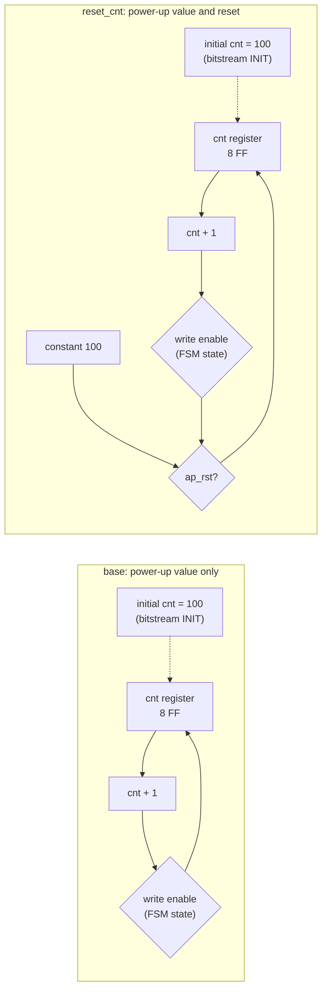
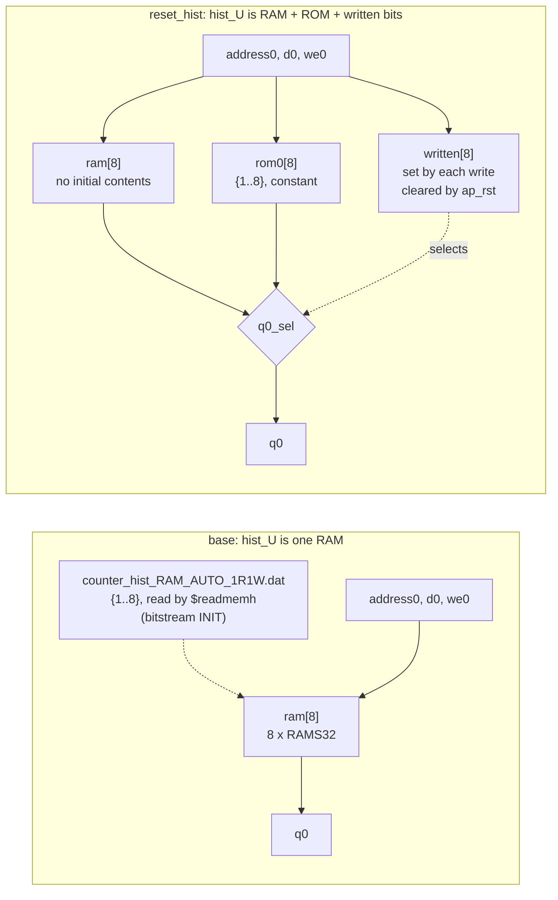

# 5.3 RESET

## 1. Introduction

The RESET directive decides whether one static or global variable returns to its C initial value when the reset port `ap_rst` is asserted.
A **static variable** keeps its value from one call of the function to the next, so in hardware it becomes a register or a memory that holds state.
Vitis HLS gives every initialised static variable its C value at **power-up**.
That value is written into the initial contents of the register in the RTL and, on an FPGA, into the **bitstream**, which is the configuration file loaded into the device when it is switched on.
A **reset** is a different event: the surrounding system can assert it at any time after power-up, and a register returns to its initial value only if the RTL contains a branch that drives it there.

The global setting `config_rtl -reset` decides which registers get such a branch.
Its default in 2023.2 is `control`, which resets the finite state machine (FSM) and the registers that generate the handshake signals, and leaves static variables alone.
The RESET directive overrides that setting for one variable, either by adding a reset, which is the form taught here, or by removing one with `-off`.

**What improves** is behavior after a reset: the kernel restarts from the same state it had at power-up, without the bitstream being reloaded.
**What it costs** depends on the variable.
A scalar costs nothing on this FPGA, because every flip-flop already has a set/reset pin.
An array held in a memory costs real logic, because a memory has no reset pin: Vitis HLS keeps a second copy of the initial values in a ROM and a bit per address that says whether the RAM has been written since the last reset.
**When to use it:** use it whenever the system can reset the accelerator without reprogramming it and expects the state to restart, and always in an ASIC flow, where there is no power-up value at all (section 8).

**RESET changes hardware only when the variable was not already reset.**
Under the default `control` mode no static variable is reset, so both directives in this lesson add logic.
Under `config_rtl -reset state` or `all`, every static variable is already reset, adding RESET to one of them changes nothing, and only `-off` would change the RTL.

References: [pragma HLS reset (UG1399)](https://docs.amd.com/r/2023.2-English/ug1399-vitis-hls/pragma-HLS-reset), [config_rtl (UG1399)](https://docs.amd.com/r/en-US/ug1399-vitis-hls/config_rtl), [Initializing and Resetting Arrays (UG1399)](https://docs.amd.com/r/en-US/ug1399-vitis-hls/Initializing-and-Resetting-Arrays).

**Roster deviations.**
The roster planned a `counter` kernel with one static variable.
This kernel also holds a static array of eight entries, because resetting a memory costs something different from resetting a register, and one lesson should show both.
The kernel has no loop, so there are no loop labels.
Co-simulation cannot pulse the reset in the middle of a run, so the lesson adds a short Verilog testbench, `tb/rst_tb.v`, with a script, `sim_reset.sh`, that drives `ap_rst` between calls on the generated RTL.

## 2. How it works

### A scalar: one extra branch in one `always` block



In both versions the register receives its value of 100 from the `initial` block of the RTL, which the FPGA tools turn into the INIT attribute of each flip-flop.
The dotted edge marks that path: it acts once, when the device is configured, and never again.
In `base` the only way into the register afterwards is the increment, so an `ap_rst` pulse leaves the counter where it was, while the FSM beside it returns to its idle state.
In `reset_cnt` a second, higher-priority path loads the constant 100 whenever `ap_rst` is high at a clock edge, so a reset and a power-up leave the register in the same state.
The reset is **synchronous**, meaning it acts only at a rising clock edge, and **active high**, meaning `ap_rst = 1` resets; both are the `config_rtl` defaults.

### An array: a ROM, a written-bit vector and a multiplexer

A RAM has no reset pin, so a reset cannot restore its contents.
Rather than spend cycles writing the eight initial values back one address at a time, Vitis HLS rebuilds the *appearance* of a reset memory out of three pieces, all inside the generated module `counter_hist_RAM_AUTO_1R1W`:



`written` is an 8-bit register, one bit per address, cleared by `ap_rst` and set whenever that address is written.
A read returns the RAM output when the bit is set and the ROM output when it is not.
After a reset every bit is 0, so every address reads back its C initial value, exactly as at power-up — and it costs **zero cycles**, because nothing has to be rewritten.
Note what disappears in `reset_hist`: the RAM itself no longer has a `$readmemh` and no longer carries an INIT, since the ROM now holds the initial values.

## 3. The kernel

`src/counter.h`

```cpp
#ifndef COUNTER_H
#define COUNTER_H

#include <ap_int.h>

typedef ap_uint<8> cnt_t;   // wraps from 255 to 0
typedef ap_uint<3> slot_t;  // selects one of H entries

const int H        = 8;
const int CNT_INIT = 100;   // non-zero, so a restart is visible

cnt_t counter(slot_t slot, cnt_t *hits);

#endif
```

`src/counter.cpp`

```cpp
#include "counter.h"

// Lesson 5.3 RESET. Two pieces of state survive between calls: a scalar call
// counter and a small table of per-slot counters. Both start from their C
// initial values at power-up in every solution; only the RESET directive
// decides whether ap_rst also returns them there. This file never changes.
cnt_t counter(slot_t slot, cnt_t *hits) {
    static cnt_t cnt     = CNT_INIT;
    static cnt_t hist[H] = {1, 2, 3, 4, 5, 6, 7, 8};

    cnt = cnt + 1;
    cnt_t h = hist[slot] + 1;
    hist[slot] = h;
    *hits = h;
    return cnt;
}
```

The kernel has no loop, so it has nothing to label.
`cnt` becomes an 8-bit register.
`hist` has eight entries and a variable index, so the tool keeps it as a small memory rather than splitting it into registers; on this part it lands in **distributed RAM**, eight `RAMS32` cells built from LUTs, not in a block RAM.
The return value becomes the output port `ap_return`, and `hits` becomes an output port with a valid signal, `hits_ap_vld`.

## 4. The solutions

| solution     | directive                            | `cnt` after `ap_rst` | `hist` after `ap_rst`    |
| ------------ | ------------------------------------ | -------------------- | ------------------------ |
| `base`       | none                                 | keeps its value      | keeps its values         |
| `reset_cnt`  | `set_directive_reset "counter" cnt`  | 100                  | keeps its values         |
| `reset_hist` | `set_directive_reset "counter" hist` | keeps its value      | {1, 2, 3, 4, 5, 6, 7, 8} |

Every solution runs under the default `config_rtl -reset control`: `common/part.tcl` sets only the part, the clock and `config_compile`, and never touches `config_rtl`, so the default applies everywhere.
A fourth solution that switched the global mode to `state` would change a configuration rather than a directive, and configuration commands are kept identical across a lesson, so it is not here; section 9 asks what it would do.

## 5. Predict

**Prediction 1: `reset_cnt` costs 0 FF and 0 LUT more than `base`, and the number of FDSE cells rises from 1 to 4.**
An **FF** is a flip-flop, a one-bit storage element, and a **LUT** is a look-up table, the small programmable logic block of the FPGA.
Xilinx flip-flops come in variants: **FDRE** has a synchronous reset pin that drives the bit to 0, and **FDSE** has a synchronous set pin that drives it to 1.
The number 100 is `0110_0100` in binary, so three of the eight bits of `cnt` must go to 1 on reset and become FDSE cells.
`base` already has one FDSE cell, because the one-hot FSM register resets its first bit to 1.
No LUT should be needed, because an FDRE gives its reset pin priority over its clock enable, which is exactly the order of the `if (ap_rst) ... else if (enable) ...` branch.

**Prediction 2: `reset_hist` costs extra flip-flops and LUTs but no extra cycles.**
A memory cannot be reset in one cycle, and a clearing loop over the eight addresses would cost eight cycles on the first call after every reset — a price paid on every call in the worst case.
Vitis HLS avoids it with the ROM-and-written-bit construction of section 2, which is combinational on the read path and therefore free in time.
The cost to predict is area: 8 flip-flops for `written`, 1 more for the registered select, some flip-flops for the ROM output, and the LUTs for the ROM contents and the output multiplexer.
Latency should stay at 1 cycle and the interval at 2 in every solution:

$$\textrm{interval} = \textrm{latency} + 1 = 2$$

**Prediction 3: the reset separates the three solutions exactly as the directives say.**
`tb/rst_tb.v` makes three calls on slot 0, pulses `ap_rst` for two clock edges, and makes three more.
Each call takes one cycle from `ap_start` to `ap_done`, and the testbench starts a new call every two cycles, so `ap_done` should land in cycles 4, 6, 8 before the reset and 13, 15, 17 after it, in every solution.

| call | done in cycle | `base` total, hits | `reset_cnt` total, hits | `reset_hist` total, hits |
| ---- | ------------- | ------------------ | ----------------------- | ------------------------ |
| 1    | 4             | 101, 2             | 101, 2                  | 101, 2                   |
| 2    | 6             | 102, 3             | 102, 3                  | 102, 3                   |
| 3    | 8             | 103, 4             | 103, 4                  | 103, 4                   |
| *— `ap_rst` high for two clock edges —* |
| 4    | 13            | 104, 5             | **101**, 5              | 104, **2**               |
| 5    | 15            | 105, 6             | **102**, 6              | 105, **3**               |
| 6    | 17            | 106, 7             | **103**, 7              | 106, **4**               |

The reset at time zero, before call 1, changes nothing visible, because the power-up values and the reset values are the same.
Only the second reset separates the solutions: `reset_cnt` restarts `total` and leaves `hits` running, `reset_hist` does the opposite, and `base` restarts neither.

## 6. Run

```bash
cd s5_interfaces/53_reset
vitis_hls -f run_hls.tcl 2>&1 | tee run.log

# Did every solution pass? Expect 7: one from csim, two per cosim.
grep -c "TEST PASSED" run.log

# What the tool says about initial values
grep -n "RTGEN 206-101" run.log

# Latency and resources, same scripts as earlier lessons
bash ../../common/collect_latency.sh counter_proj
bash ../../common/collect_resources.sh counter_proj

# Is hist a memory or a set of registers in each solution?
grep -n -A6 "\* Memory:" counter_proj/*/syn/report/counter_csynth.rpt
ls counter_proj/*/syn/verilog/

# The register writes of cnt: base shows one, reset_cnt shows two
grep -c "cnt <=" counter_proj/*/syn/verilog/counter.v
grep -n -A7 "^always @ (posedge ap_clk) begin" counter_proj/reset_cnt/syn/verilog/counter.v | head -20
grep -n -A3 "^initial begin" counter_proj/base/syn/verilog/counter.v

# How far is each solution from base? Count the differing lines.
norm() { sed -E 's/_(fu|reg)_[0-9]+/_\1_N/g' "$1"; }
for s in reset_cnt reset_hist; do
  echo "$s: $(diff <(norm counter_proj/base/syn/verilog/counter.v) \
                    <(norm counter_proj/$s/syn/verilog/counter.v) | grep -c '^[<>]')"
done

# reset_hist changes the memory module, not the top level
diff counter_proj/base/syn/verilog/counter_hist_RAM_AUTO_1R1W.v \
     counter_proj/reset_hist/syn/verilog/counter_hist_RAM_AUTO_1R1W.v

# Co-simulation latency, and the per-transaction numbers
grep -n -A3 "Verilog" counter_proj/*/sim/report/counter_cosim.rpt
head -n 8 counter_proj/reset_hist/sim/verilog/counter.performance.result.transaction.xml

# Reset in the middle of a run (needs Vivado on the PATH for xvlog, xelab, xsim)
for s in base reset_cnt reset_hist; do bash sim_reset.sh $s; done

# Post-synthesis flip-flop primitives from Vivado (about 11 minutes for all three)
vitis_hls -f export_syn.tcl 2>&1 | tee export.log
grep -E "FDRE|FDSE|LUT as|RAMS32" counter_proj/*/impl/verilog/report/counter_utilization_synth.rpt
sed -n '/^1. Utilization by Hierarchy/,$p' \
    counter_proj/reset_hist/impl/verilog/report/counter_utilization_hierarchical_synth.rpt
```

## 7. Read the results

All seven `TEST PASSED` lines appear (311 calls each): one from C simulation in `base`, and two from co-simulation in each of the three solutions.

### The log

The only message about initial values is the same warning in all three solutions:

```
WARNING: [RTGEN 206-101] Register 'cnt' is power-on initialization.
```

It refers to the `initial` block that gives `cnt` its value of 100, which is present in every solution, and it is not affected by the RESET directive — `reset_cnt` gets it too.
The tool prints nothing at all about `hist`, and nothing about a clearing loop, because it never builds one.

### Latency and resources from C synthesis

```
solution         best      worst     ii_min     ii_max   clk_est_ns
base                1          1          2          2        2.119
reset_cnt           1          1          2          2        2.119
reset_hist          1          1          2          2        2.119

solution   module          BRAM_18K    DSP       FF      LUT   URAM
base       counter                0      0       21       59      0
reset_cnt  counter                0      0       21       59      0
reset_hist counter                0      0       29       67      0
```

Latency, interval and estimated clock period are identical in all three solutions.
`reset_cnt` is free in the estimate as well as in time.
`reset_hist` adds 8 FF and 8 LUT to the estimate, and every one of them comes from the Memory row of `counter_csynth.rpt` — the top-level rows (Expression 30 LUT, Multiplexer 28 LUT, Register 13 FF) are the same everywhere.

### The Memory table

`hist` stays a memory in every solution; it never moves to the Register section, so the tool never considered 64 flip-flops.

| solution                | Memory FF | Memory LUT | Words x Bits |
| ----------------------- | --------- | ---------- | ------------ |
| `base`, `reset_cnt`     | 8         | 1          | 8 x 8        |
| `reset_hist`            | 16        | 9          | 8 x 8        |

The extra FF and LUT are the `written` vector, the select register and the ROM.

### The generated Verilog

`reset_cnt` differs from `base` by 8 lines, all of them in one `always` block:

```verilog
// base
always @ (posedge ap_clk) begin
    if ((1'b1 == ap_CS_fsm_state2)) begin
        cnt <= add_ln11_fu_69_p2;
    end
end

// reset_cnt
always @ (posedge ap_clk) begin
    if (ap_rst == 1'b1) begin
        cnt <= 8'd100;
    end else begin
        if ((1'b1 == ap_CS_fsm_state2)) begin
            cnt <= add_ln11_fu_73_p2;
        end
    end
end
```

`grep -c "cnt <="` returns 1 for `base` and `reset_hist` and 2 for `reset_cnt`.
The `initial` block is unchanged in all three:

```verilog
initial begin
#0 ap_CS_fsm = 2'd1;
#0 cnt = 8'd100;
end
```

`reset_hist` differs from `base` by **2 lines in the top level**, and both are inside the `CORE_GENERATION_INFO` comment that records the resource estimate.
The top-level logic is byte-for-byte identical; the whole reset lives inside the memory module.
There, `base` has one file and `reset_hist` has three:

```
base, reset_cnt                  reset_hist
counter.v                        counter.v
counter_hist_RAM_AUTO_1R1W.v     counter_hist_RAM_AUTO_1R1W.v      (wrapper: written, mux)
counter_hist_RAM_AUTO_1R1W.dat   counter_hist_RAM_AUTO_1R1W_ram.v  (the RAM, no $readmemh)
                                 counter_hist_RAM_AUTO_1R1W_rom.v  (the initial values)
                                 counter_hist_RAM_AUTO_1R1W_rom.dat
```

The wrapper holds the whole mechanism:

```verilog
reg [AddressRange-1:0] written = {AddressRange{1'b0}};
...
assign q0     = q0_sel ? q0_ram : q0_rom;
assign q0_sel = sel0_sr[0];

always @(posedge clk) begin
    if (reset)
        written <= 1'b0;
    else if (ce0 & we0)
        written[address0] <= 1'b1;
end

always @(posedge clk) begin
    if (ce0) sel0_sr[0] <= written[address0];
end
```

`sel0_sr` delays the select by one cycle so that it lines up with the one-cycle read latency of the RAM and the ROM.
The `.dat` file moves from the RAM to the ROM and its contents are unchanged, `01` through `08`.

### The reset waveform

`sim_reset.sh` prints, for the three solutions:

```
== base
call 1  cycle 4  total 101  hits 2  start-to-done 1
call 2  cycle 6  total 102  hits 3  start-to-done 1
call 3  cycle 8  total 103  hits 4  start-to-done 1
-- reset --
call 4  cycle 13  total 104  hits 5  start-to-done 1
call 5  cycle 15  total 105  hits 6  start-to-done 1
call 6  cycle 17  total 106  hits 7  start-to-done 1
== reset_cnt
call 1  cycle 4  total 101  hits 2  start-to-done 1
call 2  cycle 6  total 102  hits 3  start-to-done 1
call 3  cycle 8  total 103  hits 4  start-to-done 1
-- reset --
call 4  cycle 13  total 101  hits 5  start-to-done 1
call 5  cycle 15  total 102  hits 6  start-to-done 1
call 6  cycle 17  total 103  hits 7  start-to-done 1
== reset_hist
call 1  cycle 4  total 101  hits 2  start-to-done 1
call 2  cycle 6  total 102  hits 3  start-to-done 1
call 3  cycle 8  total 103  hits 4  start-to-done 1
-- reset --
call 4  cycle 13  total 104  hits 2  start-to-done 1
call 5  cycle 15  total 105  hits 3  start-to-done 1
call 6  cycle 17  total 106  hits 4  start-to-done 1
```

This is the table of section 5, line for line.
`start-to-done` is 1 on call 4 in every solution, including `reset_hist`: the array reset costs no cycles.
Co-simulation agrees that nothing changed in time — every solution reports latency 1 and interval 2, and the per-transaction file shows latency `1` for all 311 transactions and interval `2` for all but the last, which has no successor to be spaced from.

### Vivado primitives after synthesis

Timing is met in all three solutions, with the same achieved period of 1.064 ns against the 3.330 ns requirement.

| primitive          | `base` | `reset_cnt` | `reset_hist` |
| ------------------ | ------ | ----------- | ------------ |
| FDRE               | 20     | 17          | 33           |
| FDSE               | 1      | 4           | 1            |
| **FF total**       | **21** | **21**      | **34**       |
| LUT as Logic       | 21     | 21          | 41           |
| LUT as Distributed RAM (`RAMS32`) | 8 | 8      | 8            |
| **CLB LUT total**  | **29** | **29**      | **49**       |

`reset_cnt` has exactly the same cell count as `base`; three FDRE cells simply became FDSE, which is prediction 1 confirmed to the cell.
`reset_hist` costs 13 FF and 20 LUT, and the hierarchical report says where they sit:

```
| Instance                     | Total LUTs | Logic LUTs | LUTRAMs | FFs |
| inst (whole kernel)          |         49 |         41 |       8 |  34 |
|   (inst) top-level logic     |         10 |         10 |       0 |  13 |
|   hist_U                     |         39 |         31 |       8 |  21 |
|     (hist_U) written + mux   |         12 |         12 |       0 |   9 |
|     ..._ram_u                |         22 |         14 |       8 |   8 |
|     ..._rom_u                |          5 |          5 |       0 |   4 |
```

The top level keeps its 13 FF in every solution — the reset of `hist` adds nothing outside the memory.
Inside `hist_U`: 9 FF for `written` (8) and `sel0_sr` (1), 8 FF for the RAM output register, and 4 FF for the ROM output register, which needs only 4 bits because the values 1 to 8 leave the top four bits constant.
The ROM itself costs 5 LUTs, not a memory, because eight small constants collapse into logic.

### Predicted and measured

| quantity                                   | predicted | measured |
| ------------------------------------------ | --------- | -------- |
| function latency, all solutions            | 1         | 1        |
| interval, all solutions                    | 2         | 2        |
| `reset_cnt` minus `base`, FF (Vivado)      | 0         | 0        |
| `reset_cnt` minus `base`, LUT (Vivado)     | 0         | 0        |
| FDSE cells, `base`                         | 1         | 1        |
| FDSE cells, `reset_cnt`                    | 4         | 4        |
| `reset_hist` minus `base`, FF (Vivado)     | > 0       | +13      |
| `reset_hist` minus `base`, LUT (Vivado)    | > 0       | +20      |
| first call after reset, `reset_hist`       | 1 cycle   | 1 cycle  |
| `hits` after reset, `reset_hist`           | 2, 3, 4   | 2, 3, 4  |

## 8. Hardware implications

In `reset_cnt`, nothing physical appears on the FPGA.
The eight flip-flops of `cnt` already existed, and each one already had a synchronous set/reset pin that was tied off; the directive connects that pin to `ap_rst`, and three of the cells change from FDRE to FDSE so that the bits of `100 = 0110_0100` come back as ones.
The cell count, the LUT count and the achieved clock period are unchanged.
The only cost is fanout: `ap_rst` now drives eight more flip-flops, which matters for timing only in large designs.

In `reset_hist`, logic does appear, but not in the shape a clearing loop would have.
The cost is 13 flip-flops and 20 LUTs, and it buys a reset that takes no cycles at all: the initial values are kept in a small ROM beside the RAM, `written` records which addresses have been overwritten since the last reset, and the read multiplexer chooses between them.
The trade is area for time, and the tool takes it in one direction only.
Note the scaling: `written` needs one flip-flop per **address**, and the ROM needs storage for the whole initial content, so on an array of 4096 words the same construction would cost 4096 flip-flops plus a second memory.
That is why the default mode leaves static variables alone, and why `-off` on large arrays is the usual companion to `config_rtl -reset state`.

The picture changes in a standard-cell ASIC flow.
Logic synthesis for an ASIC ignores Verilog `initial` blocks, and an ASIC has no bitstream, so **in `base`, `cnt` and `hist` power up to unknown values on an ASIC**.
There, the reset is the only way to give a static variable its C initial value, and a reset flip-flop costs real area: either a flip-flop cell with a reset input or a gate in front of its data input.
The ROM-and-written-bit construction carries over unchanged and is if anything more valuable, because an SRAM macro also has no reset and no INIT.
The FDRE and FDSE vocabulary, and the claim that a synchronous reset is free, are specific to FPGAs.

## 9. One common mistake and one question

**Mistake: treating a C initialiser as a reset.**
A designer writes `static int cnt = 100;`, sees the value 100 in C simulation and in co-simulation, and concludes that the hardware restarts at 100 after every reset.
Both simulations begin at power-up, where the initial value and a reset value are indistinguishable, so neither can show the difference — which is exactly why this lesson needs `tb/rst_tb.v`.
On the board, a software reset of the accelerator then leaves `cnt` at its old value, and on an ASIC the value is unknown from the start.
The fix is the RESET directive on each variable that must restart, or `config_rtl -reset state` for all of them, with `-off` on the large arrays.

**Question: in this project, what would `set_directive_reset -off "counter" cnt` change in the RTL, and what would it change if `common/part.tcl` contained `config_rtl -reset state`?**

<details>
<summary>Answer</summary>

In this project it would change nothing.
The default mode is `control`, which never resets static variables, so `cnt` has no reset to remove, and the RTL is identical to `base`.
Under `config_rtl -reset state`, every static variable, `hist` included, would be reset, so `-off` on `cnt` would remove the `if (ap_rst)` branch from its register — back to 20 FDRE and 1 FDSE — while `hist` kept its ROM, its `written` vector and the 13 FF and 20 LUT they cost.
This mirrors the rule stated in the introduction: RESET changes hardware only when it disagrees with what the global mode already does.

</details>
