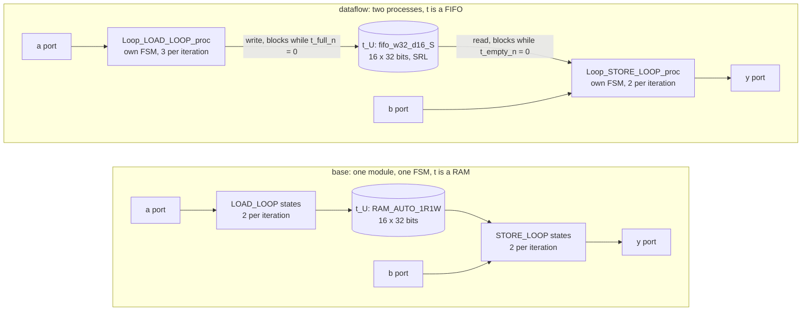

# 6.1 DATAFLOW

## 1. Introduction

The DATAFLOW directive turns the functions and loops inside one function into **processes**, which are independent hardware blocks that each get their own controller and run at the same time.
The processes pass data to each other through **channels**, which are small memories or queues that the tool inserts between a producer and a consumer.
Without DATAFLOW, one controller walks through the stages in order, so the second stage cannot begin until the first has finished.
With DATAFLOW, the second stage begins as soon as it has something to read.

Two numbers describe the result, and DATAFLOW can move both.
The **latency** is the number of clock cycles from the start of one call to its end.
The **interval** (also written II) is the number of cycles between the start of one call and the start of the next.
Which of the two improves depends on the kind of channel the tool builds:

- a **ping-pong buffer** (PIPO, for ping-pong in, ping-pong out) holds a whole array in each of two banks, and the consumer is released only when the producer has finished the entire array. One call does not get faster, but the *next* call can start early, so the interval improves and the latency does not.
- a **FIFO** (first in, first out) passes one element at a time, and the consumer is released as soon as the first element is in the queue. The stages then overlap *inside* one call, so the latency improves as well.

This lesson gets the second case.
For an array that the producer writes in order and the consumer reads in the same order, Vitis HLS converts the channel to a FIFO on its own, and the log says so:
`INFO: [XFORM 203-721] Change variable 't' to FIFO automatically.`
The measured effect is latency 66 → 51 cycles and reported interval 67 → 50 cycles.

The cost is one controller per process, status and handshake logic for the channel, and logic at the top level that combines the two processes' handshakes.
After Vivado synthesis that comes to **+14 LUT and +39 FF** on this kernel — and the channel itself gets *cheaper*, because a 16-deep shift-register FIFO replaces a 16-word distributed RAM together with its address decoding and output register.

DATAFLOW is worth using when a function consists of stages that each consume what the previous stage produced.
It is useless for a stage that reads its whole input before producing anything, and it cannot help beyond the slowest process, because that process alone sets the interval.

References: [UG1399, pragma HLS dataflow](https://docs.amd.com/r/2023.2-English/ug1399-vitis-hls/pragma-HLS-dataflow) and [config_dataflow](https://docs.amd.com/r/2023.2-English/ug1399-vitis-hls/config_dataflow).

This lesson has one roster deviation.
The roster does not name the section folder, so this lesson lives in `s6_dataflow/61_dataflow/`, and 6.2 STREAM will follow in `s6_dataflow/62_stream/`.
The kernel `pipe2` and the solutions `base` and `dataflow` follow the roster.

## 2. How it works



In `base`, a single **finite state machine** (FSM), which is the controller that steps through the schedule one state per clock cycle, walks through `LOAD_LOOP` and then through `STORE_LOOP`.
The whole design is one Verilog module with five states.
While the FSM is in `STORE_LOOP`, the hardware of `LOAD_LOOP` sits idle, because one FSM can only be in one state at a time.

In `dataflow`, each loop is lifted into a module of its own — `pipe2_Loop_LOAD_LOOP_proc` and `pipe2_Loop_STORE_LOOP_proc` — and each gets its own FSM, so both can be busy in the same cycle.
The top module `pipe2` keeps only the wiring and the handshakes.

### Why the channel becomes a FIFO and not a ping-pong buffer

`config_dataflow -default_channel` defaults to `pipo`, so an array channel is a ping-pong buffer *unless* the tool can do better.
It can do better when both ends touch the array strictly sequentially: the producer writes `t[0] … t[15]` once each in that order, and the consumer reads them once each in the same order.
Both loops here are plain `for (i = 0; i < N; i++)` bodies over `t[i]`, so the check succeeds and the array is turned into a stream.
The tool sizes the queue to the array, giving `pipe2_fifo_w32_d16_S`: 32 bits wide, 16 deep.

A FIFO is what makes the stages overlap within a single call.
The producer does not have to finish before the consumer starts; it only has to be one element ahead.

### What the blocking looks like

The FIFO exposes two status signals, and each process stalls on one of them:

- the LOAD process asserts `t_write` only while `t_full_n` is high, and holds its state otherwise;
- the STORE process reads `t_dout` only while `t_empty_n` is high, and holds its state otherwise.

That is the whole synchronisation: no global schedule, just two machines that wait on a queue.
Because the FIFO write can stall, it needs a state of its own, and the value to be written must already sit in a register when the stall happens.
This is why the LOAD loop body grows from two states in `base` to three in `dataflow`:

| state | LOAD process does |
|-------|-------------------|
| 2     | check `i < N`, drive `a_address0` and `a_ce0` |
| 3     | capture `a_q0` into `a_load_reg_122` |
| 4     | compute `a * 3` and write the FIFO; stay here while `t_full_n = 0` |

The STORE loop body keeps two states, because the FIFO read and the `b` read happen together and the write to `y` needs no permission:

| state | STORE process does |
|-------|--------------------|
| 2     | read `t_dout` and drive `b_address0`; stay here while `t_empty_n = 0` |
| 3     | compute `t + b` and write `y` |

That extra LOAD state is worth remembering: it is the reason the interval lands at 50 and not at 34.

## 3. The kernel

`src/pipe2.h`:

```cpp
#ifndef PIPE2_H
#define PIPE2_H

const int N     = 16;
const int SCALE = 3;

void pipe2(const int a[N], const int b[N], int y[N]);

#endif
```

`src/pipe2.cpp`:

```cpp
#include "pipe2.h"

// Lesson 6.1 DATAFLOW. Two stages joined by the local array t.
// LOAD_LOOP scales a into t, and STORE_LOOP adds b and writes y.
// This file never changes; only the DATAFLOW directive differs.
void pipe2(const int a[N], const int b[N], int y[N]) {
    int t[N];

LOAD_LOOP:
    for (int i = 0; i < N; i++)
        t[i] = a[i] * SCALE;

STORE_LOOP:
    for (int i = 0; i < N; i++)
        y[i] = t[i] + b[i];
}
```

The kernel has the property that matters most: `t` has exactly one producer and exactly one consumer, both visit it in the same order, and no stage is skipped by a condition.

It is **not** in the *canonical form* described in UG1399, and the tool says so:

```
WARNING: [HLS 214-114] Since the only kind of statements allowed in a canonical dataflow region
are variable declarations and function calls, the compiler may not be able to correctly handle the region
```

A canonical dataflow region contains only variable declarations and function calls; this one contains two loops.
Vitis HLS supports loops in a dataflow region anyway — it extracts each one into a process function — so this warning is expected output for this lesson, not a failure.
What would be a failure is the warning appearing *without* the `XFORM 203-712` line that reports two extracted processes.

The stages are loops rather than separate helper functions, and the reason is INLINE.
In lesson 4.3, the default INLINE behaviour inlined small helpers, so a helper-based `base` would be flat anyway, while DATAFLOW has to keep helpers as separate processes.
Part of the difference between the two solutions would then come from inlining rather than from DATAFLOW.
With loops, `base` has nothing to inline, and DATAFLOW itself extracts each loop into a process function.

Both loops stay unpipelined, because `common/part.tcl` sets `config_compile -pipeline_loops 0`.
DATAFLOW does not need pipelined stages in order to overlap, so this lesson adds no helper directive and does not mix in lesson 1.1.

## 4. The solutions

| Solution   | Directive                        | Difference from `base`                                    |
|------------|----------------------------------|-----------------------------------------------------------|
| `base`     | none                             | none                                                      |
| `dataflow` | `set_directive_dataflow "pipe2"` | each loop becomes a process module, `t` becomes a FIFO    |

`common/part.tcl` sets no `config_dataflow`, so the 2023.2 defaults apply in `dataflow`:
the default channel for an array is a ping-pong buffer, automatic conversion of a sequentially accessed array to a stream is on, and form violations are reported as warnings rather than errors.
The lesson therefore shows the tool's own choice of channel.
Asking for a stream explicitly — with `hls::stream` in the source, or by sizing a channel with a directive — belongs to lesson 6.2 STREAM, so the shared config stays untouched here.

One further warning appears in `dataflow` and is also expected:

```
WARNING: [HLS 200-1449] Process Loop_STORE_LOOP_proc has both a predecessor and reads an input
from its caller. This may lead to lower throughput.
```

The STORE process reads `t` from LOAD *and* reads `b` straight from the top-level port.
The tool notes that a process fed from two directions can be held back by the slower one.
Here it costs nothing, because LOAD is the slower side in any case.

## 5. Predict

### One stage at a time

Each iteration of a stage reads one word through a memory port, computes, and writes one word.
A port read costs two states, because the address goes out in one cycle and the data comes back in the next.

In `base`, both loop bodies fit in two states, because the write to the local RAM can be merged with the cycle that captures the read data:

$$
L_{\textrm{LOAD\_LOOP}} = L_{\textrm{STORE\_LOOP}} = N \times 2 = 16 \times 2 = 32 \textrm{ cycles.}
$$

The function adds one state to enter each loop region, so

$$
L_{\textrm{base}} = 32 + 32 + 2 = 66, \qquad \textrm{II}_{\textrm{base}} = 67,
$$

because with the `ap_ctrl_hs` protocol and a single FSM, a new call can start only one cycle after `ap_done`.

In `dataflow`, the LOAD body needs a third state for the blocking FIFO write (section 2), while the STORE body keeps two:

$$
L_{\textrm{LOAD proc}} = 16 \times 3 + 1 = 49, \qquad L_{\textrm{STORE proc}} = 16 \times 2 + 1 = 33.
$$

### The whole call

The STORE process cannot finish before the last element exists.
LOAD writes `t[15]` at about cycle 48, and STORE then needs its two states:

$$
L_{\textrm{dataflow}} \approx L_{\textrm{LOAD proc}} + 2 = 51.
$$

The interval of a dataflow region is set by its slowest process, plus one cycle of handshake:

$$
\textrm{II}_{\textrm{dataflow}} = \max(49,\ 33) + 1 = 50.
$$

**Prediction: the latency falls from 66 to 51, and the reported interval falls from 67 to 50.**
Note what this is *not*: it is not a halving. Two effects eat into it — the stages are unbalanced (49 against 33), and the FIFO write costs LOAD a third state per iteration.

### What co-simulation will show

Co-simulation measures the spacing the RTL testbench actually produces.
That harness re-applies `ap_start` only after the previous call has reported ready, so expect an interval of latency + 1 in both solutions: 67 in `base` and 52 in `dataflow`.
Over the 16 calls of the testbench:

$$
15 \times 67 + 66 = 1071 \textrm{ cycles in } \texttt{base}, \qquad 15 \times 52 + 51 = 831 \textrm{ cycles in } \texttt{dataflow}.
$$

### The shape of one call

Inside one `dataflow` call, the two processes leapfrog through the FIFO (cycle ranges are approximate; the point is the shape):

| cycles | LOAD process       | STORE process               |
|--------|--------------------|-----------------------------|
| 1–3    | produces `t[0]`    | blocked on `t_empty_n`      |
| 4–6    | produces `t[1]`    | consumes `t[0]`, writes `y[0]` |
| 7–9    | produces `t[2]`    | consumes `t[1]`, writes `y[1]` |
| …      | …                  | …                           |
| 46–48  | produces `t[15]`   | consumes `t[14]`, writes `y[14]` |
| 49–51  | finished at 49     | consumes `t[15]`, writes `y[15]` |

STORE is idle one cycle in three, because it can drain faster (2 states) than LOAD can fill (3 states).
The queue therefore never holds more than one or two elements, which is worth remembering for the question in section 9.

Three consecutive calls, as co-simulation drives them:

| call | `base`   | `dataflow` |
|------|----------|------------|
| 1    | 0–66     | 0–51       |
| 2    | 67–133   | 52–103     |
| 3    | 134–200  | 104–155    |

## 6. Run

```bash
cd s6_dataflow/61_dataflow
vitis_hls -f run_hls.tcl 2>&1 | tee run.log

# Did every solution pass? Expect 5: one from csim, two per cosim.
grep -c "TEST PASSED" run.log

# How the tool built the dataflow region (these lines appear only in dataflow)
grep -n "XFORM 203-7\|HLS 214-114\|HLS 200-1449" run.log

# Latency and resources, same scripts as earlier lessons
bash ../../common/collect_latency.sh pipe2_proj
bash ../../common/collect_resources.sh pipe2_proj

# Latency, Interval and Pipeline Type, per module and per loop
grep -n -A14 "Performance & Resource Estimates" pipe2_proj/*/syn/report/csynth.rpt

# What t became in each solution
grep -n -A8 "== Storage Report" pipe2_proj/*/syn/report/csynth.rpt

# Which Verilog files are new in dataflow?
diff <(ls pipe2_proj/base/syn/verilog) <(ls pipe2_proj/dataflow/syn/verilog)

# When does the top level accept the next call?
grep -n "ap_ready" pipe2_proj/base/syn/verilog/pipe2.v
grep -n "assign ap_done\|assign ap_ready\|assign ap_sync_ready" pipe2_proj/dataflow/syn/verilog/pipe2.v

# The two blocking points inside the processes
grep -n "t_full_n"  pipe2_proj/dataflow/syn/verilog/pipe2_Loop_LOAD_LOOP_proc.v
grep -n "t_empty_n" pipe2_proj/dataflow/syn/verilog/pipe2_Loop_STORE_LOOP_proc.v

# Co-simulation latency and interval, then the per-call numbers
grep -n "Verilog" pipe2_proj/*/sim/report/pipe2_cosim.rpt
cat pipe2_proj/dataflow/sim/verilog/pipe2.performance.result.transaction.xml

# Vivado synthesis of both solutions, for the physical form of t (about 8 minutes)
vitis_hls -f export_syn.tcl 2>&1 | tee export.log
grep -n -A9  "Post-Synthesis Resource usage" pipe2_proj/*/impl/report/verilog/pipe2_export.rpt
grep -n -A15 "^| Ref Name" pipe2_proj/*/impl/verilog/report/pipe2_utilization_synth.rpt
cat pipe2_proj/dataflow/impl/verilog/report/pipe2_utilization_hierarchical_synth.rpt
```

Co-simulation is required in this lesson.
The C code is identical in both solutions, and C simulation has no notion of concurrency, so everything DATAFLOW changes lives in the RTL.
The testbench makes 16 calls, and each call appears as one transaction in the cosim results, so that both the latency and the spacing between calls are measured rather than estimated.

## 7. Read the results

### The log

The `dataflow` solution prints the form warning, then the three transform lines, then the throughput note:

```
WARNING: [HLS 214-114] Since the only kind of statements allowed in a canonical dataflow region are
   variable declarations and function calls, the compiler may not be able to correctly handle the region
WARNING: [HLS 200-471] Dataflow form checks found 1 issue(s) in file .../src/pipe2.cpp
INFO: [XFORM 203-721] Change variable 't' (.../src/pipe2.cpp:7) to FIFO automatically.
INFO: [XFORM 203-721] Changing loop 'Loop_LOAD_LOOP_proc' (.../src/pipe2.cpp:10) to a process function
   for dataflow in function 'pipe2'.
INFO: [XFORM 203-721] Changing loop 'Loop_STORE_LOOP_proc' (.../src/pipe2.cpp:14) to a process function
   for dataflow in function 'pipe2'.
INFO: [XFORM 203-712] Applying dataflow to function 'pipe2', detected/extracted 2 process function(s):
	 'Loop_LOAD_LOOP_proc'
	 'Loop_STORE_LOOP_proc'.
WARNING: [HLS 200-1449] Process Loop_STORE_LOOP_proc has both a predecessor and reads an input from
   its caller. This may lead to lower throughput.
```

Three things to read here.
The count of **two** process functions confirms that both stages became processes; a count of one, or no `203-712` line at all, would mean the stages stayed sequential.
The `Change variable 't' to FIFO automatically` line is the single most important line of the lesson, because it decides whether the stages overlap inside a call or only between calls.
The two warnings are advisory and are explained in sections 3 and 4.

`grep -c "TEST PASSED" run.log` gives **5**: one from C simulation, which runs only in `base`, and two from each of the two co-simulations.

### Latency and interval from C synthesis

`base`:

```
+---------------+------+------+---------+---------+----------+---------+------+----------+
|    Modules    | Issue|      | Latency | Latency | Iteration|         | Trip |          |
|    & Loops    | Type | Slack| (cycles)|   (ns)  |  Latency | Interval| Count| Pipelined|
+---------------+------+------+---------+---------+----------+---------+------+----------+
|+ pipe2        |     -|  0.06|       66|  219.780|         -|       67|     -|        no|
| o LOAD_LOOP   |     -|  2.43|       32|  106.560|         2|        -|    16|        no|
| o STORE_LOOP  |     -|  2.43|       32|  106.560|         2|        -|    16|        no|
+---------------+------+------+---------+---------+----------+---------+------+----------+
```

`dataflow`:

```
+-------------------------+------+------+---------+---------+----------+---------+------+----------+
|         Modules         | Issue|      | Latency | Latency | Iteration|         | Trip |          |
|         & Loops         | Type | Slack| (cycles)|   (ns)  |  Latency | Interval| Count| Pipelined|
+-------------------------+------+------+---------+---------+----------+---------+------+----------+
|+ pipe2*                 |     -|  0.06|       51|  169.830|         -|       50|     -|  dataflow|
| + Loop_LOAD_LOOP_proc   |     -|  0.20|       49|  163.170|         -|       49|     -|        no|
|  o LOAD_LOOP            |     -|  2.43|       48|  159.840|         3|        -|    16|        no|
| + Loop_STORE_LOOP_proc  |     -|  0.06|       33|  109.890|         -|       33|     -|        no|
|  o STORE_LOOP           |     -|  2.43|       32|  106.560|         2|        -|    16|        no|
+-------------------------+------+------+---------+---------+----------+---------+------+----------+
```

Every predicted number is here.
The `*` beside `pipe2` and the `dataflow` entry in the `Pipelined` column mark the dataflow region.
Two process modules are listed, with latencies 49 and 33.
`LOAD_LOOP` shows `Iteration Latency` 3 against `STORE_LOOP`'s 2, which is the blocking FIFO write costing a state.
The region's Interval, 50, is the slower process plus one, and it is *below* the region's Latency, 51 — something a non-dataflow module can never show, since there the interval is always latency + 1.

The `collect_*` scripts give the same picture in one line each:

```
solution         best      worst     ii_min     ii_max   clk_est_ns
base               66         66         67         67        2.370
dataflow           51         51         50         50        2.370

solution   module          BRAM_18K    DSP       FF      LUT   URAM
base       pipe2                  0      0       57      199      0
dataflow   pipe2                  0      0      189      331      0
```

Compare function latencies rather than loop rows, as lesson 1.1 advised: the loop rows alone would suggest nothing changed in `STORE_LOOP`, while the function row is where the overlap shows up.
Treat the FF and LUT columns as estimates only; section 8 uses the Vivado numbers instead.

### The channel

The Storage Report says what `t` became.

`base`:

```
| Name    | Usage        | Type   | Pragma | Variable | Impl | Latency | Bitwidth, Depth, Banks |
|   t_U   | ram_1p array |        |        | t        | auto | 1       | 32, 16, 1              |
```

`dataflow`:

```
| Name    | Usage        | Type   | Pragma | Variable | Impl | Latency | Bitwidth, Depth, Banks |
|   t_U   | fifo channel | stream |        | t        | srl  | 0       | 32, 16, 1              |
```

Read the three columns that changed.
`Usage` goes from a one-port RAM to a FIFO channel, `Type` becomes `stream`, and `Impl` becomes `srl`, meaning a shift register rather than a memory array.
`Latency` drops from 1 to 0: a RAM read needs a cycle between address and data, while the FIFO's head is simply available.

Note the storage itself: `32, 16, 1` in **both** solutions, so 512 bits either way.
A ping-pong buffer would have doubled that to two banks; a FIFO does not, because it holds elements in flight rather than whole arrays.

### The generated Verilog

The module list changes exactly as expected:

```
$ diff <(ls pipe2_proj/base/syn/verilog) <(ls pipe2_proj/dataflow/syn/verilog)
1c1,3
< pipe2_t_RAM_AUTO_1R1W.v
---
> pipe2_fifo_w32_d16_S.v
> pipe2_Loop_LOAD_LOOP_proc.v
> pipe2_Loop_STORE_LOOP_proc.v
```

The RAM module is gone and three modules take its place: the FIFO and one module per process.
Neither solution contains `pipe2_flow_control_loop_pipe.v`, which lesson 1.1 identified as the file a pipelined loop adds, so its absence confirms that the stages were not pipelined and that everything measured here comes from DATAFLOW alone.

The FIFO module states its own shape in its parameters:

```verilog
module pipe2_fifo_w32_d16_S
#(parameter
    MEM_STYLE    = "shiftReg",
    DATA_WIDTH   = 32,
    ADDR_WIDTH   = 4,
    DEPTH        = 16)
```

The handshakes are where the lesson lives in hardware.
In `base`, `ap_ready` and `ap_done` are driven by the same condition in the same state, so the top level can accept a new call only when the current one is finished:

```verilog
always @ (*) begin
    if (((icmp_ln14_fu_167_p2 == 1'd1) & (1'b1 == ap_CS_fsm_state4))) begin
        ap_ready = 1'b1;
```

In `dataflow`, the two are driven separately:

```verilog
assign ap_done  = Loop_STORE_LOOP_proc_U0_ap_done;
assign ap_ready = ap_sync_ready;
assign ap_sync_ready = (ap_sync_Loop_STORE_LOOP_proc_U0_ap_ready & ap_sync_Loop_LOAD_LOOP_proc_U0_ap_ready);
```

The call is done when the *last* process is done, but the top level is ready when *both* processes have released their inputs, which each one does independently.
Each process is driven by its own `ap_start` / `ap_done` / `ap_continue` handshake (`grep -c ap_continue` gives 6 in the top module), and two sticky registers, `ap_sync_reg_Loop_*_ap_ready`, remember a process that became ready early while the other was still running.

One side effect is visible in the HW Interfaces table and is easy to misread: in `dataflow`, the ports `a`, `b` and `y` are each given a second port and a write enable (`a_address1`, `a_we0`, …).
They are unused — the top module ties them off:

```verilog
assign a_address1 = 4'd0;
assign a_ce1      = 1'b0;
assign a_we0      = 1'b0;
```

The dataflow region simply presents the full RAM interface for arrays it passes through, and Vivado optimises the constants away.

### Co-simulation

Both solutions pass, and the per-call numbers are perfectly regular:

```
base      |   Verilog|      Pass|  lat 66/66/66 |  int 67/67/67 |  total 1071
dataflow  |   Verilog|      Pass|  lat 51/51/51 |  int 52/52/52 |  total  831
```

```
$ cat pipe2_proj/dataflow/sim/verilog/pipe2.performance.result.transaction.xml
                             latency        interval
transaction       0:              51              52
transaction       1:              51              52
...
transaction      15:              51               x
```

The total drops from 1071 to 831 cycles, a speed-up of **1.29×** over 16 calls, and the arithmetic checks out: $15 \times 67 + 66 = 1071$ and $15 \times 52 + 51 = 831$.

The gap between the reported interval, 50, and the measured one, 52, is worth understanding rather than glossing over.
The report's Interval describes how soon the dataflow region *can* be re-issued.
Co-simulation measures how soon the generated RTL testbench actually re-issues it, and that harness re-applies `ap_start` one cycle after the previous call's registered ready, so the spacing it produces is latency + 1 in both solutions.
The honest throughput figure for this design as built and as driven is therefore **52 cycles per call, down from 67** — and all of that gain comes from the shorter call, not from calls overlapping.
Driving the block from logic that watches `ap_ready` instead of `ap_done` would recover the remaining two cycles.

### Vivado primitives after synthesis

Timing is met in both solutions, with an achieved period of 1.064 ns in `base` and 1.082 ns in `dataflow` against the 3.330 ns requirement.

| primitive                          | `base` | `dataflow` |
| ---------------------------------- | ------ | ---------- |
| FDRE                               | 54     | 86         |
| FDSE                               | 1      | 8          |
| **FF total**                       | **55** | **94**     |
| LUT as Logic                       | 85     | 99         |
| LUT as Distributed RAM (`RAMS32`)  | 32     | 0          |
| LUT as Shift Register (`SRL16E`)   | 0      | 32         |
| **CLB LUT total**                  | **117**| **131**    |
| BRAM / DSP                         | 0 / 0  | 0 / 0      |

The 32 LUT memory cells do not go away; they change role.
In `base` they are `RAMS32` cells holding a 16-word addressable RAM, and in `dataflow` they are `SRL16E` cells — a 16-deep, 1-bit shift register each, 32 of them side by side, which is exactly a 16 × 32 FIFO.
The storage is the same 512 bits in both.

The hierarchical report shows where the difference actually sits:

```
base                                              Total LUTs  Logic LUTs  LUTRAMs  SRLs  FFs
  inst (whole kernel)                                    117          85       32     0   55
    (inst) top-level logic and the single FSM             16          16        0     0   23
    t_U    (RAM_AUTO_1R1W)                               101          69       32     0   32

dataflow                                          Total LUTs  Logic LUTs  LUTRAMs  SRLs  FFs
  inst (whole kernel)                                    131          99        0    32   94
    (inst) top-level handshake sync                        0           0        0     0    2
    Loop_LOAD_LOOP_proc_U0                                42          42        0     0   41
    Loop_STORE_LOOP_proc_U0                               44          44        0     0   44
    t_U    (fifo_w32_d16_S)                               45          13        0    32    7
      U_..._ShiftReg                                      36           4        0    32    0
```

The two FF at the top of `dataflow` are the two `ap_sync_reg_Loop_*_ap_ready` registers from the Verilog above — the entire top-level cost of combining two processes' handshakes is two flip-flops.

### Predicted and measured

| quantity                              | predicted   | measured             |
|---------------------------------------|-------------|----------------------|
| `base` latency                        | 66          | 66                   |
| `base` interval (C synthesis)          | 67          | 67                   |
| `dataflow` LOAD process latency        | 49          | 49                   |
| `dataflow` STORE process latency       | 33          | 33                   |
| `dataflow` latency                     | 51          | 51                   |
| `dataflow` interval (C synthesis)      | 50          | 50                   |
| process functions extracted            | 2           | 2                    |
| channel for `t`                        | FIFO, 32 × 16 | `fifo channel`, `srl`, 32 × 16 |
| storage bits for `t`, both solutions   | 512         | 512                  |
| cosim interval, `base`                 | 67          | 67                   |
| cosim interval, `dataflow`             | 52          | 52                   |
| cosim total, `base`                    | 1071        | 1071                 |
| cosim total, `dataflow`                | 831         | 831                  |
| Vivado LUT, `dataflow` minus `base`    | small, > 0  | +14                  |
| Vivado FF, `dataflow` minus `base`     | small, > 0  | +39                  |

## 8. Hardware implications

The whole cost of DATAFLOW on this kernel, measured in Vivado cells:

| item                                | why it appears                                             | `base`  | `dataflow` | delta        |
|-------------------------------------|------------------------------------------------------------|---------|------------|--------------|
| controllers and stage datapath      | each process needs its own FSM and its own registers        | 16 / 23 | 86 / 85    | +70 / +62    |
| channel for `t`                     | a 16-deep SRL FIFO instead of a 16-word RAM                 | 101 / 32| 45 / 7     | −56 / −25    |
| top-level handshake sync            | `ap_ready` must combine both processes                      | 0 / 0   | 0 / 2      | +0 / +2      |
| **total (LUT / FF)**                |                                                              | **117 / 55** | **131 / 94** | **+14 / +39** |

Three things are worth taking away from that table.

**The controllers are the real cost.** Splitting one FSM into two, each with its own loop counter, index register and data register, is +70 LUT and +62 FF. That is the price of concurrency, and it is paid per process, so a region with eight stages pays it eight times.

**The channel got cheaper, not more expensive.** This is the opposite of what a ping-pong buffer would have done. A 16-word addressable RAM needs address decoding, a write path and an output register: 101 LUT and 32 FF. A FIFO of the same capacity needs only a shift register, two pointers and two status bits: 45 LUT and 7 FF. A stream is a cheaper structure than a random-access memory, because it never has to answer the question "which element?".

**The datapath does not change at all.** Both solutions use zero DSPs: the multiply by 3 becomes a shift and a subtract, which the Bind Op Report shows as `sub_ln11 | sub | fabric`, and the add is one adder. Those operators are not duplicated; they are simply owned by one process each instead of being scheduled into different states of one FSM.

The architecture carries over to a standard-cell ASIC flow unchanged.
Two independent controllers, a queue and a ready handshake are ordinary synchronous logic, and the blocking protocol is exactly the `valid`/`ready` pairing used in hand-written RTL.
In an ASIC the 512-bit queue would become a small register file or about 512 flip-flops with a pointer-driven multiplexer, and at this size flip-flops are usually cheaper than a macro.
Only the mapping to `SRL16E` and `RAMS32` cells is specific to the FPGA: an ASIC has no shift-register primitive hiding inside a logic cell, so the FIFO's cost advantage over the RAM would be smaller there.

## 9. One common mistake and one question

**The mistake** is to assume that DATAFLOW always gives a ping-pong buffer and therefore can only improve the interval.
That rule is repeated often, and it is true for a PIPO channel — but Vitis HLS converts a sequentially accessed array to a FIFO on its own, and a FIFO makes the stages overlap *inside* one call.
Here the latency fell from 66 to 51, which the interval-only rule says cannot happen, and every cycle the testbench actually saved came from that.
Whenever DATAFLOW is applied, read the Storage Report and the `Change variable ... to FIFO automatically` line before deciding which number to expect.
The rule is also worth reading in the other direction: if a channel you expected to stream shows up as `ram_*` in the Storage Report, the access pattern was not provably sequential, and only the interval will improve.

**The question.** The slower stage takes 33 cycles, so why is the interval 50 rather than 34, and would a deeper FIFO for `t` bring it down?

<details>
<summary>Answer</summary>

Because 33 is not the slower stage.
Turning `t` into a stream changed the *producer*, not the consumer: the blocking FIFO write needs a state of its own, so the LOAD body grows from two states per iteration to three.
LOAD therefore takes $16 \times 3 + 1 = 49$ cycles against STORE's 33, and the interval of a dataflow region is set by its slowest process plus one: $49 + 1 = 50$.

A deeper FIFO would change nothing.
Extra buffering absorbs *transient* differences in rate — a consumer that pauses, a producer that arrives in bursts — but here the producer is slower on every single element, so the queue never fills; section 5's table shows it holding one or two elements at a time.
Adding depth only adds SRL cells.

The only way to raise throughput is to shorten the slowest stage.
Pipelining `LOAD_LOOP` would bring its iteration interval to 1 and the process to about 17 cycles, at which point STORE's 33 would become the limit and the region's interval would be about 34 — the number this lesson's naive arithmetic reached for.
That is why DATAFLOW and PIPELINE are almost always used together: DATAFLOW decides which stages run at the same time, and PIPELINE decides how fast each one runs.

</details>
