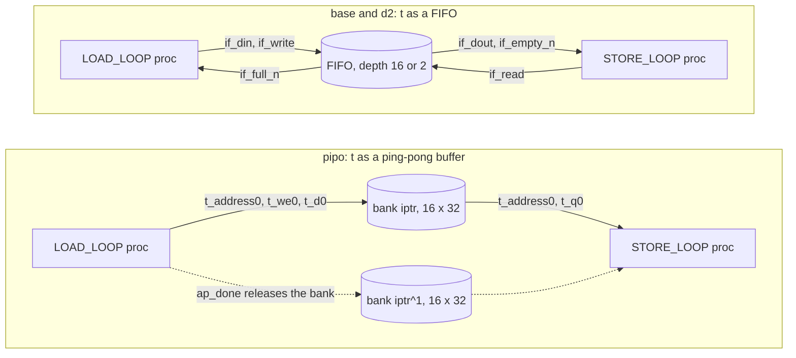

# 6.2 STREAM

## 1. Introduction

The STREAM directive tells Vitis HLS how to build the channel that carries an array from one dataflow process to the next.
A **channel** is the storage and handshake logic that sits between two processes of a DATAFLOW region, and a **process** is a function or loop that DATAFLOW turned into a block with its own controller.
With `-type fifo` the channel becomes a **FIFO** (first-in first-out queue), which passes one element at a time, and `-depth` sets how many elements it can hold.
With `-type pipo` the channel becomes a **PIPO** (ping-pong buffer), which is two full copies of the array, called banks, so that the producer can fill one bank while the consumer reads the other.

A FIFO improves latency, because the consumer can start as soon as the first element arrives instead of waiting for the whole array.
It also holds fewer bits, because it only has to store the elements that are in flight rather than two whole arrays.
The cost is a strict access rule: both processes must touch the array in the same sequential order, each element exactly once.
A shallow FIFO costs something else as well, which is that the producer stalls whenever the FIFO is full.

Use STREAM when an array is produced and consumed in order, and use `-depth` to trade storage against the slack the producer needs.
The reference is the [set_directive_stream page of UG1399](https://docs.amd.com/r/en-US/ug1399-vitis-hls/set_directive_stream).
That page describes the latest release, but the options used here (`-type fifo`, `-type pipo` and `-depth`) exist in 2023.2.

This lesson reuses the `pipe2` kernel and the DATAFLOW setup from 6.1, with one change to the code.
In 6.1, LOAD_LOOP needs 3 cycles per element and STORE_LOOP needs 2, so the producer is the slower side and no FIFO ever fills.
To make the FIFO fill, STORE_LOOP now multiplies by `b[i]` instead of adding it, which makes the consumer the slower side.
That one operator is the only change to the 6.1 code, and because of it the `base` numbers here are measured again rather than copied from 6.1.

The three solutions are `base`, `pipo` and `d2`.
There is no separate "default depth" solution, because the default depth for a converted array is its size, 16, which is exactly what DATAFLOW alone already builds in `base`.

**STREAM changes hardware in all three solutions.**
The PIPO against the FIFO changes the latency of one call, from 83 cycles to 115, but not the interval between calls, which stays 82 in all three.
The FIFO depth changes neither latency nor interval in this kernel; it changes the storage, where the producer waits, and — measurably — which FPGA primitives the channel lands on.

## 2. How it works



In the PIPO, the producer owns one bank for a whole call, and it addresses that bank exactly as it would address a plain array.
The generated channel module `pipe2_t_RAM_AUTO_1R1W` keeps a one-bit write pointer `iptr` and a one-bit read pointer `tptr`, and it forms the memory address as `{i_address0, iptr}` on the write side and `{t_address0, tptr}` on the read side.
Bank select is therefore one extra address bit into one memory, not a multiplexer in front of two.

The handshake of a PIPO is the same `full_n` / `empty_n` pair as a FIFO's, but it moves once per call instead of once per element: the top level wires `i_write` to `LOAD_LOOP`'s `ap_done` and `t_read` to `STORE_LOOP`'s `ap_ready`.
`STORE_LOOP`'s `ap_start` is gated by the channel's `t_empty_n`, so the consumer cannot begin until the producer has finished and released its bank.
The two processes therefore run one after the other inside a call, and the PIPO only lets them overlap across two different calls.

In the FIFO, every element is handed over on its own.
The producer pushes an element by raising `if_write` while `if_full_n` is 1, and the consumer pops one by raising `if_read` while `if_empty_n` is 1.
Both flags are registered, so each of them reflects the occupancy as it stood after the previous clock edge.
When the FIFO is full, `if_full_n` is 0 and the producer's controller stays in its push state until a pop makes room.
When the FIFO is empty, `if_empty_n` is 0 and the consumer waits in its pop state in the same way.
Both processes are always free to run at the same time, and the handshake alone keeps them in step.

## 3. The kernel

`src/pipe2.h` is unchanged from 6.1.

```cpp
#ifndef PIPE2_H
#define PIPE2_H

const int N     = 16;
const int SCALE = 3;

void pipe2(const int a[N], const int b[N], int y[N]);

#endif
```

`src/pipe2.cpp` differs from 6.1 in the multiply on the last line.

```cpp
#include "pipe2.h"

// Lesson 6.2 STREAM. Two stages joined by the local array t.
// LOAD_LOOP scales a into t, and STORE_LOOP multiplies t by b into y.
// Against 6.1 only the operator in STORE_LOOP changed (add became multiply),
// so that the consumer is slower than the producer and the channel can fill.
// This file never changes between solutions; only STREAM on t differs.
void pipe2(const int a[N], const int b[N], int y[N]) {
    int t[N];

LOAD_LOOP:
    for (int i = 0; i < N; i++)
        t[i] = a[i] * SCALE;

STORE_LOOP:
    for (int i = 0; i < N; i++)
        y[i] = t[i] * b[i];
}
```

LOAD_LOOP multiplies by the constant 3, which the tool builds as `(a << 2) - a` — one shift and one subtract, no DSP.
STORE_LOOP multiplies two variables, which needs a DSP multiplier, and the tool instantiates a two-stage one (`pipe2_mul_32s_32s_32_2_1`, `NUM_STAGE = 2`, three DSP48E2 slices).
A **DSP** is the dedicated multiply-add block of the FPGA.
Those two pipeline stages are the reason STORE_LOOP is the slower process here.

## 4. The solutions

Every solution carries `set_directive_dataflow pipe2`, because STREAM only acts on a channel and a channel only exists inside a DATAFLOW region.

| solution | directives on top of DATAFLOW                      | what t becomes             |
|----------|----------------------------------------------------|----------------------------|
| base     | none                                               | FIFO, depth 16 (automatic) |
| pipo     | `set_directive_stream -type pipo pipe2 t`          | ping-pong buffer, 2 banks  |
| d2       | `set_directive_stream -type fifo -depth 2 pipe2 t` | FIFO, depth 2              |

An explicit `-depth 16`, or `-type fifo` with no depth at all, would reproduce `base`, because a converted array keeps its size as its depth.
You can confirm this by adding a `d16` solution with `-type fifo -depth 16` and checking that its reports match `base` line for line.

For reference, the 6.1 measurements for the unmodified kernel are below.

| 6.1 solution | latency | interval | cosim latency, interval | cosim 16 calls | channel t          | Vivado LUT | Vivado FF |
|--------------|---------|----------|-------------------------|----------------|--------------------|------------|-----------|
| base         | 66      | 67       | 66, 67                  | 1071           | ram_1p, 32 x 16    | 117        | 55        |
| dataflow     | 51      | 50       | 51, 52                  | 831            | fifo, srl, 32 x 16 | 131        | 94        |

## 5. Predict

Write these down before running anything.

**Prediction 1.**
`pipo` has a latency of 115 cycles against 83 for `base`, so the FIFO removes about a quarter of every call.
The PIPO serializes the processes inside a call: 33 cycles of LOAD_LOOP, then 81 of STORE_LOOP, plus one cycle for the handover.
The FIFO overlaps them, so the call is the consumer's 81 cycles plus a short startup.

**Prediction 2.**
`pipo` has the *same* interval as `base`, 82 cycles, even though its latency is 32 cycles longer.
The interval of a dataflow region is set by its slowest process, and STORE_LOOP is the slowest process in every solution.
The PIPO's second bank is exactly what lets the next call's LOAD_LOOP run while this call's STORE_LOOP is still going, so the extra latency is hidden between calls and only shows up in the latency of one call.

**Prediction 3.**
`d2` has the same latency and the same interval as `base`, both in C synthesis and in co-simulation.
The consumer is the bottleneck, so a stalled producer only loses slack that it could not have used.

The loop numbers come from the 6.1 model.
An unpipelined loop takes $T \times L_{\textrm{it}} + 1$ cycles, where $T$ is the trip count and $L_{\textrm{it}}$ is the number of states per iteration.

Count the states from the datapath each process needs per element.
LOAD_LOOP writing a FIFO needs three: drive the `a` address, capture `a[i]`, push `a[i] * 3`.
LOAD_LOOP writing a PIPO needs only two, because a memory write can take the RAM output port combinationally and needs no push state of its own: drive the `a` address, write `t[i]`.
STORE_LOOP needs five in every solution: drive the `b` address, pop `t[i]` and capture `b[i]`, two stages of the DSP multiplier, write `y[i]`.

$$L_{\textrm{LOAD,fifo}} = 16 \times 3 + 1 = 49, \qquad L_{\textrm{LOAD,pipo}} = 16 \times 2 + 1 = 33, \qquad L_{\textrm{STORE}} = 16 \times 5 + 1 = 81$$

The region latency follows.
In the FIFO solutions, STORE_LOOP sits in its pop state for two cycles while the producer fetches and pushes the first element, and then runs its 81 cycles: $81 + 2 = 83$.
In `pipo`, STORE_LOOP cannot start at all until LOAD_LOOP is done: $33 + 1 + 81 = 115$.
The interval is the slowest process plus one in all three: $81 + 1 = 82$.

For co-simulation, expect the same latency and an interval two cycles longer than C synthesis reports.
Both processes read a top-level input, so `ap_ready` waits for both of them, and 6.1 measured exactly this effect (cosim interval 52 against csynth 50).
Sixteen calls at an interval $I$ take $16I - 1$ cycles.

| solution | LOAD proc | STORE proc | csynth latency | csynth interval | cosim latency | cosim interval | cosim 16 calls |
|----------|-----------|------------|----------------|-----------------|---------------|----------------|----------------|
| base     | 49        | 81         | 83             | 82              | 83            | 84             | 1343           |
| pipo     | 33        | 81         | 115            | 82              | 115           | 116            | 1855           |
| d2       | 49        | 81         | 83             | 82              | 83            | 84             | 1343           |

Now the schedule inside one call of a FIFO solution, which is where the depth matters.
For LOAD_LOOP, `A` drives the `a` address, `C` captures `a[i]`, `P` pushes.
For STORE_LOOP, `B` drives the `b` address, `Q` pops, `M` is a multiplier stage, `W` writes `y[i]`, and `..` is a cycle spent waiting in the pop state because the FIFO is still empty.
The last row is the FIFO occupancy *after* that clock edge.

| cycle           | c1 | c2 | c3 | c4 | c5 | c6 | c7 | c8 | c9 | c10 | c11 | c12 | c13 | c14 | c15 | c16 |
|-----------------|----|----|----|----|----|----|----|----|----|-----|-----|-----|-----|-----|-----|-----|
| LOAD_LOOP       | A0 | C0 | P0 | A1 | C1 | P1 | A2 | C2 | P2 | A3  | C3  | P3  | A4  | C4  | P4  | A5  |
| STORE_LOOP      | B0 | .. | .. | Q0 | M  | M  | W0 | B1 | Q1 | M   | M   | W1  | B2  | Q2  | M   | M   |
| occupancy after | 0  | 0  | 1  | 0  | 0  | 1  | 1  | 1  | 1  | 1   | 1   | 2   | 2   | 1   | 2   | 2   |

The two `..` cycles at c2 and c3 are the whole difference between the consumer's 81 cycles and the call's 83.
After them the consumer never waits again, because the producer is always ahead of it.

The producer needs 3 cycles per element and the consumer needs 5, so in any 15 cycles the producer pushes 5 elements and the consumer takes 3: the queue gains two elements every 15 cycles.
Occupancy first reaches 2 at c12, when element 3 is pushed, so a depth-2 FIFO first reports itself full at c13.
That does not stall anything yet, because the producer is in `A4` at c13 and does not need to push until c15, by which time the pop at c14 has made room.
The first real stall is element 5: the producer arrives at its push state, finds `if_full_n` low, and waits.
From there on the producer waits 2 cycles in every 5, which stretches its 3 cycles per element to the consumer's 5, and the call still ends when STORE_LOOP ends.

## 6. Run

```bash
cd s6_dataflow/62_stream
vitis_hls -f run_hls.tcl 2>&1 | tee run.log

# Did every solution pass? Expect 7: one from csim, two per cosim.
grep -c "TEST PASSED" run.log

# What each solution's own log says about t
for s in base pipo d2; do echo "== $s"; \
  grep -E "XFORM 203-721.*variable|HLS 214-142" pipe2_proj/$s/$s.log; done

# Latency and resources, same scripts as earlier lessons
bash ../../common/collect_latency.sh pipe2_proj
bash ../../common/collect_resources.sh pipe2_proj

# Latency of each process (d2 names its processes proc1 and proc2)
for s in base pipo d2; do echo "== $s"; \
  grep -E "Loop_(LOAD|STORE)_LOOP_proc" pipe2_proj/$s/syn/report/csynth.rpt | head -2; done

# The channel: type, bitwidth, depth and banks
for s in base pipo d2; do echo "== $s"; \
  grep -A 12 "== Storage Report" pipe2_proj/$s/syn/report/csynth.rpt; done

# Which Verilog modules exist in each solution
for s in base pipo d2; do echo "== $s"; ls pipe2_proj/$s/syn/verilog/; done

# The depth inside the FIFO modules
grep -n -E "^    (ADDR_WIDTH|DEPTH)" \
  pipe2_proj/base/syn/verilog/pipe2_fifo_w32_d16_S.v \
  pipe2_proj/d2/syn/verilog/pipe2_fifo_w32_d2_S.v

# The stall wires in the top level, and the per-call handshake of the PIPO
grep -n -E "t_(full_n|empty_n|write|read)\b" pipe2_proj/d2/syn/verilog/pipe2.v
grep -n -E "i_write|t_read|t_empty_n|ap_start = " pipe2_proj/pipo/syn/verilog/pipe2.v
grep -n -E "BufferCount|iptr|tptr|memcore_iaddr" \
  pipe2_proj/pipo/syn/verilog/pipe2_t_RAM_AUTO_1R1W.v | head

# Co-simulation latency and interval, then the per-call numbers
grep -n "Verilog" pipe2_proj/*/sim/report/pipe2_cosim.rpt
head -20 pipe2_proj/d2/sim/verilog/pipe2.performance.result.transaction.xml

# The full-FIFO waveform, from the d2 simulation recorded with port_hier
cd pipe2_proj/d2/sim/verilog
grep -n "xsim" run_xsim.sh          # confirm that the snapshot is called pipe2
xsim pipe2 -tclbatch ../../../../dump_fifo_vcd.tcl
cd ../../../..
python3 fifo_table.py pipe2_proj/d2/sim/verilog/fifo_t.vcd 22 4

# Vivado synthesis of all three solutions, for the physical form of t (about 10 minutes)
vitis_hls -f export_syn.tcl 2>&1 | tee export.log
grep -n -A9  "Post-Synthesis Resource usage" pipe2_proj/*/impl/report/verilog/pipe2_export.rpt
grep -n -A12 "^| Ref Name" pipe2_proj/*/impl/verilog/report/pipe2_utilization_synth.rpt
cat pipe2_proj/d2/impl/verilog/report/pipe2_utilization_hierarchical_synth.rpt
```

Co-simulation runs in every solution because STREAM changes when each process may run, which is behavior at the boundary of the design.

## 7. Read the results

### The log

Each solution says something different about `t`, and the differences are the directive itself talking.

```
base: INFO: [XFORM 203-721] Change variable 't' (src/pipe2.cpp:9) to FIFO automatically.
pipo: (nothing about t)
d2:   WARNING: [HLS 214-142] Implementing stream: may cause mismatch if read and
      write accesses are not in sequential order on port 't'
```

`base` prints the automatic conversion message that 6.1 also printed: no directive asked for a FIFO, the tool noticed that both loops walk `t` in order and converted it.
`pipo` prints nothing, because `-type pipo` asks for the channel form a dataflow region uses by default, so there is no conversion to report.
`d2` prints `HLS 214-142`, which is the tool saying that *you* asked for a stream and it is not going to re-prove that the access order is legal.
That warning is the same one 5.1 met, and it is exactly why co-simulation is not optional in this lesson.

All three solutions also print `HLS 200-1449`, a note that `STORE_LOOP` both follows another process and reads a top-level input.
That is the structural reason the co-simulated interval is two cycles longer than the synthesized one, which section 5 predicted.

### Latency and interval

```
solution         best      worst     ii_min     ii_max   clk_est_ns
base               83         83         82         82        2.365
d2                 83         83         82         82        2.365
pipo              115        115         82         82        2.370
```

Compare function latencies, not loop rows, because a loop row can read one cycle low (the 1.1 note).
The two process rows come out as predicted, and they are what everything else follows from:

| solution | `Loop_LOAD_LOOP_proc` | `Loop_STORE_LOOP_proc` |
|----------|-----------------------|------------------------|
| base     | 49                    | 81                     |
| pipo     | 33                    | 81                     |
| d2       | 49                    | 81                     |

STORE_LOOP is 81 in all three, because STREAM does not touch its datapath — the two-stage DSP multiply is there whatever the channel is.
LOAD_LOOP drops from 49 to 33 in `pipo`, which is the one place where the channel form changes a process's own schedule: writing a RAM costs two states per element, pushing a FIFO costs three.

`pipo` pays 115 cycles for a call and still delivers a call every 82 cycles, the same as `base`.
That is the whole point of the second bank: the serialization it forces is *inside* a call, and the overlap it allows is *between* calls.

### The channel

The Storage Report is the only place that states the depth directly.

```
base   t_U   fifo channel     stream   srl    latency 0   32, 16, 1
pipo   t_U   ram_1p channel   pipo     auto   latency 1   32, 16, 2
d2     t_U   fifo channel     stream   srl    latency 0   32, 2, 1
```

The last column is bitwidth, depth, banks.
`pipo` is the only one with 2 banks and the only one with a read latency, because a RAM read takes a cycle and a FIFO pop does not.
Note also that `pipo` is charged 1 BRAM_18K in the C synthesis estimate; Vivado does not agree, and section 8 shows what it builds instead.

Each solution's Verilog confirms the same thing a third time.
`base` and `d2` contain a `pipe2_fifo_w32_d<N>_S.v` whose module parameters are `ADDR_WIDTH = 4, DEPTH = 16` and `ADDR_WIDTH = 2, DEPTH = 2`.
`pipo` contains no FIFO module at all; it has `pipe2_t_RAM_AUTO_1R1W.v` and its `memcore`, with `BufferCount = 2` and `IndexWidth = 1`.

One cosmetic difference is worth knowing before you grep: `d2` calls its processes `Loop_LOAD_LOOP_proc1` and `Loop_STORE_LOOP_proc2`, with a numeric suffix, while `base` and `pipo` call them `Loop_LOAD_LOOP_proc` and `Loop_STORE_LOOP_proc`.
Match the prefix, not the whole name, and the same command works on all three.

### The generated Verilog

In `pipe2.v` of `d2`, four wires are the entire channel:

```verilog
.if_full_n(t_full_n),                                  // to LOAD_LOOP
.if_write(Loop_LOAD_LOOP_proc1_U0_t_write),            // from LOAD_LOOP
.if_empty_n(t_empty_n),                                // to STORE_LOOP
.if_read(Loop_STORE_LOOP_proc2_U0_t_read)              // from STORE_LOOP
```

Inside `pipe2_Loop_LOAD_LOOP_proc1.v`, `t_full_n` does exactly one thing: it holds state 4.

```verilog
ap_ST_fsm_state4 : begin
    if (((t_full_n == 1'b1) & (1'b1 == ap_CS_fsm_state4))) begin
        ap_NS_fsm = ap_ST_fsm_state2;      // pushed, go round again
    end else begin
        ap_NS_fsm = ap_ST_fsm_state4;      // full, stay here
    end
end
```

That single wire is the whole stall mechanism, and the same wire exists in `base`, where it simply never goes low.
`t_empty_n` holds STORE_LOOP's state 3 in the same way.

In `pipo`, the same four names appear on the channel module, but they are connected to whole-process signals rather than to per-element ones:

```verilog
.i_write(Loop_LOAD_LOOP_proc_U0_ap_done),      // a bank is pushed when LOAD finishes
.t_read(Loop_STORE_LOOP_proc_U0_ap_ready)      // a bank is popped when STORE finishes

assign Loop_STORE_LOOP_proc_U0_ap_start =
    (t_t_empty_n & (ap_sync_reg_Loop_STORE_LOOP_proc_U0_ap_ready ^ 1'b1) & ap_start);
```

That last line is the 32 extra cycles of latency in one expression: STORE_LOOP is not allowed to start until the channel is non-empty, and the channel does not become non-empty until LOAD_LOOP asserts `ap_done`.
The data ports beside it are an ordinary memory interface — `t_address0`, `t_ce0`, `t_we0`, `t_d0`, `t_q0` — which is the visible price of a PIPO: the processes exchange addresses, and a FIFO has no address.

### Co-simulation

```
base     Pass   latency 83    interval 84    total 1343
pipo     Pass   latency 115   interval 116   total 1855
d2       Pass   latency 83    interval 84    total 1343
```

`d2` and `base` are identical to the cycle, in every one of the 16 transactions, which is Prediction 3 confirmed at the RTL.
The per-call file `sim/verilog/pipe2.performance.result.transaction.xml` (the 5.1 note) shows 83 / 84 for every call except the last, whose interval is `x` because no call follows it.
There is no warm-up transaction here: the first call costs the same as the steady-state ones.

The interval is 84 rather than the 82 that C synthesis reports, in all three solutions, for the reason `HLS 200-1449` gave above.
Sixteen calls at 84 take $16 \times 84 - 1 = 1343$ cycles, and at 116 they take $16 \times 116 - 1 = 1855$.
The honest throughput figure for `pipo` as built and as driven is therefore **116 cycles per call against 84** — the second bank recovers the interval to within the same two-cycle handshake overhead the other solutions pay, but not past it.

### The full-FIFO waveform

`fifo_table.py` labels its columns with absolute clock-edge numbers and samples each signal just before that edge, so a column holds the value the registers are about to act on.
Twenty-two edges of `d2`, starting four edges before the FIFO first fills:

```
| signal            | c43 | c44 | c45 | c46 | c47 | c48 | c49 | c50 | c51 | c52 | c53 | c54 | c55 | c56 | c57 | c58 | c59 | c60 | c61 | c62 | c63 | c64 |
|-------------------|-----|-----|-----|-----|-----|-----|-----|-----|-----|-----|-----|-----|-----|-----|-----|-----|-----|-----|-----|-----|-----|-----|
| if_full_n         | 1   | 1   | 1   | 1   | 0   | 0   | 1   | 0   | 0   | 0   | 0   | 1   | 0   | 0   | 0   | 0   | 1   | 0   | 0   | 0   | 0   | 1   |
| if_write          | 1   | 0   | 0   | 1   | 0   | 0   | 1   | 0   | 0   | 0   | 0   | 1   | 0   | 0   | 0   | 0   | 1   | 0   | 0   | 0   | 0   | 1   |
| if_num_data_valid | 1   | 1   | 1   | 1   | 2   | 2   | 1   | 2   | 2   | 2   | 2   | 1   | 2   | 2   | 2   | 2   | 1   | 2   | 2   | 2   | 2   | 1   |
| if_empty_n        | 1   | 1   | 1   | 1   | 1   | 1   | 1   | 1   | 1   | 1   | 1   | 1   | 1   | 1   | 1   | 1   | 1   | 1   | 1   | 1   | 1   | 1   |
| if_read           | 1   | 0   | 0   | 0   | 0   | 1   | 0   | 0   | 0   | 0   | 1   | 0   | 0   | 0   | 0   | 1   | 0   | 0   | 0   | 0   | 1   | 0   |

First full edge: c47 of 1384 edges.
```

Read it in three parts.

*The run-in.* Pushes land at c43, c46 and c49 — every 3 cycles, the producer's natural rhythm — while pops land at c43, c48, c53 — every 5, the consumer's. The push at c46 is the one that takes the occupancy to 2, and `if_full_n` goes low one edge later, at c47, because the flag is registered.

*The stall.* After the push at c49 the occupancy is 2 again, so `if_full_n` is low from c50 onwards. The producer does not care yet: it spends c50 and c51 on its address and capture states. It reaches its push state at c52, finds `if_full_n` low, and waits there through c53, pushing at c54 — one edge after the pop at c53 released a slot. That is the stall, two cycles long, and it repeats with period 5 for the rest of the call: one push and one pop every 5 cycles, with the producer idle for 2 of them.

*What does not happen.* `if_empty_n` never falls anywhere in this window, so the consumer never waits. That is why `d2` is no slower than `base`: the depth-2 FIFO throttles the producer, and the producer had slack to give.

`if_empty_n` does fall, but only around the start of each call — in this trace it is low up to c37 and again at c39 and c40, then again at c114–c121 and c123–c124 for the next call.
Only the first window of each pair costs anything: STORE_LOOP is sitting in its pop state waiting for the producer's first push, which lands at c37, and it pops at c38.
The later low edges pass while the consumer is busy in its multiply and write states, so it never notices them.
That opening wait is the two cycles that make a call 83 rather than 81.

### Vivado primitives after synthesis

All three solutions meet timing, with an achieved period of 2.230 ns against the 3.330 ns requirement.

| primitive                            | `base`  | `pipo` | `d2`    |
|--------------------------------------|---------|--------|---------|
| FDRE                                 | 106     | 82     | 170     |
| FDSE                                 | 8       | 3      | 6       |
| **FF total**                         | **114** | **85** | **176** |
| LUT as Logic                         | 81      | 77     | 109     |
| LUT as Distributed RAM (RAMD32/S32)  | 0       | 20     | 0       |
| LUT as Shift Register (`SRL16E`)     | 32      | 0      | 0       |
| **CLB LUT total**                    | **113** | **97** | **109** |
| DSP48E2                              | 3       | 3      | 3       |
| BRAM                                 | 0       | 0      | 0       |

Three things in that table are not what the bit counts alone would suggest.

**`pipo` is the cheapest solution, not the most expensive**, even though it stores 1024 bits against `base`'s 512.
Its storage goes into 20 LUTs used as distributed RAM, which is less LUT than the 32 `base` spends on shift registers.
Of the 29 flip-flops it saves, 28 come out of LOAD_LOOP (41 down to 13), because a process that writes a RAM does not need the 32-bit pipeline register that a process pushing a FIFO does, and 1 comes out of the channel's own control (7 down to 6).
The C synthesis estimate charged `pipo` one BRAM_18K; Vivado never used it, because 32 words of 32 bits fits comfortably in LUTRAM.

**`d2` is the most expensive solution in flip-flops**, at 176 against `base`'s 114, despite holding 64 bits of data against 512.
Section 8 explains why.

**The estimates in `collect_resources.sh` are not these numbers.** C synthesis reports 356 LUT / 421 FF for `base` and `d2` and 265 / 294 for `pipo`.
They rank the solutions the same way Vivado does, but they are roughly three times too large in absolute terms; use them to compare solutions, not to size a device.

The hierarchical report puts the cost where it belongs:

```
base                                      Total LUTs  Logic LUTs  LUTRAMs  SRLs  FFs  DSP
  inst (whole kernel)                            113          81        0    32  114    3
    (inst) top-level handshake sync                0           0        0     0    2    0
    Loop_LOAD_LOOP_proc_U0                        42          42        0     0   41    0
    Loop_STORE_LOOP_proc_U0                       27          27        0     0   64    3
    t_U    (fifo_w32_d16_S)                       44          12        0    32    7    0
      U_..._ShiftReg                              36           4        0    32    0    0

pipo                                      Total LUTs  Logic LUTs  LUTRAMs  SRLs  FFs  DSP
  inst (whole kernel)                             97          77       20     0   85    3
    (inst) top-level handshake sync                0           0        0     0    2    0
    Loop_LOAD_LOOP_proc_U0                        36          36        0     0   13    0
    Loop_STORE_LOOP_proc_U0                       27          27        0     0   64    3
    t_U    (t_RAM_AUTO_1R1W)                      34          14       20     0    6    0
      ..._memcore_U                               27           7       20     0    0    0

d2                                        Total LUTs  Logic LUTs  LUTRAMs  SRLs  FFs  DSP
  inst (whole kernel)                            109         109        0     0  176    3
    (inst) top-level handshake sync                0           0        0     0    2    0
    Loop_LOAD_LOOP_proc1_U0                       42          42        0     0   41    0
    Loop_STORE_LOOP_proc2_U0                      27          27        0     0   64    3
    t_U    (fifo_w32_d2_S)                        40          40        0     0   69    0
      U_..._ShiftReg                              32          32        0     0   64    0
```

`Loop_STORE_LOOP_proc` is 27 / 64 / 3 DSP in all three, as it must be: STREAM cannot reach inside a process.
`Loop_LOAD_LOOP_proc` is identical in `base` and `d2` and smaller in `pipo`.
Everything that STREAM actually changes is in the `t_U` row.

### Predicted and measured

| quantity                       | predicted | measured |
|--------------------------------|-----------|----------|
| LOAD process, `base` and `d2`  | 49        | 49       |
| LOAD process, `pipo`           | 33        | 33       |
| STORE process, all three       | 81        | 81       |
| `base` csynth latency          | 83        | 83       |
| `pipo` csynth latency          | 115       | 115      |
| `d2` equals `base` (csynth)    | yes       | yes      |
| interval, all three (csynth)   | 82        | 82       |
| `base` cosim latency, interval | 83, 84    | 83, 84   |
| `pipo` cosim latency, interval | 115, 116  | 115, 116 |
| cosim 16 calls, `base` / `d2`  | 1343      | 1343     |
| cosim 16 calls, `pipo`         | 1855      | 1855     |
| depth of t in `base`           | 16        | 16       |
| banks of t in `pipo`           | 2         | 2        |
| first full edge in `d2`        | c47       | c47      |
| producer stall, steady state   | 2 in 5    | 2 in 5   |

## 8. Hardware implications

| solution | storage for t                     | control for t                        | LUT (Vivado) | FF (Vivado) |
|----------|-----------------------------------|--------------------------------------|--------------|-------------|
| base     | 512 bits in 32 `SRL16E`           | 5-bit pointer, full and empty flags   | 113          | 114         |
| pipo     | 1024 bits in 20 LUTs of LUTRAM    | 1-bit `iptr` / `tptr`, bank counter   | 97           | 85          |
| d2       | 64 bits in 64 flip-flops          | 3-bit pointer, full and empty flags   | 109          | 176         |

Against `base`, line by line:

**`pipo` costs 16 LUT and 29 FF less, and 32 cycles more latency per call.**
Twenty-eight of those flip-flops come out of LOAD_LOOP, because the producer no longer needs a register between reading `a[i]` and handing the value over; one more comes out of the channel's control.
Of the 16 LUT, 10 are the channel (44 down to 34, the FIFO's pointer and flag logic replaced by two one-bit bank pointers) and 6 are LOAD_LOOP's lost push state.
This is the trade the lesson is about, and on this device it points the opposite way from the usual intuition: the PIPO is *smaller* here, and what it costs is time, not area.

**`d2` costs 4 LUT less and 62 FF more.**
Its 64 bits of storage are eight times smaller than `base`'s 512, and they cost 64 flip-flops where `base`'s cost none.
The reason is a primitive: one `SRL16E` is a LUT configured as a 16-deep, 1-bit shift register, so `base` buys 16 stages for the price of one LUT per bit of width, and 32 of them side by side are exactly a 16 × 32 FIFO at zero flip-flop cost.
A 2-deep shift register is too short for that primitive to be worth inferring, so Vivado builds it out of registers instead, and the shallow FIFO ends up the *largest* of the three in flip-flops.

**The saving from a shallow FIFO is not just invisible on this FPGA, it is negative — and that is an FPGA-only effect.**
Up to 16 elements the depth costs nothing extra here, because one `SRL16E` per bit of width covers the whole range, so leaving the channel at its automatic depth is both the simplest and the cheapest choice on this device.

In a standard-cell ASIC flow, `SRL16E` and LUTRAM do not exist.
The FIFO becomes a flip-flop array or a small register file, so storage scales directly with depth, and depth 2 genuinely costs about one eighth of depth 16.
The PIPO becomes two SRAM macros or two flip-flop arrays and is the expensive option rather than the cheap one, which flips the area half of the trade-off above while leaving the latency half exactly as measured.
The handshake logic (`full_n`, `empty_n`, `write` and `read`) carries over unchanged.
Sizing the depth therefore matters much more on an ASIC than on this FPGA — but so does knowing what the depth actually needs to be, which is the closing question.

## 9. One common mistake and one question

**The mistake: streaming an array that is not accessed in order.**
Change STORE_LOOP to read `t[N-1-i]` and keep STREAM on `t`.
C simulation still passes, because a C array allows any access order.
Depending on the pattern, the tool either rejects the directive or builds the FIFO anyway, in which case STORE_LOOP pops the elements in the wrong order and the result is wrong.
`HLS 214-142`, which `d2` prints in this lesson, is the only warning you get, and it is printed whether the order is right or wrong.
As in 5.1, co-simulation is the check that catches it, so never skip co-simulation after adding STREAM.

**The question: what is the smallest depth at which LOAD_LOOP never stalls?**

<details>
<summary>Answer</summary>

The producer pushes one element every 3 cycles and the consumer pops one every 5.
The occupancy peaks when LOAD_LOOP pushes its last element, and by then the consumer has taken the fraction $L_{\textrm{it,LOAD}} / L_{\textrm{it,STORE}}$ of the array.

$$D_{\min} \approx N \left( 1 - \frac{L_{\textrm{it,LOAD}}}{L_{\textrm{it,STORE}}} \right) = 16 \times \left( 1 - \frac{3}{5} \right) = 6.4$$

Counting the actual schedule sharpens that to **7**.
The producer's 16 pushes are 3 cycles apart, spanning 45 cycles; the consumer's pops are 5 apart and the first one trails the first push by a single cycle, so by the time the last element is pushed the consumer has taken 9 of them.
That leaves 7 in the channel, and a depth-7 FIFO holds them without ever asserting `if_full_n` against a producer that needs to push.

Depth 7 is enough not to stall; depth 8 is the smallest depth at which `if_full_n` never even asserts.
Below 7 the stalls grow smoothly — 2 producer stall cycles per call at depth 6, 12 at depth 4, 22 at depth 2 — and none of them change the latency or the interval, because LOAD_LOOP has 32 cycles of slack against STORE_LOOP and the deepest stall only eats 22 of them.

Check it by adding a solution with `-depth 7`, re-running with `-trace_level port_hier`, and running `fifo_table.py` on its trace: it should print `The FIFO never became full in this trace.` for depth 8 and find one full edge, with no stall behind it, for depth 7.

</details>
